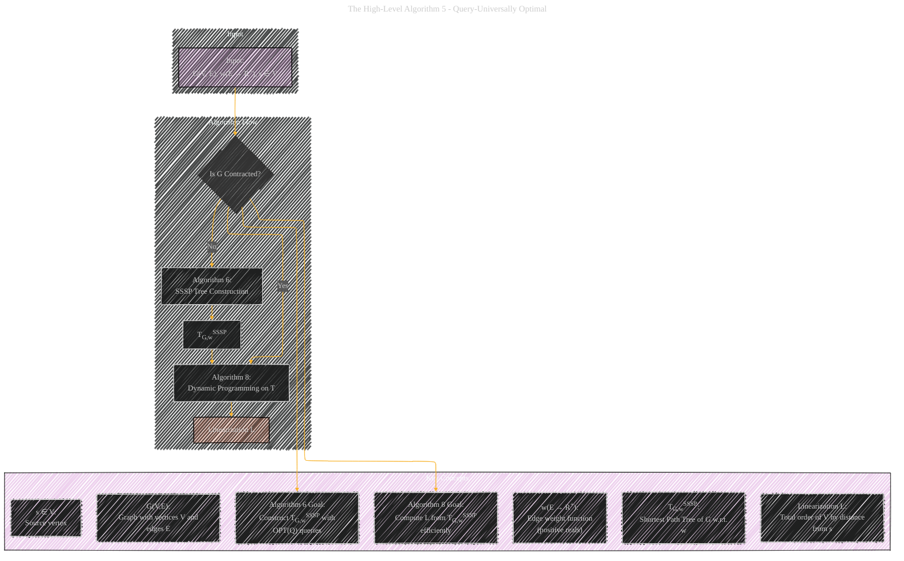

# Universal Optimality of Dijkstra via Beyond-Worst-Case Heaps
> **Disclaimer:**
>
> This document contains my personal notes on the topic,
> compiled from publicly available documentation and various cited sources.
> The materials are intended for educational purposes, personal study, and reference.
> The content is dual-licensed:
> 1. **MIT License:** Applies to all code implementations (Swift, Mermaid, and other programming languages).
> 2. **Creative Commons Attribution 4.0 International License (CC BY 4.0):** Applies to all non-code content, including text, explanations, diagrams, and illustrations.
---

## High-Level Algorithm 5 - Query-Universally Optimal

---

### Explanation

*   **Nodes:**
    *   `A`: The starting point, representing the input to the algorithm (Graph G, weights w, source node s). I've added the common notation for what these represent (V, E, R+, etc.)
    *   `B`: Represents the decision point: Has the graph been contracted? This highlights that the algorithm may need to perform contractions before finding the shortest-path tree.
    *   `C`: Represents Algorithm 6, which constructs the shortest-path tree TG,wSSSP.
    *   `D`: Represents the output of Algorithm 6, the shortest-path tree TG,wSSSP.
    *   `E`: Represents Algorithm 8, which performs dynamic programming on the tree to compute the linearization.
    *   `F`: The final output – the linearization L.
*   **Arrows:** The arrows indicate the flow of the algorithm.
*    **Subgraphs** to have clear visualization for what algorithm it is.

---
**Licenses:**

- **MIT License:**   - Full text in [LICENSE](LICENSE) file.
- **Creative Commons Attribution 4.0 International:**  - Legal details in [LICENSE-CC-BY](LICENSE-CC-BY) and at [Creative Commons official site](http://creativecommons.org/licenses/by/4.0/).

---