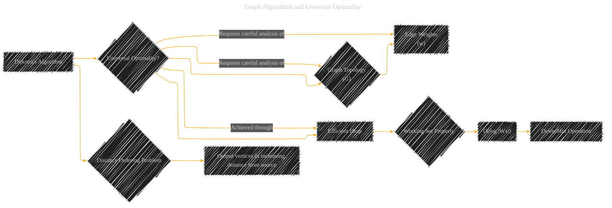
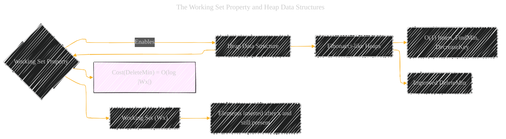
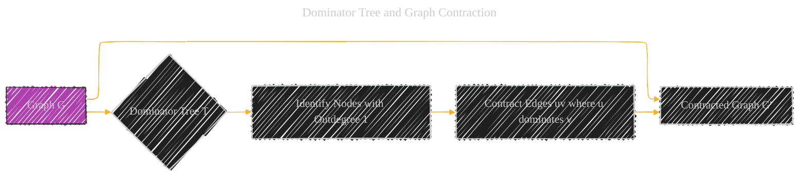

# Universal Optimality of Dijkstra via Beyond-Worst-Case Heaps - Paper Overview
> **Disclaimer:**
>
> This document contains my personal notes on the topic,
> compiled from publicly available documentation and various cited sources.
> The materials are intended for educational purposes, personal study, and reference.
> The content is dual-licensed:
> 1. **MIT License:** Applies to all code implementations (Swift, Mermaid, and other programming languages).
> 2. **Creative Commons Attribution 4.0 International License (CC BY 4.0):** Applies to all non-code content, including text, explanations, diagrams, and illustrations.
---

## 1. Graph Algorithms and Universal Optimality

* **Core Concept:**  The paper investigates if Dijkstra's algorithm, a fundamental graph algorithm for finding shortest paths, achieves *universal optimality* when paired with a specifically designed heap data structure. Universal optimality means performing as well as possible on *every* graph topology, not just in the worst case.

* **Graphical Representation:**

 * This diagram illustrates how Dijkstra's algorithm's universal optimality depends on the heap's efficiency and graph properties. The 'Working Set Property' is highlighted as a key component of the efficient heap.

---

## 2. The Working Set Property and Heap Data Structures

* **Core Concept:** A key technical contribution is the design and analysis of a heap data structure with a *working set property*.  This property ensures that the cost of `DeleteMin` operations is logarithmic in the number of elements inserted *after* the minimum element, rather than the total heap size. This "locality" allows Dijkstra's algorithm to efficiently exploit graph structure.

* **Graphical Representation:**

* This diagram highlights the heap data structure's working set property.
* `DeleteMin` operation's time complexity depends on |Wx|, rather than the total number of elements in the heap.

----

## 3. Barrier Sequences and Lower Bound Arguments

* **Core Concept:** The proof of universal optimality involves a clever technique using *barrier sequences*.  A barrier is a set of incomparable nodes in a shortest-path tree. A barrier sequence allows for constructing a lower bound on the complexity of any algorithm for the distance ordering problem.

* **Graphical Representation:**

* This diagram illustrates the barriers sequence in proving universal optimality.

---

## 4. Algorithm and Data Structure Relationships

* **Core Concept:** To achieve universal optimality, the paper presents an algorithm combines a new data structure (heap with the working set property) with a modified Dijkstra's algorithm and dynamic programming on the SSSP tree.

* **Graphical Representation:**

* This diagram shows how algorithms are working together.

---

## 5. Dominator Tree and Graph Contraction

* **Core Concept:** The algorithm uses the dominator tree to contract the graph, simplifying it while preserving essential shortest-path information. This contraction process is crucial for optimizing the number of comparisons.

* **Graphical Representation:**

* This digram shows how the Dominator Tree is created and the graph is contracted.

---
**Licenses:**

- **MIT License:**   - Full text in [LICENSE](LICENSE) file.
- **Creative Commons Attribution 4.0 International:**  - Legal details in [LICENSE-CC-BY](LICENSE-CC-BY) and at [Creative Commons official site](http://creativecommons.org/licenses/by/4.0/).

---