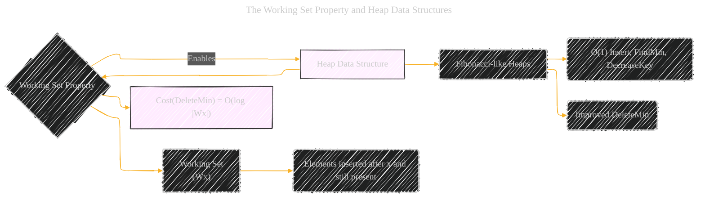
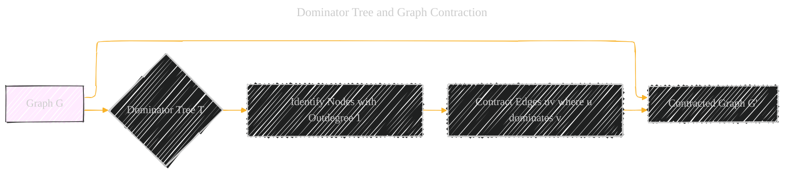

# Universal Optimality of Dijkstra via Beyond-Worst-Case Heaps - Paper Overview
> **Disclaimer:**
>
> This document contains my personal notes on the topic,
> compiled from publicly available documentation and various cited sources.
> The materials are intended for educational purposes, personal study, and reference.
> The content is dual-licensed:
> 1. **MIT License:** Applies to all code implementations (Swift, Mermaid, and other programming languages).
> 2. **Creative Commons Attribution 4.0 International License (CC BY 4.0):** Applies to all non-code content, including text, explanations, diagrams, and illustrations.
---

The diagrams below provide a visual summary of the key ideas in the paper, focusing on the relationships between algorithms, data structures, and proof techniques.

## 1. Dijkstra's Algorithm and Universal Optimality

**Explanation:**

* The core question is whether Dijkstra's is universally optimal.
* Universal optimality hinges on both graph properties and a good heap.
* `O(log |Wx|)` complexity for `DeleteMin` is essential, thanks to the Working Set Property.

-----

## 2. The Working Set Property and Heap Data Structures

**Explanation:**

* The efficient Heap is Fibonacci-like.
* Key focus is on the properties of the Working Set *Wx*.

-----

## 3. Barrier Sequences and Lower Bound Arguments

**Explanation:**

* Barriers are key to *proving* universal optimality.
* The number of incomparable nodes in each barrier provides the omega lower bound.

---

## 4. Algorithm and Data Structure Relationships

**Explanation:**

* Algorithm 5 is the top-level algorithm
* It consists of algorithms 6 and 8.

-----

## 5. Dominator Tree and Graph Contraction

**Explanation:**

* Dominator tree is used for the graph contractions

-----

## 6. Fibonacci-like priority queue

**Explanation:**

* auxiliary data structure

---
**Licenses:**

- **MIT License:**   - Full text in [LICENSE](LICENSE) file.
- **Creative Commons Attribution 4.0 International:**  - Legal details in [LICENSE-CC-BY](LICENSE-CC-BY) and at [Creative Commons official site](http://creativecommons.org/licenses/by/4.0/).

---