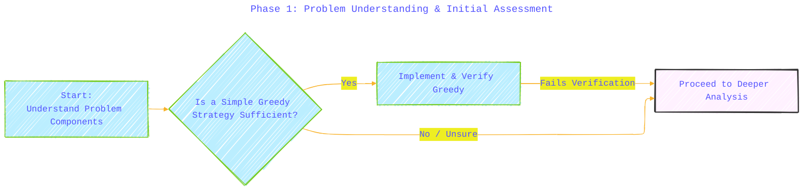
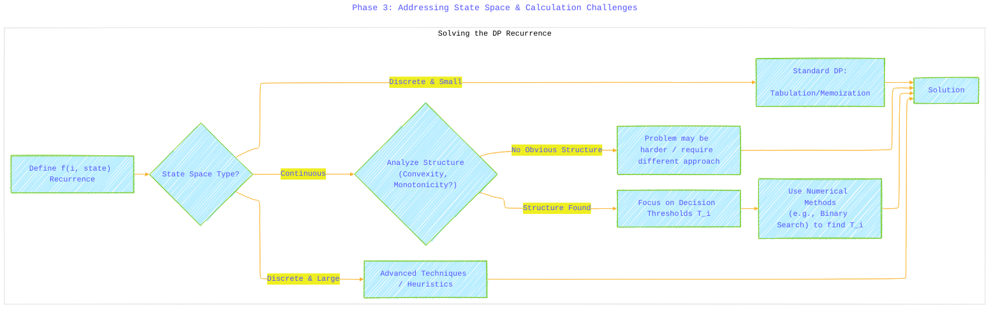

# Generic Strategy Guide for Sequential Decision Problems - A Diagrammatic Guide 
> **Disclaimer:**
>
> This document contains my personal notes on the topic,
> compiled from publicly available documentation and various cited sources.
> The materials are intended for educational purposes, personal study, and reference.
> The content is dual-licensed:
> 1. **MIT License:** Applies to all code implementations (Swift, Mermaid, and other programming languages).
> 2. **Creative Commons Attribution 4.0 International License (CC BY 4.0):** Applies to all non-code content, including text, explanations, diagrams, and illustrations.
---


This guide outlines a strategic approach based on lessons learned from problems like "Missing Mail", where decisions over time affect future states and rewards, often involving probabilities and costs.

## Phase 1: Problem Understanding & Initial Assessment

1.  **Define Core Components:** Clearly identify:
    *   **Time Horizon:** Discrete steps (days, rounds) or continuous? Finite ($N$) or infinite?
    *   **State(s):** What information fully describes the system at any time step? ($E$, expected value in "Missing Mail").
    *   **Actions/Decisions:** What choices can be made at each step? (Collect/Don't Collect).
    *   **Transitions:** How does the state change based on actions and random events? (Accumulation $V_i$, reset on collect, probabilistic loss $(1-S)$). Use $\mathbb{E}[\cdot]$ for expected transitions.
        $$ \text{State}_{i+1} = \text{TransitionFunction}(\text{State}_i, \text{Action}_i, \text{RandomEvents}_i) $$
    *   **Rewards/Costs:** What immediate value/cost is associated with each action in a given state? ($P-C$ for collect, $0$ for wait).
    *   **Objective:** What is being maximized/minimized? (Total Expected Profit).
    *   **Constraints:** Precision requirements, time/memory limits.

2.  **Initial Check: Is Greedy Plausible?**
    *   Consider simple strategies based only on immediate rewards/costs or simple heuristics (like the `C/S` threshold).
    *   **Crucial Question:** Does the optimal action *ever* depend on potential outcomes far in the future, even if a different action looks better *locally*? If yes, greedy will likely fail.
    *   Test against simple but tricky edge cases and any provided *complex* samples.



---

## Phase 2: Identifying Optimal Substructure (Dynamic Programming)

If greedy is insufficient, the problem likely requires considering future outcomes, often indicating a Dynamic Programming (DP) structure.

1.  **Look for Optimal Substructure:** Can the optimal solution for the problem starting at time $i$ be constructed from optimal solutions starting at time $i+1$?
2.  **Define the Value Function:** Formulate the objective recursively. Let $f(i, \text{state})$ be the optimal expected *future* value (or total value including current step) from step $i$ onwards, given the current state.
    $$ f(i, \text{State}_i) = \max_{\text{Action } a} \left( \text{Reward}(i, \text{State}_i, a) + \mathbb{E}\left[f(i+1, \text{State}_{i+1}) \mid \text{State}_i, a \right] \right) $$
    *   The expectation $\mathbb{E}[\cdot]$ accounts for probabilistic transitions. Example:
        $$ \mathbb{E}[f(i+1, \text{State}_{i+1})] = (1-S) \times f(i+1, \text{State}_{\text{no theft}}) + S \times f(i+1, \text{State}_{\text{theft}}) $$
3.  **Define Base Case(s):** What is the value at the end of the time horizon (e.g., $f(N, \text{State}_N)$)?


---

## Phase 3: Addressing State Space & Calculation Challenges

Solving the DP recurrence can be complex.

1.  **Analyze State Space:**
    *   **Discrete & Small:** Standard DP tabulation (arrays/maps) or memoization may work.
    *   **Discrete & Large:** Techniques like state compression or heuristics might be needed (often outside typical contest scope unless specific structures exist).
    *   **Continuous:** This is a major hurdle. Proceed to next steps.

2.  **Handle Continuous States:**
    *   **Look for Structure:** Is the value function $f(i, \text{state})$ known or likely to be monotonic, convex, or concave with respect to the continuous state variable(s)? This structure often simplifies the decision rule.
    *   **Focus on Decisions/Policy:** Instead of calculating $f(i, \text{state})$ for *all* states, can you determine the *optimal action* directly? Often, this involves finding **thresholds**. If the state variable $x$ crosses a threshold $T_i$, the optimal action changes.
        Find $x = T_i$ such that:
        $$ \text{Value}(\text{Action 1 starting from } x) = \text{Value}(\text{Action 2 starting from } x) $$
        Where $\text{Value}(\cdot)$ refers to the total expected future reward term from the recurrence.
    *   **Numerical Methods:** If thresholds exist (often guaranteed by monotonicity/convexity), use numerical methods like **binary search** to find them with high precision.



---

## Phase 4: Implementation Strategy

1.  **Determine Calculation Direction:**
    *   **Forward:** If $f(i, \text{state})$ only depends on $f(i-1, \cdot)$, a forward pass might work (less common when optimal action depends on the future).
    *   **Backward:** If computing $f(i, \text{state})$ or the optimal policy/threshold $T_i$ requires knowing future values ($f(i+1, \cdot)$ or $T_{i+1}, ...$), a backward calculation (from $N-1$ or $N$ down to $0$) is necessary. This is common.

```mermaid
---
title: "Phase 4: Implementation Strategy"
author: "Cong Le"
version: "1.0"
license(s): "MIT, CC BY 4.0"
copyright: "Copyright (c) 2025 Cong Le. All Rights Reserved."
config:
  layout: elk
  look: handDrawn
  theme: base
---
%%%%%%%% Mermaid version v11.4.1-b.14
%%%%%%%% Available curve styles include the following keywords:
%% basis, bumpX, bumpY, cardinal, catmullRom, linear, monotoneX, monotoneY, natural, step, stepAfter, stepBefore.
%%{
  init: {
    'graph': { 'htmlLabels': false, 'curve': 'linear' },
    'fontFamily': 'Monospace',
    'themeVariables': {
      'primaryColor': '#BEF',
      'primaryTextColor': '#55ff',
      'primaryBorderColor': '#7c2',
      'lineColor': '#F8B229',
      'secondaryColor': '#EE2',
      'tertiaryColor': '#fff',
      'stroke':'#3323',
      'stroke-width': '0.5px'
    }
  }
}%%
graph LR
    A["Time Step: 0"] <--> B[1] <--> C[...] <--> D[N-1] <--> E[N]

    subgraph Backward_Pass["Backward Pass<br/>(Calculate Policy/Values)"]
    direction RL
        E --> D --> C --> B --> A
    end

    subgraph Forward_Pass["Forward Pass<br/>(Simulate Policy / Calculate Final Result)"]
    direction LR
        A --> B --> C --> D --> E
    end

    Backward_Pass --> Forward_Pass
    %%  note right of Backward_Pass: Often needed first to determine<br>optimal decisions/values required<br>by earlier steps.
    %%  note right of Forward_Pass: Often used to compute the final<br>answer using the policy/values found<br>in the backward pass.
    
```

1.  **Numerical Stability:**
    *   Use high-precision floating-point types (`Double` in C++/Java/Swift, standard floats in Python) for calculations involving probabilities or accumulated values.
    *   Use robust comparisons with a small epsilon ($\epsilon$) for floating-point numbers: `a >= b - ε` instead of `a >= b`.

2.  **Modular Code:** Break down complex parts (like simulating future outcomes using computed thresholds within a binary search) into helper functions. `calculateFutureProfit(startDay, startState, policy/thresholds)` was key in "Missing Mail".

3.  **Verification:** Test thoroughly against simple cases, known edge cases (like $S=0$, $S=1$, $C=0$), and complex provided samples. Debug failures by tracing state transitions and decisions.

------


By following this structured approach—assessing greedy, recognizing DP, handling state space complexities (especially continuous states via thresholds and numerical methods), choosing the right calculation direction, and implementing carefully—you can systematically tackle a wide range of challenging sequential optimization problems.


---
**Licenses:**

- **MIT License:**  [](LICENSE) - Full text in [LICENSE](LICENSE) file.
- **Creative Commons Attribution 4.0 International:** [](LICENSE-CC-BY) - Legal details in [LICENSE-CC-BY](LICENSE-CC-BY) and at [Creative Commons official site](http://creativecommons.org/licenses/by/4.0/).

---