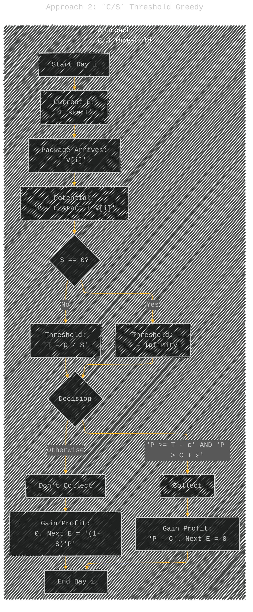
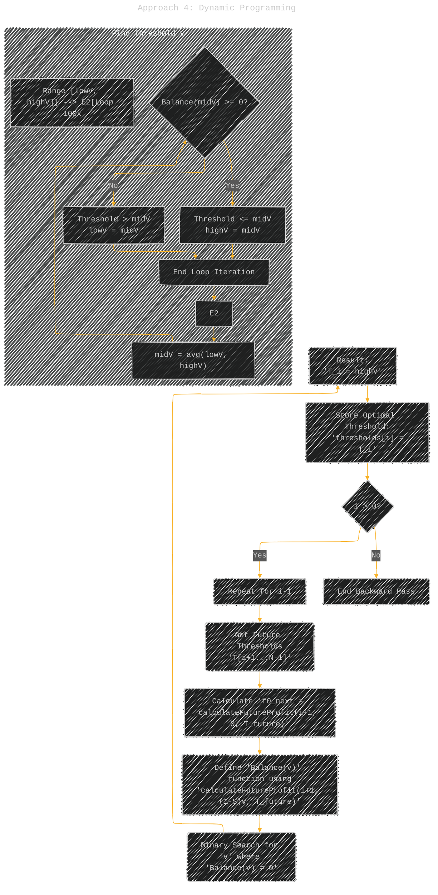
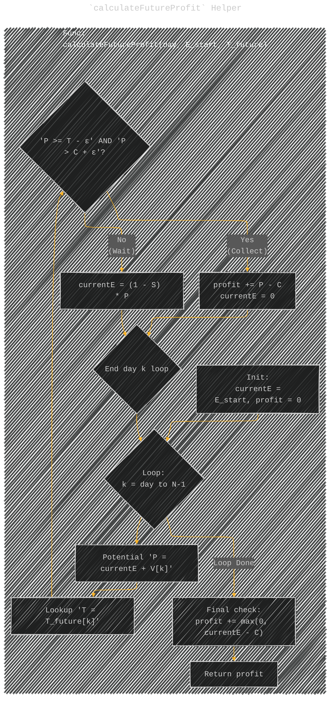

# Comprehensive Documentation: "Missing Mail" Problem-Solving Journey
> **Disclaimer:**
>
> This document contains my personal notes on the topic,
> compiled from publicly available documentation and various cited sources.
> The materials are intended for educational purposes, personal study, and reference.
> The content is dual-licensed:
> 1. **MIT License:** Applies to all code implementations (Swift, Mermaid, and other programming languages).
> 2. **Creative Commons Attribution 4.0 International License (CC BY 4.0):** Applies to all non-code content, including text, explanations, diagrams, and illustrations.
---

## Introduction: Problem Recap

**Goal:** Maximize the total *expected* profit from collecting packages delivered over $N$ days.

**Inputs:**
*   $N$: Number of days.
*   $V$: Array of package values ($V_i$ for day $i$, index 0 to N-1).
*   $C$: Cost to enter the room and collect packages.
*   $S$: Probability (0 to 1) of packages being stolen at the end of any day *if not collected*.

**Dynamics:**
*   Let $E_i^{\text{start}}$ be the expected value in the room at the *start* of day $i$.
*   Let $E_i^{\text{potential}} = E_i^{\text{start}} + V_i$ be the value *after* the day's package arrives.
*   **If Collect on day $i$:**
    *   Profit gained on day $i$: $E_i^{\text{potential}} - C$
    *   Expected value at start of next day: $E_{i+1}^{\text{start}} = 0$
*   **If Do Not Collect on day $i$:**
    *   Profit gained on day $i$: $0$
    *   Expected value going into the theft phase: $E_i^{\text{end}} = E_i^{\text{potential}}$
    *   Expected value after potential theft: $E_{i+1}^{\text{start}} = (1 - S) \times E_i^{\text{end}} = (1 - S) \times E_i^{\text{potential}}$

*   **Final collection:** After day $N-1$ finishes, any remaining expected value $E_N^{\text{start}}$ can be collected for a final profit of $\max(0.0, E_N^{\text{start}} - C)$.
*   **Precision:** High precision (e.g., `Double`, 8 decimal places) is required.

---

## The Journey & Turning Points

The solution evolved through several stages, marked by key insights gained from failed attempts and analysis.

```mermaid
---
title: "The Journey & Turning Points"
author: "Cong Le"
version: "1.0"
license(s): "MIT, CC BY 4.0"
copyright: "Copyright (c) 2025 Cong Le. All Rights Reserved."
config:
  layout: elk
  look: handDrawn
  theme: dark
---
%%%%%%%% Mermaid version v11.4.1-b.14
%%%%%%%% Toggle theme value to `base` to activate the initilization below for the customized theme version.
%%%%%%%% Available curve styles include the following keywords:
%% basis, bumpX, bumpY, cardinal, catmullRom, linear, monotoneX, monotoneY, natural, step, stepAfter, stepBefore.
%%{
  init: {
    'flowchart': {'htmlLabels': true},
    'fontFamily': 'Monospace',
    'themeVariables': {
      'lineColor': '#F8B229'
    }
  }
}%%
flowchart TD
    A["Start:<br/>Missing Mail Problem Defined"] --> B{"Attempt 1:<br/>Simple Greedy"}
    B -- Fail --> TP1["Turning Point 1:<br/>Realization - Must Account for Risk 'S'"]
    TP1 --> C{"Attempt 2:<br/>C/S Threshold Greedy"}
    C -- Partial Success --> TP2["Turning Point 2:<br/>Critical Insight (Sample Case #4) - Local Optimum is Insufficient, Future Value Matters!"]
    TP2 --> D{"Attempt 3:<br/>DP Conceptualization"}
    D --> TP3["Turning Point 3:<br/>Convexity Insight & Continuous State Challenge - Calculate Decision Thresholds Directly"]
    TP3 --> E{"Attempt 4:<br/>DP - Backward Threshold Calculation"}
    E --> F["Success!"]

    style TP1 fill:#f9f,stroke:#333,stroke-width:2px
    style TP2 fill:#f9f,stroke:#333,stroke-width:2px
    style TP3 fill:#f9f,stroke:#333,stroke-width:2px
    style F fill:#9f9,stroke:#333,stroke-width:2px
    
```

---

### Approach 1: Simple Greedy

*   **Logic:** Collect whenever the potential value in the room strictly exceeds the cost: Collect if $E_i^{\text{potential}} > C$.
*   **Rationale:** The most basic intuition – collect if the immediate reward surpasses the cost.
*   **Outcome:** Fails most cases.
*   **Flaw:** Completely ignores the risk factor $S$. Doesn't consider that *not* collecting might lead to significant loss if $S$ is high, or that collecting forfeits potential future gains if $S$ is low.

---

### Turning Point 1: Accounting for Risk

The failure of the simple greedy approach made it clear that the probability of theft, $S$, must be incorporated into the decision-making process. A purely value-based decision is insufficient.

---

### Approach 2: `C/S` Threshold Greedy

*   **Logic:** Calculate a threshold $T$ based on the cost $C$ and the theft probability $S$. Collect if the potential value $P = E_i^{\text{potential}}$ meets or exceeds this threshold (and also exceeds $C$). The threshold balances the cost of collection against the *expected loss* in the *immediate next step* due to theft ($S \times P$).
*   **Mathematical Rationale:** Collect if Cost < Expected Loss Avoided $\implies C < S \times P \implies P > \frac{C}{S}$.
    $$ T = \frac{C}{S} \quad (\text{for } S > 0) $$
    Decision Rule: Collect if $P \ge T \text{ and } P > C$ (using epsilon for float comparison: `P >= T - ε && P > C + ε`). Handle $S=0$ separately (threshold becomes infinite).
*   **Diagram:**

*   **Outcome:** Better, passes some test cases (e.g., 8/24, 12/24). Correctly handles *some* balancing.
*   **Flaw:** Still greedy and focuses only on the immediate trade-off. It doesn't value the potential future gains that might be achieved by carrying forward the expected value $(1-S)P$.

---

### Turning Point 2: The Future Matters (Sample Case #4)

The failure of the `C/S` threshold on specific test cases (like Sample Case #4) was the critical turning point. Manually stepping through such cases revealed scenarios where the `C/S` threshold was met, suggesting collection, but the optimal strategy was to *wait*. This proved that the decision must consider the *entire future potential*, not just the next step's expected loss. This pointed directly towards Dynamic Programming.

---

### Approach 3: Dynamic Programming - Conceptualization

*   **Logic:** The optimal decision on day $i$ depends on the optimal strategy from day $i+1$ onwards, given the state (expected value in the room). This fits the DP paradigm.
*   **State Definition:** Define $f(i, E)$ as the maximum expected *additional* profit obtainable from the start of day $i$ to the end of day $N-1$, given the expected value currently in the room is $E$.
*   **Goal:** Compute $f(0, 0)$.
*   **Recurrence Relation:**
    $$ f(i, E) = \max(\underbrace{(E + V_i - C) + f(i+1, 0)}_{\text{Profit if Collect}}, \underbrace{f(i+1, (1 - S)(E + V_i))}_{\text{Profit if Don't Collect}}) $$
    Where $E$ here represents $E_i^{\text{start}}$.
*   **Base Case:** After the last day's potential collection/non-collection, the remaining value $E_N^{\text{start}}$ (denoted as $E$ below) is evaluated:
    $$ f(N, E) = \max(0.0, E - C) $$
*   **Challenge:** The state variable $E$ is continuous (`Double`). Standard DP tabulation or memoization is infeasible due to the infinite state space.

---

#### Turning Point 3: Convexity & Direct Threshold Calculation

*   **Insight:** Analyzing the structure of the value function $f(i, E)$ often reveals properties like convexity. For a convex value function, the decision rule (Collect vs. Don't Collect) often simplifies to a threshold: Collect if the relevant variable (here, potential value $P = E + V_i$) exceeds some threshold $T_i$, otherwise don't collect. Crucially, this threshold $T_i$ depends on the day $i$.
*   **Strategy Shift:** Instead of calculating $f(i, E)$ for all $E$, can we directly compute the optimal *decision threshold* $T_i$ for each day $i$? This bypasses the continuous state problem.

---

### Approach 4: Dynamic Programming - Backward Threshold Calculation (Successful)

*   **Core Idea:** Calculate the optimal decision thresholds $T_i$ for each day, working backward from $i = N-1$ down to $0$. The threshold $T_i$ is the specific potential value $v = E_i^{\text{potential}}$ where the expected future profit from collecting equals the expected future profit from not collecting.
*   **Threshold Equation:** Find $v$ such that:
    $$ \underbrace{(v - C) + f(i+1, 0)}_{\text{Total Expected Profit if Collect}} = \underbrace{f(i+1, (1 - S)v)}_{\text{Total Expected Profit if Don't Collect}} $$
*   **Backward Calculation Process:**
    1.  Loop $i$ from $N-1$ down to $0$.
    2.  Assume thresholds $T_{i+1}, ..., T_{N-1}$ are known.
    3.  **`calculateFutureProfit` Helper:** Create a function `calculateFutureProfit(startDay, startE, futureThresholds)` that simulates the process *forward* from `startDay` with initial value `startE`, using the *already computed* `futureThresholds` ($T_{\text{startDay}}, ..., T_{N-1}$) to make optimal decisions at each step. This function effectively calculates $f(\text{startDay}, \text{startE})$.
    4.  **Binary Search:** The threshold equation defines a balance: `Balance(v) = [(v - C) + f(i+1, 0)] - f(i+1, (1 - S)v) = 0`. Since `Balance(v)` is monotonic, use binary search over a range of possible values $v$ (e.g., from $C$ up to a large value) to find the smallest $v$ where `Balance(v) >= 0`. This root is the optimal threshold $T_i$. Perform enough iterations (~100) for high precision.
    5.  Store $T_i$.
*   **Diagram (Backward Pass Logic):**

*   **Diagram (`calculateFutureProfit` Helper):**

*   **Final Forward Pass:** Once all thresholds $T_0, ..., T_{N-1}$ are computed, simulate the process one last time from day 0:
    *   Maintain `currentExpectedValue` (starts at 0) and `totalProfit` (starts at 0).
    *   On day $i$: Calculate `potentialValue = currentExpectedValue + V[i]`.
    *   Compare `potentialValue` against the computed $T_i$.
    *   If `potentialValue >= T_i` (and $> C$), add `potentialValue - C` to `totalProfit` and reset `currentExpectedValue = 0`.
    *   Otherwise, update `currentExpectedValue = (1 - S) * potentialValue`.
    *   (The final collection $\max(0, E_N - C)$ is implicitly handled by the logic within `calculateFutureProfit` and the thresholds derived from it).
*   **Outcome:** Correctly solves the problem by accurately balancing immediate gains against optimally managed future potential.

---

## Key Strategic Takeaways

1.  **Identify Problem Type:** Recognize sequential decision-making under uncertainty often points towards DP, not simple greedy.
2.  **Question Greedy:** Always probe greedy solutions with edge cases and complex scenarios.
3.  **Handle Continuous States:** Look for structural properties (like convexity) to simplify decisions (thresholds) or use numerical methods (binary search) when direct tabulation fails.
4.  **Backward Pass for Policy:** Computing optimal *decisions/policies/thresholds* often requires working backward from the end state.
5.  **Binary Search Power:** Apply binary search to find roots or thresholds in monotonic functions, especially when high precision is needed.
6.  **Precision Matters:** Use appropriate data types (`Double`) and comparisons (`epsilon`) from the start for problems involving floats and probabilities.
7.  **Analyze Failures:** Treat failing test cases not as setbacks, but as crucial guides revealing the flaws in current logic and pointing toward better approaches.

---
**Licenses:**

- **MIT License:**   - Full text in [LICENSE](LICENSE) file.
- **Creative Commons Attribution 4.0 International:**  - Legal details in [LICENSE-CC-BY](LICENSE-CC-BY) and at [Creative Commons official site](http://creativecommons.org/licenses/by/4.0/).

---