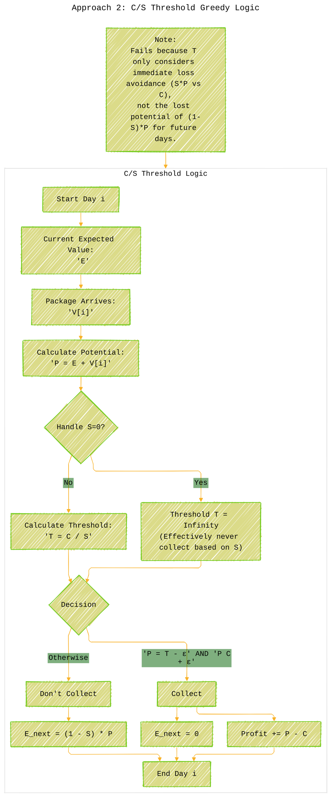

# The Journey Recap - A Diagrammatic Guide
> **Disclaimer:**
>
> This document contains my personal notes on the topic,
> compiled from publicly available documentation and various cited sources.
> The materials are intended for educational purposes, personal study, and reference.
> The content is dual-licensed:
> 1. **MIT License:** Applies to all code implementations (Swift, Mermaid, and other programming languages).
> 2. **Creative Commons Attribution 4.0 International License (CC BY 4.0):** Applies to all non-code content, including text, explanations, diagrams, and illustrations.
---

## 1. Overall Problem-Solving Progression

This flowchart shows the journey from initial attempts to the final successful strategy.

---

## 2. Approach 2: C/S Threshold Greedy Logic

This flowchart details the decision process within the `C/S` threshold strategy.

---

## 3. Approach 4: DP - Backward Threshold Calculation Algorithm

This describes the core loop of the successful backward calculation.

----

## 4. Approach 4: Helper - `calculateFutureProfit` Simulation

This illustrates the logic inside the helper function used during the backward pass.

---

## 5. Approach 4: Final Forward Pass

This flowchart shows the final step using the computed thresholds.

These diagrams visually map out the different stages and logic flows we explored. They should serve as a helpful reference for understanding how we navigated the complexities of the "Missing Mail" problem!

---
**Licenses:**

- **MIT License:**   - Full text in [LICENSE](LICENSE) file.
- **Creative Commons Attribution 4.0 International:**  - Legal details in [LICENSE-CC-BY](LICENSE-CC-BY) and at [Creative Commons official site](http://creativecommons.org/licenses/by/4.0/).

---