```mermaid
graph TD
    subgraph OracleTypes ["Oracle Implementation"]
        direction LR
        Uf_Def["Standard Oracle U<sub>f</sub><br>U<sub>f</sub>|x⟩|y⟩ = |x⟩|y ⊕ f(x)⟩"]
        Ancilla["Ancilla Qubit<br>Initialize to |−⟩ = (1/√2)(|0⟩ - |1⟩)"]
        ApplyUf["Apply U<sub>f</sub> to |x⟩ ⊗ |−⟩"]
        Result["Result: (U<sub>ω</sub>|x⟩) ⊗ |−⟩"]
        Uw_Def["Phase Oracle U<sub>ω</sub><br>U<sub>ω</sub>|x⟩ = (-1)<sup>f(x)</sup>|x⟩"]

        Uf_Def --> Ancilla;
        Ancilla --> ApplyUf;
        ApplyUf --> Result;
        Result --> Uw_Def;
    end
```

> ⚠️🏗️🚧🦺🧱🪵🪨🪚🛠️👷
> 
> This is a working draft in progress
> 
> 
> 
> ⚠️🏗️🚧🦺🧱🪵🪨🪚🛠️👷


----


# Grover's Algorithm
> **Disclaimer:**
>
> This document contains my personal notes on the topic,
> compiled from publicly available documentation and various cited sources.
> The materials are intended for educational purposes, personal study, and reference.
> The content is dual-licensed:
> 1. **MIT License:** Applies to all code implementations (Swift, Mermaid, and other programming languages).
> 2. **Creative Commons Attribution-ShareAlike 4.0 International License (CC BY-SA 4.0):** Applies to all non-code content, including text, explanations, diagrams, and illustrations.
---

## Grover's Algorithm: The Quantum Search Miracle 🚀

Grover's algorithm, developed by Lov Grover in 1996 ,[^1] is a cornerstone of quantum computation. It's often called the quantum search algorithm because it provides a significant speedup for a specific type of problem: **unstructured search**.

Imagine you have a massive, unsorted phone book 📖 and you're looking for a specific name. Classically, you'd have to check entries one by one. On average, you'd check half the entries ($N/2$), and in the worst case, all $N$ entries. This gives a classical query complexity of $O(N)$.

Grover's algorithm tackles this by leveraging quantum phenomena to find the unique input to a "black box" function that produces a desired output, using only $O(\sqrt{N})$ evaluations of that function. That's a quadratic speedup! 💨

**Key Characteristics:**

*   **Problem:** Unstructured search – finding a "marked" item (or items) in a large, unsorted dataset.
*   **Classical Complexity:** $O(N)$
*   **Quantum Complexity (Grover's):** $O(\sqrt{N})$
*   **Optimality:** Grover's algorithm is asymptotically optimal; any quantum algorithm for this problem needs at least $\Omega(\sqrt{N})$ evaluations .[^2]
*   **Speedup:** Quadratic, not exponential. This means it's unlikely to solve NP-Complete problems in polynomial time by itself .[^3]

-----

### Classical vs. Quantum Search Speedup 📊

Let's visualize the difference in query complexity:

```mermaid
graph TD
    subgraph SearchProblem["Unstructured Search for 1 item in N"]
        A[Classical Search] --> B["Average: N/2 queries<br>Worst-Case: N queries<br>Complexity: O(N)"];
        C[Grover's Quantum Search] --> D["Queries: approx. (π/4)√N<br>Complexity: O(√N)"];
    end

    style A fill:#f9f,stroke:#333,stroke-width:2px
    style C fill:#9cf,stroke:#333,stroke-width:2px
```



Think about it: if $N = 1,000,000$:
*   Classical search: ~500,000 queries on average.
*   Grover's algorithm: ~$\frac{\pi}{4}\sqrt{1,000,000} \approx \frac{\pi}{4} \times 1000 \approx 785$ queries.
A huge improvement! 👍

----

### The "Black Box" Oracle 🔍

Grover's algorithm interacts with the search space through an **oracle**. This oracle is a "black box" function, $f(x)$, that can identify whether an input $x$ is the solution we're looking for (the "marked" item, $\omega$).

*   $f(x) = 1$ if $x = \omega$ (marked item)
*   $f(x) = 0$ if $x \neq \omega$ (unmarked item)

The quantum oracle, $U_\omega$, acts on a quantum state $|x\rangle$:
If $x = \omega$ (i.e., $f(x)=1$), it flips the phase of the state: $U_\omega |x\rangle = -|x\rangle$.
If $x \neq \omega$ (i.e., $f(x)=0$), it leaves the state unchanged: $U_\omega |x\rangle = |x\rangle$.

This can be written compactly as:
$$
U_{\omega }|x\rangle =(-1)^{f(x)}|x\rangle
$$

#### Standard Oracle $U_f$ vs. Phase Oracle $U_\omega$

Often, an oracle $U_f$ is defined using an ancillary qubit (helper qubit):
$$
U_{f}|x\rangle |y\rangle =|x\rangle |y\oplus f(x)\rangle
$$
where $\oplus$ is addition modulo 2.

If we prepare the ancilla qubit in the state $|-\rangle = \frac{1}{\sqrt{2}}(|0\rangle - |1\rangle)$, applying $U_f$ effectively implements $U_\omega$ on the primary qubits:
1.  **If $f(x)=0$**:
	$$
    U_f|x\rangle|-\rangle = |x\rangle|0 \oplus 0\rangle - |x\rangle|1 \oplus 0\rangle = |x\rangle(|0\rangle - |1\rangle) = |x\rangle|-\rangle
    $$
	(No change, equivalent to $U_\omega|x\rangle = |x\rangle$)
2.  **If $f(x)=1$**:
	$$
    U_f|x\rangle|-\rangle = \frac{1}{\sqrt{2}}(|x\rangle|0 \oplus 1\rangle - |x\rangle|1 \oplus 1\rangle) = \frac{1}{\sqrt{2}}(|x\rangle|1\rangle - |x\rangle|0\rangle) = -|x\rangle\frac{1}{\sqrt{2}}(|0\rangle - |1\rangle) = (-|x\rangle)|-\rangle
    $$
	(Phase flip, equivalent to $U_\omega|x\rangle = -|x\rangle$)

So mathematically:
$$
U_{f}(|x\rangle \otimes |-\rangle) = (U_{\omega }|x\rangle )\otimes |-\rangle
$$



----

## The Algorithm Steps ⚙️🪜

Grover's algorithm consists of a few main steps:

1.  **Initialization:** Prepare a register of $n = \lceil \log_2 N \rceil$ qubits in a uniform superposition of all $N$ possible states. This is often denoted as $|s\rangle$.
	$$
    |s\rangle = H^{\otimes n}|0\rangle^{\otimes n} = \frac{1}{\sqrt{N}}\sum_{x=0}^{N-1} |x\rangle
    $$
	Here, $H$ is the Hadamard gate, and $H^{\otimes n}$ means applying $H$ to each of the $n$ qubits.

2.  **The Grover Iteration (Amplitude Amplification):** Repeat the following two sub-steps approximately $r(N) \approx \frac{\pi}{4}\sqrt{N}$ times:
	*   **a. Apply the Oracle $U_\omega$**: This marks the solution state $\omega$ by flipping its phase.
		$$
        U_{\omega }|\psi\rangle
        $$
	*   **b. Apply the Grover Diffusion Operator $U_s$**: This operator amplifies the amplitude of the marked state and decreases the amplitude of other states. It's a reflection about the initial state $|s\rangle$.
		$$
        U_s = 2|s\rangle\langle s| - I
        $$
		where $I$ is the identity operator.

3.  **Measurement:** Measure the qubit register in the computational basis. With high probability (approaching 1 for large $N$ and the correct number of iterations), the outcome will be the marked state $\omega$.

### Flowchart Representation

```mermaid
flowchart TD
    A[Start] --> B(Step 1: Initialization<br>Create uniform superposition<br>|s⟩ = (1/√N) Σ|x⟩);
    B --> C{Repeat Grover Iteration<br>r ≈ (π/4)√N times};
    C -- Yes --> D(Step 2a: Apply Oracle<br>U<sub>ω</sub>);
    D --> E(Step 2b: Apply Grover Diffusion<br>U<sub>s</sub> = 2|s⟩⟨s| - I);
    E --> C;
    C -- No --> F(Step 3: Measure);
    F --> G[Output: ω with high probability];
    A --> H((Quantum System: n qubits));

    style A fill:#lightgrey,stroke:#333
    style G fill:#lightgreen,stroke:#333
```

### Quantum Circuit Overview circuitry

The document provides an image of the quantum circuit. A typical Grover iteration looks like this within the larger circuit:

*(The actual drawing of complex quantum circuits in text-based diagram tools is limited. The SVG image provided in the source document `https://upload.wikimedia.org/wikipedia/commons/thumb/b/b9/Grover%27s_algorithm_circuit.svg/500px-Grover%27s_algorithm_circuit.svg.png` is an excellent representation. Below is a conceptual PlantUML of one Grover iteration for illustration, not a full circuit diagram)*

```plantuml
@startuml
hide footbox
skinparam activity ArrowColor #555555
skinparam activityBarColor #A9DCDF
skinparam activityBackgroundColor # Teknologi
skinparam activityBorderColor #555555
skinparam shadowing false

|State|
start
:Current state |ψ⟩;
partition "Grover Iteration" {
    :Apply Oracle U<sub>ω</sub>;
    note right: Flips phase of solution(s)
    :Apply Hadamard H<sup>⊗n</sup>;
    :Apply Phase Shift Z<sub>0</sub>\n(Conditional phase flip if state is |0...0⟩);
    note right: This is part of implementing U<sub>s</sub> more directly.\nZ<sub>0</sub> = I - 2|0⟩⟨0|
    :Apply Hadamard H<sup>⊗n</sup>;
    note left: The sequence H<sup>⊗n</sup> Z<sub>0</sub> H<sup>⊗n</sup> realizes -U<sub>s</sub> \n(or U<sub>s</sub> up to a global phase \nwhen Z<sub>0</sub> is constructed as 2|0⟩<sup>n</sup>⟨0|<sup>n</sup> - I ).\nEffectively, U<sub>s</sub> = H<sup>⊗n</sup>(2|0⟩⟨0| - I)H<sup>⊗n</sup> = 2|s⟩⟨s| - I
}
:State after iteration |ψ'⟩;
stop
@enduml
```



**Note on circuit diffusion operator:** The Grover diffusion operator $U_s = 2|s\rangle\langle s| - I$ can be implemented as $H^{\otimes n} (2|0\rangle\langle 0| - I) H^{\otimes n}$. The $2|0\rangle\langle 0| - I$ part flips the phase of the $|0\rangle^{\otimes n}$ state and leaves others unchanged.

----

## Geometric Interpretation 📐

The magic of Grover's algorithm can be visualized geometrically. The state of the system always remains in a 2-dimensional plane spanned by:
1.  The initial uniform superposition state $|s\rangle$.
2.  The marked (solution) state $|\omega\rangle$.

Let's define $|s'\rangle$ as the uniform superposition of all unmarked states:
$$
|s'\rangle = \frac{1}{\sqrt{N-1}}\sum_{x\neq\omega} |x\rangle
$$
The state vector lies in the plane spanned by $|\omega\rangle$ and $|s'\rangle$.

The initial state $|s\rangle$ can be written as:
$$
|s\rangle = \sin(\frac{\theta}{2}) |\omega\rangle + \cos(\frac{\theta}{2}) |s'\rangle
$$
where $\sin(\frac{\theta}{2}) = \langle \omega | s \rangle = \frac{1}{\sqrt{N}}$. Thus, the initial angle between $|s\rangle$ and $|s'\rangle$ is $\frac{\theta}{2}$.

Each Grover iteration performs two reflections:
1.  **Oracle $U_\omega$**: Reflects the state vector across the hyperplane orthogonal to $|\omega\rangle$ (which means reflecting across $|s'\rangle$ in our 2D plane).
	$$
    U_\omega = I - 2|\omega\rangle\langle\omega|
    $$
2.  **Diffusion $U_s$**: Reflects the state vector across the initial state $|s\rangle$.
	$$
    U_s = 2|s\rangle\langle s| - I
    $$

The combined operation $U_s U_\omega$ rotates the state vector by an angle $\theta = 2\arcsin(1/\sqrt{N})$ towards the marked state $|\omega\rangle$.

```dot
digraph GroverGeometric {
    rankdir="LR";
    node [shape=none, margin=0, fontcolor=blue];
    edge [arrowhead=vee, color=gray];

    splines=true;
    sep="+25,25"; // Increase separation

    // Define states as nodes for positioning
    omega [label=<|\(\omega\)\rangle>]; // Solution state
    s_prime [label=<|\(s'\)\rangle>]; // Orthogonal component
    s_initial [label=<|\(s\)\rangle<sub>initial</sub>>]; // Initial state
    psi_after_Uomega [label=<|\(\psi'\)\rangle = U<sub>ω</sub>|\(s\rangle>];
    psi_after_UsUomega [label=<|\(\psi''\)\rangle = U<sub>s</sub>U<sub>ω</sub>|\(s\rangle>];

    // Invisible edges for layout if needed
    // omega -> s_initial [style=invis];

    // Visual aid for axes
    {rank=same; s_prime; omega;} // Align s' and omega roughly

    // Initial state and its components
    s_initial -> omega [style=dashed, arrowhead=none, label=" sin(θ/2)"];
    s_initial -> s_prime [style=dashed, arrowhead=none, label=" cos(θ/2)"];

    // First reflection (U_omega)
    // s_initial is reflected across s_prime (hyperplane orthogonal to omega)
    // This flips the omega component
    s_initial -> psi_after_Uomega [color="red", label=" U<sub>ω</sub>\n(reflection across s')"];

    // Second reflection (U_s)
    // psi_after_Uomega is reflected across s_initial
    psi_after_Uomega -> psi_after_UsUomega [color="blue", label=" U<sub>s</sub> \n(reflection across s)"];

    // Overall rotation
    // The angle between s_initial and psi_after_UsUomega is θ
    // Indicating this with an arc is hard in DOT.
    // We can add a note.

    label = "\nGeometric View of One Grover Iteration:\nInitial state |s⟩ is rotated by angle θ towards |ω⟩.\nθ = 2 arcsin(1/√N)";
    fontsize=14;
    fontcolor=black;

    // Relative positioning hints (may not be perfectly geometric)
    // These are simplified for DOT; a true geometric plot needs more math.
    // Assume s' is horizontal, omega is vertical for simplicity of concept.
}
```



*Self-correction: DOT is tricky for precise geometric angles. The image `https://upload.wikimedia.org/wikipedia/commons/thumb/1/16/Grovers_algorithm_geometry.png/500px-Grovers_algorithm_geometry.png` in the document illustrates this much better. The DOT diagram above tries to capture the actors and transformations conceptually.*

After $r$ iterations, the state makes an angle $(2r+1)\frac{\theta}{2}$ with $|s'\rangle$. The probability of measuring $|\omega\rangle$ is:
$$
P(\omega) = \sin^2\left(\left(r + \frac{1}{2}\right)\theta\right) = \sin^2\left((2r+1)\arcsin\frac{1}{\sqrt{N}}\right)
$$
We want $(2r+1)\arcsin\frac{1}{\sqrt{N}} \approx \frac{\pi}{2}$.
Since $\arcsin x \approx x$ for small $x$, and $1/\sqrt{N}$ is small for large $N$:
$(2r+1)\frac{1}{\sqrt{N}} \approx \frac{\pi}{2} \implies 2r+1 \approx \frac{\pi}{2}\sqrt{N} \implies r \approx \frac{\pi}{4}\sqrt{N}$.

----

## Algebraic Analysis 🤓

The Grover iteration operator $G = U_s U_\omega$. In the basis $\{|\omega\rangle, |s'\rangle\}$ (where $|s'\rangle$ is the uniform superposition of non-marked states, orthogonal to $|\omega\rangle$), the matrix for $G$ is a rotation:
$$
G = {\begin{bmatrix} \cos\theta & -\sin\theta \\ \sin\theta & \cos\theta \end{bmatrix}}
$$
where $\theta = 2\arcsin(1/\sqrt{N})$.

The initial state is $|s\rangle = \sin(\theta/2)|\omega\rangle + \cos(\theta/2)|s'\rangle$.
After $r$ iterations, the state becomes $G^r|s\rangle$:
$$
G^r|s\rangle = \sin\left((2r+1)\frac{\theta}{2}\right)|\omega\rangle + \cos\left((2r+1)\frac{\theta}{2}\right)|s'\rangle
$$
The probability of measuring $\omega$ is the square of the amplitude of $|\omega\rangle$:
$$
P(\omega) = \sin^2\left((2r+1)\frac{\theta}{2}\right)
$$
(This matches the geometric interpretation's formula).

The document also mentions working in the basis $\{|\omega\rangle, |s\rangle\}$, which is not orthogonal. The matrix for $U_s U_\omega$ in this basis is:
$$
U_{s}U_{\omega }={\begin{bmatrix}1&2/{\sqrt {N}}\\-2/{\sqrt {N}}&1-4/N\end{bmatrix}}
$$
This matrix can be diagonalized using its Jordan form to find its $r$-th power, leading to the same probability expression.

---

## Handling Multiple Matches (*k* solutions) 🧐

If there are $k$ marked items instead of just one, Grover's algorithm still works. The key changes are:
*   The number of iterations required is now approximately $r_k \approx \frac{\pi}{4}\sqrt{\frac{N}{k}}$.
*   The initial superposition $|s\rangle$ now has an overlap of $\sqrt{k/N}$ with the subspace of marked states. The effective angle of rotation $\theta_k$ satisfies $\sin(\theta_k/2) = \sqrt{k/N}$.

```mermaid
graph TD
    subgraph MultipleSolutions["Grover with k Solutions"]
        N_items["Total items: N"]
        K_solutions["Number of marked solutions: k"]
        Iterations["Optimal iterations r<sub>k</sub> ≈ (π/4)√(N/k)"]
        N_items --> K_solutions
        K_solutions --> Iterations

        UnknownK["If k is unknown:"]
        Strategy1["Run repeatedly for decreasing k <br/>(N, N/2, N/4, ...)"]
        Strategy2["Use Quantum Counting Algorithm to estimate k first"]
        UnknownK --> Strategy1 & Strategy2
    end
```



**Important Notes on *k*:**
*   If $k = N/2$, $\sqrt{N/k} = \sqrt{2}$, performance gain is minimal.
*   If $k > N/2$, choosing a random item classically has a >50% chance of success. Iterations would increase.
*   The algorithm is primarily designed for $k \ll N$.

---

## Quantum Partial Search 🤏

Grover and Radhakrishnan proposed quantum partial search in 2004 .[^20] Instead of finding the exact item, it finds which "block" or "chunk" the item belongs to.
*   Database divided into $K$ blocks, each of size $b=N/K$.
*   Uses a combination of "global" Grover iterations (acting on blocks) and "local" Grover iterations (acting within blocks).
*   The speedup depends on $K$ and offers finer control over search granularity.

----

## Optimality and Limitations 🏆🛑

### Optimality
*   Grover's algorithm is **asymptotically optimal** for unstructured search using an oracle $U_\omega$. Any such quantum algorithm requires at least $\Omega(\sqrt{N})$ queries .[^2][^21]
*   For $k$ matching entries, the $\approx \frac{\pi}{4}\sqrt{N/k}$ iterations are also optimal .[^18]

### Implications for NP-Completeness
*   The quadratic speedup is significant but not enough to solve NP-Complete problems in polynomial time quantumly. Squaring an exponential runtime still results in an exponential runtime.
*   This suggests that NP is not contained within BQP (Bounded-error Quantum Polynomial time), at least not via Grover's algorithm alone.

```mermaid
graph TD
    ComplexityClasses["Complexity Landscape (Conjectured)"]
    P["P (Polynomial Time)"]
    NP["NP (Nondeterministic Polynomial Time)"]
    BQP["BQP (Bounded-error Quantum Polynomial)"]
    PSPACE["PSPACE"]

    P --> NP;
    P --> BQP;
    NP --> PSPACE;
    BQP --> PSPACE;
    NP -.-> BQP_relationship["NP ?⊆ BQP (Likely No)"];

    note "Grover's algorithm gives O(√N) for search (NP problems relate to search),
    but √Exponential is still Exponential.
    It doesn't place NP in BQP."

    style BQP_relationship stroke-dasharray: 5 5, color:red
```

----

### Practical Barriers
*   **Overhead:** Near-term quantum computers have significant overhead in terms of qubit quality, connectivity, and error correction. The constant factors hidden in $O(\sqrt{N})$ can be large.
*   **Oracle Implementation:** Constructing an efficient quantum oracle for complex functions $f(x)$ can be challenging and resource-intensive. The "database" is not explicit; the oracle *is* the way to check a constraint or evaluate $f(x)$ .[^13] Fast oracles are possible for some problems .[^14]
*   **Limited Speedup:** The quadratic speedup, while impressive, might not always outweigh the cost of quantum computation for certain problem sizes or specific classical algorithm advantages .[^15]

----

## Applications and Variants 💡

Grover's algorithm and its core idea, amplitude amplification, have broad applicability:

*   **Function Inversion:** If $y = f(x)$ can be evaluated quantumly, Grover can help find $x$ given $y$.
*   **Cryptography 🗝️:**
	*   **Symmetric-key brute-force:** Can reduce effort for a 128-bit key from $2^{128}$ to $\sim 2^{64}$ operations (oracle calls) .[^4]
	*   **Collision attacks:** Finding $x_1 \neq x_2$ such that $H(x_1) = H(x_2)$.
	*   **Pre-image attacks:** Given $h$, find $x$ such that $H(x)=h$.
	*   *Note:* Specialized classical algorithms (e.g., Pollard's rho for collisions) might still be more efficient for specific cryptographic hashes than a generic Grover application .[^12]
*   **Speeding up NP-Complete Problem Subroutines:**
	*   If an algorithm for an NP-complete problem involves exhaustive search as a subroutine, Grover's can speed up that part (e.g., some algorithms for 3SAT, Constraint Satisfaction Problems (CSP)) .[^6][^8]
*   **Black-Box Quantum Query Complexity Problems:**
	*   **Element Distinctness:** Are all elements in a list unique? (Ambainis's quantum walk algorithm uses Grover-like ideas) .[^9]
	*   **Collision Problem:** (Solved with Brassard–Høyer–Tapp algorithm, which uses Grover) .[^10]
*   **Amplitude Amplification:** A generalization of Grover's algorithm that can boost the success probability of any quantum algorithm that finds a solution with some known (small) probability. Grover's algorithm is a special case where the initial success probability is $1/N$ (by random guessing an item in superposition).

----

### Related Quantum Algorithms
*   [Amplitude Amplification](https://en.wikipedia.org/wiki/Amplitude_amplification)
*   [Brassard–Høyer–Tapp algorithm (BHT algorithm)](https://en.wikipedia.org/wiki/BHT_algorithm)
*   [Shor's algorithm](https://en.wikipedia.org/wiki/Shor%27s_algorithm) (Factorization - provides exponential speedup, different mechanism)
*   [Quantum Walk Search](https://en.wikipedia.org/wiki/Quantum_walk_search)

Grover's algorithm represents a fundamental way quantum mechanics can enhance computation, demonstrating a clear, provable advantage over classical approaches for unstructured search problems. While not a silver bullet for all difficult problems, its quadratic speedup is a powerful tool in the quantum algorithm toolkit. ✨


---

<!-- 


---
>**Licenses:**
>
>- **MIT License:**  [](LICENSE) - Full text in [LICENSE](LICENSE) file.
>- **Creative Commons Attribution-ShareAlike 4.0 International**: [CC BY-SA 4.0](https://creativecommons.org/licenses/by-sa/4.0/) [](https://creativecommons.org/licenses/by-sa/4.0/) - Legal details in [LICENSE-CC-BY-SA-4.0](THE_PAST/LICENSE-CC-BY-SA-4.0) and at [Creative Commons official site](https://creativecommons.org/licenses/by-sa/4.0/).
>
---


### References 📚

[^1]: Grover, L. K. (1996). "A fast quantum mechanical algorithm for database search". *Proceedings of the twenty-eighth annual ACM symposium on Theory of computing - STOC '96*. pp. 212–219. [arXiv:quant-ph/9605043](https://arxiv.org/abs/quant-ph/9605043). [doi:10.1145/237814.237866](https://doi.org/10.1145%2F237814.237866).

[^2]: Bennett, C. H., Bernstein, E., Brassard, G., & Vazirani, U. (1997). "The strengths and weaknesses of quantum computation". *SIAM Journal on Computing*, 26(5), 1510–1523. [arXiv:quant-ph/9701001](https://arxiv.org/abs/quant-ph/9701001). [doi:10.1137/s0097539796300933](https://doi.org/10.1137%2Fs0097539796300933).

[^3]: Nielsen, M. A., & Chuang, I. L. (2010). *Quantum computation and quantum information*. Cambridge University Press. (See Chapter 6 for Grover's Algorithm).

[^4]: Bernstein, D. J. (2010). "Grover vs. McEliece". In *Post-Quantum Cryptography, PQCrypto 2010*. Lecture Notes in Computer Science, vol 6061. Springer. pp. 73–80. [doi:10.1007/978-3-642-12929-2\_6](https://doi.org/10.1007%2F978-3-642-12929-2_6).

[^5]: Grover, L. K. (1998). "A framework for fast quantum mechanical algorithms". *Proceedings of the Thirtieth Annual ACM Symposium on the Theory of Computing*. pp. 53–62. [arXiv:quant-ph/9711043](https://arxiv.org/abs/quant-ph/9711043). [doi:10.1145/276698.276712](https://doi.org/10.1145%2F276698.276712).

[^6]: Ambainis, A. (2004). "Quantum search algorithms". *ACM SIGACT News*, 35(2), 22–35. [arXiv:quant-ph/0504012](https://arxiv.org/abs/quant-ph/0504012). [doi:10.1145/992287.992296](https://doi.org/10.1145%2F992287.992296).

[^8]: Cerf, N. J., Grover, L. K., & Williams, C. P. (2000). "Nested Quantum Search and NP-Hard Problems". *Applicable Algebra in Engineering, Communication and Computing*, 10(4), 311–338. [doi:10.1007/s002000050134](https://doi.org/10.1007%2Fs002000050134).

[^9]: Ambainis, A. (2007). "Quantum Walk Algorithm for Element Distinctness". *SIAM Journal on Computing*, 37(1), 210–239. [arXiv:quant-ph/0311001](https://arxiv.org/abs/quant-ph/0311001). [doi:10.1137/S0097539705447311](https://doi.org/10.1137%2FS0097539705447311).

[^10]: Brassard, G., Høyer, P., & Tapp, A. (1998). "Quantum Cryptanalysis of Hash and Claw-Free Functions". *LATIN '98: Theoretical Informatics*. Lecture Notes in Computer Science, vol 1380. Springer. pp. 163–169. [arXiv:quant-ph/9705002](https://arxiv.org/abs/quant-ph/9705002). [doi:10.1007/BFb0054319](https://doi.org/10.1007%2FBFb0054319).

[^12]: Bernstein, D. J. (2009). "Cost analysis of hash collisions: Will quantum computers make SHARCS obsolete?". *Conference Proceedings for Special-purpose Hardware for Attacking Cryptographic Systems (SHARCS '09)*, 09, 105–117.

[^13]: Viamontes, G. F., Markov, I. L., & Hayes, J. P. (2005). "Is Quantum Search Practical?". *Computing in Science and Engineering*, 7(3), 62–70. [arXiv:quant-ph/0405001](https://arxiv.org/abs/quant-ph/0405001). [doi:10.1109/mcse.2005.53](https://doi.org/10.1109%2Fmcse.2005.53).

[^14]: Sinitsyn, N. A., & Yan, B. (2023). "Topologically protected Grover's oracle for the partition problem". *Physical Review A*, 108(2), 022412. [arXiv:2304.10488](https://arxiv.org/abs/2304.10488). [doi:10.1103/PhysRevA.108.022412](https://doi.org/10.1103%2FPhysRevA.108.022412).

[^15]: Babbush, R., McClean, J. R., Newman, M., Gidney, C., Boixo, S., & Neven, H. (2021). "Focus beyond Quadratic Speedups for Error-Corrected Quantum Advantage". *PRX Quantum*, 2(1), 010103. [arXiv:2011.04149](https://arxiv.org/abs/2011.04149). [doi:10.1103/PRXQuantum.2.010103](https://doi.org/10.1103%2FPRXQuantum.2.010103).

[^18]: Boyer, M., Brassard, G., Høyer, P., & Tapp, A. (1998). "Tight Bounds on Quantum Searching". *Fortschritte der Physik*, 46(4–5), 493–506. [arXiv:quant-ph/9605034](https://arxiv.org/abs/quant-ph/9605034). [doi:10.1002/3527603093.ch10](https://doi.org/10.1002%2F3527603093.ch10).

[^20]: Grover, L. K., & Radhakrishnan, J. (2005). "Is partial quantum search of a database any easier?". [arXiv:quant-ph/0407122v4](https://arxiv.org/abs/quant-ph/0407122v4).

[^21]: Zalka, C. (1999). "Grover's quantum searching algorithm is optimal". *Physical Review A*, 60(4), 2746–2751. [arXiv:quant-ph/9711070](https://arxiv.org/abs/quant-ph/9711070). [doi:10.1103/PhysRevA.60.2746](https://doi.org/10.1103%2FPhysRevA.60.2746).

----
