> ⚠️🏗️🚧🦺🧱🪵🪨🪚🛠️👷
> 
> This is a working draft in progress
> 
> 
> 
> ⚠️🏗️🚧🦺🧱🪵🪨🪚🛠️👷


----


# Shor's Algorithm
> **Disclaimer:**
>
> This document contains my personal notes on the topic,
> compiled from publicly available documentation and various cited sources.
> The materials are intended for educational purposes, personal study, and reference.
> The content is dual-licensed:
> 1. **MIT License:** Applies to all code implementations (Swift, Mermaid, and other programming languages).
> 2. **Creative Commons Attribution-ShareAlike 4.0 International License (CC BY-SA 4.0):** Applies to all non-code content, including text, explanations, diagrams, and illustrations.
---

## Shor's Algorithm: An Overview 😮

Shor's algorithm, introduced by Peter Shor in 1994, is a quantum algorithm primarily known for its ability to find the prime factors of an integer. This capability poses a significant threat to widely used cryptographic systems. 💥

**Key Problems Solved by Shor's Algorithm:**

*   **Integer Factorization**: Finding prime factors of a number $N$.
*   **Discrete Logarithm Problem**: Finding $r$ such that $x = g^r \pmod p$.
*   **Period-Finding Problem**: A general problem that underlies the solutions to the above.

All these problems are instances of the **Hidden Subgroup Problem (HSP)**.


### Computational Power: Quantum vs. Classical 🚀

The real excitement around Shor's algorithm stems from its efficiency on a quantum computer compared to the best-known classical algorithms.

*   **Shor's Algorithm (Quantum)**: Runs in polynomial time with respect to $\log N$.
	*   Time Complexity: $O((\log N)^2 (\log \log N) (\log \log \log N))$ using fast multiplication.
	*   Or even $O((\log N)^2 (\log \log N))$ with the asymptotically fastest multiplication.
	*   This places integer factorization in the complexity class **BQP** (Bounded-error Quantum Polynomial time).

*   **General Number Field Sieve (Classical)**: The best known classical algorithm, runs in sub-exponential time.
	*   Time Complexity: $O(e^{1.9(\log N)^{1/3}(\log \log N)^{2/3}})$

The difference is stark: polynomial time is vastly faster than sub-exponential time for large $N$.

```mermaid
graph LR
    subgraph ComplexityComparison["Algorithm Complexity"]
        direction LR
        Shor["Shor's Algorithm (Quantum)"] -- "Polynomial Time" --> PTime["O((log N)<sup>k</sup>)"]
        GNFS["General Number Field Sieve (Classical)"] -- "Sub-exponential Time" --> SubExpTime["O(e<sup>(log N)<sup>c<sub>1</sub></sup>(log log N)<sup>c<sub>2</sub></sup></sup>)"]
    end
    PTime -- "Much Faster for large N" --> Faster["✅ Efficient"]
    SubExpTime -- "Much Slower for large N" --> Slower["❌ Inefficient for very large N"]

    style Shor fill:#add,stroke:#333,stroke-width:2px
    style GNFS fill:#dda,stroke:#333,stroke-width:2px
    style PTime fill:#lightgreen
    style SubExpTime fill:#lightcoral
```



### Impact on Cryptography 🔐🔓

The ability to factor large integers efficiently has massive implications for public-key cryptography.

**Cryptosystems Vulnerable to Shor's Algorithm:**

*   RSA (Rivest-Shamir-Adleman)
*   Finite-field Diffie-Hellman key exchange
*   Elliptic-Curve Diffie-Hellman key exchange (ECC)

RSA's security, for example, relies on the assumption that factoring large integers is computationally intractable for classical computers. Shor's algorithm shatters this assumption in the quantum realm.


This threat has spurred research into **Post-Quantum Cryptography (PQC)** – cryptosystems designed to be secure against both classical and quantum computers.

### Challenges and Practical Realizations 🛠️🔬

Despite its theoretical power, practical implementation of Shor's algorithm faces hurdles:

*   **Qubit Requirements**: Factoring numbers of practical significance (e.g., 2048-bit RSA keys) requires millions of high-quality qubits. Current quantum computers have far fewer.
*   **Quantum Noise & Decoherence**: Quantum states are fragile. Noise can corrupt computations.
*   **Quantum Error Correction (QEC)**: Needed to combat noise, but QEC itself requires additional qubits.
*   **Experimental Successes**:
	*   **2001 (IBM)**: Factored $15 = 3 \times 5$ using 7 qubits (NMR).
	*   **2007 (Photonic Qubits)**: Compiled versions demonstrated.
	*   **2012 (Solid-state qubits)**: Factored $15$.
	*   **2012 (Qubit Recycling)**: Factored $21$.
	*   **2019 (IBM Q System One)**: Attempt to factor $35$ failed due to errors.
*   **Oversimplification Concerns**: Early demonstrations often "compiled" the algorithm using prior knowledge of the answer, oversimplifying the problem.
*   **Noise Impact (Cai, 2023)**: Showed that in the presence of noise, Shor's algorithm fails asymptotically almost surely for certain types of large semiprimes unless robust error correction is employed.


----

## The Algorithm: A Deep Dive 🏊‍♂️

The problem: Given an odd composite number $N$, find its integer factors.
Shor's algorithm tackles this in two main parts:

1.  **Classical Reduction**: Reduce the factoring problem to an order-finding problem.
2.  **Quantum Order-Finding**: Solve the order-finding problem using a quantum computer.

---

### Overall Flow of Shor's Algorithm

```mermaid
graph TD
    Start((Start: Factor N)) --> C0{Is N even?};
    C0 -- Yes --> F1["Factor is 2. N = N/2. Repeat."];
    C0 -- No --> C1{Is N a prime power, $p^k$?};
    C1 -- Yes --> F2["Factor with classical algorithms."];
    C1 -- No --> Step1["1. Pick random a, 1 < a < N"];
    Step1 --> Step2["2. Compute K = gcd(a, N)"];
    Step2 --> C2{K = 1?};
    C2 -- No (K != 1) --> F3["K is a non-trivial factor! (Other factor N/K). Done. 🎉"];
    C2 -- Yes (K = 1) --> Step4["4. Use Quantum Subroutine to find order r of a mod N"];
    Step4 --> Step5{"5. Is r odd?"};
    Step5 -- Yes --> Step1;
    Step5 -- No --> Step6a["Compute x = a<sup>r/2</sup> mod N"];
    Step6a --> Step6b{"Is x ≡ -1 mod N (i.e., a<sup>r/2</sup> + 1 ≡ 0 mod N)?"};
    Step6b -- Yes --> Step1;
    Step6b -- No --> Step6c["Compute g = gcd(a<sup>r/2</sup> - 1, N)"];
    Step6c --> C3{g = 1 or g = N?};
    C3 -- Yes --> Step1;
    C3 -- No --> F4["g is a non-trivial factor! (Other factor N/g). Done. 🎉"];
    
    style Start fill:#lightgreen,stroke:#333,stroke-width:2px
    style QuantumSubroutine fill:#lightblue,stroke:#333,stroke-width:2px,href:"#quantum-order-finding-subroutine"
    style F3 fill:#ccffcc,stroke:#333,stroke-width:2px
    style F4 fill:#ccffcc,stroke:#333,stroke-width:2px
    link Step4 QuantumSubroutine "Click for Quantum Subroutine Details"
```

----

### Classical Reduction: From Factoring to Order-Finding

The classical part of the algorithm relies on number theory. If we want to factor $N$:

1.  Handle trivial cases:
	*   If $N$ is even, $2$ is a factor.
	*   If $N$ is a prime power (e.g., $N=p^k$), classical algorithms can factor it. Assume $N$ is odd and not a prime power.
2.  Pick a random integer $a$ such that $2 \leq a < N$.
3.  Compute $K = \gcd(a, N)$.
	*   If $K \neq 1$, then $K$ is a non-trivial factor of $N$. We're done! 😊
4.  If $K = 1$, then $a$ and $N$ are coprime. We need to find the **order** $r$ of $a$ modulo $N$.
	The order $r$ is the smallest positive integer such that:
	$$
    a^r \equiv 1 \pmod N
    $$
	This is where the quantum computer comes in.
5.  Once $r$ is found (by the quantum part):
	*   If $r$ is odd, this $a$ doesn't work. Go back to step 2 and pick a new $a$.
	*   If $r$ is even, we can write:
		$$
        a^r - 1 \equiv 0 \pmod N
        $$
		$$
        (a^{r/2} - 1)(a^{r/2} + 1) \equiv 0 \pmod N
        $$
		This means $N$ divides the product $(a^{r/2}-1)(a^{r/2}+1)$.
	*   Now, we check if $N$ also divides $a^{r/2} + 1$.
		*   If $a^{r/2} + 1 \equiv 0 \pmod N$ (i.e., $a^{r/2} \equiv -1 \pmod N$), this $a$ doesn't work. Go back to step 2.
		   (Note: The original text states "If $N$ does not divide $a^{r/2}+1$, then this means that we are able to find a nontrivial factor." The check $d=\gcd(N, a^{r/2}-1)$ handles this. If $a^{r/2} \equiv -1 \pmod N$, then $a^{r/2}-1 \equiv -2 \pmod N$, and $\gcd(N, a^{r/2}-1)$ could still be a factor, but this case, $a^{r/2} \equiv -1 \pmod N$, is often a failure case that leads to trivial factors if we just proceed to compute $d=\gcd(N, a^{r/2}-1)$ or $d'=\gcd(N, a^{r/2}+1)$. The original text's step 6 is: "Compute $g=\gcd(N,a^{r/2}+1)$. If $g$ is nontrivial …". A common way to state it is if $a^{r/2} \not\equiv \pm 1 \pmod N$, then $\gcd(a^{r/2}-1, N)$ and $\gcd(a^{r/2}+1, N)$ are non-trivial factors. Let's stick to the text's logic.)
	*   Otherwise, neither $a^{r/2}-1$ nor $a^{r/2}+1$ is a multiple of $N$ by itself (if $a^{r/2} \equiv 1 \pmod N$ we would have picked a smaller $r$).
		Compute $d = \gcd(a^{r/2}-1, N)$ (or $g = \gcd(a^{r/2}+1, N)$ as in the text).
		*   If $d$ (or $g$) is a non-trivial factor (i.e., $1 < d < N$), then $d$ is a factor of $N$. We're done! 😄
		*   If $d$ (or $g$) is $1$ or $N$ (trivial factors), this $a$ doesn't work. Go back to step 2.

It's shown that this process is likely to succeed after a few random choices of $a$.

----

### Quantum Order-Finding Subroutine ⚛️

This is the core quantum part. Goal: Given coprime $N$ and $1 < a < N$, find the order $r$ of $a$ modulo $N$.

**Setup:**

*   Two quantum registers:
	*   **First register (control/input):** $2n$ qubits, initialized to $|0\rangle^{\otimes 2n}$.
	*   **Second register (target):** $n$ qubits, where $n = \lceil \log_2 N \rceil$, initialized to $|1\rangle$.
*   The state $|1\rangle$ in the second register is actually $\underbrace{|0\dots01\rangle}_{n \text{ qubits}}$.

**Steps of the Quantum Subroutine Circuit:**
(Referenced from the image in the provided text and common literature such as Nielsen & Chuang)


1.  **Initialization & Superposition:**
	*   The first register is initialized to $|0\rangle^{\otimes 2n}$ and then put into an equal superposition of all $2^{2n}$ states using Hadamard gates:
		$$
        \frac{1}{\sqrt{2^{2n}}} \sum_{x=0}^{2^{2n}-1} |x\rangle
        $$
	*   The second register is initialized to $|1\rangle$.
	*   The total initial state (after Hadamards on reg1) is:
		$$
        \frac{1}{\sqrt{2^{2n}}} \sum_{x=0}^{2^{2n}-1} |x\rangle |1\rangle
        $$

2.  **Controlled Modular Exponentiation (The Oracle $U_f$):**
	This step applies a transformation that computes $a^x \pmod N$. The unitary operator $U$ acts on the second register, controlled by the first register:
	$$
    U |x\rangle |y\rangle = |x\rangle |y \cdot a^x \pmod N\rangle
    $$
	However, the text describes the QPE approach. For Quantum Phase Estimation (QPE), the unitary is $U|k\rangle = |ak \pmod N\rangle$ for $0 \leq k < N$. The QPE uses controlled powers of this $U$, i.e., $U^{2^j}$.
	The eigenvectors of this $U$ are:
	$$
    |\psi_s\rangle = \frac{1}{\sqrt{r}} \sum_{k=0}^{r-1} e^{-2\pi i sk/r} |a^k \pmod N\rangle
    $$
	with eigenvalues $e^{2\pi i s/r}$ for $s = 0, 1, \ldots, r-1$.
	The state $|1\rangle$ in the second register can be written as a sum of these eigenvectors:
	$$
    |1\rangle = \frac{1}{\sqrt{r}} \sum_{s=0}^{r-1} |\psi_s\rangle
    $$
	After applying Hadamard gates to the first register, and preparing $|1\rangle$ in the second, the QPE procedure effectively transforms the state to:
	$$
    \frac{1}{\sqrt{r}} \sum_{s=0}^{r-1} |\widetilde{s/r}\rangle |\psi_s\rangle
    $$
	where $|\widetilde{s/r}\rangle$ is a state in the first register that is a superposition of integers close to $2^{2n} \cdot (s/r)$. The term $\phi_j$ in the problem text corresponds to $\widetilde{j/r}$.
	So the state after QPE (before measurement of first register) is approximately:
	$$
    \frac{1}{\sqrt{r}} \sum_{j=0}^{r-1} |\phi_j\rangle |\psi_j\rangle
    $$
	where $|\phi_j\rangle$ is a state highly peaked around the value $y_j \approx 2^{2n} \frac{j}{r}$.

3.  **Inverse Quantum Fourier Transform (IQFT):**
	Applied to the first register. This transform is crucial for isolating the period information. (This is part of the QPE algorithm).

4.  **Measurement:**
	Measure the first register. We obtain a value $y$. This $y$ is highly likely to be an integer close to $2^{2n} \frac{j}{r}$ for some random $j \in \{0, 1, \ldots, r-1\}$.
	Specifically, the probability of measuring $y$ such that $\frac{y}{2^{2n}}$ is an integer multiple of $1/r$ is high.
	So, $\frac{y}{2^{2n}} \approx \frac{j}{r}$ for some integer $j$.

5.  **Classical Post-Processing (Continued Fractions Algorithm):**
	We have an estimate $\frac{y}{2^{2n}} \approx \frac{j}{r}$. The continued fractions algorithm is used to find the best rational approximation $b/c$ for $y/2^{2n}$ such that $c < N$.
	With $2n$ qubits in the first register, it's guaranteed that if $|\frac{j}{r} - \phi| \leq \frac{1}{2r^2}$, the continued fraction algorithm recovers $\frac{j'}{c'} = \frac{j/\gcd(j,r)}{r/\gcd(j,r)}$.
	The condition is met because:
	$$
    \left| \frac{j}{r} - \frac{y}{2^{2n}} \right| \leq \frac{1}{2^{2n+1}}
    $$
	And since $2n$ qubits are chosen such that $2^{2n} \ge N^2 > r^2$ (typically $N \le 2^n \implies N^2 \le 2^{2n}$), then $1/2^{2n+1} < 1/(2r^2)$.
	So, the algorithm finds $b/c = j/r$ where $c$ is a candidate for $r$.
	*   If $\gcd(j,r) \neq 1$, then $c$ will be $r/\gcd(j,r)$, a factor of $r$.
	*   To get the true $r$, one might need to run the quantum subroutine multiple times, obtain several candidates $c_1, c_2, \ldots, c_s$, and then compute $r = \operatorname{lcm}(c_1, c_2, \ldots, c_s)$.
	*   However, advanced post-processing often allows finding $r$ from a single good run.

**Bottleneck:** The quantum modular exponentiation (implementing the controlled-$U^{2^j}$ gates) is the most computationally intensive part, typically requiring $O(n^3)$ gates or $O((\log N)^3)$ gates.

### Mathematical Equations Summary

*   Order finding: $a^r \equiv 1 \pmod N$
*   Classical reduction: $N \mid (a^{r/2}-1)(a^{r/2}+1)$
*   Factor finding: $d = \gcd(N, a^{r/2}-1)$ or $\gcd(N, a^{r/2}+1)$
*   Qubit count for second register: $n = \lceil \log_2 N \rceil$
*   Qubit count for first register: $2n$ (or $2n + O(1)$ for higher precision)
*   Unitary for QPE: $U|k\rangle = |ak \pmod N\rangle$ for $0 \le k < N$
*   Eigenvectors of $U$: $|\psi_j\rangle = r^{-1/2} \sum_{k=0}^{r-1} \omega_r^{-kj} |a^k \pmod N\rangle$
*   Eigenvalues of $U$: $\omega_r^j = e^{2\pi i j/r}$
*   Decomposition of $|1\rangle$: $|1\rangle = \frac{1}{\sqrt{r}} \sum_{j=0}^{r-1} |\psi_j\rangle$
*   State after QPE (approximate): $\frac{1}{\sqrt{r}} \sum_{j=0}^{r-1} |\phi_j\rangle |\psi_j\rangle$, where measurement of first register yields $y$ s.t. $y/2^{2n} \approx j/r$.
*   Continued fractions condition: Given $\phi = y/2^{2n}$, if $|j/r - \phi| \leq \frac{1}{2r^2}$, then $j/\gcd(j,r)$ and $r/\gcd(j,r)$ are found.
*   Shor's algorithm meets this: $\left| \frac{j}{r} - \frac{y}{2^{2n}} \right| \leq \frac{1}{2^{2n+1}} \leq \frac{1}{2N^2} \leq \frac{1}{2r^2}$ (as $r < N$).
*   Finding $r$ from multiple runs: $r = \operatorname{lcm}(c_1, c_2, \ldots, c_s)$.

---

## Relation to the Hidden Subgroup Problem (HSP) 🎭

The HSP provides a general framework for many quantum algorithms, including Shor's.
Given a function $f: G \to X$ that is constant on the cosets of some hidden subgroup $H \subseteq G$, and distinct on distinct cosets, the goal is to find $H$.

### Discrete Logarithm as HSP

*   Problem: Given $g, x$ in a group $G'$ of order $p$, find $r$ such that $x = g^r$.
*   Consider the group $G = \mathbb{Z}_p \times \mathbb{Z}_p$.
*   Define the function $f: \mathbb{Z}_p \times \mathbb{Z}_p \to G'$:
	$$
    f(s_1, s_2) = g^{s_1} x^{-s_2}
    $$
*   This function $f$ is constant on the cosets of the hidden subgroup $H = \{(k \cdot r, k \cdot 1) \pmod p \mid k \in \mathbb{Z}_p \}$. The kernel of $f$ (elements mapping to identity in $G'$) is $H$.
*   Finding a generator of $H$, which is $(r,1)$, reveals $r$.


### Order-Finding as HSP

*   Problem: Find $r$ such that $a^r \equiv 1 \pmod N$.
*   Consider the group $G = \mathbb{Z}$ (integers under addition).
*   Define the function $f: \mathbb{Z} \to \mathbb{Z}_N^*$ (multiplicative group of integers modulo N):
	$$
    f(x) = a^x \pmod N
    $$
*   This function is periodic with period $r$: $f(x+r) = a^{x+r} = a^x a^r \equiv a^x \cdot 1 = f(x) \pmod N$.
*   The hidden subgroup is $H = r\mathbb{Z} = \{kr \mid k \in \mathbb{Z}\}$. Finding this subgroup (i.e., its generator $r$) solves the order-finding problem.


Shor's algorithm provides an efficient quantum solution for the HSP in abelian groups.

----

## Conclusion🏁

Shor's algorithm is a cornerstone of quantum computing, demonstrating a significant speedup over classical methods for problems of immense practical importance, especially in cryptography. While practical, fault-tolerant quantum computers capable of breaking current encryption standards are still some way off, the theoretical foundation laid by Shor continues to drive research in both quantum algorithm design and the development of quantum-resistant cryptography. The journey from theory to large-scale practice is ongoing, filled with challenges and exciting possibilities! 🧑‍🔬✨


---

<!-- 


---
>**Licenses:**
>
>- **MIT License:**  [](LICENSE) - Full text in [LICENSE](LICENSE) file.
>- **Creative Commons Attribution-ShareAlike 4.0 International**: [CC BY-SA 4.0](https://creativecommons.org/licenses/by-sa/4.0/) [](https://creativecommons.org/licenses/by-sa/4.0/) - Legal details in [LICENSE-CC-BY-SA-4.0](THE_PAST/LICENSE-CC-BY-SA-4.0) and at [Creative Commons official site](https://creativecommons.org/licenses/by-sa/4.0/).
>
---


## References 📚

[^1]: Shor, P.W. (1994). "Algorithms for quantum computation: Discrete logarithms and factoring". *Proceedings 35th Annual Symposium on Foundations of Computer Science*. pp. 124–134. [doi:10.1109/sfcs.1994.365700](https://doi.org/10.1109%2Fsfcs.1994.365700). ISBN 978-0-8186-6580-6.
[^2]: Shor, Peter W. (October 1997). "Polynomial-Time Algorithms for Prime Factorization and Discrete Logarithms on a Quantum Computer". *SIAM Journal on Computing*. **26** (5): 1484–1509. [arXiv:quant-ph/9508027](https://arxiv.org/abs/quant-ph/9508027). [doi:10.1137/S0097539795293172](https://doi.org/10.1137%2FS0097539795293172). S2CID [2337707](https://api.semanticscholar.org/CorpusID:2337707).
[^3]: Nielsen, Michael A.; Chuang, Isaac L. (9 December 2010). [*Quantum Computation and Quantum Information*](http://mmrc.amss.cas.cn/tlb/201702/W020170224608149940643.pdf) (PDF) (10th Anniversary ed.). Cambridge University Press. ISBN 978-1-107-00217-3. Archived (PDF) from the original on 2019-07-11. Retrieved 24 April 2022.
[^4]: Gidney, Craig; Ekerå, Martin (2021). "How to factor 2048 bit RSA integers in 8 hours using 20 million noisy qubits". *Quantum*. **5**: 433. [arXiv:1905.09749](https://arxiv.org/abs/1905.09749). [Bibcode:2021Quant...5..433G](https://ui.adsabs.harvard.edu/abs/2021Quant...5..433G). [doi:10.22331/q-2021-04-15-433](https://doi.org/10.22331%2Fq-2021-04-15-433). S2CID [162183806](https://api.semanticscholar.org/CorpusID:162183806).
[^5]: Cai, Jin-Yi (2024). "Shor's algorithm does not factor large integers in the presence of noise". *Science China Information Sciences*. **67** (7). [arXiv:2306.10072](https://arxiv.org/abs/2306.10072). [doi:10.1007/s11432-023-3961-3](https://doi.org/10.1007%2Fs11432-023-3961-3).
[^6]: See also [pseudo-polynomial time](https://en.wikipedia.org/wiki/Pseudo-polynomial_time).
[^7]: Beckman, David; Chari, Amalavoyal N.; Devabhaktuni, Srikrishna; Preskill, John (August 1996). "Efficient networks for quantum factoring". *Physical Review A*. **54** (2): 1034–1063. [arXiv:quant-ph/9602016](https://arxiv.org/abs/quant-ph/9602016). [Bibcode:1996PhRvA..54.1034B](https://ui.adsabs.harvard.edu/abs/1996PhRvA..54.1034B). [doi:10.1103/physreva.54.1034](https://doi.org/10.1103%2Fphysreva.54.1034). PMID [9913575](https://pubmed.ncbi.nlm.nih.gov/9913575).
[^8]: Harvey, David; van der Hoeven, Joris (March 2021). ["Integer multiplication in time O (n log n)"](https://hal.science/hal-02070778v2/file/nlogn.pdf) (PDF). *Annals of Mathematics*. **193** (2). [doi:10.4007/annals.2021.193.2.4](https://doi.org/10.4007%2Fannals.2021.193.2.4).
[^9]: ["Number Field Sieve"](http://mathworld.wolfram.com/NumberFieldSieve.html). *wolfram.com*. Retrieved 23 October 2015.
[^10]: Roetteler, Martin; Naehrig, Michael; Svore, Krysta M.; Lauter, Kristin E. (2017). "Quantum resource estimates for computing elliptic curve discrete logarithms". *Advances in Cryptology – ASIACRYPT 2017*. LNCS. Vol. 10625. Springer. pp. 241–270. [arXiv:1706.06752](https://arxiv.org/abs/1706.06752). [doi:10.1007/978-3-319-70697-9_9](https://doi.org/10.1007%2F978-3-319-70697-9_9).
[^11]: Vandersypen, L. M. K., et al. (2001). "Experimental realization of Shor's quantum factoring algorithm using nuclear magnetic resonance". *Nature*. **414** (6866): 883–887. [arXiv:quant-ph/0112176](https://arxiv.org/abs/quant-ph/0112176). [doi:10.1038/414883a](https://doi.org/10.1038%2F414883a).
[^12]: Lu, C-Y., et al. (2007). "Demonstration of a Compiled Version of Shor's Quantum Factoring Algorithm Using Photonic Qubits". *Physical Review Letters*. **99** (25): 250504. [arXiv:0705.1684](https://arxiv.org/abs/0705.1684). [doi:10.1103/PhysRevLett.99.250504](https://doi.org/10.1103%2FPhysRevLett.99.250504).
[^13]: Lanyon, B. P., et al. (2007). "Experimental Demonstration of a Compiled Version of Shor's Algorithm with Quantum Entanglement". *Physical Review Letters*. **99** (25): 250505. [arXiv:0705.1398](https://arxiv.org/abs/0705.1398). [doi:10.1103/PhysRevLett.99.250505](https://doi.org/10.1103%2FPhysRevLett.99.250505).
[^14]: Lucero, E., et al. (2012). "Computing prime factors with a Josephson phase qubit quantum processor". *Nature Physics*. **8** (10): 719. [arXiv:1202.5707](https://arxiv.org/abs/1202.5707). [doi:10.1038/nphys2385](https://doi.org/10.1038%2Fnphys2385).
[^15]: Martín-López, E., et al. (2012). "Experimental realization of Shor's quantum factoring algorithm using qubit recycling". *Nature Photonics*. **6** (11): 773–776. [arXiv:1111.4147](https://arxiv.org/abs/1111.4147). [doi:10.1038/nphoton.2012.259](https://doi.org/10.1038%2Fnphoton.2012.259).
[^16]: Monz, T., et al. (2016). "Realization of a scalable Shor algorithm". *Science*. **351** (6277): 1068–1070. [arXiv:1507.08852](https://arxiv.org/abs/1507.08852). [doi:10.1126/science.aad9480](https://doi.org/10.1126%2Fscience.aad9480).
[^17]: Amico, M., et al. (2019). "Experimental study of Shor's factoring algorithm using the IBM Q Experience". *Physical Review A*. **100** (1): 012305. [arXiv:1903.00768](https://arxiv.org/abs/1903.00768). [doi:10.1103/PhysRevA.100.012305](https://doi.org/10.1103%2FPhysRevA.100.012305).
[^18]: Smolin, J. A., et al. (2013). "Oversimplifying quantum factoring". *Nature*. **499** (7457): 163–165. [arXiv:1301.7007](https://arxiv.org/abs/1301.7007). [doi:10.1038/nature12290](https://doi.org/10.1038%2Fnature12290).
[^19]: Karamlou, A. H., et al. (2021). "Analyzing the performance of variational quantum factoring on a superconducting quantum processor". *npj Quantum Information*. **7** (1): 156. [arXiv:2012.07825](https://arxiv.org/abs/2012.07825). [doi:10.1038/s41534-021-00478-z](https://doi.org/10.1038%2Fs41534-021-00478-z).
[^20]: ["Quantum computing motte-and-baileys"](https://scottaaronson.blog/?p=4447). *Shtetl-Optimized*. 2019-12-28.
[^21]: Bernstein, D. (1998). "Detecting perfect powers in essentially linear time". *Mathematics of Computation*. **67** (223): 1253–1283. [doi:10.1090/S0025-5718-98-00952-1](https://doi.org/10.1090%2FS0025-5718-98-00952-1).
[^22]: For example, computing roots and testing primality.
[^23]: Ekerå, M. (2021). "On completely factoring any integer efficiently in a single run of an order-finding algorithm". *Quantum Information Processing*. **20** (6): 205. [arXiv:2007.10044](https://arxiv.org/abs/2007.10044). [doi:10.1007/s11128-021-03069-1](https://doi.org/10.1007%2Fs11128-021-03069-1).
[^24]: Kitaev, A. Yu (1995). "Quantum measurements and the Abelian Stabilizer Problem". [arXiv:quant-ph/9511026](https://arxiv.org/abs/quant-ph/9511026).
[^25]: Ekerå, M. (2024). "On the Success Probability of Quantum Order Finding". *ACM Transactions on Quantum Computing*. **5** (2): 1–40. [arXiv:2201.07791](https://arxiv.org/abs/2201.07791). [doi:10.1145/3655026](https://doi.org/10.1145%2F3655026).
[^26]: Markov, I. L.; Saeedi, M. (2012). "Constant-Optimized Quantum Circuits for Modular Multiplication and Exponentiation". *Quantum Information and Computation*. **12** (5–6): 361–394. [arXiv:1202.6614](https://arxiv.org/abs/1202.6614). [doi:10.26421/QIC12.5-6-1](https://doi.org/10.26421%2FQIC12.5-6-1).
[^27]: Markov, I. L.; Saeedi, M. (2013). "Faster Quantum Number Factoring via Circuit Synthesis". *Phys. Rev. A*. **87** (1): 012310. [arXiv:1301.3210](https://arxiv.org/abs/1301.3210). [doi:10.1103/PhysRevA.87.012310](https://doi.org/10.1103%2FPhysRevA.87.012310).
[^28]: Bernstein, D. J., et al. (2017). "Post-quantum RSA". *Post-Quantum Cryptography*. LNCS. Vol. 10346. pp. 311–329. [doi:10.1007/978-3-319-59879-6_18](https://doi.org/10.1007%2F978-3-319-59879-6_18).

-----
