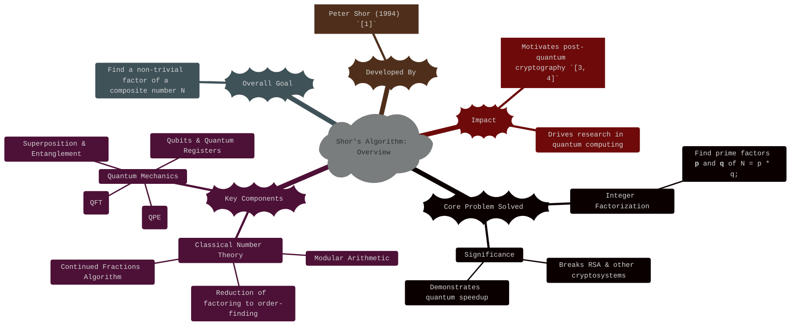
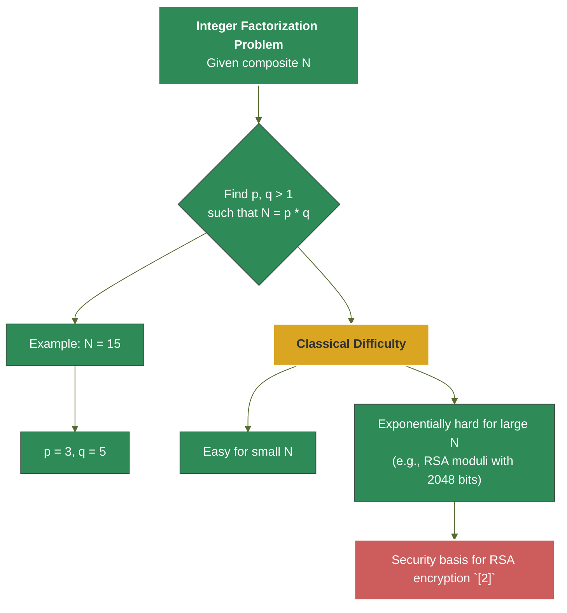
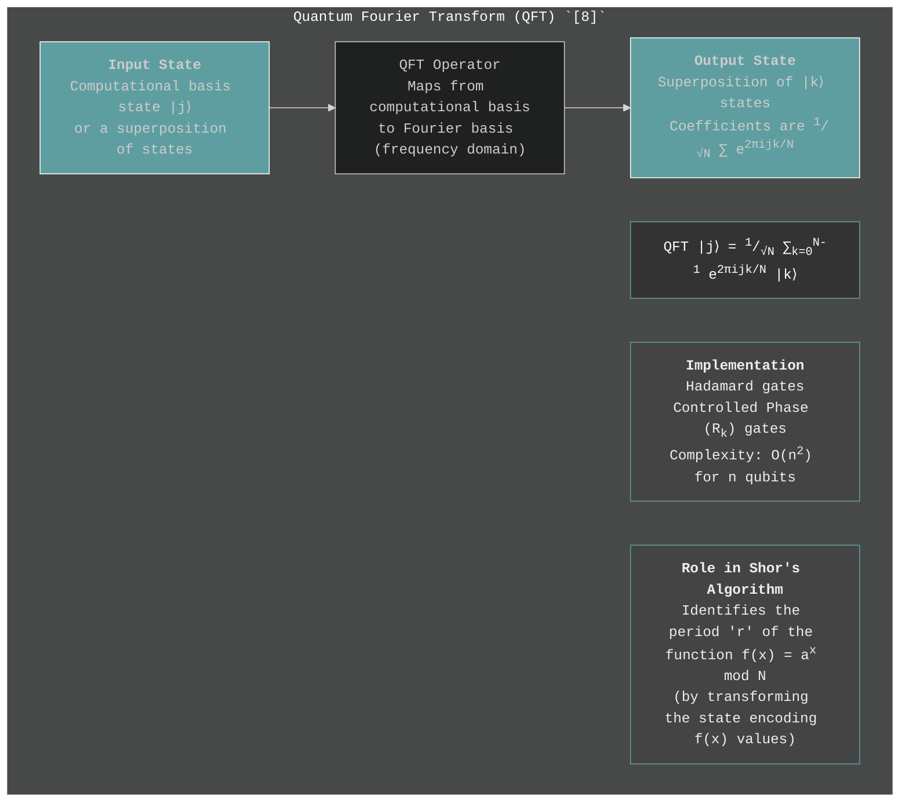

> ⚠️🏗️🚧🦺🧱🪵🪨🪚🛠️👷
> 
> This is a working draft in progress
> 
> 
> 
> ⚠️🏗️🚧🦺🧱🪵🪨🪚🛠️👷


----

# Shor's Algorithm: Unlocking the Secrets of Large Numbers

> **Disclaimer:**
>
> This document contains my personal notes on the topic,
> compiled from publicly available documentation and various cited sources.
> The materials are intended for educational purposes, personal study, and reference.
> The content is dual-licensed:
> 1. **MIT License:** Applies to all code implementations (Swift, Mermaid, and other programming languages).
> 2. **Creative Commons Attribution-ShareAlike 4.0 International License (CC BY-SA 4.0):** Applies to all non-code content, including text, explanations, diagrams, and illustrations.
---

Shor's Algorithm, developed by Peter Shor in 1994 `[1]`, is a groundbreaking quantum algorithm primarily known for its ability to factor large integers efficiently. This capability has profound implications, most notably for the security of widely used public-key cryptographic systems like RSA `[2]`, which rely on the classical difficulty of integer factorization. This document breaks down the algorithm into its core components, explaining both the classical number theory and the quantum mechanical steps involved.

## 1. Introduction: The Power of Quantum Factoring

At its heart, Shor's Algorithm provides a polynomial-time solution for the integer factorization problem on a quantum computer. Classically, factoring very large numbers (hundreds of digits long) is intractable, forming the security backbone of systems like RSA. Shor's showed that a sufficiently powerful quantum computer could break this `[1]`.



---
## 2. The Integer Factorization Problem: A Classical Challenge

The integer factorization problem is simple to state: given a composite integer $N$, find its prime factors. For example, if $N=15$, the prime factors are $3$ and $5$. While easy for small numbers, this becomes exponentially hard for classical computers as $N$ grows. The best known classical algorithms, like the General Number Field Sieve (GNFS) `[5]`, have a sub-exponential but still very high complexity.

**Mathematical Definition:**
Given a composite integer $N$, find integers $p, q > 1$ such that $N = p \cdot q$. If $p$ and $q$ are prime, these are the prime factors.



_Diagram 1: The Integer Factorization Problem and its Classical Hardness._

----

## 3. From Factoring to Order-Finding: The Classical Reduction

Shor's algorithm cleverly transforms the factoring problem into a problem of finding the _order_ (or period) of an element in a modular arithmetic group. This reduction is purely classical and relies on fundamental number theory `[6, 7]`.

**The Steps:**

1.  **Pick a random integer `a`** such that $1 < a < N$.
2.  **Compute the greatest common divisor (GCD)** of `a` and `N`: $\text{gcd}(a, N)$.
	*   If $\text{gcd}(a, N) \neq 1$, then we have found a non-trivial factor of $N$. This is a lucky break, and we are done. This happens with low probability for large $N$ if $a$ is chosen randomly and $N$ is a product of two large primes.
3.  **If $\text{gcd}(a, N) = 1$**, then `a` is coprime to $N$. We then need to find the **order `r`** of `a` modulo `N`. The order `r` is the smallest positive integer such that:
	$$
    a^r \equiv 1 \pmod N
    $$
4.  **Once `r` is found**, we check two conditions:
	*   **Is `r` even?** If not, we must go back to step 1 and pick a different `a`.
	*   **Is $a^{r/2} \not\equiv -1 \pmod N$?** (Equivalently, $a^{r/2} + 1 \not\equiv 0 \pmod N$). If this condition is not met (i.e., $a^{r/2} \equiv -1 \pmod N$), we must also go back to step 1.

5.  **If `r` is even AND $a^{r/2} \not\equiv -1 \pmod N$**, then we have:
	$$
    a^r - 1 \equiv 0 \pmod N
    $$
	$$
    (a^{r/2} - 1)(a^{r/2} + 1) \equiv 0 \pmod N
    $$
	This means $N$ divides $(a^{r/2} - 1)(a^{r/2} + 1)$. Since $a^{r/2} \not\equiv 1 \pmod N$ (because `r` is the smallest such power) and $a^{r/2} \not\equiv -1 \pmod N$ (by our check), $N$ does not divide $a^{r/2}-1$ alone, nor $a^{r/2}+1$ alone.
	Therefore, the factors of $N$ must be distributed between $(a^{r/2}-1)$ and $(a^{r/2}+1)$.
	We can find non-trivial factors of $N$ by computing:
	$$
    p = \text{gcd}(a^{r/2} - 1, N)
    $$
	$$
    q = \text{gcd}(a^{r/2} + 1, N)
    $$
	At least one of these will be a non-trivial factor of $N$. It can be shown that if $N$ is an odd composite number that is not a prime power, and $a$ is chosen randomly, there's a high probability (at least 1/2) that `r` will be even and $a^{r/2} \not\equiv -1 \pmod N$ `[1, 7]`.

The hard part, classically, is finding this order `r`. This is where the quantum computer comes in.

```mermaid
%%{ init: { 'theme': 'base', 'themeVariables': { 'primaryColor': '#4682B4', 'primaryTextColor': '#fff', 'lineColor': '#B0C4DE' }, 'fontFamily': 'Verdana, sans-serif', 'look': 'handDrawn' , 'logLevel': 'fatal' } }%%
flowchart TD
    title "Factoring to Order-Finding: Classical Reduction `[6, 7]`"
    S1[Start: Composite N] --> P1{"Pick random <b>a</b> <br> (1 < a < N)"};
    P1 --> P2{"Calculate g = gcd(a, N)"};
    P2 --> C1{g == 1?};
    C1 -- No (g > 1) --> S_FACTOR_FOUND["<b>Factor found!</b> <br> g is a factor of N.<br>END"];
    C1 -- Yes --> P3["Find order <b>r</b> of <b>a</b> mod N <br> (smallest r > 0 s.t. a<sup>r</sup> &equiv; 1 mod N)<br><i>This is the quantum part!</i>"];
    P3 --> C2{"Is <b>r</b> even?"};
    C2 -- No --> P1;
    C2 -- Yes --> C3{"Is a<sup>r/2</sup> &equiv; -1 mod N?"};
    C3 -- Yes --> P1;
    C3 -- No --> P4["Factors p, q of N are:<br>p = gcd(a<sup>r/2</sup> - 1, N)<br>q = gcd(a<sup>r/2</sup> + 1, N)"];
    P4 --> S_FACTORS_COMPUTED["<b>Factors p, q obtained!</b> <br> END"];

    style S_FACTOR_FOUND fill:#90EE90,stroke:#333
    style S_FACTORS_COMPUTED fill:#90EE90,stroke:#333
    style P3 fill:#FFA07A,stroke:#333
```

_Diagram 2: Classical reduction of factoring to order-finding. The quantum computer's role is to solve the order-finding problem efficiently._

---

## 4. Quantum Core Component 1: The Quantum Fourier Transform (QFT)

The Quantum Fourier Transform (QFT) is the quantum analogue of the classical Discrete Fourier Transform (DFT). It is a linear transformation on qubits and is a cornerstone of many quantum algorithms, including Shor's `[8, Ch. 5]`. Its primary role in Shor's algorithm is to find the period (order `r`) of the function $f(x) = a^x \pmod N$.

For a computational basis state $|j\rangle$ (where $j$ is an integer $0 \le j < 2^n$), the QFT on $n$ qubits is defined as:
$$
\text{QFT}_N |j\rangle = \frac{1}{\sqrt{N}} \sum_{k=0}^{N-1} e^{2\pi i jk / N} |k\rangle
$$
Where $N=2^n$ is the dimension of the Hilbert space. Notice the similarity to the classical DFT:
$$
X_k = \sum_{j=0}^{N-1} x_j e^{-2\pi i jk / N}
$$
(The sign in the exponent is a convention difference; sometimes $-i$ is used for QFT too, but the one above linking to phase is common). The QFT maps a state representing a superposition of function values to a state representing a superposition of frequencies, highlighting periodicities.

The QFT can be implemented efficiently on a quantum computer using a circuit of $O(n^2)$ gates, composed of Hadamard gates and controlled phase rotation gates `[8, Sec. 5.1]`.



_Diagram 3: Conceptual overview of the Quantum Fourier Transform._

---

## 5. Quantum Core Component 2: Quantum Phase Estimation (QPE)

Quantum Phase Estimation (QPE) is another crucial quantum subroutine `[8, Sec. 5.2]`. Given a unitary operator $U$ and an eigenvector $|\psi\rangle$ of $U$ such that $U|\psi\rangle = e^{2\pi i \phi} |\psi\rangle$, QPE estimates the phase $\phi$.

In Shor's algorithm, the unitary operator $U$ is related to modular exponentiation:
$U |y\rangle = |ay \pmod N\rangle$ for $y < N$, and $U|y\rangle = |y\rangle$ for $y \ge N$.
The eigenvectors of this $U$ are related to the order `r` we seek. Specifically, states of the form:
$$
|u_s\rangle = \frac{1}{\sqrt{r}} \sum_{k=0}^{r-1} e^{-2\pi i sk/r} |a^k \pmod N\rangle
$$
are eigenvectors of $U$ with eigenvalues $e^{2\pi i s/r}$ `[1, 8]`. QPE is used to find these $s/r$ values, which then give us `r`.

The QPE algorithm uses two quantum registers:
1.  **First register (t-qubits):** Initialized to $|0\rangle^{\otimes t}$. This register will store the phase estimate.
2.  **Second register (n-qubits):** Initialized to the eigenvector $|\psi\rangle$ (or a state that can be projected onto eigenvectors, like $|1\rangle$ in Shor's).

The circuit involves applying controlled-$U^{2^j}$ operations from the j-th qubit of the first register to the second register, followed by an inverse QFT on the first register. Measurement of the first register yields an approximation of $\phi$.

```mermaid
%%{ init: { 'theme': 'neutral', 'fontFamily': 'Arial, sans-serif', 'logLevel': 'fatal' } }%%
flowchart TD
    title "Quantum Phase Estimation (QPE) - Conceptual `[8]`"

    A["<b>Setup</b><br>Two registers:<br>1. t-qubit register |0...0⟩ (estimation)<br>2. n-qubit register |ψ⟩ (eigenvector of U)"] --> B["<b>Step 1: Superposition</b><br>Apply Hadamard gates to all qubits in the 1st register.<br>Creates &sum;|j⟩"];

    B --> C["<b>Step 2: Controlled Unitary Operations</b><br>For each qubit j in 1st register,<br>apply U<sup>2<sup>j</sup></sup> to 2nd register, controlled by qubit j.<br>Unitary U: e.g., U|y⟩ = |a*y mod N⟩ for Shor's"];

    C --> D["<b>Step 3: Inverse Quantum Fourier Transform (IQFT)</b><br>Apply IQFT to the 1st register."];

    D --> E["<b>Step 4: Measurement</b><br>Measure the 1st register.<br>Result is an integer 'm' that approximates 2<sup>t</sup> &phi;.<br>So, &phi; &approx; m / 2<sup>t</sup>"];

    F["<b>Goal</b><br>Given U, |ψ⟩ such that U|ψ⟩ = e<sup>2πi&phi;</sup>|ψ⟩,<br>Estimate phase &phi;."];

    style A fill:#ADD8E6,stroke:#333
    style E fill:#90EE90,stroke:#333
    style F fill:#FFFACD,stroke:#333
```

_Diagram 4: Conceptual steps of Quantum Phase Estimation. In Shor's, U is related to modular exponentiation, and $\phi$ is $s/r$._

----

## 6. The Quantum Order-Finding Algorithm

This is the core quantum part of Shor's algorithm. It finds the order `r` of `a` modulo `N` `[1, 8]`.

**Steps:**
1.  **Initialization:**
	*   Two quantum registers. The first (input register) needs $q$ qubits, where $2^q \approx N^2$ (typically $q = 2L$ where $L = \lceil \log_2 N \rceil$). Initialize to $|0\rangle^{\otimes q}$.
	*   The second (output register) needs $L$ qubits to store values up to $N-1$. Initialize to $|1\rangle$.
	So the initial state is $|0\rangle^{\otimes q} |1\rangle$.

2.  **Create Superposition:**
	*   Apply a Hadamard transform to each qubit in the first register:
		$$
        \frac{1}{\sqrt{2^q}} \sum_{x=0}^{2^q-1} |x\rangle |1\rangle
        $$

3.  **Apply Modular Exponentiation (Oracle):**
	*   This is the function $f(x) = a^x \pmod N$. Apply this function to the state. This is typically done using a quantum circuit that performs modular exponentiation `[9]`. The value $x$ comes from the first register, and the result $a^x \pmod N$ is stored in the second register (often by XORing or adding into it, depending on the circuit design, but conceptually it creates entanglement):
		$$
        \frac{1}{\sqrt{2^q}} \sum_{x=0}^{2^q-1} |x\rangle |a^x \pmod N\rangle
        $$
	*   This step creates entanglement between the two registers. The values $a^x \pmod N$ are periodic with period `r`.

4.  **Apply Inverse Quantum Fourier Transform (IQFT):**
	*   Apply the IQFT to the first register. The second register is not touched by the IQFT itself but measuring it first would collapse the first register. For simplicity, we often discuss applying IQFT to the first register on its own. The effect of the IQFT is that the amplitudes in the first register will now peak at values that are multiples of $2^q/r$.
		If we were to measure the second register and get some value $k = a^{x_0} \pmod N$, the first register would collapse to a superposition of $|x\rangle$ such that $a^x \pmod N = k$. These $x$ values are $x_0, x_0+r, x_0+2r, \dots$.
		After IQFT on this collapsed state, the output is approximately concentrated on multiples of $2^q/r$.

5.  **Measure the First Register:**
	*   Measure the first register in the computational basis. This yields an integer value, let's call it `m`.
	*   The theory shows that `m` is highly likely to be close to an integer multiple of $2^q/r$. That is:
		$$
        \frac{m}{2^q} \approx \frac{s}{r}
        $$
		for some integer `s` (which is coprime to `r` with good probability).

The task now is to find `r` from this fraction $m/2^q$.

```mermaid
%%{ init: { 'theme': 'default', 'fontFamily': 'Georgia, serif', 'look': 'handDrawn' , 'logLevel': 'fatal' } }%%
flowchart TD
    title "Quantum Order-Finding Subroutine `[1, 8]`"

    S_INIT["<b>1. Initialize Registers</b><br>Reg1 (|0...0⟩, q qubits for x)<br>Reg2 (|0...01⟩, L qubits for f(x))"] --> S_HAD["<b>2. Create Superposition (Reg1)</b><br>Apply Hadamard to Reg1:<br><sup>1</sup>/<sub>&radic;Q</sub> &sum;<sub>x=0</sub><sup>Q-1</sup> |x⟩|1⟩ (Q=2<sup>q</sup>)"];

    S_HAD --> S_MODEXP["<b>3. Modular Exponentiation (Oracle U<sub>f</sub>)</b><br>Compute a<sup>x</sup> mod N into Reg2:<br><sup>1</sup>/<sub>&radic;Q</sub> &sum;<sub>x=0</sub><sup>Q-1</sup> |x⟩|a<sup>x</sup> mod N⟩<br><i>Entangles registers, Reg2 now periodic</i>"];

    %% S_MEAS2["(Optional: Measure Reg2 - conceptually helps see periodicity in Reg1,<br>but not always explicitly done before IQFT)"];
    %% S_MODEXP --> S_MEAS2;
    %% S_MEAS2 --> S_IQFT;

    S_MODEXP --> S_IQFT["<b>4. Inverse QFT (Reg1)</b><br>Apply IQFT<sub>Q</sub> to Reg1.<br>State peaks at multiples of Q/r"];

    S_IQFT --> S_MEAS1["<b>5. Measure Reg1</b><br>Obtain measurement outcome 'm'"];

    S_MEAS1 --> S_POST["<b>Output: 'm'</b><br>Such that m/Q &asymp; s/r for some integer s."];

    style S_INIT fill:#E6E6FA,stroke:#333
    style S_POST fill:#F0E68C,stroke:#333
    style S_MODEXP fill:#FFB6C1,stroke:#333
```

_Diagram 5: Steps of the Quantum Order-Finding algorithm._

----

## 7. Interpreting the Measurement: The Continued Fractions Algorithm

After measuring `m` from the first register, we have the approximation $m/2^q \approx s/r$. We need to find `r`. The **Continued Fractions Algorithm** is a classical algorithm that can find the best rational approximation $s'/r'$ to a given real number (in this case $m/2^q$) where the denominator $r'$ is less than some bound (in this case, $N$) `[6, Ch. 10]`.

1.  Input: The fraction $m/2^q$ and the maximum denominator $N$.
2.  The continued fractions algorithm expands $m/2^q$ into its continued fraction representation.
3.  It then computes the sequence of convergents (rational approximations) $p_i/q_i$.
4.  We look for the first convergent $s'/r'$ such that $r' < N$. This $r'$ is our candidate for the order `r`.

Once a candidate `r'` is found, we classically check if $a^{r'} \equiv 1 \pmod N$.
*   If it is, and $r'$ is the smallest such positive integer, then $r'$ is indeed the order `r`.
*   If not, or if the continued fractions algorithm doesn't yield a suitable `r`, then the quantum measurement `m` might not have been "good" enough (e.g., `s` and `r` were not coprime, or $2^q/r$ was too close to an integer multiple). In this case, we may need to repeat the quantum order-finding part. Shor showed that the probability of success in finding a good `r` is high (related to $\phi(r)/r$, where $\phi$ is Euler's totient function) `[1]`.

```mermaid
%%{ init: { 'theme': 'dark', 'fontFamily': 'monospace', 'logLevel': 'fatal' } }%%
graph TD
    title "Post-Quantum Processing: Finding 'r' using Continued Fractions `[6]`"
    A["<b>Input from Quantum Measurement</b><br>Measurement 'm'<br>Number of qubits q (so Q = 2<sup>q</sup>)"] --> B["Form fraction: x = m / Q"];
    B --> C["<b>Classical Continued Fractions Algorithm</b><br>Goal: Find integers s, r (coprime, r < N)<br>such that |x - s/r| is small."];
    C --> D["Expand x into continued fraction:<br>x = [a<sub>0</sub>; a<sub>1</sub>, a<sub>2</sub>, ..., a<sub>k</sub>]"];
    D --> E["Calculate convergents p<sub>i</sub>/q<sub>i</sub> of x"];
    E --> F{"Iterate through convergents s'/r' = p<sub>i</sub>/q<sub>i</sub><br>Is r' < N?"};
    F -- Yes --> G["Candidate order r<sub>cand</sub> = r'"];
    F -- No (or no good convergent found) --> H["<b>Failure / Retry</b><br>Measurement 'm' might not be useful.<br>Repeat quantum order-finding or pick new 'a'."];
    G --> I{"<b>Verification</b><br>Check if a<sup>r<sub>cand</sub></sup> &equiv; 1 (mod N)"};
    I -- Yes --> J["<b>Order 'r' Found!</b><br>r = r<sub>cand</sub>"];
    I -- No (or r<sub>cand</sub> not smallest) --> H;

    style A fill:#4A4A4A,color:#FFF
    style J fill:#32CD32,color:#000
    style H fill:#DC143C,color:#FFF
```

_Diagram 6: Using the Continued Fractions Algorithm to deduce the order `r`._

---

## 8. Putting It All Together: Shor's Algorithm - Full Steps

Now we combine the classical reduction and the quantum order-finding procedure `[1, 8]`.

1.  **Classical Part 1:**
	a. Given a composite integer $N$ to factor.
	b. Choose a random integer $a$ such that $1 < a < N$.
	c. Compute $g = \text{gcd}(a, N)$. If $g > 1$, then $g$ is a factor. Done.
2.  **Quantum Part (Order-Finding for `a` mod `N`):**
	a. Initialize two quantum registers (e.g., $|0\rangle^{\otimes q} |1\rangle$). $q$ is chosen such that $N^2 \le 2^q < 2N^2$.
	b. Apply Hadamard gates to the first register to create $\frac{1}{\sqrt{2^q}} \sum_{x=0}^{2^q-1} |x\rangle |1\rangle$.
	c. Apply the modular exponentiation operation $U_f: |x\rangle|y\rangle \to |x\rangle|y \cdot a^x \pmod N\rangle$. (If starting with $|1\rangle$ in second register, this effectively becomes $|x\rangle|a^x \pmod N\rangle$). State is $\frac{1}{\sqrt{2^q}} \sum_{x=0}^{2^q-1} |x\rangle |a^x \pmod N\rangle$.
	d. Apply the inverse Quantum Fourier Transform (IQFT) to the first register.
	e. Measure the first register. Let the outcome be $m$.
3.  **Classical Part 2 (Post-Processing):**
	a. Use the continued fractions algorithm to find integers $s$ and $r$ (candidate order) such that $s/r \approx m/2^q$, with $r < N$.
	b. If multiple candidate $r$ values are found (e.g., from different convergents or if $s, r$ were not coprime and a multiple $kr$ was found), try the smallest valid one, or check multiples.
	c. Verify if $a^r \equiv 1 \pmod N$. If not, or if no suitable $r$ is found, repeat from step 1b (pick new $a$) or step 2a (rerun quantum part with same $a$). A few tries are usually sufficient.
4.  **Classical Part 3 (Factor Derivation):**
	a. If the found order $r$ is odd, go to step 1b (pick new $a$).
	b. Compute $x = a^{r/2} \pmod N$. If $x \equiv -1 \pmod N$ (i.e., $x = N-1$), go to step 1b.
	c. Otherwise, the factors are $p = \text{gcd}(x-1, N)$ and $q = \text{gcd}(x+1, N)$.
	d. If $p$ or $q$ is $N$ or $1$ (trivial factors), something went wrong (likely previous checks failed or `a` was unlucky); go back to step 1b. Otherwise, $p$ and $q$ are non-trivial factors.

**Example: Factoring N=15 (Conceptual Walkthrough)**
1.  Classical 1:
	*   $N=15$.
	*   Pick $a=7$.
	*   $\text{gcd}(7, 15) = 1$. So proceed to find order of 7 mod 15.
2.  Quantum Part (to find order $r$ of $7 \pmod{15}$):
	*   Suppose $q=8$ qubits for first register ($2^q = 256$).
	*   Registers initialized: $|0\rangle^{\otimes 8} |1\rangle$.
	*   Hadamards on first register: $\frac{1}{\sqrt{256}} \sum_{x=0}^{255} |x\rangle |1\rangle$.
	*   Modular exponentiation: $\frac{1}{\sqrt{256}} \sum_{x=0}^{255} |x\rangle |7^x \pmod{15}\rangle$.
		(The sequence $7^x \pmod{15}$ is $7^0=1, 7^1=7, 7^2=49\equiv 4, 7^3=28\equiv 13, 7^4=91\equiv 1, \dots$. So the order $r=4$).
	*   Apply IQFT to first register.
	*   Measure first register. We expect $m$ such that $m/256 \approx s/4$. Possible $m$ values near multiples of $256/4 = 64$: e.g., $m \approx 0, 64, 128, 192$.
	*   Suppose we measure $m=63$. (Slightly off a multiple due to approximation and finite $q$).
3.  Classical Part 2:
	*   We have $m/2^q = 63/256 \approx 0.246$.
	*   Continued fractions for $63/256$:
		$63/256 \approx 1/4$. Convergent is $1/4$.
		So $s=1, r=4$.
	*   Verify: $7^4 = 2401$. $2401 \pmod{15} = 1$. So $r=4$ is correct.
4.  Classical Part 3:
	*   $r=4$ is even.
	*   $x = a^{r/2} = 7^{4/2} = 7^2 = 49$. $49 \pmod{15} = 4$.
	*   $x=4 \not\equiv -1 \pmod{15}$ (i.e. $4 \not\equiv 14 \pmod{15}$). Conditions met.
	*   $p = \text{gcd}(x-1, N) = \text{gcd}(4-1, 15) = \text{gcd}(3, 15) = 3$.
	*   $q = \text{gcd}(x+1, N) = \text{gcd}(4+1, 15) = \text{gcd}(5, 15) = 5$.
	*   Factors are 3 and 5. $3 \times 5 = 15$. Success!

```mermaid
%%{ init: { 'theme': 'forest', 'fontFamily': 'sans-serif', 'logLevel': 'fatal' } }%%
flowchart TD
    title "Shor's Algorithm: Full Process `[1]`"
    START[Input: N (composite number)] --> CL_P1_A{Pick random 'a', 1<a<N};
    CL_P1_A --> CL_P1_B{Compute g = gcd(a, N)};
    CL_P1_B --> CL_P1_C{g > 1?};
    CL_P1_C -- Yes --> FACTOR_FOUND_EARLY["Factor g found!<br>END"];
    CL_P1_C -- No (g=1) --> Q_P2_A["<b>Quantum Subroutine: Find Order 'r' of 'a' mod N</b><br>1. Init Regs |0⟩|1⟩<br>2. Hadamard on Reg1<br>3. Modular Exp: |x⟩|a<sup>x</sup> mod N⟩<br>4. IQFT on Reg1<br>5. Measure Reg1 -> m"];
    Q_P2_A --> CL_P3_A["<b>Classical Post-Processing</b><br>Use Continued Fractions on m/2<sup>q</sup> to find candidate 'r'"];
    CL_P3_A --> CL_P3_B{Verify a<sup>r</sup> &equiv; 1 mod N?};
    CL_P3_B -- No / Bad 'r' --> CL_P1_A;
    CL_P3_B -- Yes --> CL_P4_A{Is 'r' even?};
    CL_P4_A -- No --> CL_P1_A;
    CL_P4_A -- Yes --> CL_P4_B["Compute x = a<sup>r/2</sup> mod N"];
    CL_P4_B --> CL_P4_C{Is x &equiv; -1 mod N?};
    CL_P4_C -- Yes --> CL_P1_A;
    CL_P4_C -- No --> CL_P4_D["Factors are:<br>p = gcd(x-1, N)<br>q = gcd(x+1, N)"];
    CL_P4_D --> END_FACTORS["Factors p, q found!<br>END"];

    style FACTOR_FOUND_EARLY fill:#98FB98,stroke:#333
    style END_FACTORS fill:#98FB98,stroke:#333
    style Q_P2_A fill:#87CEFA,stroke:#333
    classDef retryNode fill:#FFCCCB,stroke:#A52A2A
    class CL_P1_A,CL_P3_B,CL_P4_A,CL_P4_C retryNode
```

_Diagram 7: Overall flowchart of Shor's Algorithm._

-----
## 9. Complexity and Success Probability

*   **Classical Complexity:** The best known classical algorithm for factoring an $L$-bit number $N$ (i.e., $L \approx \log_2 N$) is the General Number Field Sieve (GNFS), which has a complexity roughly of $e^{O(L^{1/3} (\log L)^{2/3})}$ `[5]`. This is sub-exponential but super-polynomial.
*   **Quantum Complexity (Shor's):**
	*   The quantum order-finding part (QFT, modular exponentiation) takes roughly $O((\log N)^2 (\log \log N) (\log \log \log N))$ operations using fast multiplication for modular exponentiation `[1, 9]`. Often simplified to $O((\log N)^3)$.
	*   The classical parts (GCD, continued fractions) are efficient, running in polynomial time with respect to $\log N$.
	*   Thus, Shor's algorithm runs in polynomial time on a quantum computer. This is an exponential speedup over known classical algorithms.

*   **Success Probability:**
	*   The probability that a randomly chosen `a` will have an order `r` that is "good" (even and $a^{r/2} \not\equiv -1 \pmod N$) is at least 1/2, assuming $N$ is not a prime power and is odd `[1, 7]`.
	*   The probability that the quantum measurement $m$ leads to the correct order $r$ via continued fractions is also high, related to $\phi(r)/r \cdot 1/\log N$. Roughly, it's $\Omega(1/\log\log N)$ `[1, 8]`.
	*   Overall, by repeating the algorithm a small number of times (polynomially many in $\log N$, often just a few practical tries), the success probability can be made arbitrarily close to 1.

```mermaid
%%{ init: { 'theme': 'dark', 'fontFamily': 'Arial, Helvetica, sans-serif', 'logLevel': 'fatal' } }%%
gantt
    title Algorithm Complexity Comparison (Factoring N)
    dateFormat X
    axisFormat %s

    section Classical (GNFS) `[5]`
    Complexity :crit, classical, 0, 100
    Note right of classical: Exponential Scale: e<sup>O((log N)<sup>1/3</sup>(log log N)<sup>2/3</sup>)</sup>

    section Quantum (Shor's) `[1]`
    Complexity :active, quantum, 0, 20
    Note right of quantum: Polynomial Scale: O((log N)<sup>3</sup>)

    %% Values are illustrative for relative scale, not actual time units.
    %% Lower value means faster.
```



_Diagram 8: Illustrative comparison of computational complexity scales for factoring. Shor's offers a significant speedup._

----

## 10. Implications and Future Outlook

*   **Cryptography:** Shor's algorithm's main impact is its threat to public-key cryptosystems like RSA, Diffie-Hellman (based on discrete log, also solvable by a similar quantum algorithm), and Elliptic Curve Cryptography `[10]`. If large-scale, fault-tolerant quantum computers are built, these systems will become insecure.
*   **Post-Quantum Cryptography (PQC):** This has spurred research into PQC, which aims to develop cryptographic algorithms that are secure against both classical and quantum computers. The U.S. National Institute of Standards and Technology (NIST) has been leading a standardization process for PQC algorithms, with initial standards announced `[3, 4, 11]`.
*   **Experimental Progress:** While small numbers (like 15, 21) have been factored using experimental quantum computers `[12]`, building a quantum computer large and stable enough to factor RSA-2048 (requiring thousands of logical qubits and millions of physical qubits with current error rates) is a formidable engineering challenge and likely many years, if not decades, away `[13]`.
*   **Quantum Supremacy/Advantage:** Shor's algorithm is a prime example of a problem where quantum computers offer an exponential advantage over classical ones.

----

## 11. Summary: Shor's Algorithm at a Glance

This mind map synthesizes the core aspects of Shor's Algorithm.

```mermaid
%%{ init: { 'theme': 'neutral', 'fontFamily': 'Verdana, Geneva, sans-serif', 'look': 'handDrawn' , 'logLevel': 'fatal' } }%%
mindmap
  root((Shor's Algorithm: Comprehensive Summary))
    <b>Goal</b>
      Factor large integer N into p * q
    <b>Key Idea</b>
      Reduce Factoring to Order-Finding
        Order 'r' of 'a' mod N :: a<sup>r</sup> &equiv; 1 (mod N)
        If 'r' is even & a<sup>r/2</sup> &nequiv; -1 (mod N)
          Factors: gcd(a<sup>r/2</sup>&pm;1, N)
    <b>Classical Components</b>
      Random 'a' selection
      GCD computation
      Continued Fractions Algorithm (to find 'r' from m/Q) `[6]`
      Verification of 'r' and factor derivation
    <b>Quantum Core: Order-Finding</b> `[1, 8]`
      <b>1. Initialization</b>
        Two registers: |0...0⟩<sub>q</sub> |1⟩<sub>L</sub>
      <b>2. Superposition</b>
        Hadamard on 1st register --> &sum;|x⟩
      <b>3. Modular Exponentiation (Oracle)</b>
        U<sub>f</sub>|x⟩|1⟩ = |x⟩|a<sup>x</sup> mod N⟩
        Creates periodic state in 2nd register, entangles with 1st
      <b>4. Inverse Quantum Fourier Transform (IQFT)</b>
        Applied to 1st register
        Transforms state to highlight period: peaks at m &asymp; s * (2<sup>q</sup>/r)
      <b>5. Measurement</b>
        Measure 1st register to get 'm'
    <b>Core Quantum Primitives Used</b>
      Quantum Fourier Transform (QFT / IQFT) `[8]`
        Efficiently finds periodicity
      Quantum Phase Estimation (QPE) `[8]`
        Underlying principle for order-finding (modular exponentiation operator's eigenvalues e<sup>2&pi;is/r</sup>)
    <b>Complexity</b>
      Quantum: Polynomial O((log N)<sup>3</sup>) `[1]`
      Classical: Sub-exponential (GNFS) `[5]`
      Implies exponential speedup for quantum computers
    <b>Probabilistic Nature</b>
      Multiple attempts may be needed for "good" 'a' or 'm'
      High overall success probability with few repeats `[1]`
    <b>Impact & Significance</b>
      Cryptography
        Threatens RSA, ECC, Diffie-Hellman `[10]`
        Drives Post-Quantum Cryptography (PQC) development `[3, 4, 11]`
      Quantum Computing
        Demonstrates quantum advantage
        Significant motivator for building quantum computers
    <b>Challenges</b>
      Requires large-scale, fault-tolerant quantum computer `[13]`
      Qubit stability, error correction, gate fidelity
```

_Diagram 9: Comprehensive Summary Mind Map of Shor's Algorithm._

---

<!-- 


---
>**Licenses:**
>
>- **MIT License:**  [](LICENSE) - Full text in [LICENSE](LICENSE) file.
>- **Creative Commons Attribution-ShareAlike 4.0 International**: [CC BY-SA 4.0](https://creativecommons.org/licenses/by-sa/4.0/) [](https://creativecommons.org/licenses/by-sa/4.0/) - Legal details in [LICENSE-CC-BY-SA-4.0](THE_PAST/LICENSE-CC-BY-SA-4.0) and at [Creative Commons official site](https://creativecommons.org/licenses/by-sa/4.0/).
>
---

### References

`[1]` Shor, P. W. (1994). Algorithms for quantum computation: discrete logarithms and factoring. In _Proceedings 35th Annual Symposium on Foundations of Computer Science_ (pp. 124-134). IEEE. (Also available as arXiv:quant-ph/9508027, 1995, published in SIAM Journal on Computing, 26(5), 1484-1509, 1997).

`[2]` Rivest, R. L., Shamir, A., & Adleman, L. (1978). A method for obtaining digital signatures and public-key cryptosystems. _Communications of the ACM_, 21(2), 120-126.

`[3]` National Institute of Standards and Technology (NIST). (2022). _Post-Quantum Cryptography Standardization_. U.S. Department of Commerce. Retrieved from [https://csrc.nist.gov/Projects/post-quantum-cryptography](https://csrc.nist.gov/Projects/post-quantum-cryptography)

`[4]` Alagic, G., et al. (2022). _Status Report on the Third Round of the NIST Post-Quantum Cryptography Standardization Process_. NISTIR 8413. National Institute of Standards and Technology. Retrieved from [https://doi.org/10.6028/NIST.IR.8413-upd1](https://doi.org/10.6028/NIST.IR.8413-upd1) (Note: Check NIST for the most current PQC status reports and selected algorithms.)

`[5]` Lenstra, A. K., & Lenstra Jr, H. W. (Eds.). (1993). _The development of the number field sieve_ (Vol. 1554). Springer Science & Business Media.

`[6]` Hardy, G. H., & Wright, E. M. (2008). _An Introduction to the Theory of Numbers_ (6th ed.). Oxford University Press.

`[7]` Pomerance, C. (1987). Fast, rigorous factorization and discrete logarithm algorithms. In _Discrete Algorithms and Complexity_ (pp. 119-143). Academic Press.

`[8]` Nielsen, M. A., & Chuang, I. L. (2010). _Quantum Computation and Quantum Information: 10th Anniversary Edition_. Cambridge University Press.

`[9]` Vedral, V., Barenco, A., & Ekert, A. (1996). Quantum networks for elementary arithmetic operations. _Physical Review A_, 54(1), 147. (Also available as arXiv:quant-ph/9511018).

`[10]` Bernstein, D. J., & Lange, T. (2017). Post-quantum cryptography. _Nature_, 549(7671), 188-194.

`[11]` National Institute of Standards and Technology (NIST). (July 5, 2022). _NIST Announces First Four Quantum-Resistant Cryptographic Algorithms_. [Press Release]. Retrieved from [https://www.nist.gov/news-events/news/2022/07/nist-announces-first-four-quantum-resistant-cryptographic-algorithms](https://www.nist.gov/news-events/news/2022/07/nist-announces-first-four-quantum-resistant-cryptographic-algorithms)

`[12]` Vandersypen, L. M. K., et al. (2001). Experimental realization of Shor's quantum factoring algorithm using nuclear magnetic resonance. _Nature_, 414(6866), 883-887. (Also available as arXiv:quant-ph/0112176).

`[13]` National Academies of Sciences, Engineering, and Medicine. (2019). _Quantum Computing: Progress and Prospects_. The National Academies Press. [https://doi.org/10.17226/25196](https://doi.org/10.17226/25196).

----

