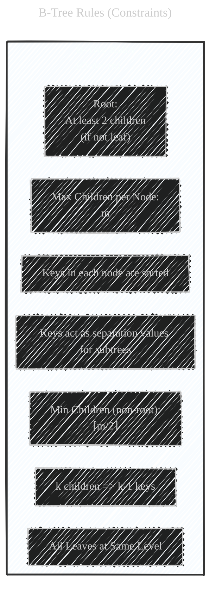
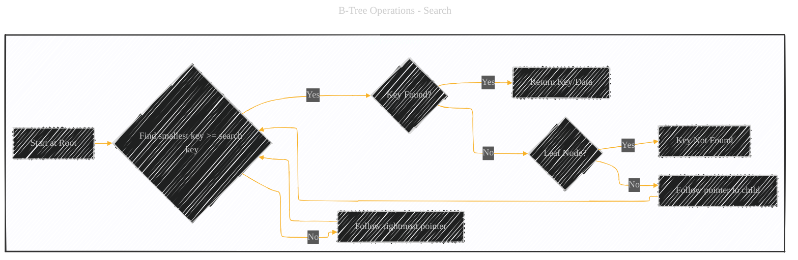
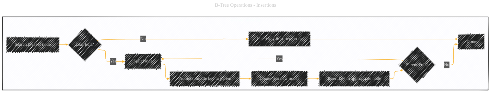
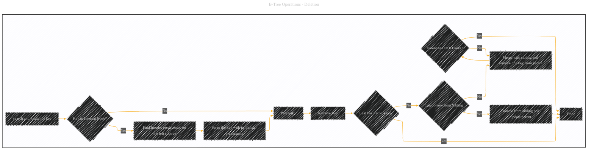
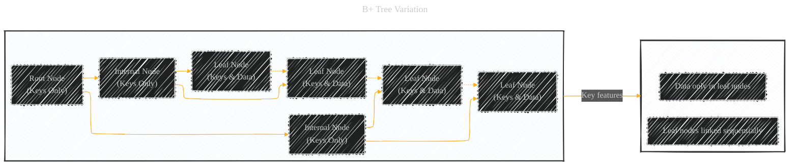
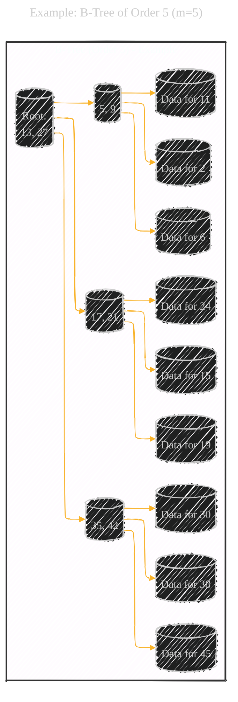

# Tree Collection - BTree - A Diagrammatic Guide 
> **Disclaimer:**
>
> This document contains my personal notes on the topic,
> compiled from publicly available documentation and various cited sources.
> The materials are intended for educational purposes, personal study, and reference.
> The content is dual-licensed:
> 1. **MIT License:** Applies to all code implementations (Swift, Mermaid, and other programming languages).
> 2. **Creative Commons Attribution 4.0 International License (CC BY 4.0):** Applies to all non-code content, including text, explanations, diagrams, and illustrations.
---

Below is a comprehensive breakdown, combining visual diagrams, step-by-step explanations, and mathematical context, should provide a thorough understanding of B-Trees and B+ Trees. The use of different perspectives and levels of detail caters to various learning styles and levels of expertise.

---

## 1. What is a B-Tree? (High-Level Overview)

A B-Tree is a self-balancing tree data structure that maintains sorted data and allows searches, sequential access, insertions, and deletions in logarithmic time. It's a generalization of a binary search tree, but unlike binary trees (which have at most two children per node), B-Trees can have a variable number of children per node, within a predefined range. This "branching factor" is crucial for performance. B-Trees are especially well-suited for storage systems that read and write relatively large blocks of data, such as databases and file systems.

**Explanation of the Initial Diagram:**

*   **`B_Tree` Subgraph:**  Shows a simplified, generic B-Tree structure.  It highlights the hierarchical nature (root, internal nodes, leaf nodes).  Note that this is a *very* simplified example; real B-Trees are typically much wider (more children per node).
*   **`Properties` Subgraph:** Lists the key characteristics of a B-Tree.
*   **`Use_Cases` Subgraph:**  Indicates the primary applications of B-Trees.

---

## 2. B-Tree Properties and Terminology

*   **Order (m):**  The maximum number of children a node can have.  A B-Tree of order *m* is often called an *m*-way tree.  This is sometimes defined as the *maximum* number of children, and sometimes defined as the maximum number of *keys* (which is one less than the maximum number of children).  We'll use the "maximum children" definition here.
*   **Key:**  A value used to identify a record (like an ID number or a name).  Keys are stored in sorted order within each node.
*   **Node:**  A fundamental unit of the B-Tree.  A node contains keys and pointers (references) to child nodes.
*   **Root Node:** The top-most node in the tree.
*   **Internal Node:**  A node that has children (i.e., not a leaf node).
*   **Leaf Node:**  A node that has no children.  Leaf nodes contain the actual data pointers (or sometimes the data itself, depending on the implementation).
*   **Height:** The number of levels in the tree.  B-Trees minimize height by having a large branching factor.
* **Minimum Degree (t):** The minimum degree determines the limits of children and keys within the node.
  * Minimum number of children: t (except for the root). The root can have as few as 1 key (2 children).
  * Maximum number of children: 2t.
  * Minimum number of keys: t-1 (except for the root)
  * Maximum number of keys: 2t – 1.

---

## 3. B-Tree Rules (Constraints)

For a B-Tree of order *m* (maximum *m* children per node):

1.  **Every node has at most *m* children.**
2.  **Every internal node (except the root) has at least ⌈*m*/2⌉ children.** (⌈ ⌉ is the ceiling function, meaning round up to the nearest integer). This ensures the tree doesn't become too sparse.
3.  **The root has at least two children if it is not a leaf node.**
4.  **A non-leaf node with *k* children contains *k*-1 keys.**
5.  **All leaf nodes appear in the same level.** (This is the "balancing" property).
6. **Keys in each node are sorted:** All keys in each node are kept in increasing order.
7. **Subtree constraint:**
    *   Each key, *ki*, in an internal node acts as a separation value that divides its subtrees.
    *   All keys in the subtree pointed to by the child pointer to the left of *ki* are less than *ki*.
    *   All keys in the subtree pointed to by the child pointer to the right of *ki* are greater than *ki*.

---

## 4. B-Tree Operations: Search, Insertion, Deletion

### 4.1 Search

Searching in a B-Tree is similar to searching in a binary search tree, but we make a multi-way decision at each node instead of a binary decision.

1.  **Start at the root node.**
2.  **Within the current node, find the smallest key that is greater than or equal to the search key.**
3.  **If such a key is found, and it's equal to the search key, we've found it.**
    *   If we're at a leaf node, we're done (either we found it or it's not present).
    *   If we're at an internal node, follow the pointer *before* that key to the appropriate child node.
4.  **If no such key is found (the search key is larger than all keys in the node), follow the rightmost pointer to the child node.**
5.  **Repeat steps 2-4 until the key is found or we reach a leaf node and determine the key is not present.**

### 4.2 Insertion

Insertion into a B-Tree is more complex because we need to maintain the B-Tree properties.

1.  **Search for the leaf node where the new key should be inserted.**
2.  **If the leaf node has fewer than *m*-1 keys, insert the new key in the correct sorted position.**
3.  **If the leaf node is full (has *m*-1 keys), we need to *split* the node:**
    *   The middle key (at index ⌈*m*/2⌉ - 1) is promoted to the parent node.
    *   Create two new nodes: one with the keys before the middle key, and one with the keys after the middle key.
    *   The new key is inserted into the appropriate new node (left or right).
4.  **If the parent node is full, split the parent node recursively.** This splitting can propagate all the way up to the root. If the root splits, a new root is created, and the height of the tree increases by one.

### 4.3 Deletion
Deletion is similar to Insertion and is also more complex because we need to maintain the B-Tree properties.
1. **Search and locate the key**
2. **If the key is located in the internal nodes:**
    * Find the inorder predecessor (largest key) of the key in the left subtree.
    * Swap the key with its inorder predecessor.
    * Proceed to remove the key from the previous leaf node.
3. **If the key is located in the Leaf node, remove the key.**
4. **If the leaf node has less than t-1 keys after removal**:
    * **Borrow** from a direct sibling node: Check the number of keys of sibling nodes, and if anyone has more than the minimum number of keys after losing one key, borrow and update the parent.
    * If the number of keys in both siblings reached a minimum:
        * **Merge** the node with its sibling.
        * Remove 1 key from the parent and update the number of children.
        * Recursively repeat the operations if the parent has less key than the minimum.

---

## 5. B+ Tree Variation

A common and important variation is the **B+ Tree**.  The key differences are:

*   **All data pointers are stored in leaf nodes.** Internal nodes only store keys, which act purely as an index to guide the search.
*   **Leaf nodes are often linked together in a sequential order (like a linked list).** This allows for efficient range scans (e.g., "find all records with keys between 10 and 50").

B+ Trees are *extremely* common in database implementations.  The sequential linking of leaf nodes makes range queries very efficient.  Since internal nodes only store keys, they can have a higher branching factor, which further reduces the height of the tree.

---

## 6. Example: B-Tree of Order 5 (m=5)

Let's visualize a small portion of a B-Tree of order 5.  This means:

*   Maximum children per node: 5
*   Maximum keys per node: 4
*   Minimum children per non-root node: ⌈5/2⌉ = 3
*   Minimum keys per non-root node: 2

**Explanation:**

*   **Root Node:** Contains keys 13 and 27.  It has three children.
*   **Internal Nodes (A, B, C):** Each has two keys and three children.
*   **Leaf Nodes (A1, A2, ..., C3):**  These would contain the actual data (or pointers to the data).  For simplicity, we just show placeholder text ("Data for X").
    *   All keys less than 13 are in the subtree rooted at A.
    *   All keys between 13 and 27 are in the subtree rooted at B.
    *   All keys greater than 27 are in the subtree rooted at C.

---

## 7. Time and Space Complexity

*   **Search:** O(log n), where n is the number of keys.  The height of the tree is logarithmic due to the large branching factor.
*   **Insertion:** O(log n) in the average case.  Splitting nodes takes time, but it doesn't happen on every insertion.
*   **Deletion:** O(log n) in the average case. Merging and borrowing takes time.
*   **Space:** O(n).  The tree stores all the keys and data (or pointers to the data).

---

## 8. Key Terms and Concepts

---
**Licenses:**

- **MIT License:**   - Full text in [LICENSE](LICENSE) file.
- **Creative Commons Attribution 4.0 International:**  - Legal details in [LICENSE-CC-BY](LICENSE-CC-BY) and at [Creative Commons official site](http://creativecommons.org/licenses/by/4.0/).

---