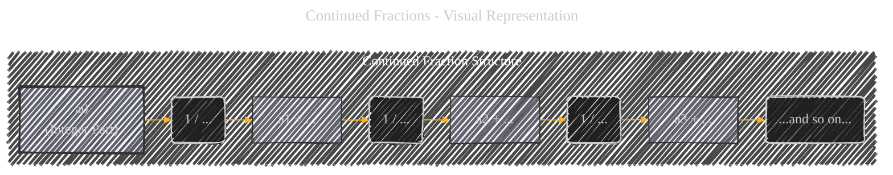
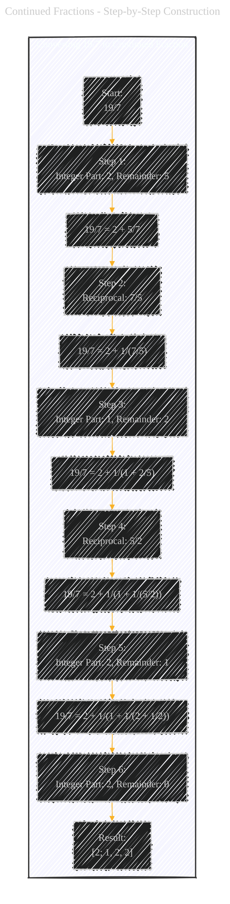

# Continued Fractions - A Diagrammatic Guide 
> **Disclaimer:**
>
> This document contains my personal notes on the topic,
> compiled from publicly available documentation and various cited sources.
> The materials are intended for educational purposes, personal study, and reference.
> The content is dual-licensed:
> 1. **MIT License:** Applies to all code implementations (Swift, Mermaid, and other programming languages).
> 2. **Creative Commons Attribution 4.0 International License (CC BY 4.0):** Applies to all non-code content, including text, explanations, diagrams, and illustrations.
---


Below is a comprehensive explanation, using multiple Mermaid diagrams for visual clarity and detailed textual explanations, covers the core aspects of continued fractions, their properties, how to construct them, and their connection to important mathematical concepts like the Golden Ratio. The step-by-step breakdown and examples make the topic accessible to a broader audience. 


## 1. What is a Continued Fraction?

A continued fraction is a way of representing a real number as a sequence of integers. Instead of using decimals, you express the number as an integer plus the reciprocal of another number, which is *itself* expressed as an integer plus a reciprocal, and so on. This can be a finite or infinite process.

**General Form:**

A continued fraction looks like this:
$$
a0 + 1 / (a1 + 1 / (a2 + 1 / (a3 + ...)))
$$

Where `a0` is an integer, and `a1`, `a2`, `a3`, ... are positive integers. We can write this more compactly using square brackets:

$$
[a0; a1, a2, a3, ...]
$$

*   **`a0`:** The integer part of the number.
*   **`a1, a2, a3, ...`:**  The *partial quotients*.

---

## 2. Visual Representation (Mermaid Flowchart)

We can represent the structure of a continued fraction using a Mermaid flowchart:


**Explanation:**
* Each integer is visualized as a separate node, with the connections representing the divisions that happen after the `+` sign.

---

## 3. Simple Example:  A Finite Continued Fraction

Let's represent the fraction 19/7 as a continued fraction:

1.  **Integer Part:** 19 divided by 7 is 2 with a remainder of 5. So, `a0 = 2`.  We now have:
    ```LaTex
    19/7 = 2 + 5/7
    ```

2.  **Reciprocal:** Take the reciprocal of the fractional part (5/7):
    ```LaTex
    19/7 = 2 + 1 / (7/5)
    ```

3.  **Repeat:** 7 divided by 5 is 1 with a remainder of 2. So, `a1 = 1`.
    ```LaTex
    19/7 = 2 + 1 / (1 + 2/5)
    ```

4.  **Reciprocal:** Take the reciprocal of the fractional part (2/5):
    ```LaTex
    19/7 = 2 + 1 / (1 + 1 / (5/2))
    ```

5.  **Repeat:** 5 divided by 2 is 2 with a remainder of 1. So, `a2 = 2`.
    ```LaTex
    19/7 = 2 + 1 / (1 + 1 / (2 + 1/2))
    ```

6.  **Final Step:**  2 divided by 1 is 2 with no remainder. `a3 = 2`.
    ```LaTex
    19/7 = 2 + 1 / (1 + 1 / (2 + 1/2))
    ```

The continued fraction representation of 19/7 is `[2; 1, 2, 2]`.

---

## 4.  Step-by-Step Construction (Mermaid Flowchart)

Let's visualize the process of converting 19/7 to a continued fraction:




**Explanation:**
* Each step is presented with a clear description.
* The style is changed for better emphasis on the step-by-step process.

---

## 5. Infinite Continued Fractions: Irrational Numbers

Rational numbers (like 19/7) have *finite* continued fractions. Irrational numbers (like √2 or π) have *infinite* continued fractions. These infinite continued fractions are non-repeating.

Let's consider √2. Here's how to find its continued fraction representation:

1.  **Integer Part:** The integer part of √2 is 1.  So, `a0 = 1`.
    ```Latex
    √2 = 1 + (√2 - 1)
    ```

2.  **Reciprocal:** We need the reciprocal of (√2 - 1). To get rid of the square root in the denominator, we multiply by the conjugate:
    ```Latex
    1 / (√2 - 1)  *  (√2 + 1) / (√2 + 1)  =  (√2 + 1) / (2 - 1) = √2 + 1
    ```
    So,
    ```Latex
    √2 = 1 + 1 / (√2 + 1)
    ```

3.  **Repeat:** The integer part of (√2 + 1) is 2. So, `a1 = 2`.
    ```Latex
    √2 = 1 + 1 / (2 + (√2 - 1))
    ```
    Notice that we have `(√2 - 1)` again. This is the same expression we had in step 1. This means the pattern will repeat!

4.  **The Pattern:**  The continued fraction for √2 is:
    ```Latex
    √2 = 1 + 1 / (2 + 1 / (2 + 1 / (2 + ...)))
    ```
    Or, in compact notation: `[1; 2, 2, 2, 2, ...]` or `[1;  overline{2}]`

---

## 6. The Golden Ratio (φ) and Continued Fractions

The Golden Ratio (φ) has a *very* simple and elegant continued fraction representation:

$$
φ = 1 + 1 / (1 + 1 / (1 + 1 / (1 + ...)))
$$

In compact notation: `[1; 1, 1, 1, 1, ...]` or `[1; overline{1}]`

This is considered the "most irrational" number because its continued fraction representation converges *slowest* to its actual value.

----

## 7.  Convergents

The *convergents* of a continued fraction are the rational numbers you get by truncating the continued fraction at different points.  They provide increasingly accurate approximations of the original number.

For example, the convergents of the Golden Ratio's continued fraction `[1; 1, 1, 1, 1, ...]` are:

*   **[1]** = 1/1 = 1
*   **[1; 1]** = 1 + 1/1 = 2/1 = 2
*   **[1; 1, 1]** = 1 + 1/(1 + 1/1) = 1 + 1/2 = 3/2 = 1.5
*   **[1; 1, 1, 1]** = 1 + 1/(1 + 1/(1 + 1/1)) = 1 + 1/(1 + 1/2) = 1 + 1/(3/2) = 1 + 2/3 = 5/3 ≈ 1.666...
*   **[1; 1, 1, 1, 1]** = 8/5 = 1.6
* **[1; 1, 1, 1, 1, 1]** = 13/8 = 1.625

Notice that these convergents are ratios of successive Fibonacci numbers!  This is a fundamental connection.

----

## 8. Visualizing Convergents (Mermaid Flowchart)

```mermaid
---
title: "Continued Fractions - Visualizing Convergents"
author: "Cong Le"
version: "1.0"
license(s): "MIT, CC BY 4.0"
copyright: "Copyright (c) 2025 Cong Le. All Rights Reserved."
config:
  layout: elk
  look: handDrawn
  theme: dark
---
%%%%%%%% Mermaid version v11.4.1-b.14
%%%%%%%% Toggle theme value to `base` to activate the initilization below for the customized theme version.
%%%%%%%% Available curve styles include the following keywords:
%% basis, bumpX, bumpY, cardinal, catmullRom, linear, monotoneX, monotoneY, natural, step, stepAfter, stepBefore.
%%{
  init: {
    'graph': { 'htmlLabels': false, 'curve': 'linear' },
    'fontFamily': 'Fantasy',
    'themeVariables': {
      'primaryColor': '#ffff',
      'primaryTextColor': '#55ff',
      'primaryBorderColor': '#7c2',
      'lineColor': '#F8B229',
      'secondaryColor': '#006100',
      'tertiaryColor': '#fff'
    }
  }
}%%
graph LR
    subgraph Golden_Ratio_Convergents["Convergents of Golden Ratio<br>([1; 1, 1, 1, ...])"]
    style Golden_Ratio_Convergents fill:#ddf3,stroke:#333,stroke-width:2px
        A["[1] = 1/1 = 1"] --> B["[1; 1] = 2/1 = 2"];
        B --> C["[1; 1, 1] = 3/2 = 1.5"];
        C --> D["[1; 1, 1, 1] = 5/3 ≈ 1.667"];
        D --> E["[1; 1, 1, 1, 1] = 8/5 = 1.6"];
        E --> F["[1; 1, 1, 1, 1, 1] = 13/8 = 1.625"];
        F --> G["...Approaching φ (1.618...)"];
    end
```



**Explanation:**
*   Each convergent is a better and better rational approximation of the Golden Ratio.  The diagram shows the calculations and the resulting decimal values.
* The style is for visual purposes.

---

## 9. Applications of Continued Fractions

*   **Approximating Irrational Numbers:** Continued fractions provide the *best* rational approximations for irrational numbers.
*   **Diophantine Equations:**  Used in solving certain types of equations where the solutions must be integers.
*   **Calendar Design:**  Used in the design of calendars.
*   **Physics and Engineering:**  Appear in various applications, such as analyzing electrical circuits and modeling physical systems.
* **Cryptography:** Continued fractions can be used in some number-theoretic algorithms related to cryptography.

---

## 10. Key Terms and Concepts


----


---
**Licenses:**

- **MIT License:**  [](LICENSE) - Full text in [LICENSE](LICENSE) file.
- **Creative Commons Attribution 4.0 International:** [](LICENSE-CC-BY) - Legal details in [LICENSE-CC-BY](LICENSE-CC-BY) and at [Creative Commons official site](http://creativecommons.org/licenses/by/4.0/).

---