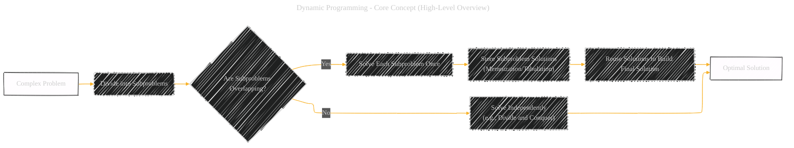
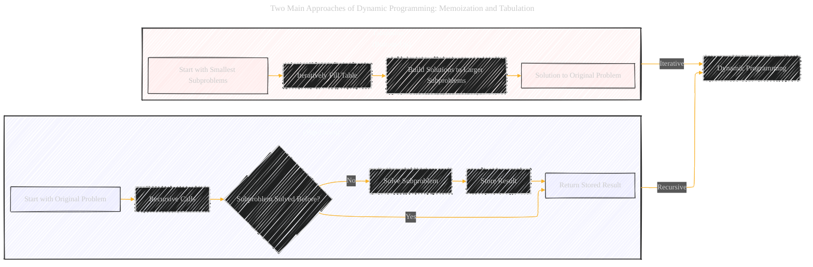
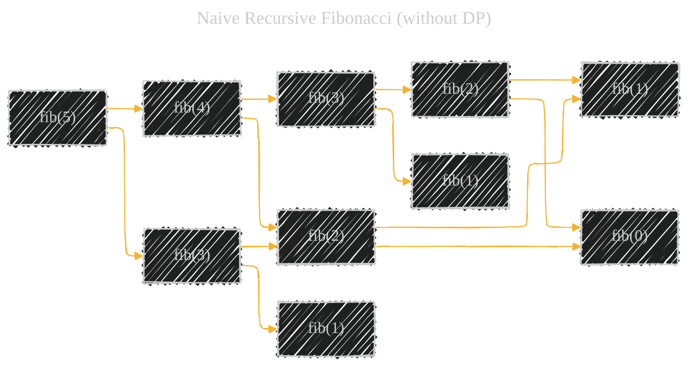
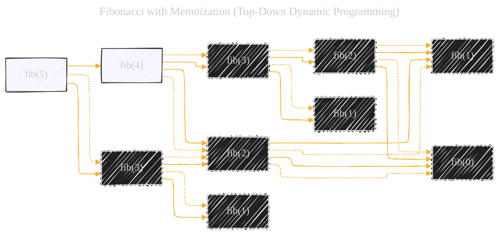
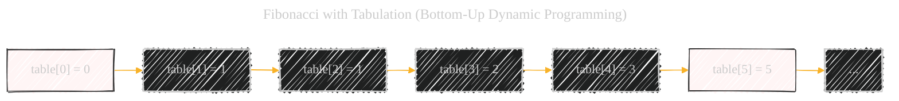
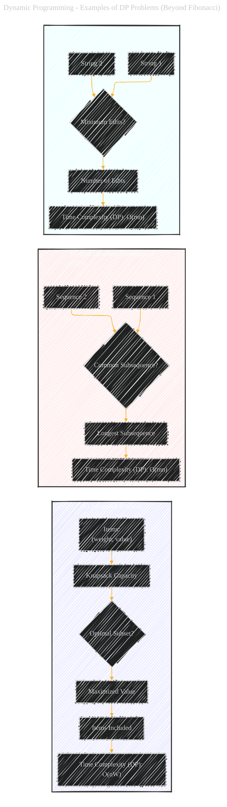

# Dynamic Programming - A Diagrammatic Guide
> **Disclaimer:**
>
> This document contains my personal notes on the topic,
> compiled from publicly available documentation and various cited sources.
> The materials are intended for educational purposes, personal study, and reference.
> The content is dual-licensed:
> 1. **MIT License:** Applies to all code implementations (Swift, Mermaid, and other programming languages).
> 2. **Creative Commons Attribution 4.0 International License (CC BY 4.0):** Applies to all non-code content, including text, explanations, diagrams, and illustrations.
---


Below is a comprehensive explanation, using diagrams, code examples, and a step-by-step approach, should provide a solid understanding of Dynamic Programming. It covers the core concept, the two main approaches (memoization and tabulation), a detailed example with the Fibonacci sequence, how to identify DP problems, and a list of common DP problem examples.


## 1. Core Concept (High-Level Overview)

Dynamic Programming is an optimization technique for solving problems that can be broken down into overlapping subproblems. Instead of recomputing the solutions to these subproblems multiple times, DP stores the results of subproblems (usually in a table or array – often called memoization) and reuses them when needed. This dramatically reduces computation time, often from exponential to polynomial.



**Explanation of the Core Concept Diagram:**

*   **`Complex Problem`:** The starting point – a problem that can potentially be solved with DP.
*   **`Divide into Subproblems`:** The problem is broken down into smaller, self-similar subproblems.
*   **`Are Subproblems Overlapping?`:**  This is the *crucial* question.  If the same subproblems are encountered multiple times during the recursive solution, DP is likely beneficial.
*   **`Solve Each Subproblem Once`:**  Avoid redundant computation.
*   **`Store Subproblem Solutions (Memoization/Tabulation)`:** This is the heart of DP.  We use a data structure (often a table/array) to store the results.
*   **`Reuse Solutions to Build Final Solution`:**  The stored solutions are used to efficiently construct the solution to the original problem.
*   **`Optimal Solution`:**  DP is often used for optimization problems (finding the *best* solution, e.g., shortest path, maximum value).
*   **`Solve Independently (e.g., Divide and Conquer)`:** If subproblems are *not* overlapping, a technique like Divide and Conquer is more appropriate.

----

## 2. Two Main Approaches: Memoization and Tabulation

There are two primary ways to implement Dynamic Programming:

*   **Memoization (Top-Down):**  This is a recursive approach. You start with the original problem and recursively break it down.  You "memoize" (store) the result of each subproblem as you solve it. Before solving a subproblem, you check if it's already been solved; if so, you reuse the stored result.

*   **Tabulation (Bottom-Up):**  This is an iterative approach. You start with the smallest subproblems and build up solutions to larger and larger subproblems, storing the results in a table (hence "tabulation").  You systematically fill the table until you reach the solution to the original problem.



**Explanation of Approaches Diagram:**

*   **Memoization:**  Shows the recursive flow, with the check for previously solved subproblems.
*   **Tabulation:**  Shows the iterative, bottom-up construction of the solution table.
*   **`DP` Node:**  Both approaches are forms of Dynamic Programming.

---

## 3. Example: Fibonacci Sequence (with both approaches)

The Fibonacci sequence is a classic (though not always the *best*) example to illustrate DP because it clearly demonstrates the overlapping subproblems issue.

### 3.a. Naive Recursive Fibonacci (without DP)

```python
def fib_naive(n):
  if n <= 1:
    return n
  return fib_naive(n-1) + fib_naive(n-2)

# Example calls
print(fib_naive(5))
print(fib_naive(6))
```



**Explanation of Naive Recursion:**

*   The code is a direct implementation of the recursive definition of Fibonacci.
*   The diagram shows the *massive* redundancy. `fib(3)` is calculated twice, `fib(2)` three times, and so on. This leads to exponential time complexity, O(2^n), which is very inefficient.

### 3.b. Fibonacci with Memoization (Top-Down DP)

```python
def fib_memo(n, memo={}):
  if n in memo:
    return memo[n]
  if n <= 1:
    return n
  memo[n] = fib_memo(n-1, memo) + fib_memo(n-2, memo)
  return memo[n]

# Example
print(fib_memo(5))
print(fib_memo(6))
print(fib_memo(100)) # This would take forever with fib_naive!

```




**Explanation of Memoization:**

*   We use a dictionary `memo` to store results.
*   Before computing `fib(n)`, we check if it's already in `memo`.
*   The diagram shows how redundant calculations are avoided (dotted lines indicate reused values).  The time complexity improves to O(n) because each subproblem is solved only once.

### 3.c. Fibonacci with Tabulation (Bottom-Up DP)

```python
def fib_tab(n):
  if n <= 1:
    return n
  table = [0] * (n + 1)
  table[1] = 1
  for i in range(2, n + 1):
    table[i] = table[i-1] + table[i-2]
  return table[n]

#Example
print(fib_tab(5))
print(fib_tab(6))
print(fib_tab(100))

```




**Explanation of Tabulation:**

*   We create a `table` (list) to store results.
*   We initialize `table[0]` and `table[1]` (base cases).
*   We iteratively fill the table, using previously computed values.
*   The diagram shows the table being built up. The time complexity is also O(n), and the space complexity is O(n) as well (for both memoization and tabulation in this specific Fibonacci example).

----

## 4. Identifying DP Problems: Key Characteristics

*   **Optimal Substructure:**  An optimal solution to the problem can be constructed from optimal solutions to its subproblems. This means the problem can be broken down recursively.

*   **Overlapping Subproblems:** The recursive solution would solve the same subproblems repeatedly.  This is where DP's efficiency gain comes from.

---

## 5. Steps to Solve a DP Problem

1.  **Identify Optimal Substructure:**  Can you define the solution to the problem in terms of solutions to smaller instances of the same problem?

2.  **Identify Overlapping Subproblems:**  Draw the recursion tree (like we did for the naive Fibonacci). Are the same subproblems appearing multiple times?

3.  **Choose Memoization or Tabulation:**
    *   **Memoization:**  Often easier to implement if you already have a recursive solution.  Can be less efficient if you end up solving subproblems you don't need.
    *   **Tabulation:**  Often more efficient in terms of constant factors (no recursion overhead).  Requires careful planning to determine the correct order to fill the table.

4.  **Define the Memo/Table:** What data structure will you use to store subproblem solutions? What are the dimensions of the table? What does each entry in the table represent?

5.  **Define the Recurrence Relation:**  This is the mathematical formula that defines how to compute a subproblem's solution based on the solutions to smaller subproblems. (For Fibonacci: `fib(n) = fib(n-1) + fib(n-2)`).

6.  **Implement (with Memoization or Tabulation):** Write the code!

7.  **Determine Time and Space Complexity:** Analyze the efficiency of your DP solution.

---

## 6. Examples of DP Problems (Beyond Fibonacci)

*   **0/1 Knapsack Problem:** Given a set of items, each with a weight and a value, determine the subset of items to include in a knapsack of limited capacity to maximize the total value.
*   **Longest Common Subsequence (LCS):** Find the longest subsequence common to two sequences. Used in DNA sequence alignment, diff utilities, and more.
*   **Shortest Path Problems (e.g., Dijkstra's Algorithm with a min-priority queue, Floyd-Warshall Algorithm):** Find the shortest path between nodes in a graph.
*   **Edit Distance (Levenshtein Distance):** Find the minimum number of edits (insertions, deletions, substitutions) needed to transform one string into another.
*   **Matrix Chain Multiplication:** Find the most efficient way to multiply a chain of matrices.
*   **Coin Change Problem:** Given a set of coin denominations and a target amount, find the minimum number of coins needed to make up that amount.
*   **Rod Cutting** Given a rod with n length, we want to maximize the revenue.

For each of these more practical problems, the same process applies but you will have much better performance in terms of complexities:




---

## 7. Key Terms and Concepts


---
**Licenses:**

- **MIT License:**  [](LICENSE) - Full text in [LICENSE](LICENSE) file.
- **Creative Commons Attribution 4.0 International:** [](LICENSE-CC-BY) - Legal details in [LICENSE-CC-BY](LICENSE-CC-BY) and at [Creative Commons official site](http://creativecommons.org/licenses/by/4.0/).

---