# Fractals - A Diagrammatic Guide
> **Disclaimer:**
>
> This document contains my personal notes on the topic,
> compiled from publicly available documentation and various cited sources.
> The materials are intended for educational purposes, personal study, and reference.
> The content is dual-licensed:
> 1. **MIT License:** Applies to all code implementations (Swift, Mermaid, and other programming languages).
> 2. **Creative Commons Attribution 4.0 International License (CC BY 4.0):** Applies to all non-code content, including text, explanations, diagrams, and illustrations.
---

Below is a comprehensive explanation, combining visual representations, mathematical definitions, step-by-step constructions, and real-world applications, provides a solid foundation for understanding the concept of fractals. The use of multiple Mermaid diagrams aids in visualizing the iterative processes and key characteristics, while the textual descriptions provide the necessary context and detail.

## 1. What is a Fractal? (Conceptual Overview)

A fractal is a geometric shape that exhibits **self-similarity** at different scales. This means that if you zoom in on a part of a fractal, it looks similar or identical to the whole fractal. Fractals often possess infinite detail; you can keep zooming in forever and continue to see new, intricate structures. They are often described as "never-ending patterns". They are created by repeating a simple process in any ongoing feedback loop. They are images of dynamic systems or systems that are in motion.

Here are some key features:

*   **Self-Similarity:** The defining characteristic.  Small parts resemble the whole.
*   **Infinite Detail:**  Zooming in reveals more and more complexity.
*   **Non-Integer Dimension:**  Fractals often have a "fractal dimension" that is not a whole number (e.g., 1.26).  This reflects their space-filling properties.  A straight line has a dimension of 1; a square has a dimension of 2.  Fractals occupy a dimensional space between these integers.
*   **Recursive Definition:**  Fractals are often generated by repeating a simple process over and over again (iteration).

----

## 2. Sierpinski Triangle (Step-by-Step Construction and Mermaid)

The Sierpinski Triangle is a classic example of a fractal. Let's build it step-by-step and visualize it with Mermaid:

**Step 1: Start with an equilateral triangle.**

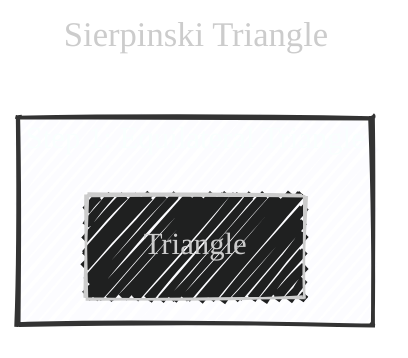

**Step 2: Divide the triangle into four smaller equilateral triangles and remove the central one.**

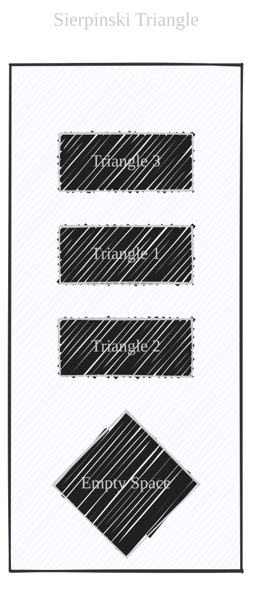

**Step 3: Repeat Step 2 for each of the remaining smaller triangles.**

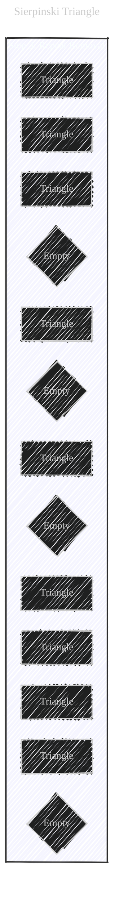

**Step 4: Continue this process infinitely.**

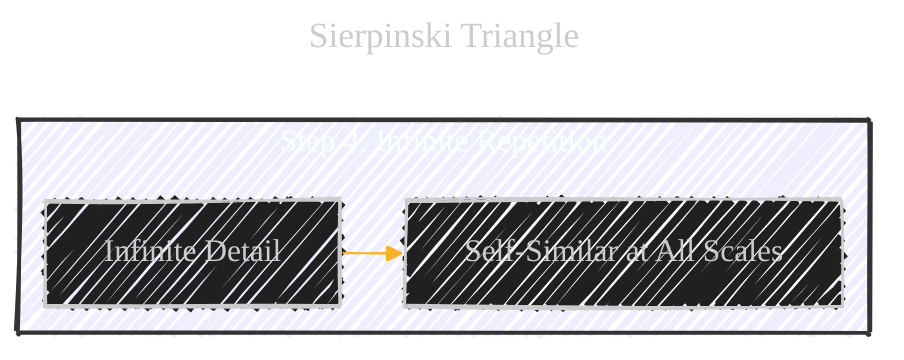

**Combined Steps (Conceptual Mermaid Diagram):**

```mermaid
---
title: "Sierpinski Triangle"
author: "Cong Le"
version: "1.0"
license(s): "MIT, CC BY 4.0"
copyright: "Copyright (c) 2025 Cong Le. All Rights Reserved."
config:
  layout: elk
  look: handDrawn
  theme: dark
---
%%%%%%%% Mermaid version v11.4.1-b.14
%%%%%%%% Toggle theme value to `base` to activate the initilization below for the customized theme version.
%%%%%%%% Available curve styles include the following keywords:
%% basis, bumpX, bumpY, cardinal, catmullRom, linear, monotoneX, monotoneY, natural, step, stepAfter, stepBefore.
%%{
  init: {
    'graph': { 'htmlLabels': false, 'curve': 'linear' },
    'fontFamily': 'Fantasy',
    'themeVariables': {
      'primaryColor': '#ffff',
      'primaryTextColor': '#55ff',
      'primaryBorderColor': '#7c2',
      'lineColor': '#F8B229',
      'secondaryColor': '#006100',
      'tertiaryColor': '#fff'
    }
  }
}%%
graph LR
    Start[Start: Equilateral Triangle] --> Step1;
    Step1[Divide into 4, Remove Center] --> Step2;
    Step2[Repeat for Each Smaller Triangle] --> Step3;
    Step3 --> StepN[Repeat Infinitely];
    StepN -- "Results in" --> Sierpinski[Sierpinski Triangle];
```

**Mathematical Detail:**

The Sierpinski Triangle has a fractal dimension of approximately 1.585.  This is calculated using the formula:

$$
D = log(N) / log(S)
$$

Where:

*   `D` is the fractal dimension.
*   `N` is the number of self-similar pieces (3, in this case, because we keep 3 triangles at each step).
*   `S` is the scaling factor (2, because each smaller triangle is half the size of the original).

So:  D = log(3) / log(2) ≈ 1.585

----

## 3. Koch Snowflake (Another Iterative Fractal)

The Koch Snowflake is another classic fractal, built using a different iterative process:

**Step 1: Start with an equilateral triangle.**

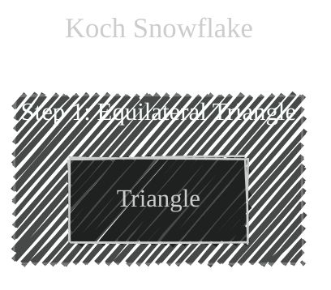

**Step 2: Divide each line segment into three equal parts.**

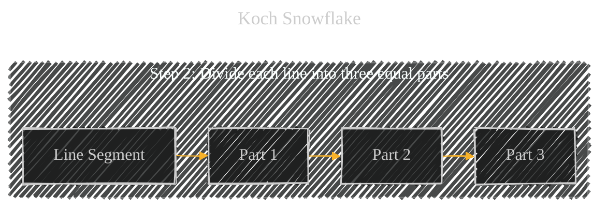

**Step 3: Draw an equilateral triangle on the middle segment, pointing outwards. Remove the base of the new triangle.**

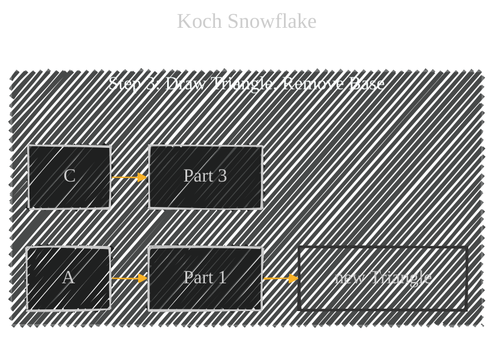

**Step 4: Repeat steps 2 and 3 for each line segment of the resulting shape.**

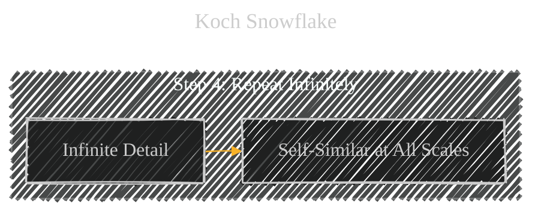
**Combined Steps (Conceptual Mermaid Diagram):**

**Mathematical Detail:**

The Koch Snowflake's perimeter becomes infinitely long, even though it encloses a finite area. Its fractal dimension is approximately 1.262.

---

## 4. Mandelbrot Set (Complex Numbers and Visualization)

The Mandelbrot set is perhaps the most famous fractal. It's generated using complex numbers and a relatively simple iterative equation, but it produces incredibly complex and beautiful images.

**The Equation:**

$$
z_(n+1) = z_n^2 + c
$$

Where:

*   `z` is a complex number (z = a + bi, where 'i' is the imaginary unit, √-1).
*   `c` is a constant complex number.
*   `z_0` is usually set to 0.

**The Process:**

1.  **Choose a complex number `c`.** Think of this as a point on the complex plane (where the x-axis is the real part and the y-axis is the imaginary part).
2.  **Iterate the equation:** Start with `z_0 = 0`. Calculate `z_1`, then `z_2`, `z_3`, and so on.
3.  **Check for Divergence:**  If the magnitude (absolute value) of `z` ever becomes greater than 2, the sequence *diverges* – it goes off to infinity. We say that the point `c` is *not* in the Mandelbrot set.
4.  **Coloring:** If the sequence *doesn't* diverge (after many iterations), the point `c` *is* in the Mandelbrot set. We typically color the point black. Points *outside* the set are colored based on *how quickly* they diverge. This creates the beautiful, colorful patterns around the edges of the Mandelbrot set.

**Mermaid (Conceptual Representation):**

We can't directly draw the Mandelbrot set in Mermaid, but we can show the iterative process:

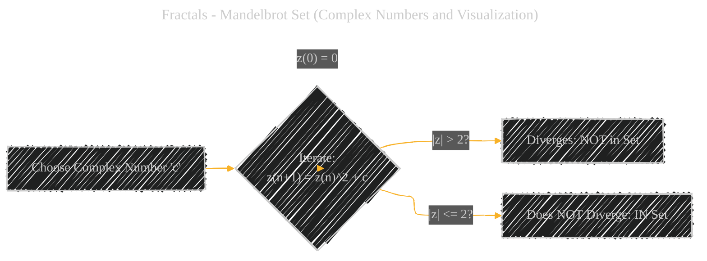

**Julia Sets:** Related to the mandelbrot and is defined as:

$$
z_(n+1) = z_n^2 + c
$$

Similar to the Mandelbrot, z is complex.

The difference between the mandelbrot and Julia:
* In Mandelbrot, c is the variable, and z0 is 0
* In Julia, c is constant, and z0 is the variable.

---

## 5. Real-World Examples and Applications

Fractals aren't just mathematical curiosities; they appear throughout nature and have practical applications:

*   **Nature:**
    *   **Coastlines:** The jagged, irregular shape of coastlines can be modeled using fractals.
    *   **Mountains:** Mountain ranges exhibit self-similar patterns at different scales.
    *   **Trees:** Branching patterns in trees are fractal.
    *   **Snowflakes:** The intricate structures of snowflakes are fractal.
    *   **Lightning:** The branching of lightning bolts follows a fractal pattern.
    *   **Romanesco Broccoli:**  A striking example of a natural fractal.
    *  **River network**
    * **Human lungs**

*   **Technology:**
    *   **Computer Graphics:** Fractals are used to generate realistic landscapes, clouds, and other natural phenomena.
    *   **Image Compression:** Fractal image compression techniques can achieve high compression ratios.
    *   **Antenna Design:** Fractal antennas can be designed to operate efficiently over a wide range of frequencies.
    *  **Medicine, detecting/predicting cancer**

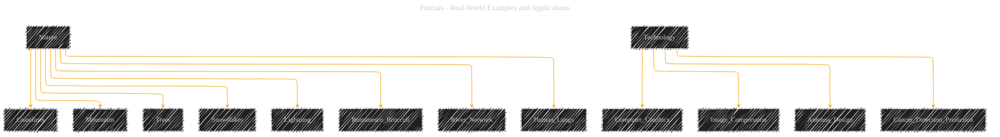

----

## 6. Key Terms and Concepts

Here is the summary of the diagrams that covers keywords about `Fractals`:

---
**Licenses:**

- **MIT License:**   - Full text in [LICENSE](LICENSE) file.
- **Creative Commons Attribution 4.0 International:**  - Legal details in [LICENSE-CC-BY](LICENSE-CC-BY) and at [Creative Commons official site](http://creativecommons.org/licenses/by/4.0/).

---