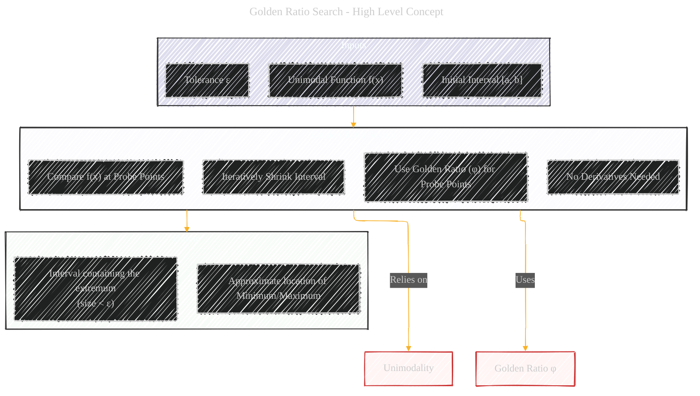
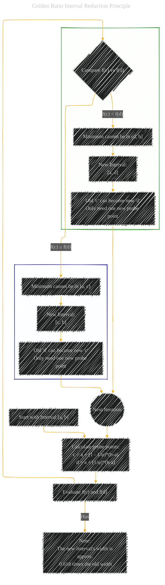
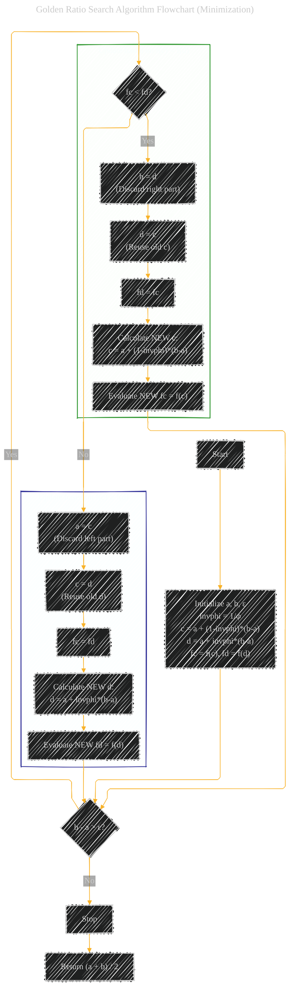

# Golden Ratio Search - A Diagrammatic Guide 
> **Disclaimer:**
>
> This document contains my personal notes on the topic,
> compiled from publicly available documentation and various cited sources.
> The materials are intended for educational purposes, personal study, and reference.
> The content is dual-licensed:
> 1. **MIT License:** Applies to all code implementations (Swift, Mermaid, and other programming languages).
> 2. **Creative Commons Attribution 4.0 International License (CC BY 4.0):** Applies to all non-code content, including text, explanations, diagrams, and illustrations.
---


## 1. What is Golden Ratio Search? (High-Level Overview)

Golden Ratio Search is an efficient numerical optimization technique used to find the extremum (minimum or maximum) of a **unimodal function** within a given bounded interval. A unimodal function on an interval has only one peak (for maximum) or valley (for minimum). The key idea is to iteratively narrow down the interval containing the extremum by strategically placing two interior "probe" points based on the **Golden Ratio (φ)**. Unlike methods like Newton's method, it does not require the function's derivative.



---

## 2. Key Concepts and Terminology

*   **Unimodal Function:** A function `f(x)` is unimodal on an interval `[a, b]` if it has exactly one local minimum or maximum within that interval. For minimization, it means the function decreases, hits a minimum, and then increases.
*   **Interval `[a, b]`:** The initial range within which the extremum is known to exist.
*   **Golden Ratio (φ):** An irrational number approximately equal to **1.6180339887...**. It's defined as `(1 + √5) / 2`. A key property used is its reciprocal: `1/φ = φ - 1 ≈ 0.618`.
*   **Probe Points (c, d):** Two points chosen *inside* the current interval `[a, b]` where the function `f(x)` is evaluated. Their placement is determined by the Golden Ratio to ensure efficient interval reduction.
*   **Tolerance (ε):** A small positive number defining the desired precision. The search stops when the interval width (`b - a`) is less than ε.


---

## 3. The Core Idea (How Interval Reduction Works)

The algorithm maintains an interval `[a, b]` known to contain the minimum. Two interior points `c` and `d` are chosen such that `a < c < d < b`. Their positions are calculated using the golden ratio's reciprocal (`1/φ ≈ 0.618`):

*   `c = a + (1 - 1/φ) * (b - a)`  (which is `a + (1/φ^2) * (b-a)`)
*   `d = a + (1/φ) * (b - a)`

This placement ensures symmetry and allows for efficient reuse. The function is evaluated at `c` and `d`.

1.  **If `f(c) < f(d)`:** The minimum *cannot* be in the interval `(d, b]`. The new interval becomes `[a, d]`. Notice that the *old* `c` becomes the *new* `d` (approximately, due to scaling) for the next iteration.
2.  **If `f(c) ≥ f(d)`:** The minimum *cannot* be in the interval `[a, c)`. The new interval becomes `[c, b]`. Notice that the *old* `d` becomes the *new* `c` for the next iteration.

In each step, the interval is reduced by a factor of `1/φ ≈ 0.618`, and crucially, **only one *new* function evaluation** is needed in the next iteration because one of the previous probe points and its function value are reused.



---

## 4. Algorithm Steps (Finding Minimum)

1.  **Initialization:**
    *   Define the unimodal function `f(x)`.
    *   Set the initial interval `[a, b]`.
    *   Choose the tolerance `ε > 0`.
    *   Calculate `invphi = 1/φ = (√5 - 1) / 2`.
    *   Calculate initial probe points:
        *   `c = a + (1 - invphi) * (b - a)`
        *   `d = a + invphi * (b - a)`
    *   Evaluate `fc = f(c)` and `fd = f(d)`.

2.  **Iteration Loop:** While `(b - a) > ε`:
    *   **Compare:**
        *   If `fc < fd`:
            *   Update `b = d` (discard `(d, b]`).
            *   Update `d = c` (old `c` is the new `d`).
            *   Update `fd = fc`.
            *   Calculate *new* `c = a + (1 - invphi) * (b - a)`.
            *   Evaluate *new* `fc = f(c)`.
        *   Else (`fc ≥ fd`):
            *   Update `a = c` (discard `[a, c)`).
            *   Update `c = d` (old `d` is the new `c`).
            *   Update `fc = fd`.
            *   Calculate *new* `d = a + invphi * (b - a)`.
            *   Evaluate *new* `fd = f(d)`.

3.  **Termination:** When `(b - a) ≤ ε`, the loop stops.
4.  **Result:** The minimum lies within the final interval `[a, b]`. Return the midpoint `(a + b) / 2` as the approximate location of the minimum.



---

## 5. Example Illustration (Conceptual)

Imagine searching for the minimum in `[0, 10]`.

*   **Iter 0:** `[a=0, b=10]`. Calculate `c ≈ 3.82`, `d ≈ 6.18`. Evaluate `f(c)`, `f(d)`.
    *   Assume `f(c) > f(d)`.
*   **Iter 1:** New interval is `[c, b] = [3.82, 10]`. The *old* `d` (6.18) becomes the *new* `c`. We only need to calculate a *new* `d` within `[3.82, 10]` (around 7.64) and evaluate `f` at this new `d`.
    *   Assume `f(new_c) < f(new_d)`.
*   **Iter 2:** New interval is `[a, d] = [3.82, 7.64]`. The *old* `c` (6.18) becomes the *new* `d`. We only need to calculate a *new* `c` within `[3.82, 7.64]` (around 5.28) and evaluate `f` at this new `c`.
*   ... and so on, until the interval is sufficiently small.

```mermaid
---
title: Conceptual Illustration of Interval Shrinking
author: "Cong Le"
version: "1.0"
license(s): "MIT, CC BY 4.0"
copyright: "Copyright (c) 2025 Cong Le. All Rights Reserved."
config:
  layout: elk
  look: handDrawn
  theme: dark
---
%%%%%%%% Mermaid version v11.4.1-b.14
%%%%%%%% Toggle theme value to `base` to activate the initilization below for the customized theme version.
%%%%%%%% Available curve styles include the following keywords:
%% basis, bumpX, bumpY, cardinal, catmullRom, linear, monotoneX, monotoneY, natural, step, stepAfter, stepBefore.
%%{
  init: {
    'graph': { 'htmlLabels': false, 'curve': 'linear' },
    'fontFamily': 'Fantasy',
    'themeVariables': {
      'primaryColor': '#ffff',
      'primaryTextColor': '#55ff',
      'primaryBorderColor': '#7c2',
      'lineColor': '#F8B229',
      'secondaryColor': '#006100',
      'tertiaryColor': '#fff'
    }
  }
}%%
graph LR
    subgraph Iteration_0 ["Iteration 0: [a₀, b₀]"]
        I0["a₀ --- c₀ --- d₀ --- b₀"]
    end
    subgraph Evaluation_0 ["Evaluate f(c₀), f(d₀)<br>Assume f(c₀) ≥ f(d₀)"]
    end
    subgraph Iteration_1 ["Iteration 1: [a₁, b₁] = [c₀, b₀]"]
        I1["a₁ (=c₀) --- c₁ (=d₀) --- d₁ --- b₁ (=b₀)"]
    end
     subgraph Evaluation_1 ["Evaluate f(d₁)<br>Reuse f(c₁) = f(d₀)<br>Assume f(c₁) < f(d₁)"]
    end
     subgraph Iteration_2 ["Iteration 2: [a₂, b₂] = [a₁, d₁]"]
        I2["a₂ (=a₁) --- c₂ --- d₂ (=c₁) --- b₂ (=d₁)"]
    end
    subgraph Evaluation_2 ["Evaluate f(c₂)<br>Reuse f(d₂) = f(c₁)"]
    end


    Iteration_0 --> Evaluation_0
    Evaluation_0 --> Iteration_1
    Iteration_1 --> Evaluation_1
    Evaluation_1 --> Iteration_2
    Iteration_2 --> Evaluation_2
    Evaluation_2 --> Final["...Continue until b - a < ε"]

    style Iteration_0 fill:#eee3
    style Evaluation_0 fill:#ffe3
    style Iteration_1 fill:#eee3
    style Evaluation_1 fill:#ffe3
    style Iteration_2 fill:#eee3
    style Evaluation_2 fill:#ffe3
    style Final fill:#ddd3

```

---

## 6. Why the Golden Ratio?

The choice of the Golden Ratio is not arbitrary. It's the *unique* ratio that allows the interval reduction property where one of the *interior* points from the current step becomes one of the *interior* points for the next step, perfectly positioned according to the same ratio. This symmetry means that after the first iteration, **each subsequent iteration requires only *one* new function evaluation**, making it more efficient than a naive ternary search (which requires two new evaluations per step).

---

## 7. Time and Space Complexity

*   **Time Complexity:** The interval width is reduced by a constant factor (approximately 0.618) in each iteration. To reduce the interval from an initial width `W = b - a` down to `ε`, we need `k` iterations such that `W * (1/φ)^k ≤ ε`. Taking logarithms, this gives `k >= log(W/ε) / log(φ)`. Therefore, the time complexity is **O(log( (b-a)/ε ))**, which is logarithmic with respect to the ratio of the initial interval width to the desired precision. Since each iteration involves a constant number of calculations (one function evaluation after the first step, plus comparisons/assignments), the overall time is logarithmic.
*   **Space Complexity:** The algorithm only needs to store a few variables (a, b, c, d, fc, fd, ε, invphi). This is independent of the interval size or tolerance. Therefore, the space complexity is **O(1)** (constant).

---

## 8. Key Terms and Concepts (Summary Mind Map)


---
**Licenses:**

- **MIT License:**  [](LICENSE) - Full text in [LICENSE](LICENSE) file.
- **Creative Commons Attribution 4.0 International:** [](LICENSE-CC-BY) - Legal details in [LICENSE-CC-BY](LICENSE-CC-BY) and at [Creative Commons official site](http://creativecommons.org/licenses/by/4.0/).

---