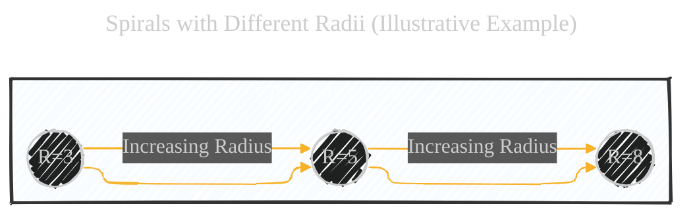

# Golden Spiral - A Diagrammatic Guide
> **Disclaimer:**
>
> This document contains my personal notes on the topic,
> compiled from publicly available documentation and various cited sources.
> The materials are intended for educational purposes, personal study, and reference.
> The content is dual-licensed:
> 1. **MIT License:** Applies to all code implementations (Swift, Mermaid, and other programming languages).
> 2. **Creative Commons Attribution 4.0 International License (CC BY 4.0):** Applies to all non-code content, including text, explanations, diagrams, and illustrations.
---


The diagrams below and mathematical explanations provide a comprehensive understanding of the Golden Spiral, the Fibonacci sequence, and the Golden Ratio, covering the visual and mathematical aspects presented in the original image – plus more detail for full conceptual understanding. The use of multiple Mermaid diagrams, along with textual explanations, allows for a richer and more educational presentation than any single diagram could achieve.


## 1. Core Image Recreation (Mermaid Flowchart)

We can't perfectly replicate curved lines in a Mermaid flowchart, but we can represent the structure and relationships of the squares and the sequence:

```mermaid
---
title: "Recreation Golden Spiral Image"
author: "Cong Le"
version: "1.0"
license(s): "MIT, CC BY 4.0"
copyright: "Copyright (c) 2025 Cong Le. All Rights Reserved."
config:
  layout: elk
  look: handDrawn
  theme: dark
---
%%%%%%%% Mermaid version v11.4.1-b.14
%%%%%%%% Toggle theme value to `base` to activate the initilization below for the customized theme version.
%%%%%%%% Available curve styles include the following keywords:
%% basis, bumpX, bumpY, cardinal, catmullRom, linear, monotoneX, monotoneY, natural, step, stepAfter, stepBefore.
%%{
  init: {
    'graph': { 'htmlLabels': false, 'curve': 'linear' },
    'fontFamily': 'Fantasy',
    'themeVariables': {
      'primaryColor': '#ffff',
      'primaryTextColor': '#55ff',
      'primaryBorderColor': '#7c2',
      'lineColor': '#F8B229',
      'secondaryColor': '#006100',
      'tertiaryColor': '#fff'
    }
  }
}%%
graph LR
    subgraph Golden_Spiral_Construction["Golden Spiral Construction"]
    style Golden_Spiral_Construction fill:#eef3,stroke:#333,stroke-width:2px
    direction LR
        A[Square 8x8] --> B[Square 5x5];
        B --> C[Square 3x3];
        C --> D[Square 2x2];
        D --> E[Square 1x1];
        E --> F[Square 1x1];

        A -- "Contains Arc" --> A1((Arc 8));
        B -- "Contains Arc" --> B1((Arc 5));
        C -- "Contains Arc" --> C1((Arc 3));
        D -- "Contains Arc" --> D1((Arc 2));
        E -- "Contains Arc" --> E1((Arc 1));
        F -- "Contains Arc" --> F1((Arc 1));

        A1 --> B1;
        B1 --> C1;
        C1 --> D1;
        D1 --> E1;
    end

    subgraph Fibonacci["Fibonacci Sequence"]
    style Fibonacci fill:#ddf3,stroke:#333,stroke-width:2px
        Fib[1, 1, 2, 3, 5, 8, 13, 21, ...]
    end
        
    subgraph GoldenRatio["Golden Ratio (φ)"]
    style GoldenRatio fill:#eef3,stroke:#333,stroke-width:2px
        GR["(a + b) / a ≈ a / b ≈ 1.618"]
        GR1["φ ≈ 1.618"]
        GR --> GR1
    end

    Fib -- "Generates sizes for" --> Golden_Spiral_Construction
    Golden_Spiral_Construction -- "Approximates" --> GoldenRatio

```



**Explanation of the Core Mermaid Diagram:**

*   **`Golden_Spiral_Construction` Subgraph:**  This represents the nested squares that make up the Golden Spiral.  We use a left-to-right (LR) layout to mimic the image.  Each node (A, B, C, D, E, F) represents a square with a side length corresponding to a Fibonacci number.  The arrows show how the squares are nested.  The `((Arc X))` nodes represent the quarter-circle arcs drawn within each square.  The connections between the arcs illustrate the continuous spiral.
*   **`Fibonacci` Subgraph:**  This simply shows the beginning of the Fibonacci sequence.
*  **`GoldenRatio` Subgraph:**  Represents the mathematical core, which is the ratio.
*   **Connections:**: Links the subgraphs.

---

## 2. Golden Ratio and Fibonacci Relationship (Mathematical Explanation)

The Golden Ratio (φ) is an irrational number, approximately 1.6180339887....  It's defined by the following relationship:


$$
(a + b) / a = a / b = φ
$$

Where `a` is larger than `b`.  If you divide a line into two parts so that the ratio of the whole line (`a + b`) to the longer part (`a`) is the same as the ratio of the longer part (`a`) to the shorter part (`b`), you've divided it in the Golden Ratio.

The Fibonacci sequence (0, 1, 1, 2, 3, 5, 8, 13, 21, ...) is closely related.  Each number is the sum of the two preceding numbers.  As you go further into the sequence, the ratio between successive Fibonacci numbers gets closer and closer to the Golden Ratio.


```LaTex
8 / 5 = 1.6
13 / 8 = 1.625
21 / 13 = 1.61538...
34 / 21 = 1.61904...
...and so on...
```
Here is the mathematical equation:

$$
\lim_{n \to \infty} \frac{F_{n+1}}{F_n} = \phi
$$

---

## 3. Constructing the Golden Spiral (Step-by-Step)

Here we provide step-by-step illustrative instructions to create a visualization:

```mermaid
---
title: "Constructing the Golden Spiral (Step-by-Step)"
author: "Cong Le"
version: "1.0"
license(s): "MIT, CC BY 4.0"
copyright: "Copyright (c) 2025 Cong Le. All Rights Reserved."
config:
  layout: elk
  look: handDrawn
  theme: dark
---
%%%%%%%% Mermaid version v11.4.1-b.14
%%%%%%%% Toggle theme value to `base` to activate the initilization below for the customized theme version.
%%%%%%%% Available curve styles include the following keywords:
%% basis, bumpX, bumpY, cardinal, catmullRom, linear, monotoneX, monotoneY, natural, step, stepAfter, stepBefore.
%%{
  init: {
    'graph': { 'htmlLabels': false, 'curve': 'linear' },
    'fontFamily': 'Fantasy',
    'themeVariables': {
      'primaryColor': '#ffff',
      'primaryTextColor': '#55ff',
      'primaryBorderColor': '#7c2',
      'lineColor': '#F8B229',
      'secondaryColor': '#006100',
      'tertiaryColor': '#fff'
    }
  }
}%%
graph LR
    subgraph Step1["Step 1: Start with two small squares"]
        S1A[1x1 Square]
        S1B[1x1 Square]
        S1A -- "Adjacent" --> S1B
    end

    subgraph Step2["Step 2: Add a 2x2 Square"]
        S2A[1x1 Square]
        S2B[1x1 Square]
        S2C[2x2 Square]
       
        S2A -- "Adjacent" --> S2B
        S2B -- "Adjacent" --> S2C
    end

    subgraph Step3["Step 3: Add a 3x3 Square"]
        S3A[1x1]
        S3B[1x1]
        S3C[2x2]
        S3D[3x3]
        
        S3A -- "Adjacent" --> S3B
        S3B -- "Adjacent" --> S3C
        S3C -- "Adjacent" --> S3D
    end

    subgraph Step4["Step 4: Add a 5x5 Square"]
        S4A[1x1]
        S4B[1x1]
        S4C[2x2]
        S4D[3x3]
        S4E[5x5]
        
        S4A -- "Adjacent" --> S4B
        S4B -- "Adjacent" --> S4C
        S4C -- "Adjacent" --> S4D
        S4D -- "Adjacent" --> S4E
    end

     subgraph Step5["Step 5: Add a 8x5 Square"]
        S5A[1x1]
        S5B[1x1]
        S5C[2x2]
        S5D[3x3]
        S5E[5x5]
        S5F[8x8]
        
        S5A -- "Adjacent" --> S5B
        S5B -- "Adjacent" --> S5C
        S5C -- "Adjacent" --> S5D
        S5D -- "Adjacent" --> S5E
        S5E -- "Adjacent" --> S5F
    end

    subgraph Step6["Step 6: Draw Arcs"]
        S6A[1x1] --"Arc"--> S6A1(( ))
        S6B[1x1] --"Arc"--> S6B1(( ))
        S6C[2x2] --"Arc"--> S6C1(( ))
        S6D[3x3] --"Arc"--> S6D1(( ))
        S6E[5x5] --"Arc"--> S6E1(( ))
        S6F[8x8] --"Arc"--> S6F1(( ))

       
        S6A --"Adjacent"--> S6B
        S6B --"Adjacent"--> S6C
        S6C --"Adjacent"--> S6D
        S6D --"Adjacent"--> S6E
        S6E --"Adjacent"--> S6F

        S6A1 --> S6B1
        S6B1 --> S6C1
        S6C1 --> S6D1
        S6D1 --> S6E1
        S6E1 --> S6F1
    end

    Step1 --> Step2
    Step2 --> Step3
    Step3 --> Step4
    Step4 --> Step5
    Step5 --> Step6
```



**Explanation of the Step-by-Step Diagram:**

*   **Step 1:** Begin with two squares of size 1x1, placed side by side.
*   **Step 2:** Add a 2x2 square, adjacent to the *combined* length of the previous two squares.
*   **Step 3:** Add a 3x3 square, adjacent to the combined rectangle formed by the previous squares.
*   **Step 4:** Add a 5x5 square, and so on.
*   **Step 5:** Continue adding squares, where each new square's side length is the sum of the previous two squares' side lengths (following the Fibonacci sequence).
*   **Step 6:** Within each square, draw a quarter-circle (arc) with a radius equal to the square's side length.  Connect these arcs to form the spiral.

> [!TIP]
> 🙊 Does this look like or relate to how neutral networks being contructed in the architecture of Large Language Models?

----

## 4. Spirals with Different Radii (Illustrative Example)

The bottom-left image in the original shows spirals formed by quarter-circles of increasing radii, but *not* necessarily following the Fibonacci sequence. We can't create perfect circles in Mermaid, and we *especially* can't create smoothly connected, increasing-radius arcs.  However, we can represent the *concept* of increasing radii.


**Explanation:**
*The style in this illustration is for visual purposes and can easily be changed.*

----

## 5. Sectio Aurea (Golden Section Proportion)

The bottom-right image of the original highlights "Sectio Aurea," which is Latin for "Golden Section." This is another name for the Golden Ratio.  The diagram shows how the spiral is constructed within the rectangles formed by the Golden Ratio proportions. Here is the combination of math concept and representation:

```mermaid
---
title: "Sectio Aurea (Golden Section Proportion)"
author: "Cong Le"
version: "1.0"
license(s): "MIT, CC BY 4.0"
copyright: "Copyright (c) 2025 Cong Le. All Rights Reserved."
config:
  layout: elk
  look: handDrawn
  theme: dark
---
%%%%%%%% Mermaid version v11.4.1-b.14
%%%%%%%% Toggle theme value to `base` to activate the initilization below for the customized theme version.
%%%%%%%% Available curve styles include the following keywords:
%% basis, bumpX, bumpY, cardinal, catmullRom, linear, monotoneX, monotoneY, natural, step, stepAfter, stepBefore.
%%{
  init: {
    'graph': { 'htmlLabels': false, 'curve': 'linear' },
    'fontFamily': 'Fantasy',
    'themeVariables': {
      'primaryColor': '#ffff',
      'primaryTextColor': '#55ff',
      'primaryBorderColor': '#7c2',
      'lineColor': '#F8B229',
      'secondaryColor': '#006100',
      'tertiaryColor': '#fff'
    }
  }
}%%
graph LR
    subgraph Golden_Rectangle["Golden Rectangle"]
        style Golden_Rectangle fill:#fed3,stroke:#333,stroke-width:2px
        A["Larger Rectangle (8x?)"] --> B["Square (8x8)"]
        B --> C["Smaller Rectangle (5x?)"]
        C --> D["Square(5x5)"]
        D --> E["and so on..."]

        A -- "Side Ratio ≈ φ" --> B
		B -- "Side Ratio ≈ φ" --> C
    end

```


**Explanation:**

*   We represent the nested rectangles.  The key is that each time you remove a square from a Golden Rectangle, you're left with another, smaller Golden Rectangle. This process can continue infinitely.
*   The side ratio is *approximately* φ because we're using Fibonacci numbers (8, 5, etc.), which only approach the Golden Ratio.

---

## 6. Key Terms and Concepts

Here is an additional diagram with all the keywords and descriptions:

```mermaid
---
title: "Golden Spiral - Key Terms and Concepts"
author: "Cong Le"
version: "1.0"
license(s): "MIT, CC BY 4.0"
copyright: "Copyright (c) 2025 Cong Le. All Rights Reserved."
config:
  theme: dark
---
%%%%%%%% Mermaid version v11.4.1-b.14
%%{
  init: {
    'mindmap': { 'htmlLabels': false },
    'themeVariables': {
      'fontSize': '12px',
      'fontFamily': 'Fantasy'
    }
  }
}%%
mindmap
      root((Golden Spiral & Golden Ratio))
        Golden_Spiral
          Definition[A logarithmic spiral that gets wider by a factor of φ for every quarter turn it makes]
          Construction[Created using a sequence of squares with sizes based on the Fibonacci sequence]
          Approximation[Approximates the Golden Ratio]
        Fibonacci_Sequence
          Definition["A sequence where each number is the sum of the two preceding ones (0, 1, 1, 2, 3, 5, 8, ...)"]
          Formula["F(n) = F(n-1) + F(n-2)"]
          Relation_to_Golden_Ratio[The ratio of consecutive Fibonacci numbers approaches φ]
        Golden_Ratio
          Symbol["φ (phi)"]
          Value[Approximately 1.618]
          Mathematical_Definition["(a + b) / a = a / b = φ"]
          Sectio_Aurea["Latin for 'Golden Section'"]
          Properties
            Irrational_Number[Cannot be expressed as a simple fraction]
            Self_Similar[Found in various proportions within the Golden Spiral]
        Applications
          Art_and_Design[Used for aesthetically pleasing proportions]
          Nature[Observed in patterns in plants, shells, and galaxies]
          Architecture[Used in the design of buildings and structures]
        Mathematical_Representation
	        Limit_of_Fibonacci_Ratio["The limit of F(n+1)/F(n) as n approaches infinity is φ"]
	        
```



---
**Licenses:**

- **MIT License:**  [](LICENSE) - Full text in [LICENSE](LICENSE) file.
- **Creative Commons Attribution 4.0 International:** [](LICENSE-CC-BY) - Legal details in [LICENSE-CC-BY](LICENSE-CC-BY) and at [Creative Commons official site](http://creativecommons.org/licenses/by/4.0/).

---
