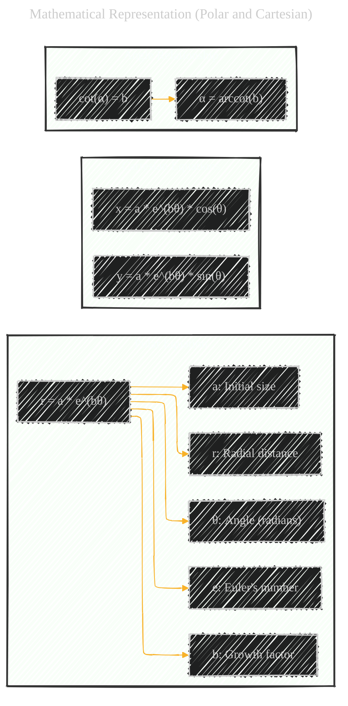
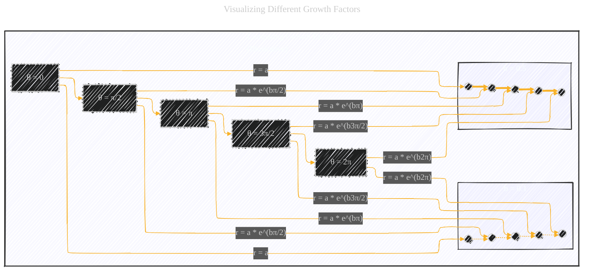
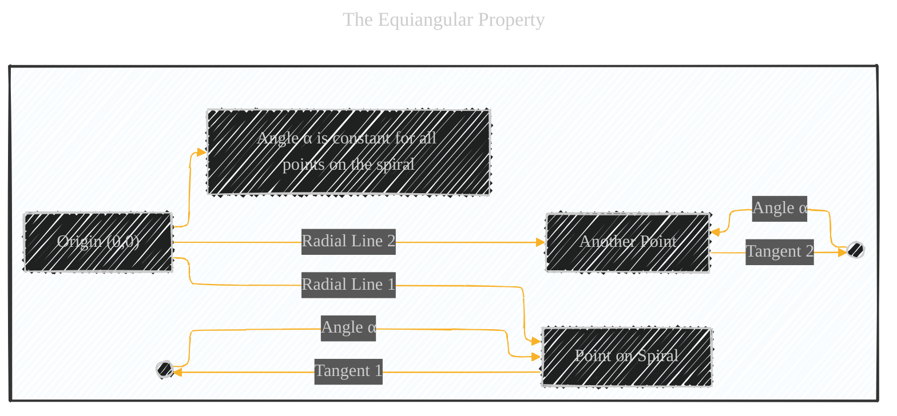
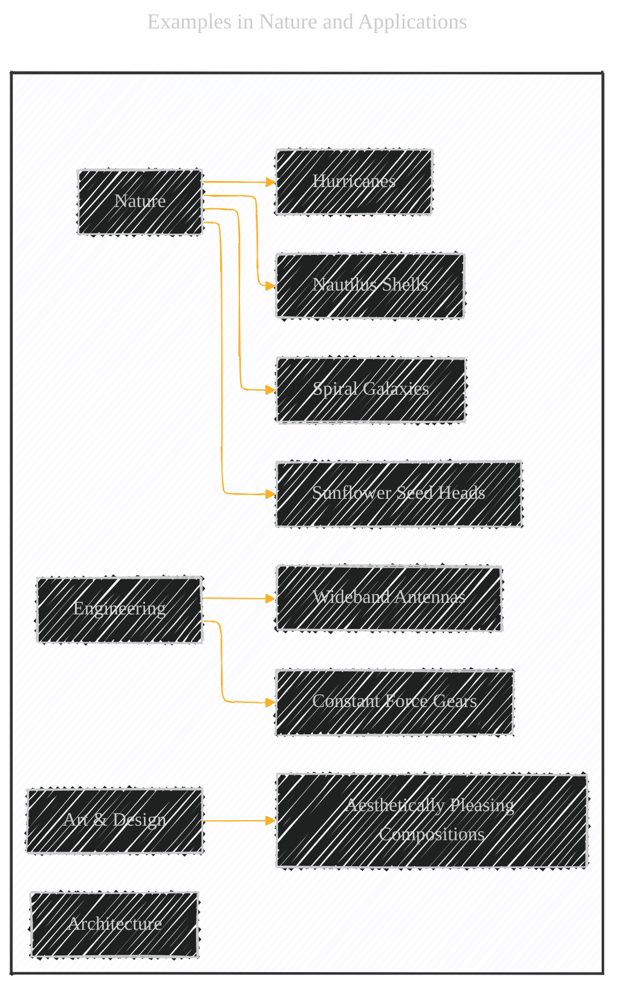

# Logarithmic Spirals (in general) - A Diagrammatic Guide
> **Disclaimer:**
>
> This document contains my personal notes on the topic,
> compiled from publicly available documentation and various cited sources.
> The materials are intended for educational purposes, personal study, and reference.
> The content is dual-licensed:
> 1. **MIT License:** Applies to all code implementations (Swift, Mermaid, and other programming languages).
> 2. **Creative Commons Attribution 4.0 International License (CC BY 4.0):** Applies to all non-code content, including text, explanations, diagrams, and illustrations.
---


Below is a comprehensive breakdown, using a combination of diagrams, mathematical formulas, and textual explanations, provides a thorough understanding of logarithmic spirals, their properties, and their significance.


## 1. Definition and Core Concept (Mind Map)

Let's start with a mind map to establish the core definition and key properties of logarithmic spirals:


**Explanation of the Mind Map:**

*   **Definition:**  A logarithmic spiral continuously expands or contracts while maintaining its shape.
*   **Properties:**
    *   **Self-Similarity:** The spiral looks the same regardless of how much you zoom in or out.  Any section of the spiral is a scaled-down or scaled-up version of any other section.
    *   **Equiangular (Constant Angle):**  A crucial property.  If you draw a line from the origin (the center of the spiral) to any point on the spiral, the angle between that line and the tangent to the spiral at that point is *always the same*.  This angle is often denoted as α (alpha).
    *   **Growth Factor:**  Determines how "tight" or "loose" the spiral is.  This is directly related to the constant *b* in the polar equation (explained below).
*   **Mathematical Representation:** We show here the polar equation and the Cartesian equations.
*   **Types:** The Golden Spiral is just *one* type, with a specific growth factor related to the Golden Ratio (φ).
*   **Applications:**  Logarithmic spirals show up surprisingly often in nature, art, and engineering.

## 2. Mathematical Representation (Polar and Cartesian)

The most common and concise way to define a logarithmic spiral is using its **polar equation**:

```
r = a * e^(bθ)
```

Where:

*   **r:** The radial distance from the origin (the center of the spiral) to a point on the spiral.
*   **θ (theta):** The angle (in radians) measured counterclockwise from the positive x-axis to the point on the spiral.
*   **a:** A positive constant that determines the initial size of the spiral (at θ = 0, r = a). It's a scaling factor.
*   **e:** The base of the natural logarithm (Euler's number, approximately 2.71828).
*   **b:** A non-zero constant that determines the "growth factor" or "tightness" of the spiral.  It controls how quickly the spiral expands or contracts.
    *   If `b > 0`, the spiral expands outwards as θ increases.
    *   If `b < 0`, the spiral contracts inwards as θ increases.
    *   The magnitude of `b` determines how rapidly the spiral grows or shrinks.  A larger `|b|` means a faster change in radius.

The relationship between `b` and the constant angle α (from the equiangular property) is:

```
cot(α) = b  
or
α = arccot(b)
```

Where arccot is the inverse cotangent function.

We can also express the logarithmic spiral in **Cartesian coordinates (x, y)**:

```
x = a * e^(bθ) * cos(θ)
y = a * e^(bθ) * sin(θ)
```
Here is the visualization of the equations above:



---

## 3. Visualizing Different Growth Factors (Mermaid Flowchart)

While we can't draw perfect logarithmic spirals in Mermaid, we can illustrate the *effect* of changing the `b` value.  We'll use a flowchart to represent points along the spiral at increasing angles and show how the radius changes.



**Explanation of the Flowchart:**

*   We show the angle (θ) increasing in steps of π/2 (90 degrees).
*   For each angle, we show the formula for the radius (r) based on the polar equation.  We use a = 1 for simplicity.
*   We have two subgraphs, representing small and large `b`, and use different line style to visually demonstrate the different growth.

----

## 4. The Equiangular Property (Diagram and Explanation)

This is a defining characteristic of logarithmic spirals. Let's visualize it:



**Explanation:**

*   We have an origin and two points on a (hypothetical) logarithmic spiral.
*   We draw radial lines from the origin to each point.
*   We draw tangents to the spiral at each point.
*   The angle (α) between the radial line and the tangent is the *same* at both points (and at *all* points on the spiral).

---

## 5. The Golden Spiral as a Special Case

The Golden Spiral is a specific logarithmic spiral where the growth factor `b` is related to the Golden Ratio (φ):

$$
b = ln(φ) / (π/2)
$$

This means that for every quarter turn (π/2 radians), the radius of the Golden Spiral increases by a factor of φ.
It's important since it combines the definition of *logarithmic* and *Golden* spiral.

---

## 6. Examples in Nature and Applications

Here are the details of some examples:

*   **Nautilus Shell:**  This is a classic example.  As the nautilus grows, its shell spirals outwards, approximating a logarithmic spiral.  This allows the creature to grow without changing its overall shape.

*   **Galaxies:**  Spiral galaxies often exhibit logarithmic spiral arms.  The density waves that form these arms follow a logarithmic spiral pattern.

*   **Hurricanes:**  The swirling arms of a hurricane also tend to follow a logarithmic spiral shape.

*   **Sunflower Seed Heads:**  The arrangement of seeds in a sunflower head follows a pattern related to both the Fibonacci sequence and the Golden Spiral (which is a type of logarithmic spiral).

*   **Antenna Design:**  Logarithmic spiral antennas are used in wideband applications because their self-similar property allows them to operate over a broad range of frequencies.

*   **Gear Design:**  Some types of gears use logarithmic spirals to ensure a constant force transmission.

Here is a combined diagram that showcases all the examples above:




---
**Licenses:**

- **MIT License:**  [](LICENSE) - Full text in [LICENSE](LICENSE) file.
- **Creative Commons Attribution 4.0 International:** [](LICENSE-CC-BY) - Legal details in [LICENSE-CC-BY](LICENSE-CC-BY) and at [Creative Commons official site](http://creativecommons.org/licenses/by/4.0/).

---