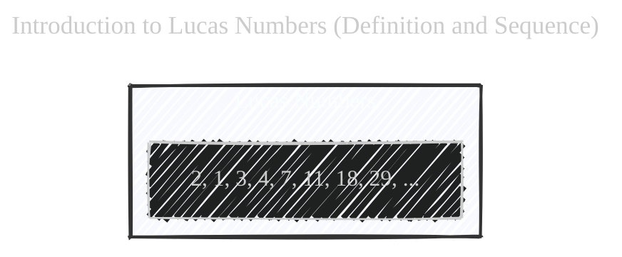
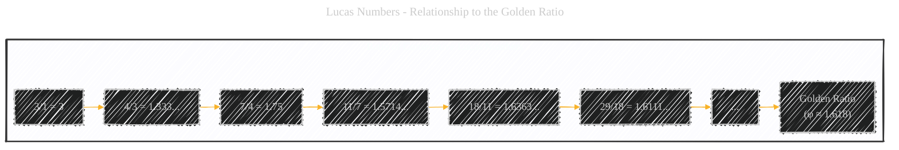
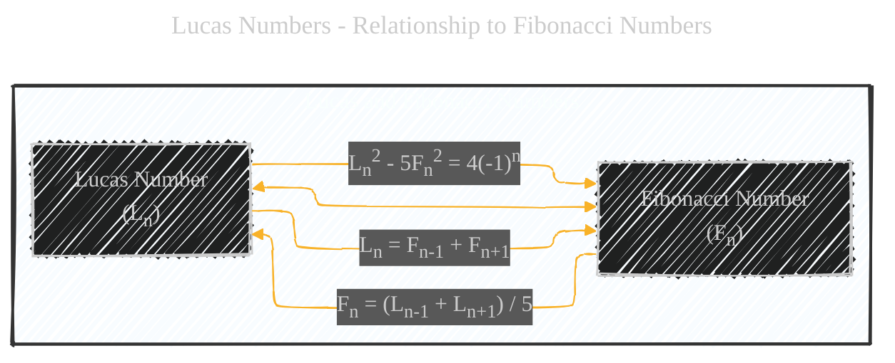
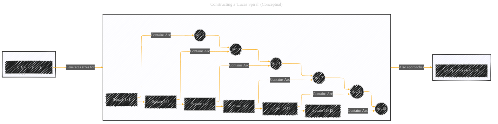

# Lucas Numbers - A Diagrammatic Guide
> **Disclaimer:**
>
> This document contains my personal notes on the topic,
> compiled from publicly available documentation and various cited sources.
> The materials are intended for educational purposes, personal study, and reference.
> The content is dual-licensed:
> 1. **MIT License:** Applies to all code implementations (Swift, Mermaid, and other programming languages).
> 2. **Creative Commons Attribution 4.0 International License (CC BY 4.0):** Applies to all non-code content, including text, explanations, diagrams, and illustrations.
---


Below is a comprehensive breakdown, using multiple Mermaid diagrams, mathematical formulas, and textual explanations, provides a thorough understanding of Lucas numbers, mirroring the approach we used for the Fibonacci sequence and Golden Spiral.  The diagrams help visualize the sequence, its relationship to the Golden Ratio, and its connection to the Fibonacci sequence.  The step-by-step conceptual construction of a "Lucas Spiral" clarifies how it differs from the more common Golden Spiral.


## 1. Introduction to Lucas Numbers (Definition and Sequence)

The Lucas Numbers are a sequence of integers that are closely related to the Fibonacci sequence.  The key difference lies in the starting values:

*   **Fibonacci Sequence:** Starts with 0, 1... (or sometimes 1, 1...)
*   **Lucas Sequence:** Starts with 2, 1...

The recurrence relation (the rule for generating subsequent numbers) is the *same* for both: each number is the sum of the two preceding numbers.

**Lucas Sequence:** 2, 1, 3, 4, 7, 11, 18, 29, 47, 76, ...

Here's a simple Mermaid diagram to represent the sequence:



----

## 2. Recurrence Relation (Mathematical Definition)

The Lucas numbers, denoted as *L<sub>n</sub>*, are defined by the following recurrence relation:

*   *L<sub>0</sub>* = 2
*   *L<sub>1</sub>* = 1
*   *L<sub>n</sub>* = *L<sub>n-1</sub>* + *L<sub>n-2</sub>*  for *n* > 1

This is the same recurrence relation as the Fibonacci sequence, just with different initial values. Let's write a complete formula for Lucas Numbers:
$$
L_n = \begin{cases}
2 & \text{if } n = 0 \\
1 & \text{if } n = 1 \\
L_{n-1} + L_{n-2} & \text{if } n > 1
\end{cases}
$$

----

## 3. Relationship to the Golden Ratio

Just like the Fibonacci sequence, the ratio of consecutive Lucas numbers approaches the Golden Ratio (φ ≈ 1.618) as *n* approaches infinity.

```md
3 / 1 = 3
4 / 3 = 1.333...
7 / 4 = 1.75
11 / 7 = 1.5714...
18 / 11 = 1.6363...
29 / 18 = 1.6111...
...and so on...
```
Here is the mathematical equation:

$$
\lim_{n \to \infty} \frac{L_{n+1}}{L_n} = \phi
$$

We can visualize this convergence with a Mermaid diagram:



---

## 4. Relationship to Fibonacci Numbers

There's a direct relationship between Lucas numbers and Fibonacci numbers.  Here are a few key formulas:

*   **Lucas numbers in terms of Fibonacci numbers:**

    *   *L<sub>n</sub>* = *F<sub>n-1</sub>* + *F<sub>n+1</sub>*

    This means you can calculate a Lucas number by adding the Fibonacci number *before* it and the Fibonacci number *after* it in the Fibonacci sequence.

    *   Example: *L<sub>4</sub>* = *F<sub>3</sub>* + *F<sub>5</sub>*  =>  7 = 2 + 5

*  **Fibonacci numbers in terms of Lucas numbers**:
$$F_n = \frac{L_{n-1} + L_{n+1}}{5}$$

* **Another important connection formula**:
$$L_n^2 - 5F_n^2 = 4(-1)^n$$

Let's create a flowchart to link these.



---

## 5. Binet's Formula for Lucas Numbers

Similar to the Fibonacci sequence, there's a closed-form expression for Lucas numbers called Binet's Formula:

*   *L<sub>n</sub>* = φ<sup>n</sup> + (1 - φ)<sup>n</sup>

Where φ is the Golden Ratio ( (1 + √5) / 2 ) and (1 - φ) is its conjugate ( (1 - √5) / 2 ), which can also be written as -1/φ.

This formula allows you to calculate any Lucas number directly, without needing to calculate the preceding numbers. This formula is important and different, and let write it also in the following approach:

$$
L_n = \phi^n + (-\phi)^{-n} = \left(\frac{1 + \sqrt{5}}{2}\right)^n + \left(\frac{1 - \sqrt{5}}{2}\right)^n
$$

---

## 6. Constructing a "Lucas Spiral" (Conceptual)

While there isn't a standard "Lucas Spiral" in the same way there's a Golden Spiral, we can adapt the concept.  Instead of using Fibonacci numbers for the square sizes, we use Lucas numbers. This spiral would still approximate the Golden Ratio, but it would start differently.

Here is step by step illustration of how to construct the spiral:



**Explanation of the "Lucas Spiral" Construction:**

1.  **Start:** Begin with a 1x1 square (using *L<sub>1</sub>* = 1). Unlike the Fibonacci spiral, we don't start with *two* 1x1 squares, because *L<sub>0</sub>* = 2 is handled differently (see point 3 below).
2.  **Add Squares:** Add squares with side lengths corresponding to subsequent Lucas numbers: 3x3, 4x4, 7x7, 11x11, 18x18, and so on.
3.  **Handling *L<sub>0</sub>* = 2:**  You can think of the initial 2 as representing the *area* formed by combining the initial 1x1 square with a conceptual rectangle that, together with the 1x1 square, form a larger rectangle with an area of 2. This is less visually intuitive than the Fibonacci spiral's start, which is why the "Lucas Spiral" isn't as commonly depicted.
4. **Draw Arc:** Draw the arcs inside each square.
5. **Sequence:** Linking all subgraphs.

---

## 7. Applications and Properties

*   **Cryptography:** Lucas sequences, like Fibonacci sequences, can be used in certain cryptographic algorithms.
*   **Combinatorics:** Lucas numbers appear in various counting problems in combinatorics.
*   **Divisibility Properties:** Lucas numbers have interesting divisibility properties, similar to Fibonacci numbers.

---

## 8. Key Terms and Concepts (Mind Map)


---
**Licenses:**

- **MIT License:**  [](LICENSE) - Full text in [LICENSE](LICENSE) file.
- **Creative Commons Attribution 4.0 International:** [](LICENSE-CC-BY) - Legal details in [LICENSE-CC-BY](LICENSE-CC-BY) and at [Creative Commons official site](http://creativecommons.org/licenses/by/4.0/).

---