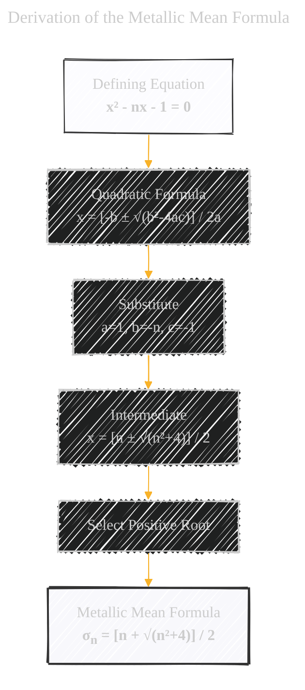
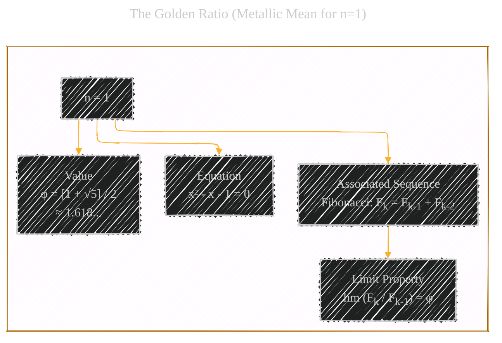
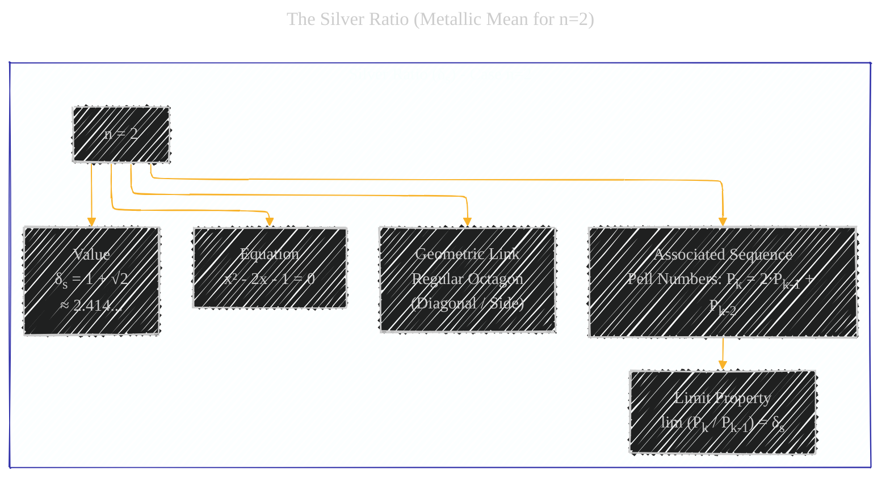
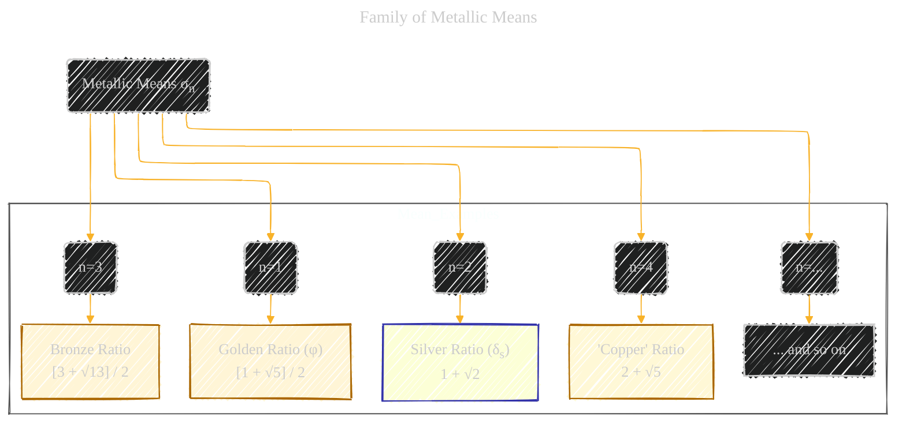

# Metallic Means - A Diagrammatic Guide 
> **Disclaimer:**
>
> This document contains my personal notes on the topic,
> compiled from publicly available documentation and various cited sources.
> The materials are intended for educational purposes, personal study, and reference.
> The content is dual-licensed:
> 1. **MIT License:** Applies to all code implementations (Swift, Mermaid, and other programming languages).
> 2. **Creative Commons Attribution 4.0 International License (CC BY 4.0):** Applies to all non-code content, including text, explanations, diagrams, and illustrations.
---

This set of diagrams and explanations covers the definition, specific examples (especially the Silver Ratio), mathematical properties, and connections to recursive sequences for the family of Metallic Means.

## 1. Introduction: What are Metallic Means?

Metallic Means (or Metallic Ratios) are a family of irrational numbers that generalize the concept of the Golden Ratio. Each Metallic Mean is defined as the positive solution to a specific quadratic equation, characterized by a natural number 'n'. They often appear as limiting ratios in certain recursively defined sequences, similar to how the Golden Ratio arises from the Fibonacci sequence.

---

## 2. Mathematical Definition

The Metallic Mean associated with the natural number *n*, often denoted as $\sigma_n$, is defined as the positive root of the quadratic equation:

$$
x^2 - nx - 1 = 0
$$

Using the quadratic formula ($x = \frac{-b \pm \sqrt{b^2 - 4ac}}{2a}$ with a=1, b=-n, c=-1):

$$
x = \frac{-(-n) \pm \sqrt{(-n)^2 - 4(1)(-1)}}{2(1)} = \frac{n \pm \sqrt{n^2 + 4}}{2}
$$

Since we are interested in the *positive* root, the n-th Metallic Mean is:

$$
\sigma_n = \frac{n + \sqrt{n^2 + 4}}{2}
$$

---

## 3. The Golden Ratio (n=1)

The most famous Metallic Mean is the Golden Ratio (φ), which corresponds to the case where **n = 1**.

*   **Equation:** $x^2 - x - 1 = 0$
*   **Value:** $\sigma_1 = \phi = \frac{1 + \sqrt{1^2 + 4}}{2} = \frac{1 + \sqrt{5}}{2} \approx 1.618...$
*   **Associated Sequence (Fibonacci):** $F_k = F_{k-1} + F_{k-2}$ (with $F_0=0, F_1=1$). The ratio of consecutive Fibonacci numbers approaches φ: $\lim_{k \to \infty} \frac{F_k}{F_{k-1}} = \phi$.

---

## 4. The Silver Ratio (n=2)

The Silver Ratio, often denoted as $\delta_s$ (delta-s), is the Metallic Mean corresponding to the case where **n = 2**.

*   **Equation:** $x^2 - 2x - 1 = 0$
*   **Value:** $\sigma_2 = \delta_s = \frac{2 + \sqrt{2^2 + 4}}{2} = \frac{2 + \sqrt{8}}{2} = \frac{2 + 2\sqrt{2}}{2} = 1 + \sqrt{2} \approx 2.414...$
*   **Associated Sequence (Pell Numbers):** $P_k = 2 P_{k-1} + P_{k-2}$ (with $P_0 = 0, P_1 = 1$). The sequence starts 0, 1, 2, 5, 12, 29, 70, ... The ratio of consecutive Pell numbers approaches $\delta_s$: $\lim_{k \to \infty} \frac{P_k}{P_{k-1}} = \delta_s$.
*   **Geometry:** The Silver Ratio appears in the regular octagon. The ratio of the long diagonal to the side length is $1 + \sqrt{2}$ ($\delta_s$).

---

## 5. Other Metallic Means (n=3, 4, ...)

Following the pattern for increasing values of *n*:

*   **Bronze Ratio (n=3):**
    *   Equation: $x^2 - 3x - 1 = 0$
    *   Value: $\sigma_3 = \frac{3 + \sqrt{3^2 + 4}}{2} = \frac{3 + \sqrt{13}}{2} \approx 3.303...$
    *   Sequence: $a_k = 3 a_{k-1} + a_{k-2}$

*   **Copper Ratio (n=4) (Note: Less standard terminology):**
    *   Equation: $x^2 - 4x - 1 = 0$
    *   Value: $\sigma_4 = \frac{4 + \sqrt{4^2 + 4}}{2} = \frac{4 + \sqrt{20}}{2} = 2 + \sqrt{5} \approx 4.236...$
    *   Sequence: $a_k = 4 a_{k-1} + a_{k-2}$

*   ...and so on for n = 5, 6, ...

---

## 6. General Properties

Metallic means share several interesting properties:

*   **Irrational Numbers:** All metallic means ($\sigma_n$ for $n \ge 1$) are irrational numbers.
*   **Continued Fractions:** They have simple periodic continued fraction representations:
    $$
    \sigma_n = n + \frac{1}{n + \frac{1}{n + \frac{1}{n + \ddots}}} = [n; n, n, n, ...]
    $$
    For example:
    *   Golden Ratio (n=1): $\phi = [1; 1, 1, 1, ...]$
    *   Silver Ratio (n=2): $\delta_s = [2; 2, 2, 2, ...]$
*   **Algebraic Integers:** They are algebraic integers, specifically Pisot–Vijayaraghavan numbers under certain conditions.

---

## 7. Associated Recursive Sequences

Each Metallic Mean $\sigma_n$ is the limiting ratio of consecutive terms in a generalized Fibonacci-like sequence defined by:

$$
a_k = n \cdot a_{k-1} + a_{k-2}
$$

Given appropriate starting values (like $a_0 = 0, a_1 = 1$), the limit holds:

$$
\lim_{k \to \infty} \frac{a_k}{a_{k-1}} = \sigma_n = \frac{n + \sqrt{n^2 + 4}}{2}
$$

---

## 8. Summary Mind Map

This mind map brings together the core concepts related to the Silver Ratio and the broader family of Metallic Means.

---
**Licenses:**

- **MIT License:**   - Full text in [LICENSE](LICENSE) file.
- **Creative Commons Attribution 4.0 International:**  - Legal details in [LICENSE-CC-BY](LICENSE-CC-BY) and at [Creative Commons official site](http://creativecommons.org/licenses/by/4.0/).

---