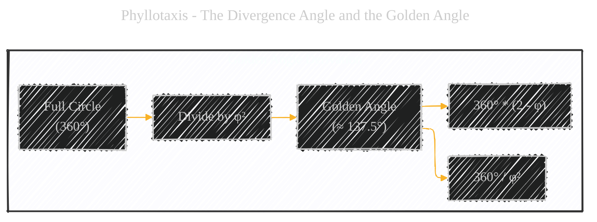
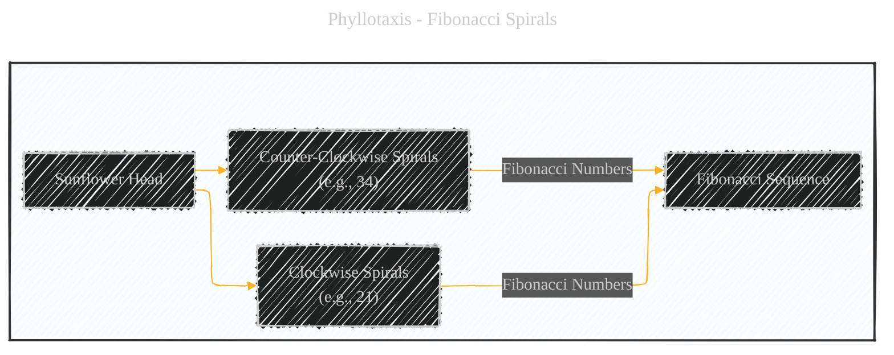

# Phyllotaxis - A Diagrammatic Guide 
> **Disclaimer:**
>
> This document contains my personal notes on the topic,
> compiled from publicly available documentation and various cited sources.
> The materials are intended for educational purposes, personal study, and reference.
> The content is dual-licensed:
> 1. **MIT License:** Applies to all code implementations (Swift, Mermaid, and other programming languages).
> 2. **Creative Commons Attribution 4.0 International License (CC BY 4.0):** Applies to all non-code content, including text, explanations, diagrams, and illustrations.
---

Below is a comprehensive breakdown, combining Mermaid diagrams, mathematical explanations, and illustrative steps, provides a clear and educational overview of Phyllotaxis, its connection to the Golden Ratio and Fibonacci sequence, and its significance in the natural world.

## 1. What is Phyllotaxis?

Phyllotaxis (from Greek *phyllon* = leaf and *taxis* = arrangement) is the study of the arrangement of leaves, petals, seeds, and other botanical elements on a plant stem.  A core principle of phyllotaxis is that these elements are often arranged in spiral patterns. These spirals are not arbitrary; they're intricately linked to the Golden Ratio (φ) and the Fibonacci sequence, just like the Golden Spiral itself. The key concept is the *divergence angle*.

----

## 2. The Divergence Angle and the Golden Angle

The *divergence angle* is the angle between successive plant organs (e.g., leaves) as they emerge around the stem.  The most common divergence angle observed in nature is the *Golden Angle*, which is approximately 137.5 degrees.

**Mathematical Relationship:**

The Golden Angle is derived from the Golden Ratio:

*   **Full Circle:** 360 degrees
*   **Golden Ratio (φ):**  Approximately 1.618
*   **Golden Angle:** 360° / φ2  ≈ 137.5°  (or, equivalently, 360° * (2 - φ) ≈ 137.5°). Since φ is equal to (1+√5)/2:

The formula for golden angle is:

$$
\text{Golden Angle} = 360^\circ \times \left(2 - \frac{1 + \sqrt{5}}{2}\right) = 360^\circ \times \left(\frac{3 - \sqrt{5}}{2}\right) \approx 137.5^\circ
$$

**Mermaid Representation of the Golden Angle:**

----

## 3. Phyllotactic Spirals

We can represent the spiral arrangement conceptually using a Mermaid flowchart. While we can't draw perfect arcs or precise angles, we can illustrate the sequential arrangement and the concept of the divergence angle.

```mermaid
---
title: "Phyllotactic Spirals"
author: "Cong Le"
version: "1.0"
license(s): "MIT, CC BY 4.0"
copyright: "Copyright (c) 2025 Cong Le. All Rights Reserved."
config:
  layout: elk
  look: handDrawn
  theme: dark
---
%%%%%%%% Mermaid version v11.4.1-b.14
%%%%%%%% Toggle theme value to `base` to activate the initilization below for the customized theme version.
%%%%%%%% Available curve styles include the following keywords:
%% basis, bumpX, bumpY, cardinal, catmullRom, linear, monotoneX, monotoneY, natural, step, stepAfter, stepBefore.
%%{
  init: {
    'graph': { 'htmlLabels': false, 'curve': 'linear' },
    'fontFamily': 'Fantasy',
    'themeVariables': {
      'primaryColor': '#ffff',
      'primaryTextColor': '#55ff',
      'primaryBorderColor': '#7c2',
      'lineColor': '#F8B229',
      'secondaryColor': '#006100',
      'tertiaryColor': '#fff'
    }
  }
}%%
graph LR
    subgraph Phyllotactic_Spirals["Phyllotactic Spirals"]
    style Phyllotactic_Spirals fill:#ddf3,stroke:#333,stroke-width:2px
        A[Center] --> B["Leaf/Seed 1"]
        B -- "Divergence Angle<br>(≈ 137.5°)" --> C["Leaf/Seed 2"]
        C -- "Divergence Angle<br>(≈ 137.5°)" --> D["Leaf/Seed 3"]
        D -- "Divergence Angle<br>(≈ 137.5°)" --> E["Leaf/Seed 4"]
        E -- "Divergence Angle<br>(≈ 137.5°)" --> F["Leaf/Seed 5"]
        F -- "Divergence Angle<br>(≈ 137.5°)" --> G["...and so on"]

    end
        Center["Center of the flower"]
```

**Explanation of the Mermaid Diagram:**

*   **`A[Center]`:** Represents the center of the plant stem (or the center of a flower head, like a sunflower).
*   **`B`, `C`, `D`, `E`, `F`, `G`:** Represent successive leaves, seeds, or other botanical elements.
*   **`Divergence Angle (≈ 137.5°)`:**  This label on the arrows indicates that each new element is placed approximately 137.5 degrees (the Golden Angle) around the stem relative to the previous element.
* The result is a formation of spirals on the plant.

---

## 4. Why the Golden Angle? (Optimal Packing)

The prevalence of the Golden Angle in phyllotaxis is believed to be due to *optimal packing*.  Here's why:

*   **Even Distribution:** The Golden Angle ensures that new leaves or seeds are placed in the *least crowded* areas.  No two leaves will ever be directly above each other, maximizing exposure to sunlight and minimizing overlap.
*   **Irrationality:** Because the Golden Angle is based on an irrational number (φ), it prevents the formation of straight radial lines.  If the angle were a simple fraction of 360° (e.g., 1/4 or 90°), you'd get straight lines of leaves, which would be inefficient.
*   **Space Efficiency:** This spiral arrangement allows the plant to pack the maximum number of elements (leaves, seeds, etc.) into a given space.

---

## 5. Fibonacci Numbers in Phyllotaxis

The Fibonacci sequence often appears in the *number* of spirals you can count in a phyllotactic pattern.  For example, in a sunflower head:

*   You might find 21 spirals going in one direction (clockwise).
*   And 34 spirals going in the other direction (counter-clockwise).
*   Or 55 and 89, or other pairs of consecutive Fibonacci numbers.

This isn't a coincidence. The Golden Angle and the Fibonacci sequence are mathematically linked, and the optimal packing generated by the Golden Angle often results in spiral counts that correspond to Fibonacci numbers.

**Mermaid Diagram (Fibonacci Spirals):**

----

## 6. Visualizing Phyllotaxis (Conceptual Steps)

Let's outline a conceptual, step-by-step approach to visualize a phyllotactic pattern (you could imagine drawing this, or creating it with a computer program):

1.  **Start at the Center:** Begin at a central point.
2.  **Place the First Element:** Place the first seed (or leaf, etc.) at an arbitrary point.
3.  **Rotate by the Golden Angle:** Rotate by approximately 137.5 degrees (clockwise or counter-clockwise).
4.  **Move Outward:** Move a small, constant distance outward from the center. This distance determines the spacing between elements.
5.  **Place the Second Element:** Place the second seed at this new position.
6.  **Repeat:** Repeat steps 3, 4, and 5. Rotate by the Golden Angle, move outward, and place the next element.
7.  **Observe Spirals:** As you continue, you'll see spiral patterns emerge. The number of spirals in each direction will often be consecutive Fibonacci numbers.

Here is the visual representation of the steps:

---

## 7. Examples in Nature

*   **Sunflowers:** The arrangement of seeds in a sunflower head is a classic example.
*   **Pinecones:** The scales on a pinecone form spirals.
*   **Pineapples:** The "eyes" on a pineapple are arranged in phyllotactic spirals.
*   **Succulents:** Many succulents exhibit clear spiral leaf arrangements.
*   **Cauliflowers:** Cauliflowers exhibit spiral features.

---

## 8. Key Terms and Concepts

---
**Licenses:**

- **MIT License:**   - Full text in [LICENSE](LICENSE) file.
- **Creative Commons Attribution 4.0 International:**  - Legal details in [LICENSE-CC-BY](LICENSE-CC-BY) and at [Creative Commons official site](http://creativecommons.org/licenses/by/4.0/).

---