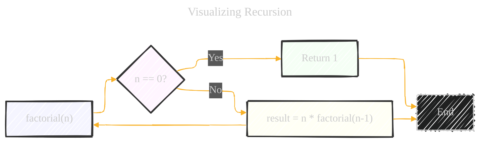
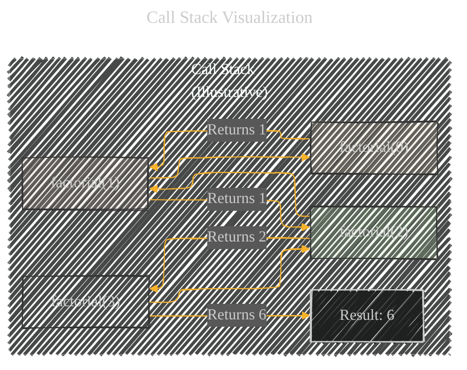
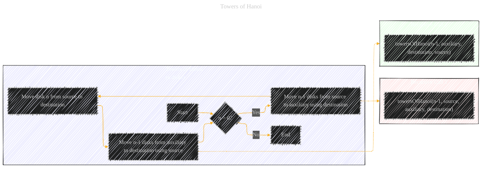

# Recursion (in Computer Science) - A Diagrammatic Guide
> **Disclaimer:**
>
> This document contains my personal notes on the topic,
> compiled from publicly available documentation and various cited sources.
> The materials are intended for educational purposes, personal study, and reference.
> The content is dual-licensed:
> 1. **MIT License:** Applies to all code implementations (Swift, Mermaid, and other programming languages).
> 2. **Creative Commons Attribution 4.0 International License (CC BY 4.0):** Applies to all non-code content, including text, explanations, diagrams, and illustrations.
---


Below is a comprehensive breakdown covers the core concepts of recursion, provides clear visualizations, code examples, comparisons, and a classic problem (Towers of Hanoi) to solidify understanding. It also highlights the practical considerations when using recursion in Swift.


## 1. Core Concept: What is Recursion?

Recursion is a powerful programming technique where a function calls *itself* within its own definition. This might sound circular (and it can be, if not handled correctly!), but it's a very elegant way to solve problems that can be broken down into smaller, self-similar subproblems.

**Key Components of a Recursive Function:**

1.  **Base Case(s):**  The condition(s) that stop the recursion. Without a base case, the function would call itself infinitely, leading to a stack overflow error. This is *crucial*.
2.  **Recursive Step:** The part of the function where it calls itself, but with a *modified* input that moves it closer to the base case.

---

## 2. Visualizing Recursion (Mermaid Flowchart)

Let's visualize a simple example: calculating the factorial of a number.  The factorial of a non-negative integer `n`, denoted by `n!`, is the product of all positive integers less than or equal to `n`. For example, 5! = 5 * 4 * 3 * 2 * 1 = 120.  We also define 0! = 1.




**Explanation of the Flowchart:**

*   **`A[factorial(n)]`:**  The function starts with an input `n`.
*   **`B{n == 0?}`:**  This is the *base case* check. If `n` is 0, we've reached the end of the recursion.
*   **`C[Return 1]`:**  If `n` is 0, the function returns 1 (because 0! = 1).
*   **`D[result = n * factorial(n-1)]`:**  This is the *recursive step*.  If `n` is not 0, the function calculates `n` multiplied by the factorial of `n-1`.  Notice how it calls `factorial` again, but with a smaller input (`n-1`).  This is what moves us closer to the base case.
*    Arrows connecting back `D` to `A`, `C` and `D` to `E`: Shows the relationship of each step of the recursive process.

---

## 3. Code Example (Swift)

Here's the factorial function implemented recursively in Swift:

```swift
func factorial(n: Int) -> Int {
    // Base case: factorial of 0 is 1
    if n == 0 {
        return 1
    } else {
        // Recursive step: n! = n * (n-1)!
        return n * factorial(n: n - 1)
    }
}

// Example usage:
let result = factorial(n: 5)
print(result) // Output: 120
```

**Explanation of the Swift Code:**

*   The code directly mirrors the flowchart.  The `if n == 0` block is the base case, and the `else` block contains the recursive step.
*   The `factorial(n: n - 1)` call is where the function calls itself with a smaller input.

## 4. Call Stack Visualization

Understanding the call stack is vital for grasping recursion. The call stack is a data structure that keeps track of active function calls. When a function calls itself, a new *frame* is added to the stack. When a function returns, its frame is removed.

Let's trace the execution of `factorial(n: 3)`:

```md
1. factorial(3) is called.
   - n is not 0.
   - Calls factorial(2).  // Frame for factorial(3) is on the stack.

2. factorial(2) is called.
   - n is not 0.
   - Calls factorial(1).  // Frames for factorial(3) and factorial(2) are on the stack.

3. factorial(1) is called.
   - n is not 0.
   - Calls factorial(0).  // Frames for factorial(3), factorial(2), and factorial(1) are on the stack.

4. factorial(0) is called.
   - n IS 0 (base case!).
   - Returns 1.  // Frame for factorial(0) is removed from the stack.

5. factorial(1) receives the return value 1.
   - Calculates 1 * 1 = 1.
   - Returns 1.   // Frame for factorial(1) is removed from the stack.

6. factorial(2) receives the return value 1.
   - Calculates 2 * 1 = 2.
   - Returns 2.   // Frame for factorial(2) is removed from the stack.

7. factorial(3) receives the return value 2.
   - Calculates 3 * 2 = 6.
   - Returns 6.   // Frame for factorial(3) is removed from the stack.

// The call stack is now empty, and the final result (6) is returned.
```

Here's the visual representation of the call stack:



----

## 5. Another Example: Fibonacci Sequence

The Fibonacci sequence itself is inherently recursive. Let's implement it recursively in Swift:

```swift
func fibonacci(n: Int) -> Int {
    // Base cases:
    if n == 0 {
        return 0
    } else if n == 1 {
        return 1
    } else {
        // Recursive step:
        return fibonacci(n: n - 1) + fibonacci(n: n - 2)
    }
}

// Example usage:
print(fibonacci(n: 6)) // Output: 8
```

**Explanation:**

*   **Base Cases:**  `fibonacci(0)` is 0, and `fibonacci(1)` is 1.
*   **Recursive Step:**  `fibonacci(n)` is the sum of the previous two Fibonacci numbers: `fibonacci(n-1)` and `fibonacci(n-2)`. This example demonstrates *multiple* recursive calls within the same function.

----

## 6. Recursion vs. Iteration

Every recursive function can (theoretically) be rewritten using iteration (loops).  Sometimes, the iterative solution is more efficient.  However, recursion often leads to more concise and readable code, especially for problems that naturally fit the recursive structure.

**Factorial (Iterative Version in Swift):**

```swift
func factorialIterative(n: Int) -> Int {
    var result = 1
    for i in 1...n {
        result *= i
    }
    return result
}
```

**Fibonacci (Iterative Version in Swift):**

```swift
func fibonacciIterative(n: Int) -> Int {
    if n <= 1 {
        return n
    }
    var a = 0
    var b = 1
    var result = 0
    for _ in 2...n {
        result = a + b
        a = b
        b = result
    }
    return result
}
```

**Comparison Table:**

| Feature         | Recursion                                  | Iteration                                 |
| --------------- | ------------------------------------------ | ----------------------------------------- |
| Readability     | Often more readable for recursive problems | Can be less readable for complex logic |
| Efficiency      | Can be less efficient (function call overhead) | Generally more efficient                |
| Stack Overflow  | Potential for stack overflow with deep recursion | No stack overflow risk                |
| Space Complexity| Can use more memory (call stack)          | Generally uses less memory              |
| Code Size       | Often more concise                         | Can be more verbose                       |

----

## 7. Tail Recursion

Tail recursion is a special form of recursion where the recursive call is the *very last* operation performed in the function. Some compilers (including, to some extent, Swift's compiler) can optimize tail-recursive functions, eliminating the stack overhead and making them as efficient as iteration. This optimization is called *Tail Call Optimization (TCO)*.

**Example (Tail-Recursive Factorial - *not* ideal in Swift):**

```swift
func tailRecursiveFactorial(n: Int, accumulator: Int = 1) -> Int {
    if n == 0 {
        return accumulator
    } else {
        return tailRecursiveFactorial(n: n - 1, accumulator: accumulator * n)
    }
}
```

**Explanation:**

*   The `accumulator` parameter keeps track of the intermediate result.
*   The recursive call `tailRecursiveFactorial(n: n - 1, accumulator: accumulator * n)` is the *last* thing that happens.

**Important Note about Swift and TCO:**  While Swift *can* perform TCO, it's not *guaranteed* in all cases, and it's not as heavily optimized as in some other functional languages.  Therefore, even tail-recursive functions in Swift *might* still lead to stack overflows if the recursion is too deep.  For truly large inputs, iterative solutions are generally preferred in Swift for performance and safety.

---

## 8. Common Recursive Problems

Here are some classic problems often solved using recursion:

*   **Tree Traversals:**  (Pre-order, in-order, post-order) - Very natural fit for recursion.
*   **Graph Traversals:** (Depth-First Search - DFS)
*   **Divide and Conquer Algorithms:** (Merge Sort, Quick Sort)
*   **Fractals:** (Generating Mandelbrot set, Sierpinski triangle, etc.)
*   **Backtracking Problems:** (Solving Sudoku, N-Queens problem)
*  **Towers of Hanoi**

----

## 9. Towers of Hanoi (Example and Explanation)

The Towers of Hanoi is a classic mathematical puzzle that demonstrates recursion beautifully.

**The Problem:**

You have three rods (let's call them A, B, and C) and a number of disks of different sizes, which can slide onto any rod. The puzzle starts with the disks in a neat stack in ascending order of size on one rod (say, rod A), the smallest at the top, thus making a conical shape.

The objective of the puzzle is to move the entire stack to another rod (say, rod C), obeying the following simple rules:

1.  Only one disk can be moved at a time.
2.  Each move consists of taking the upper disk from one of the stacks and placing it on top of another stack or on an empty rod.
3.  No larger disk may be placed on top of a smaller disk.

**Recursive Solution (Swift):**

```swift
func towersOfHanoi(n: Int, source: Character, destination: Character, auxiliary: Character) {
    if n > 0 {
        // Move n-1 disks from source to auxiliary rod, using destination as auxiliary
        towersOfHanoi(n: n - 1, source: source, destination: auxiliary, auxiliary: destination)

        // Move the nth disk from source to destination
        print("Move disk \(n) from \(source) to \(destination)")

        // Move n-1 disks from auxiliary to destination, using source as auxiliary
        towersOfHanoi(n: n - 1, source: auxiliary, destination: destination, auxiliary: source)
    }
}

// Example Usage:
towersOfHanoi(n: 3, source: "A", destination: "C", auxiliary: "B")

```

**Explanation of the `towersOfHanoi` function:**

1.  **Base Case:** If `n` is 0 (no disks to move), the function does nothing (implicitly returning).
2.  **Recursive Steps:**
    *   **`towersOfHanoi(n: n - 1, source: source, destination: auxiliary, auxiliary: destination)`:**  This line recursively moves `n-1` disks from the `source` rod to the `auxiliary` rod, using the `destination` rod as a temporary holding place. This is the key insight: to move the largest disk (disk `n`), we first need to get the smaller disks out of the way.
    *   **`print("Move disk \(n) from \(source) to \(destination)")`:**  This line represents moving the largest disk (disk `n`) from the `source` rod to the `destination` rod. This is the only actual disk move that happens in this call of the function.
    *   **`towersOfHanoi(n: n - 1, source: auxiliary, destination: destination, auxiliary: source)`:** This line recursively moves the `n-1` disks from the `auxiliary` rod to the `destination` rod, using the `source` rod as the temporary holding place. Now the largest disk is in its final position, and we just need to get the smaller disks on top of it.

**Output of `towersOfHanoi(n: 3, source: "A", destination: "C", auxiliary: "B")`:**

```
Move disk 1 from A to C
Move disk 2 from A to B
Move disk 1 from C to B
Move disk 3 from A to C
Move disk 1 from B to A
Move disk 2 from B to C
Move disk 1 from A to C
```

Here is the visual representation:




The key takeaways are the base case (`n > 0`), and the two recursive calls within the function, which elegantly solve the subproblems.

----

## 10. Key terms and Concept


---
**Licenses:**

- **MIT License:**  [](LICENSE) - Full text in [LICENSE](LICENSE) file.
- **Creative Commons Attribution 4.0 International:** [](LICENSE-CC-BY) - Legal details in [LICENSE-CC-BY](LICENSE-CC-BY) and at [Creative Commons official site](http://creativecommons.org/licenses/by/4.0/).

---
