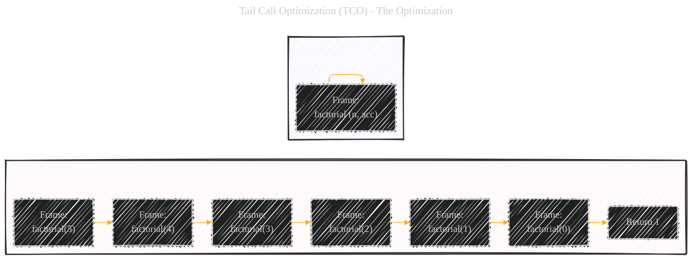

# Tail Call Optimization (TCO) - A Diagrammatic Guide 
> **Disclaimer:**
>
> This document contains my personal notes on the topic,
> compiled from publicly available documentation and various cited sources.
> The materials are intended for educational purposes, personal study, and reference.
> The content is dual-licensed:
> 1. **MIT License:** Applies to all code implementations (Swift, Mermaid, and other programming languages).
> 2. **Creative Commons Attribution 4.0 International License (CC BY 4.0):** Applies to all non-code content, including text, explanations, diagrams, and illustrations.
---


Below is a comprehensive breakdown covers the what, why, and how of Tail Call Optimization, using visual diagrams and code examples to illustrate the key concepts. It highlights the nuances of TCO in Swift, emphasizing the lack of a guarantee and the importance of understanding the potential for stack overflow if TCO is not applied. The use of multiple diagrams, mathematical concepts and illustrative examples, ensures the information is accessible and easy to understand.


## 1. What is a Tail Call? (Conceptual Explanation and Diagram)

Before diving into optimization, we need to understand what a "tail call" *is*. A tail call occurs when a function's *very last* action is to call *another* function (or itself, in the case of recursion). Importantly, after that call, the original function does *nothing* else – it doesn't perform any calculations, modify variables, or have any further instructions. It simply returns whatever the called function returns.


**Explanation of the Diagram:**

*   **`Function A`**:  Represents any function.
*   **`A1`**: Represents any work that the function might do *before* the potential tail call.
*   **`A2`**:  This is the crucial decision point.  Is the *last* action a function call?
*   **`Yes` (Tail Call):** If the last action is to call `Function B`, and `Function A` does nothing further except return `Function B`'s result, this is a tail call.
*   **`No` (Not a Tail Call):**  If `Function A` does *anything* after calling another function (even something as simple as adding 1 to the result), it's *not* a tail call.
*   **`Function B`**: Represents the function being called in the tail position.

---

## 2. Tail Call Optimization (TCO) - The Optimization

TCO is a compiler optimization. When a compiler detects a tail call, it can *reuse* the current function's stack frame instead of creating a new one for the called function. This has two major benefits:

*   **Stack Overflow Prevention:** In recursive functions, without TCO, each recursive call adds a new stack frame.  Deep recursion can lead to a stack overflow error (running out of stack memory). TCO prevents this because the stack doesn't grow with each call.
*   **Performance Improvement:**  Creating and destroying stack frames has a (small) overhead. TCO avoids this overhead, making tail-recursive functions potentially as efficient as loops.



**Explanation of the Diagram:**

*   **`Without_TCO`**: This illustrates the typical stack behavior for a recursive function *without* TCO. Each call to `factorial` creates a new stack frame, leading to potential stack overflow for large inputs.
*   **`With_TCO`**:  This shows how TCO optimizes the stack.  The `factorial` function's frame is *reused* for each "recursive" call.  The `acc` (accumulator) parameter is the key to making this tail-recursive (explained below).

----

## 3. Tail Recursion: TCO's Best Friend

TCO is most beneficial in the context of *tail recursion*. Tail recursion is a special case of recursion where the recursive call is a tail call.  This allows the compiler to transform the recursion into a loop-like structure, avoiding stack growth.

**Example: Factorial (Non-Tail Recursive - Swift)**

```swift
func factorial(n: Int) -> Int {
    if n == 0 {
        return 1
    } else {
        return n * factorial(n: n - 1) // NOT a tail call
    }
}
```

This is *not* tail-recursive. The last operation is `n * factorial(n: n - 1)`. After `factorial(n: n - 1)` returns, the result must be multiplied by `n`.

**Example: Factorial (Tail Recursive - Swift)**

```swift
func factorialTail(n: Int, acc: Int = 1) -> Int {
    if n == 0 {
        return acc
    } else {
        return factorialTail(n: n - 1, acc: acc * n) // Tail call!
    }
}
```

This *is* tail-recursive.  We've introduced an accumulator parameter (`acc`). The *last* operation is the call to `factorialTail` itself.  No further calculation is done after the recursive call. All the work have finished prior calling the `factorialTail` function.

----

## 4. TCO in Swift: The Good, the Bad, and the Workaround

Here's the crucial point about Swift and TCO:

*   **Good (Optimization is Available) :** The Swift compiler *can* perform TCO, particularly in optimized builds (`-O`). Optimization is built into the Swift compiler, but there's no explicit keyword to *guarantee* it.
*   **Bad (No Guarantee):** Unlike some functional languages (e.g., Scheme), Swift *does not guarantee* TCO. There's no language-level enforcement. This is a very important thing to remember.
*   **Workaround (Manual Transformation):** If you absolutely need the guarantee of loop-like behavior (and stack safety), you can manually transform a tail-recursive function into a loop.

**Example: Factorial (Iterative - Swift - "Manual TCO")**

```swift
func factorialIterative(n: Int) -> Int {
    var acc = 1
    var currentN = n
    while currentN > 0 {
        acc *= currentN
        currentN -= 1
    }
    return acc
}
```

This version uses a `while` loop and achieves the same result as the tail-recursive version, but with guaranteed constant stack space.

---

## 5. Why Doesn't Swift *Guarantee* TCO?

There are several reasons for this design choice:

*   **Debugging:**  Retaining stack frames makes debugging easier.  You can see the full call history.  With TCO, the stack trace would be much shorter (and potentially less informative).
*   **Interoperability:**  Swift interoperates with Objective-C, which doesn't have TCO.
*   **Complexity:**  Guaranteeing TCO can add complexity to the compiler.
*   **Developer Control:**  The Swift designers likely wanted to give developers more control over performance characteristics.  If you *need* the loop-like behavior, you can write it explicitly.

---

## 6. Illustrative Use Cases

Here are the breakdowns of TCO's use cases and benefits with different scenarios:


**Explanation:**

*   **Recursive Algorithms:** This is the classic use case. Many algorithms are naturally recursive.
*   **Functional Programming:** Functional languages often encourage recursion.
*   **Compilers/Interpreters:** TCO is used internally in compilers and interpreters.
*   **State Machines:** State transitions can be modeled as function calls.
*   **Event Loops:** Asynchronous event handling can use tail calls.

---

## 7. TCO vs. Non-TCO: Performance Comparison (Illustrative)

While we can't run benchmarks directly here, we can *conceptually* illustrate the performance difference:


*   **Large Input:**  The differences become more pronounced with larger inputs (deeper recursion).
*   **Non-Tail Recursive:**  High stack usage, potential for stack overflow, and slower execution due to stack frame overhead.
*   **Tail Recursive (with TCO):** Constant stack usage (like a loop), no risk of stack overflow, and faster execution.

---

## 8. Key Terms and Summary


---
**Licenses:**

- **MIT License:**  [](LICENSE) - Full text in [LICENSE](LICENSE) file.
- **Creative Commons Attribution 4.0 International:** [](LICENSE-CC-BY) - Legal details in [LICENSE-CC-BY](LICENSE-CC-BY) and at [Creative Commons official site](http://creativecommons.org/licenses/by/4.0/).

---