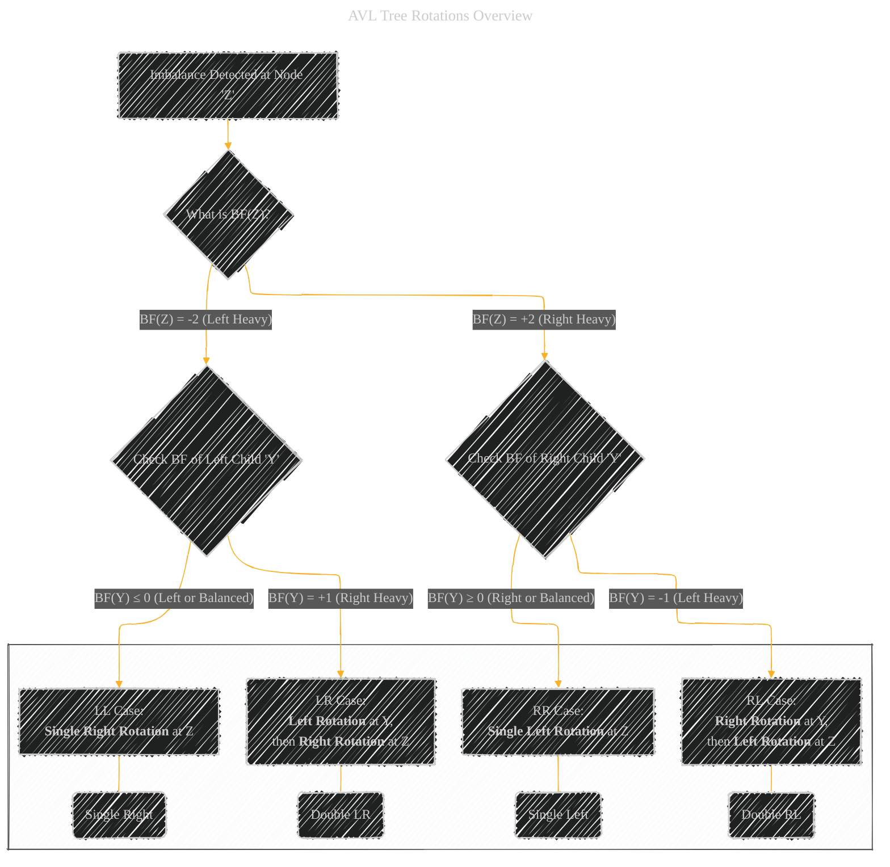
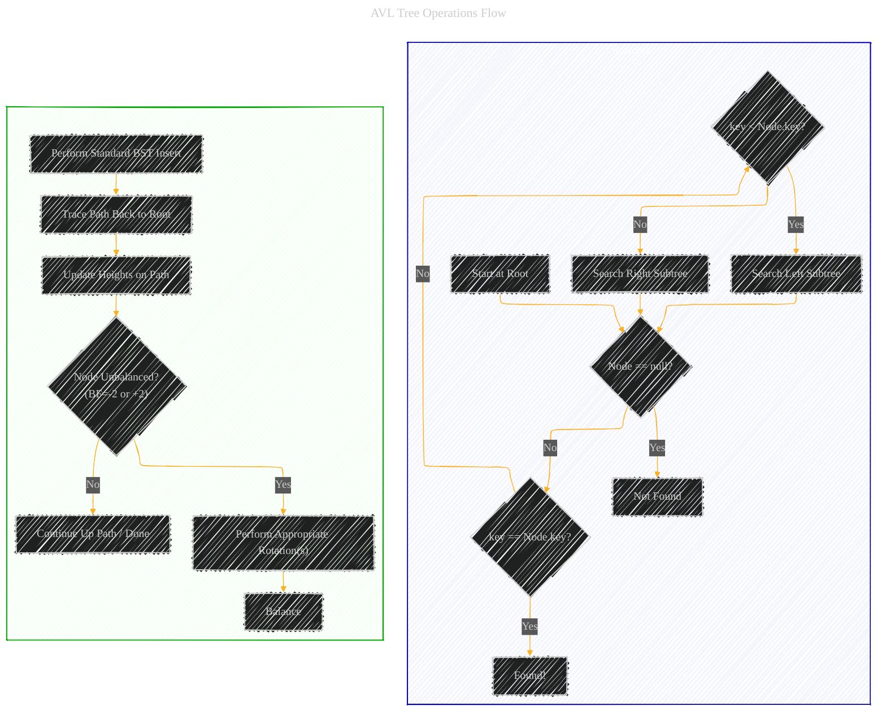

# AVL Trees - A Diagrammatic Guide 
> **Disclaimer:**
>
> This document contains my personal notes on the topic,
> compiled from publicly available documentation and various cited sources.
> The materials are intended for educational purposes, personal study, and reference.
> The content is dual-licensed:
> 1. **MIT License:** Applies to all code implementations (Swift, Mermaid, and other programming languages).
> 2. **Creative Commons Attribution 4.0 International License (CC BY 4.0):** Applies to all non-code content, including text, explanations, diagrams, and illustrations.
---

## 1. Introduction: What are AVL Trees?

An AVL Tree, named after its inventors **A**delson-**V**elsky and **L**andis, is a self-balancing Binary Search Tree (BST). In an AVL tree, the heights of the two child subtrees of any node differ by at most one. This height-balancing property ensures that the tree remains relatively balanced, preventing scenarios where the tree degenerates into a linked list (which would lead to O(n) performance for operations). This balance guarantees that major operations like search, insertion, and deletion have a worst-case time complexity of O(log n), where n is the number of nodes in the tree.

---

## 2. Mathematical Definition: The Balance Factor

The core of an AVL tree's self-balancing property lies in the **Balance Factor (BF)**. For any node in the tree, the balance factor is defined as:

$$
\text{BalanceFactor}(node) = \text{Height}(node.\text{rightSubtree}) - \text{Height}(node.\text{leftSubtree})
$$

*Note: Sometimes the definition is swapped (Left Height - Right Height). The key is consistency.*

For a tree to be considered an AVL tree, the balance factor of **every** node must be within the set {-1, 0, 1}.

*   **BF = -1:** The left subtree is one level deeper than the right subtree.
*   **BF = 0:** The left and right subtrees have the same height.
*   **BF = +1:** The right subtree is one level deeper than the left subtree.

If any node has a balance factor outside this range (e.g., -2 or +2), the tree is unbalanced, and rotations must be performed to restore the AVL property. The height of an empty subtree is typically defined as -1 or 0 (consistency is key). If using -1 for empty trees: `Height(null) = -1`.

---

## 3. Rotations: Maintaining Balance

When an insertion or deletion causes a node's balance factor to become -2 or +2, the tree must be rebalanced using **rotations**. Rotations are local transformations that change the structure of the tree to restore the height balance while preserving the Binary Search Tree property. There are four types of imbalances that require specific rotations:

1.  **Left-Left (LL) Case (BF = -2):** An insertion into the left subtree of the left child causes the imbalance. A **Single Right Rotation** is performed.
2.  **Right-Right (RR) Case (BF = +2):** An insertion into the right subtree of the right child causes the imbalance. A **Single Left Rotation** is performed.
3.  **Left-Right (LR) Case (BF = -2):** An insertion into the right subtree of the left child causes the imbalance. A **Double Rotation (Left rotation followed by Right rotation)** is performed.
4.  **Right-Left (RL) Case (BF = +2):** An insertion into the left subtree of the right child causes the imbalance. A **Double Rotation (Right rotation followed by Left rotation)** is performed.

*(Detailed diagrams of each rotation would typically follow here, showing the node movements, but are omitted for brevity in this overview structure).*

---

## 4. Operations

AVL trees support the standard BST operations, but with modifications to maintain balance after insertions and deletions.

*   **Search:** Identical to standard BST search. Since the tree is balanced, the height is logarithmic, guaranteeing **O(log n)** time complexity.
*   **Insertion:**
    1.  Insert the new node as in a standard BST.
    2.  Travel back up the tree from the newly inserted node towards the root.
    3.  For each node on the path, update its height.
    4.  Check the balance factor of each node on the path.
    5.  If an imbalance is found (BF = -2 or +2), perform the appropriate rotation (LL, RR, LR, or RL) based on the case. Note that only *one* rotation (single or double) is needed to fix the entire imbalance caused by an insertion.
    6.  The overall time complexity is **O(log n)** (BST insertion + height updates + at most one rotation).
*   **Deletion:**
    1.  Delete the node as in a standard BST (handling cases with 0, 1, or 2 children). If a node with two children is deleted, it's typically replaced by its inorder successor or predecessor.
    2.  Travel back up the tree from the *parent* of the physically removed node (or the replacement node) towards the root.
    3.  For each node on the path, update its height.
    4.  Check the balance factor of each node on the path.
    5.  If an imbalance is found, perform the appropriate rotation. Unlike insertion, deletion might require *multiple* rotations along the path back to the root to restore balance.
    6.  The overall time complexity is **O(log n)** (BST deletion + height updates + potentially multiple rotations up the path).

---
**Licenses:**

- **MIT License:**   - Full text in [LICENSE](LICENSE) file.
- **Creative Commons Attribution 4.0 International:**  - Legal details in [LICENSE-CC-BY](LICENSE-CC-BY) and at [Creative Commons official site](http://creativecommons.org/licenses/by/4.0/).

---