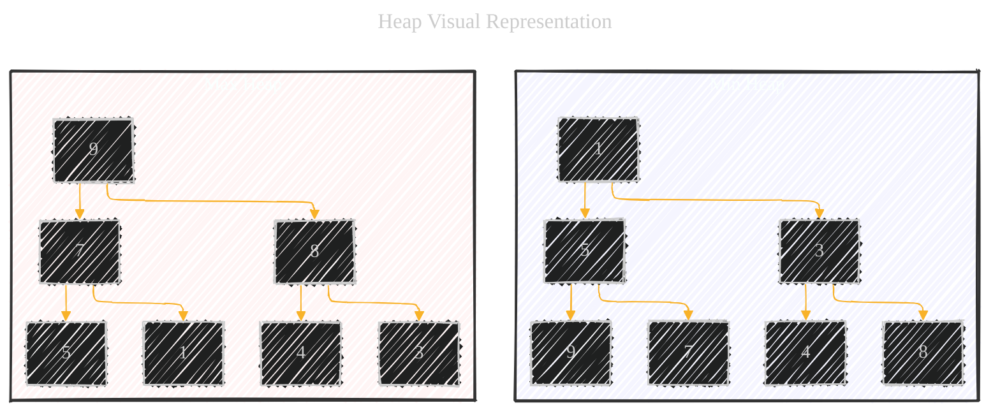
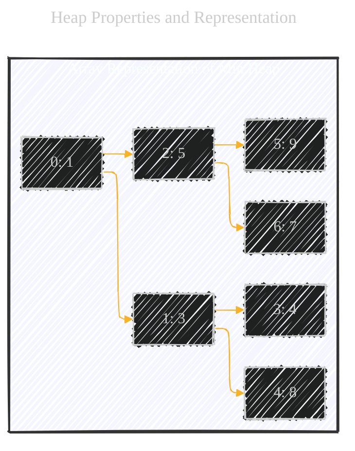
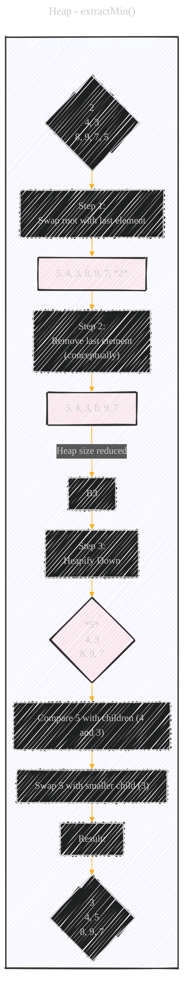

# Heap - A Diagrammatic Guide 
> **Disclaimer:**
>
> This document contains my personal notes on the topic,
> compiled from publicly available documentation and various cited sources.
> The materials are intended for educational purposes, personal study, and reference.
> The content is dual-licensed:
> 1. **MIT License:** Applies to all code implementations (Swift, Mermaid, and other programming languages).
> 2. **Creative Commons Attribution 4.0 International License (CC BY 4.0):** Applies to all non-code content, including text, explanations, diagrams, and illustrations.
---


Below is a comprehensive explanation, combining visual diagrams, step-by-step examples, and mathematical properties, provides a thorough understanding of the heap data structure.


----


## 1. What is a Heap? (Conceptual Overview)

A heap is a specialized tree-based data structure that satisfies the *heap property*. This property dictates the relationship between parent and child nodes. There are two main types of heaps:

*   **Max Heap:** In a max heap, the value of each node is greater than or equal to the value of its children. The largest element is always at the root.
*   **Min Heap:** In a min heap, the value of each node is less than or equal to the value of its children. The smallest element is always at the root.

Heaps are *not* fully sorted. They are *partially ordered* in a way that efficiently maintains the largest (or smallest) element at the root. This makes them perfect for priority queues.

---

## 2. Visual Representation

Let's start with a visual representation of both a min-heap and a max-heap:



**Explanation of the Diagram:**

*   **Nodes:** Each circle represents a node in the heap, containing a value.
*   **Edges:** The lines (edges) connect parent nodes to their child nodes.
*   **Min Heap:** Observe that in the Min Heap, each parent's value is less than or equal to its children's values. The root (1) is the smallest.
*   **Max Heap:** In the Max Heap, each parent's value is greater than or equal to its children's values. The root (9) is the largest.
* Notice, the nodes in the same level are not necessary sorted.

---

## 3. Heap Properties and Representation

*   **Complete Binary Tree:** Heaps are typically implemented as *complete binary trees*.  This means:
    *   All levels of the tree are fully filled, except possibly the last level.
    *   The last level is filled from left to right.  This "completeness" is crucial for efficient array representation.

*   **Array Representation:** Although heaps are conceptually trees, they are very efficiently stored in arrays.  The complete binary tree property makes this possible.  Here's how the mapping works:
    *   The root is at index 0.
    *   For a node at index `i`:
        *   Its left child is at index `2i + 1`.
        *   Its right child is at index `2i + 2`.
        *   Its parent is at index `floor((i - 1) / 2)`.

Let's visualize the array representation of the Min Heap from above:

```
Array: [1, 3, 5, 4, 8, 9, 7]

Index:  0  1  2  3  4  5  6
```



**Explanation:**

*   The Mermaid diagram now shows the array indices corresponding to each node in the heap. This clarifies how the tree structure is flattened into a linear array.

---

## 4. Heap Operations

The core operations on a heap are:

*   **`insert(value)`:**  Adds a new value to the heap while maintaining the heap property.
*   **`extractMin()` (or `extractMax()`):** Removes and returns the root element (minimum for min-heap, maximum for max-heap) while maintaining the heap property.
*   **`peek()`:** Returns the root element without removing it.
*   **`heapify(array)`:**  Transforms an arbitrary array into a valid heap.
*   **`delete(node)`:** Remove the targeted node.

Let's illustrate the `insert` and `extractMin` operations step-by-step, using a min-heap as an example.

### 4.1.  `insert(value)` - Step-by-Step

**Scenario:**  We'll insert the value `2` into the following min-heap:

```
Initial Heap (Array): [3, 4, 5, 8, 9, 7]
```

1.  **Add to the End:**  Add the new value to the end of the array (next available position in the complete tree).

    ```
    Array: [3, 4, 5, 8, 9, 7, 2]
    ```

2.  **Heapify Up (Bubble Up):**  Compare the new value with its parent. If the new value is smaller (for a min-heap), swap them.  Continue this process up the tree until the heap property is restored.

    *   `2` (index 6) is smaller than its parent `7` (index 2), so swap them.
        ```
        Array: [3, 4, 2, 8, 9, 7, 5]
        ```
    *   `2` (index 2) is smaller than its parent `3` (index 0), so swap them.
        ```
        Array: [2, 4, 3, 8, 9, 7, 5]
        ```
    *   Now `2` is at the root, and the heap property is restored.


### 4.2. `extractMin()` - Step-by-Step

**Scenario:**  We'll extract the minimum value from the heap we just created:

```
Initial Heap (Array): [2, 4, 3, 8, 9, 7, 5]
```

1.  **Swap with Last Element:** Swap the root (minimum element) with the last element in the array.

    ```
    Array: [5, 4, 3, 8, 9, 7, 2]  (Conceptually, we've removed 2)
    ```

2.  **Remove Last Element:**  Decrease the size of the heap (conceptually remove the last element – the original minimum – from the array).

    ```
    Array: [5, 4, 3, 8, 9, 7]  (Heap size reduced)
    ```

3.  **Heapify Down (Bubble Down):**  Start at the new root (which was the last element). Compare it with its children. If it's larger than either child (for a min-heap), swap it with the *smaller* of the two children.  Continue this down the tree until the heap property is restored.

    *   `5` (index 0) is larger than both its children (`4` at index 1 and `3` at index 2). Swap with the smaller child, `3`.
        ```
        Array: [3, 4, 5, 8, 9, 7]
        ```
    *   Now `3` is at the root.  Its children are `4` and `5`.  The heap property is restored.



### 4.3 Delete

1.  **Locate and Swap:** Find the index of the node you want to remove. Swap this node with the last element in the heap.

2.  **Decrease Heap Size:** Decrease the size of the heap by 1. This effectively "removes" the last element (which is now the node you wanted to delete).

3.  **Heapify (Up or Down):** Now, you need to restore the heap property.

    *   **If the swapped node is smaller** than its parent (in a min-heap) or larger than its parent (in a max-heap), you need to `heapifyUp` (bubble up) from its current position.
    *   **If the swapped node is larger** than one of its children (in a min-heap) or smaller than one of its children (in a max-heap), you need to `heapifyDown` (bubble down) from its current position.

---

## 5. `heapify(array)` - Building a Heap

The `heapify` operation takes an arbitrary array and rearranges it to satisfy the heap property.  There are two main approaches:

*   **Top-Down (using repeated `insert`):**  You could start with an empty heap and repeatedly insert elements from the array.  This is simple but less efficient.
*   **Bottom-Up (more efficient):**  This is the preferred method.  It works as follows:
    1.  Start with the last non-leaf node (parent of the last leaf).  This is at index `floor((n/2) - 1)`, where `n` is the number of elements.
    2.  `Heapify Down` (bubble down) this node.
    3.  Move to the previous node (towards the beginning of the array) and repeat `Heapify Down`.
    4.  Continue until you reach the root.

**Example:**  Let's heapify the array `[4, 1, 3, 9, 7, 5, 8]` into a min-heap.

1.  **Last non-leaf node:**  `floor((7/2) - 1) = 2`. The node at index 2 is `3`.
2.  **Heapify Down (3):** `3` is smaller than its children (`9`, `7`, `5`, `8`), so no swap is needed.
3.  **Heapify Down (1):** `1` is smaller than its children (`9`, `7`), so no swap is needed.
4.  **Heapify Down (4):** `4` is larger than `1` and `3`.  Swap with the smaller child, `1`.
    ```
    [1, 4, 3, 9, 7, 5, 8]
    ```
    Now, `4` is at index 1.  Its children are `9` and `7`.  Swap with `7`.
    ```
    [1, 7, 3, 9, 4, 5, 8]
    ```

The final min-heap is `[1, 7, 3, 9, 4, 5, 8]`.

---

## 6. Time Complexity Analysis

*   **`insert`:**  O(log n) - In the worst case, we might have to bubble up the new element all the way to the root, which takes logarithmic time in a balanced tree.
*   **`extractMin` (or `extractMax`):** O(log n) - Similar to `insert`, we might have to bubble down the new root all the way to a leaf.
*   **`peek`:** O(1) - Accessing the root is a constant-time operation.
*   **`heapify` (Bottom-Up):** O(n) - This might seem counterintuitive (since we're calling `Heapify Down` which is O(log n)), but a more careful analysis shows that the overall complexity is linear.  Most of the nodes are near the bottom of the tree, and `Heapify Down` takes less time for those nodes.
*   **`delete`**: O(logN)

---

## 7. Applications of Heaps

*   **Priority Queues:** Heaps are the ideal data structure for implementing priority queues, where elements have associated priorities, and you need to efficiently retrieve the highest (or lowest) priority element.
*   **Heap Sort:** A sorting algorithm that uses a heap.  It has O(n log n) time complexity.
*   **Graph Algorithms:**  Used in algorithms like Dijkstra's algorithm (shortest path) and Prim's algorithm (minimum spanning tree).
*   **Kth Largest/Smallest Element:**  Efficiently finding the kth largest or smallest element in a collection.
*  **Merge K Sorted Arrays**: If you have a large collection of already-sorted arrays, you can efficiently combine them into a single sorted array using a heap

---

## 8. Mathematical Representation

While there isn't a single "equation" for a heap like there is for the Golden Ratio, we can express the key relationships mathematically:

*   **Min-Heap Property:**
    ```
    For any node i:  A[parent(i)] <= A[i]
    ```
    Where `A` is the array representing the heap, and `parent(i) = floor((i - 1) / 2)`.

*   **Max-Heap Property:**
    ```
    For any node i:  A[parent(i)] >= A[i]
    ```

* **Index relations**
 For a node at index i:
     *   Its left child is at index `2i + 1`.
     *   Its right child is at index `2i + 2`.
     *   Its parent is at index `floor((i - 1) / 2)`.
*  **Heap Sort Complexity:** $O(N \log N)$


---
**Licenses:**

- **MIT License:**  [](LICENSE) - Full text in [LICENSE](LICENSE) file.
- **Creative Commons Attribution 4.0 International:** [](LICENSE-CC-BY) - Legal details in [LICENSE-CC-BY](LICENSE-CC-BY) and at [Creative Commons official site](http://creativecommons.org/licenses/by/4.0/).

---