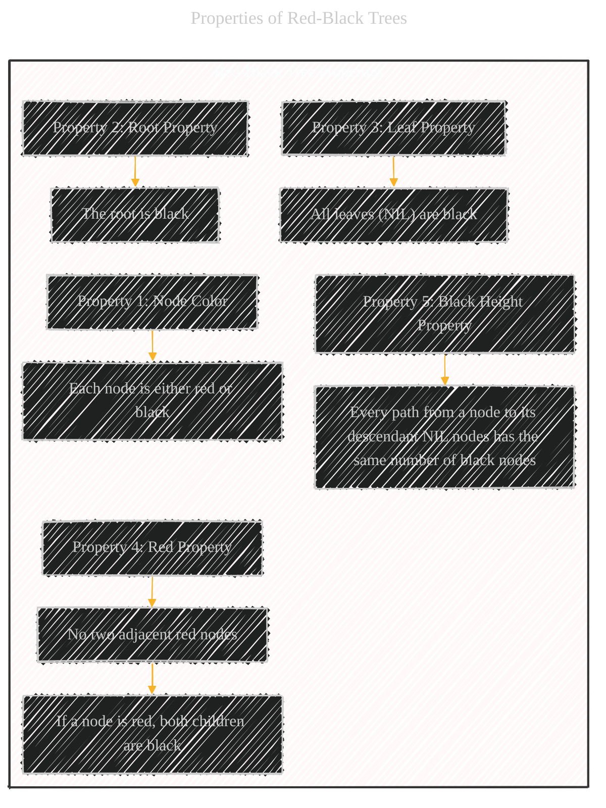
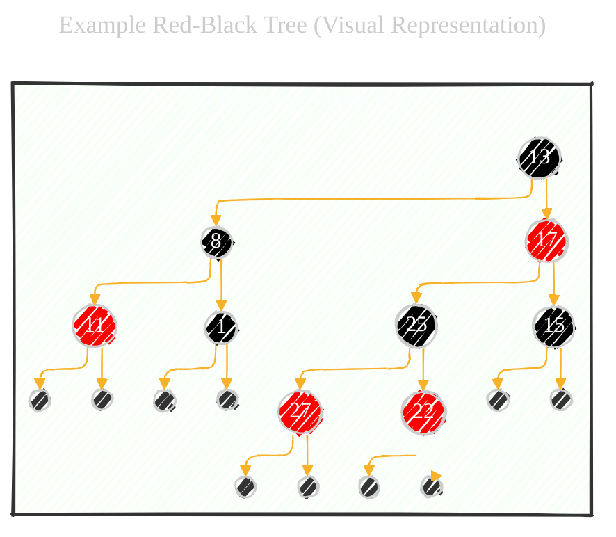
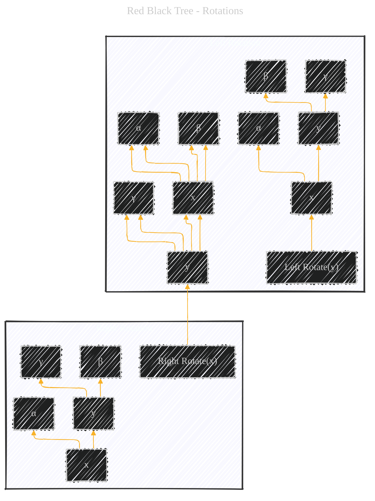
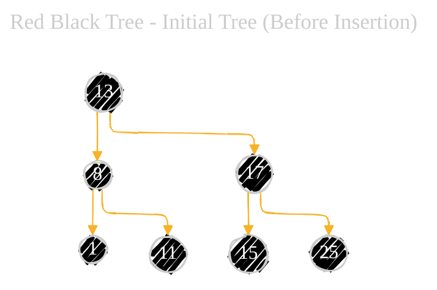
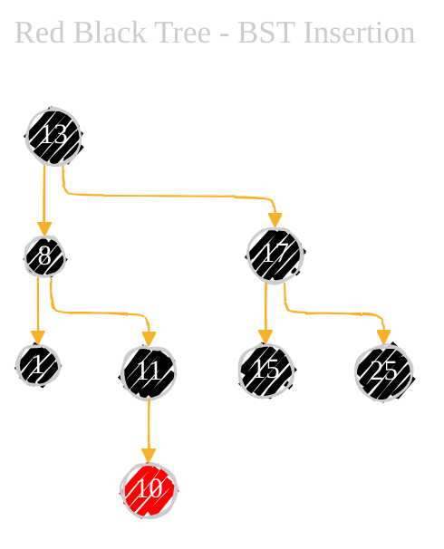
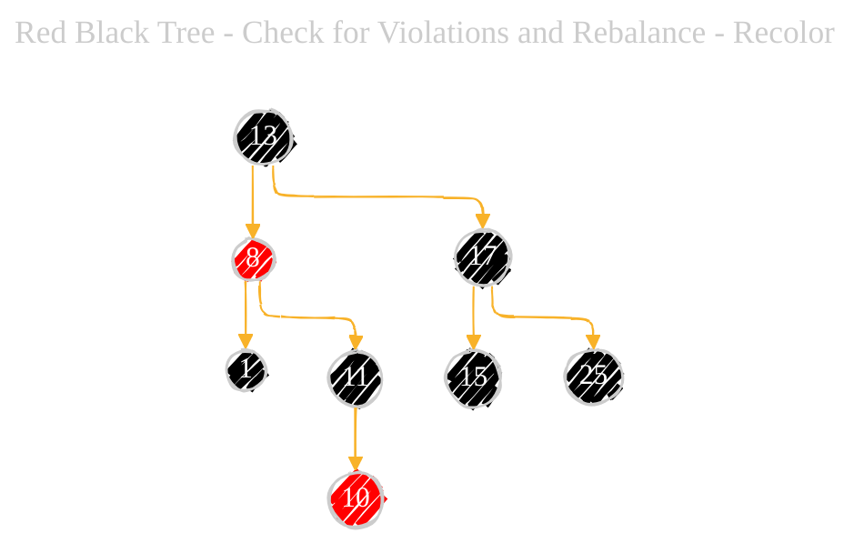
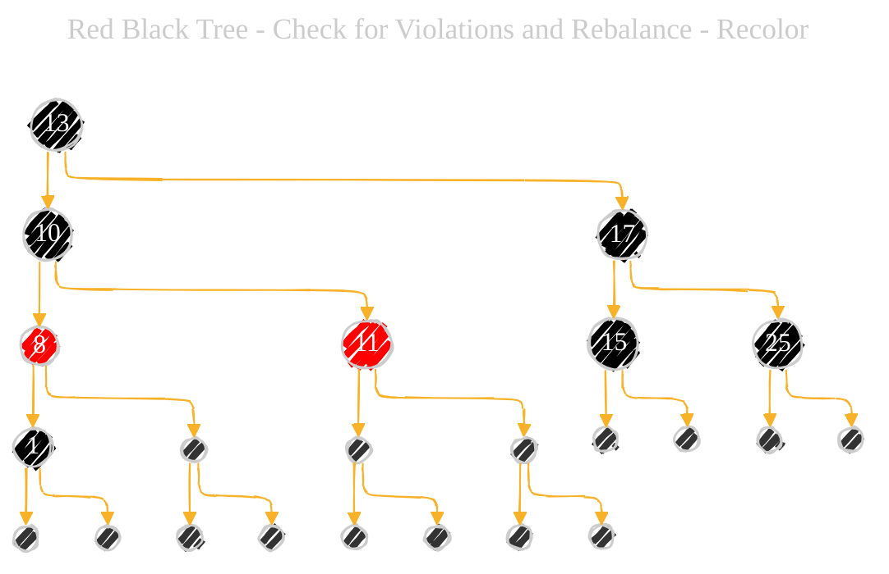

# Red Black Tree - A Diagrammatic Guide 
> **Disclaimer:**
>
> This document contains my personal notes on the topic,
> compiled from publicly available documentation and various cited sources.
> The materials are intended for educational purposes, personal study, and reference.
> The content is dual-licensed:
> 1. **MIT License:** Applies to all code implementations (Swift, Mermaid, and other programming languages).
> 2. **Creative Commons Attribution 4.0 International License (CC BY 4.0):** Applies to all non-code content, including text, explanations, diagrams, and illustrations.
---

Below is a comprehensive breakdown provides a solid understanding of Red-Black Trees, covering their properties, operations, rebalancing strategies, and complexities. The combination of visual diagrams, step-by-step examples, and conceptual explanations makes the information accessible to various learning styles. Remember that the specific implementation details of insertion and deletion can be quite intricate, but understanding the core principles and properties is crucial.

----

## 1. What is a Red-Black Tree?

A Red-Black Tree is a type of self-balancing binary search tree.  This means it automatically keeps its height small (logarithmic in the number of nodes) even as elements are inserted and deleted. This balancing is crucial for maintaining good performance for operations like search, insertion, and deletion, which all take O(log n) time in a balanced tree, compared to O(n) in the worst case for an unbalanced tree.

---

## 2. Properties of Red-Black Trees

A Red-Black Tree must satisfy these five properties:

1.  **Node Color:** Each node is either red or black.
2.  **Root Property:** The root node is always black.
3.  **Leaf Property (NIL Property):** All leaves (NIL nodes – representing the absence of a child) are considered black.
4.  **Red Property (No Double Red):**  If a node is red, both its children must be black.  This means no two red nodes can be adjacent on any path.
5.  **Black Height Property:** Every path from a given node to any of its descendant NIL nodes must contain the same number of black nodes.  This number is called the node's *black-height*.

---

## 3. Example Red-Black Tree (Visual Representation)

**Explanation:**

*   **Nodes:** Circles represent nodes, with the key value inside. Double circles in the above diagram represent `NIL` node, which is the child leaf.
*   **Colors:**  Black nodes are represented by black fill, red nodes by red fill. and `NIL` node with dark fill according to the standard representation.
*   **Root:** Node 13 is the root and is black.
*   **Leaves:** All NIL nodes (represented by empty circles) are considered black.
*   **Red Property:** No red node has a red child.
*   **Black Height:**  For example, all paths from node 13 to any NIL descendant have a black-height of 2 (excluding the NIL node itself, but consistent among all paths).

---

## 4. Operations on a Red-Black Tree

The main operations on a Red-Black Tree are:

*   **Search:** Identical to a regular Binary Search Tree (BST) search.  O(log n) time.
*   **Insertion:**  Insert the new node as in a BST, then rebalance the tree to maintain the Red-Black properties.  O(log n) time.
*   **Deletion:** Delete the node as in a BST, then rebalance. O(log n) time.

The rebalancing operations (rotations and recolorings) are the key to maintaining the tree's balance.

---

## 5. Rotations

Rotations are fundamental operations used to restructure the tree during insertion and deletion. There are two types:

*   **Left Rotation:**  Pivots the tree to the left around a given node.
*   **Right Rotation:** Pivots the tree to the right around a given node.

*   **Before Rotation:** The tree structure before the rotation.
*   **Left Rotate/Right Rotate:**  The action performed.
*   **After Rotation:** The resulting tree structure.
*   **Nodes:** x and y are the nodes involved in the rotation. α, β, and γ represent subtrees.

---

## 6. Insertion (Step-by-Step with Rebalancing)

Let's illustrate insertion with an example.  We'll insert the value 10 into a simplified Red-Black Tree.

**Initial Tree (Before Insertion):**

**Step 1: BST Insertion**

Insert 10 as you would in a regular BST.  The new node is initially colored *red*.

**Step 2: Check for Violations and Rebalance**

Now, we check for violations of the Red-Black properties. Node 10 (red) has a red parent (11), violating the Red Property.  We need to rebalance.  Here's where we use rotations and recoloring:

*   **Case Analysis:** The rebalancing strategy depends on the "uncle" of the newly inserted node (the sibling of the node's parent). In this case, node 10's uncle is node 1, which is **black**.
*   **Case 1: Uncle is Black**
(the uncle is RED)
    *   **Step 1 (Recolor):** Change the colors of the node's parent, and grandparent, and the uncle:

*   **Step 2 (Rotate):** Rotate around Node 8:

*   **Step 3 (Recolor):** Recolor the final tree:

----

## 7. Deletion (Conceptual Overview)

Deletion is more complex than insertion but follows a similar principle:

1.  **BST Deletion:** Delete the node as in a regular BST.
2.  **Rebalancing:**  If the deleted node or its replacement was black, this can violate the Black Height Property.  We use a series of rotations and recolorings, similar to insertion, to restore the Red-Black properties.  There are multiple cases to consider, depending on the colors of the replacement node, its sibling, and its nephews.

----

## 8. Time and Space Complexity

*   **Time Complexity:**
    *   Search: O(log n)
    *   Insertion: O(log n)
    *   Deletion: O(log n)
*   **Space Complexity:** O(n) - We need to store the nodes.

----

## 9. Key Terms and Concepts

---
**Licenses:**

- **MIT License:**   - Full text in [LICENSE](LICENSE) file.
- **Creative Commons Attribution 4.0 International:**  - Legal details in [LICENSE-CC-BY](LICENSE-CC-BY) and at [Creative Commons official site](http://creativecommons.org/licenses/by/4.0/).

---