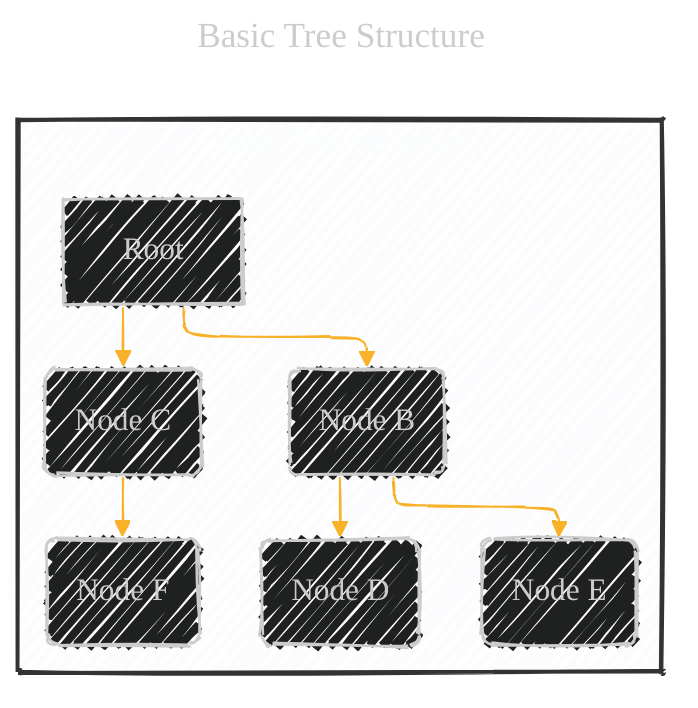
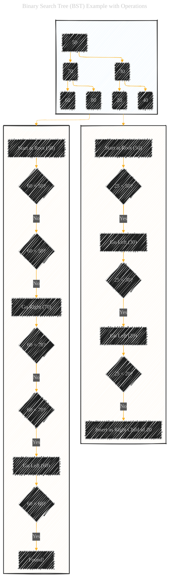
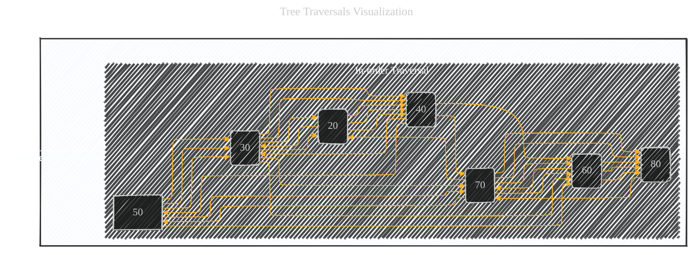

# Tree Structures (in Computer Science) - A Diagrammatic Guide 
> **Disclaimer:**
>
> This document contains my personal notes on the topic,
> compiled from publicly available documentation and various cited sources.
> The materials are intended for educational purposes, personal study, and reference.
> The content is dual-licensed:
> 1. **MIT License:** Applies to all code implementations (Swift, Mermaid, and other programming languages).
> 2. **Creative Commons Attribution 4.0 International License (CC BY 4.0):** Applies to all non-code content, including text, explanations, diagrams, and illustrations.
---


Below is a comprehensive overview covers the fundamental concepts of tree structures, different types of trees, their properties, operations, complexities, and applications.  The combination of Mermaid diagrams, code examples, and textual explanations provides a multi-faceted learning experience.


---


## 1. Basic Tree Structure

A tree is a hierarchical data structure. Unlike arrays, linked lists, stacks, and queues, which are linear, trees organize data in a non-linear, branching fashion. Here's a basic representation:



**Explanation:**

*   **Root:**  The topmost node in the tree (Node A in this case).  Every tree has exactly one root.
*   **Nodes:** The elements of the tree (A, B, C, D, E, F).  Each node contains data and may have links to other nodes.
*   **Edges/Links:** The connections between nodes (represented by the arrows).  They show the hierarchical relationships.
*   **Parent:**  A node that has child nodes.  In the diagram, A is the parent of B and C.  B is the parent of D and E.
*   **Child:** A node that has a parent.  B and C are children of A.  D and E are children of B.
*   **Leaf:**  A node with no children (D, E, and F in this example).  Leaves are the "end points" of the tree's branches.
*   **Subtree:**  A node and all its descendants.  For instance, B and its children (D and E) form a subtree.
*   **Height**: Height of a node is the longest downward path to a leaf from that node.
*   **Depth**: Depth of a node is the length of the path from the root to the node.

----

## 2. Types of Trees

There are many specialized types of tree structures, each with its own properties and use cases. Let's illustrate some common ones with a class diagram:


**Explanation:**

*   **`Tree` (General):**  The base class, representing the fundamental concept.  It has `data` (the value stored in the node) and `children` (a list of references to child nodes).  Basic operations like `insert`, `delete`, and `search` are defined.
*   **`BinaryTree`:**  A tree where each node has at most *two* children, typically referred to as `left` and `right`.
*   **`BinarySearchTree` (BST):**  A special type of binary tree where the values in the nodes are ordered.  For any node:
    *   All values in the left subtree are *less than* the node's value.
    *   All values in the right subtree are *greater than* the node's value.
    *   This ordering allows for efficient searching (hence the name).
      $$
      \text{Left Subtree Values} < \text{Node Value} < \text{Right Subtree Values}
      $$
*   **`AVLTree`:**  A self-balancing BST.  It maintains a balanced structure by performing rotations (`rotateLeft`, `rotateRight`) to ensure the height difference between the left and right subtrees of any node is at most 1.  This guarantees logarithmic time complexity for operations.
*   **`RedBlackTree`:** Another self-balancing BST.  It uses "colors" (red and black) assigned to nodes to maintain balance.  Rotations and color flips keep the tree relatively balanced.  Slightly less strict balancing than AVL trees, but often faster in practice for insertions and deletions.
*   **`BTree`:**  Designed for disk-based data storage (databases and file systems).  A B-tree node can have many children (determined by the "order," *m*).  It keeps keys sorted within each node and uses a multi-level index to efficiently locate data.
* **`Trie` (Prefix Tree):** Used for storing strings or sequences.  Each edge represents a character, and paths from the root to a node spell out a word or prefix.  Efficient for prefix-based searches (like autocomplete).

* **`Heap`:** A specialized tree-based data structure optimized for maintaining the minimum or maximum element. Heaps are commonly implemented using an underlying array to minimize memory overhead and enhance access speed.

----

## 3. Binary Search Tree (BST) Example with Operations

Let's visualize a BST and demonstrate insertion and search.




**Explanation:**

*   **`BST_Example`:** A simple BST with some initial values.
*   **`Insert_25`:**  Demonstrates the process of inserting a new value (25) into the BST:
    *   Start at the root (50).
    *   Compare the new value (25) with the current node's value.
    *   If it's less, go left; if it's greater, go right.
    *   Repeat until you find an empty spot (a `null` child) and insert the new node there.
*   **`Search_60`:** Shows how to search for a value (60):
    *   Start at the root (50).
    *   Compare the target value (60) with the current node's value.
    *   If they're equal, you've found it.
    *   If the target is less, go left; if it's greater, go right.
    *   Repeat until you find the value or reach a `null` child (meaning the value isn't present).

----

## 4. Tree Traversals (Code and Visualization)

There are several ways to "visit" all the nodes in a tree.  Common traversal methods include:

*   **In-order Traversal (Left, Root, Right):**  Visits the left subtree, then the current node, then the right subtree.  For a BST, this produces the values in *sorted* order.
*   **Pre-order Traversal (Root, Left, Right):**  Visits the current node, then the left subtree, then the right subtree.  Useful for creating a copy of the tree.
*   **Post-order Traversal (Left, Right, Root):**  Visits the left subtree, then the right subtree, then the current node.  Useful for deleting a tree.
* **Breadth-First Traversal (Level order):** Visits the tree level by level.

```swift
// Swift code for tree traversals (using a Binary Tree)

class TreeNode {
    var data: Int
    var left: TreeNode?
    var right: TreeNode?

    init(_ data: Int) {
        self.data = data
    }
}

func inorderTraversal(node: TreeNode?) {
    guard let node = node else { return }
    inorderTraversal(node: node.left)
    print(node.data, terminator: " ") // Process the node
    inorderTraversal(node: node.right)
}

func preorderTraversal(node: TreeNode?) {
    guard let node = node else { return }
    print(node.data, terminator: " ") // Process the node
    preorderTraversal(node: node.left)
    preorderTraversal(node: node.right)
}

func postorderTraversal(node: TreeNode?) {
    guard let node = node else { return }
    postorderTraversal(node: node.left)
    postorderTraversal(node: node.right)
    print(node.data, terminator: " ") // Process the node
}
func breadthFirstTraversal(root: TreeNode?) {
        guard let root = root else { return }

        var queue: [TreeNode] = []
        queue.append(root)

        while !queue.isEmpty {
            let node = queue.removeFirst()
            print(node.data, terminator: " ")

            if let leftChild = node.left {
                queue.append(leftChild)
            }
            if let rightChild = node.right {
                queue.append(rightChild)
            }
        }
    }

// Example Usage (using the BST from the previous diagram):
let root = TreeNode(50)
root.left = TreeNode(30)
root.right = TreeNode(70)
root.left?.left = TreeNode(20)
root.left?.right = TreeNode(40)
root.right?.left = TreeNode(60)
root.right?.right = TreeNode(80)

print("In-order:")
inorderTraversal(node: root) // Output: 20 30 40 50 60 70 80
print("\nPre-order:")
preorderTraversal(node: root) // Output: 50 30 20 40 70 60 80
print("\nPost-order:")
postorderTraversal(node: root) // Output: 20 40 30 60 80 70 50
print("\nBreadth-First Traversal:")
breadthFirstTraversal(root: root)

```




---

## 5. Time and Space Complexity

A key consideration for any data structure is its efficiency.  Here's a summary of the time and space complexity for common tree operations (focusing on balanced binary search trees):

| Operation         | Average Time Complexity | Worst-Case Time Complexity (Unbalanced Tree) | Space Complexity |
| ----------------- | ----------------------- | ------------------------------------------- | ---------------- |
| Search            | O(log n)                | O(n)                                        | O(n)             |
| Insertion         | O(log n)                | O(n)                                        | O(n)             |
| Deletion          | O(log n)                | O(n)                                        | O(n)             |
| Find Min/Max      | O(log n)                | O(n)                                        | O(1)             |
| Traversal (all) | O(n)                    | O(n)                                        | O(n)             |

**Explanation:**

*   **`n`:** The number of nodes in the tree.
*   **`O(log n)` (Logarithmic):**  This is the ideal case for balanced BSTs.  Because you effectively eliminate half the remaining search space with each comparison, the operations are very efficient, even for large trees.
*   **`O(n)` (Linear):**  This is the worst-case scenario, occurring when the tree is highly *unbalanced* (essentially becoming a linked list).  In this degenerate case, you might have to traverse all nodes.
*    **Space complexity:**
    *  **O(n)**  Worst-case scenario for recursive traversals where each node creates its own space.

---

## 6. Use Cases and Applications

Tree structures are used extensively in computer science:

*   **File Systems:**  Directories and files are organized hierarchically.
*   **Databases:**  B-Trees and their variants are crucial for indexing and efficient data retrieval.
*   **Compilers:**  Parse trees represent the syntactic structure of code.
*   **Networking:**  Routing algorithms often use tree-like structures.
*   **Decision Trees (Machine Learning):** Used for classification and regression tasks.
*   **HTML/XML Parsing:**  The Document Object Model (DOM) represents web pages as trees.
*   **Game AI:**  Game trees represent possible moves and outcomes in games like chess.
*   **Autocomplete and Spell Checkers:**  Tries are used to store dictionaries and efficiently search for words.
*   **Priority Queues:** Heaps are commonly used to manage tasks or elements with priorities.

---

## 7. Key Terms and Concepts


---
**Licenses:**

- **MIT License:**  [](LICENSE) - Full text in [LICENSE](LICENSE) file.
- **Creative Commons Attribution 4.0 International:** [](LICENSE-CC-BY) - Legal details in [LICENSE-CC-BY](LICENSE-CC-BY) and at [Creative Commons official site](http://creativecommons.org/licenses/by/4.0/).

---