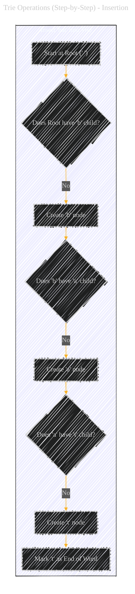
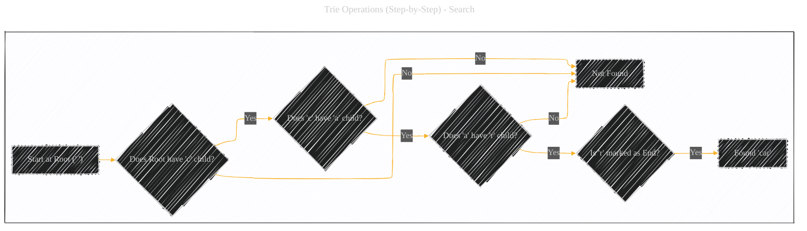
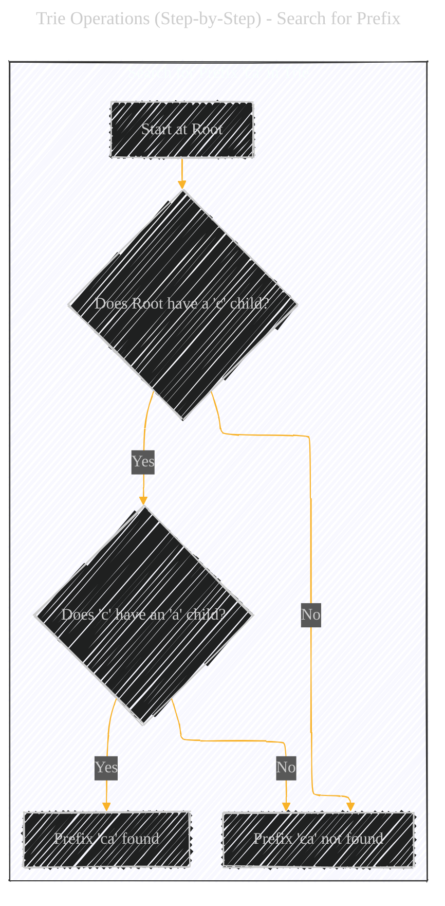
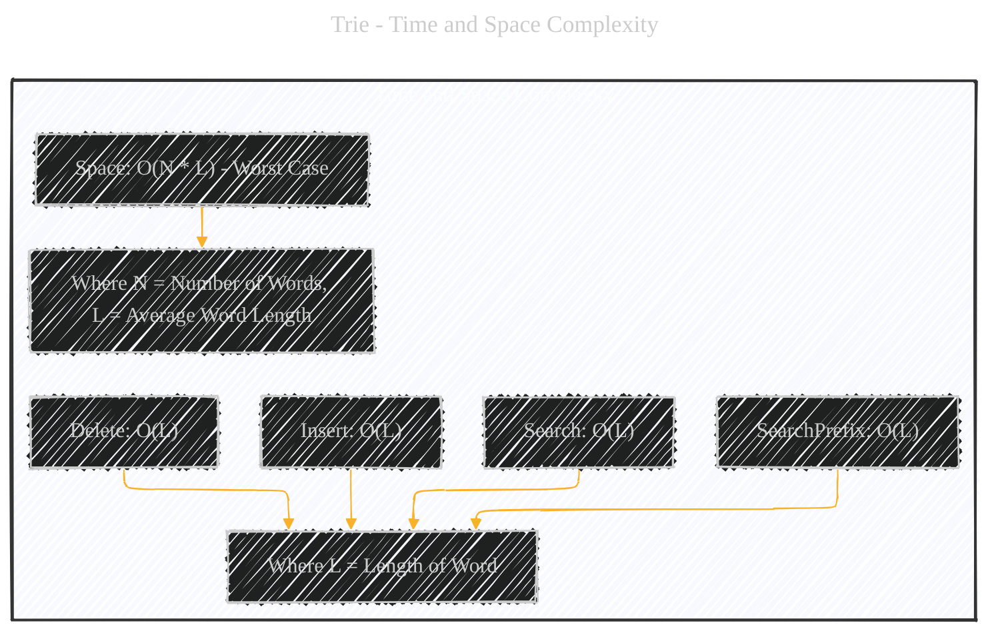
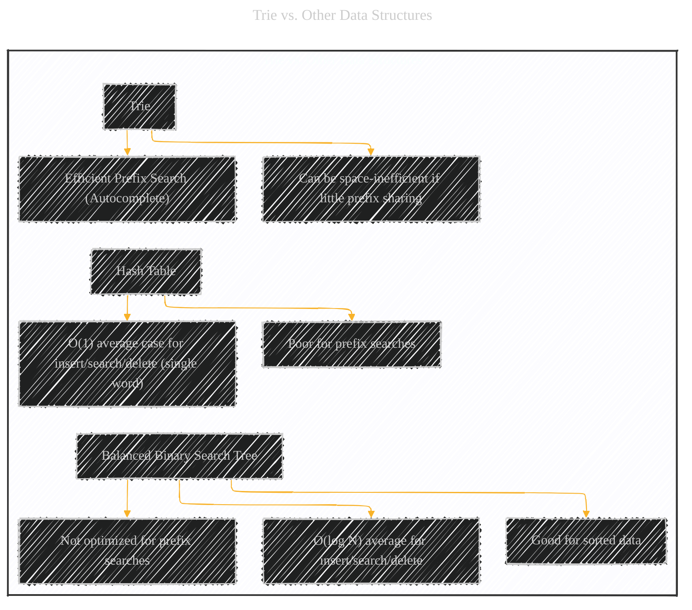

# Trie (Prefix Tree) - A Diagrammatic Guide 
> **Disclaimer:**
>
> This document contains my personal notes on the topic,
> compiled from publicly available documentation and various cited sources.
> The materials are intended for educational purposes, personal study, and reference.
> The content is dual-licensed:
> 1. **MIT License:** Applies to all code implementations (Swift, Mermaid, and other programming languages).
> 2. **Creative Commons Attribution 4.0 International License (CC BY 4.0):** Applies to all non-code content, including text, explanations, diagrams, and illustrations.
---

Below is a multi-pronged approach, combining diagrams, step-by-step instructions, complexity analysis, comparisons, and a keyword mind map, provides a thorough explanation of the Trie data structure.

---

## 1. Core Trie Representation

A Trie is a tree-like data structure used to store a dynamic set of strings, where the keys are usually strings. Unlike a binary search tree, no node in the tree stores the key associated with that node; instead, its position in the tree defines the key with which it is associated. All the descendants of a node have a common prefix of the string associated with that node, and the root is associated with the empty string.

Here's a Mermaid flowchart representing a Trie containing the words "cat", "car", "can", "dog", and "do":

**Explanation of the Core Mermaid Diagram:**

*   **`Root`**:  The Trie always starts with an empty root node (represented here as `""`).  This node doesn't represent any character.
*   **Nodes (Letters):** Each node, except the root, represents a single character of a word.
*   **Edges (Connections):** The edges represent transitions from one character to the next.
*   **`End` Nodes (Words):** Nodes marked with "End" (e.g., `{"t" - End}`) signify the end of a valid word.  This is crucial because a prefix of a valid word might also be a valid word itself (e.g., "do" and "dog").  The `End` marker distinguishes them.
*   **Shared Prefixes:**  Notice how "cat", "car", and "can" all share the prefix "ca".  They branch out from the same 'c' and 'a' nodes. This prefix sharing is the core efficiency of the Trie.

---

## 2. Trie Operations and Examples (Step-by-Step)

Let's illustrate the primary Trie operations: insertion, search, and deletion (although deletion is less commonly visualized).

### 2.a Insertion

**Explanation of Insertion:**

1.  **Start at Root:** Always begin at the empty root node.
2.  **Check for Child:** For each character in the word to be inserted, check if the current node has a child representing that character.
3.  **Create if Needed:** If a child doesn't exist, create a new node for that character.
4.  **Move to Child:** Move to the child node corresponding to the current character.
5.  **Mark End:** After processing all characters, mark the final node as an "End of Word" node.

### 2.b Search

**Explanation of Search:**

1.  **Start at Root:** Begin at the empty root node.
2.  **Check for Child:** For each character in the word being searched for, check if the current node has a child representing that character.
3.  **Not Found:** If at any point a child doesn't exist, the word is not in the Trie.
4.  **Move to Child:** If the child exists, move to that child node.
5.  **Check End:** After processing all characters, check if the final node is marked as "End of Word."  If it is, the word is found; otherwise, it's not (it might be a prefix of another word, but not a complete word itself).

----

### 2.c Search for Prefix (Slight Variation)
Searching if a given string is a prefix, not exactly the entire word.

### 2.d Deletion (Conceptual)

Deletion is a bit more complex, especially if you need to maintain the Trie's integrity (removing nodes that are no longer needed). Here's the general idea:

1.  **Find the Word:** Perform a search for the word to be deleted.
2.  **Unmark End:** If found, unmark the "End of Word" status of the final node.
3.  **Check for Children:** If the final node has *no* children, you can delete it.
4.  **Recursive Deletion:**  Move back up the Trie. If a parent node has no other children *and* is not marked as "End of Word," you can delete it too. Continue this process recursively until you reach a node that either has other children or marks the end of another word. This step prevents accidental removal of prefixes that are part of other valid words.

----

## 3. Time and Space Complexity

A key advantage of Tries is their efficiency in terms of time complexity for certain operations.

**Explanation:**

*   **Insert, Search, SearchPrefix, Delete:** All have a time complexity of O(L), where L is the length of the word being inserted, searched for, or deleted.  This is because, in the worst case, you traverse a path from the root to a leaf, and the length of this path is proportional to the word's length.  This is significantly faster than searching in an unsorted list (O(N)) or even a balanced binary search tree (O(log N) average, O(N) worst case), especially when dealing with many short strings.
*   **Space Complexity:**  The space complexity is where Tries can be less efficient. In the *worst case*, where no prefixes are shared, the space complexity is O(N * L), where N is the number of words and L is the average length of the words.  If you have many words with little prefix overlap, this can be significant. However, in many practical applications, there *is* significant prefix sharing, and the actual space used is much less.

---

## 4. Trie vs. Other Data Structures

**Explanation:**

*   **Trie:**
    *   **Advantage:**  Excels at prefix searches (e.g., autocomplete suggestions).  This is its primary strength.
    *   **Disadvantage:** Can use a lot of memory if there's not much prefix sharing among the stored strings.
*   **Hash Table:**
    *   **Advantage:** Very fast (average O(1)) for inserting, searching, and deleting *individual* words, assuming a good hash function and few collisions.
    *   **Disadvantage:** Very poor for prefix searches.  You'd have to iterate through all keys and check each one.
*   **Balanced Binary Search Tree:**
    *   **Advantage:**  Provides good average-case performance (O(log N)) for insertion, search, and deletion.  Also keeps the data sorted, which can be useful for other operations.
    *   **Disadvantage:** Not specifically optimized for prefix searches. While you could find prefixes, it wouldn't be as efficient as a Trie.

----

## 5. Key Terms and Concepts

---
**Licenses:**

- **MIT License:**   - Full text in [LICENSE](LICENSE) file.
- **Creative Commons Attribution 4.0 International:**  - Legal details in [LICENSE-CC-BY](LICENSE-CC-BY) and at [Creative Commons official site](http://creativecommons.org/licenses/by/4.0/).

---