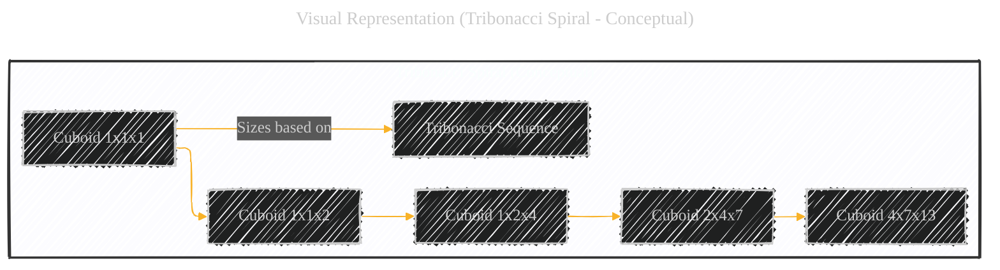
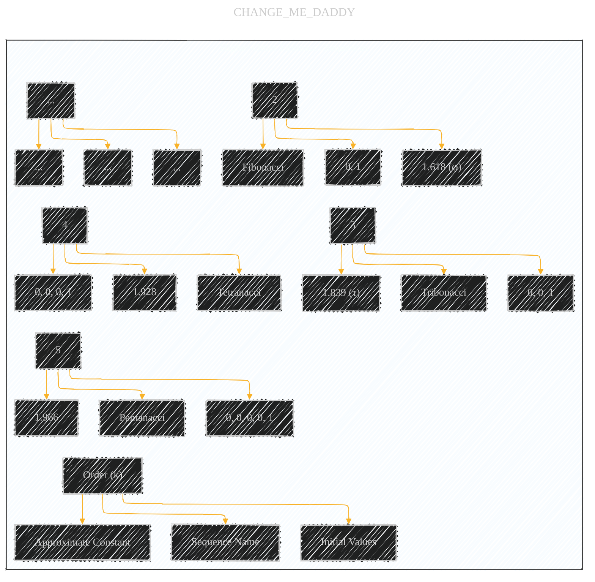

# Tribonacci and Higher-Order Fibonacci Sequences - A Diagrammatic Guide 
> **Disclaimer:**
>
> This document contains my personal notes on the topic,
> compiled from publicly available documentation and various cited sources.
> The materials are intended for educational purposes, personal study, and reference.
> The content is dual-licensed:
> 1. **MIT License:** Applies to all code implementations (Swift, Mermaid, and other programming languages).
> 2. **Creative Commons Attribution 4.0 International License (CC BY 4.0):** Applies to all non-code content, including text, explanations, diagrams, and illustrations.
---

Below is a multi-pronged approach provides a clear, conceptual, and mathematically sound explanation of Tribonacci and higher-order Fibonacci sequences. The combination of textual definitions, mathematical formulas, and conceptual diagrams (even when perfect visual representations are impossible) creates a much more understandable and engaging presentation.


---


## 1. Introduction: Beyond Fibonacci

The Fibonacci sequence is a *second-order* recurrence relation.  Each term depends on the *two* preceding terms.  We can generalize this concept to *higher-order* sequences, where each term depends on *three*, *four*, or more preceding terms.

---

## 2. The Tribonacci Sequence

The Tribonacci sequence is a *third-order* recurrence relation.  Each term is the sum of the *three* preceding terms.

*   **Definition:**
    ```LaTex
    T(n) = T(n-1) + T(n-2) + T(n-3)
    ```
    with initial values:
    ```LaTex
    T(0) = 0
    T(1) = 0
    T(2) = 1
    ```
    *And, following the pattern, the next values would evaluate to:*
     ```LaTex
    T(3) = 1
    T(4) = 2
    T(5) = 4
    ...
    ```

*   **Sequence:** 0, 0, 1, 1, 2, 4, 7, 13, 24, 44, 81, 149, ...

*   **Tribonacci Constant:**  Just as the ratio of consecutive Fibonacci numbers approaches the Golden Ratio (φ), the ratio of consecutive Tribonacci numbers approaches a constant, often called the *Tribonacci constant* (τ).

$$
τ ≈ 1.8392867552...
$$

     $$
    \lim_{n \to \infty} \frac{T_{n+1}}{T_n} = \tau
    $$
    *The Tribonacci constant (τ) is the real root of the characteristic polynomial:*

        $$
        x^3 - x^2 - x - 1 = 0
        $$
----

## 3. Visual Representation (Tribonacci Spiral - Conceptual)

We can't *perfectly* draw a 3D spiral in Mermaid.  However, we can conceptually represent how a Tribonacci spiral *would* be constructed, analogous to the Golden Spiral. Imagine a series of *cuboids* (rectangular prisms), where the side lengths of each cuboid are based on successive Tribonacci numbers.



**Explanation:**

*   This diagram represents a *conceptual* Tribonacci spiral, built from cuboids instead of squares.
*   Each cuboid's dimensions are based on three *consecutive* Tribonacci numbers.  For example, if we have Tribonacci numbers 1, 2, and 4, the corresponding cuboid would be 1x2x4.
*   The spiral would be formed by connecting quarter-turns (or appropriate curves) within these cuboids, creating a 3D spiral.

---

## 4. Higher-Order Fibonacci Sequences (Generalization)

We can generalize this concept to *k*-th order Fibonacci sequences:

*   **Definition:**

$$
F_k(n) = F_k(n-1) + F_k(n-2) + ... + F_k(n-k)
$$
    where *k* is the order of the sequence, and you need *k* initial values to start the sequence.

*   **Examples:**

    *   **Tetranacci (k=4):**  0, 0, 0, 1, 1, 2, 4, 8, 15, 29, 56, ...  Each term is the sum of the previous *four* terms.
    *   **Pentanacci (k=5):** 0, 0, 0, 0, 1, 1, 2, 4, 8, 16, 31, ... Each term is the sum of the previous *five* terms.

* **Constants:** Each higher-order Fibonacci sequence has a corresponding constant that the ratio of consecutive terms approaches. These constants are roots of the characteristic polynomial:

   $$x^k - x^{k-1} - x^{k-2} - ... - x - 1 = 0$$

----

## 5. Illustrative Table (Orders and Constants)



**Explanation:**

*   This table summarizes the different orders of Fibonacci sequences, their names, initial values, and the approximate values of their corresponding constants.

----

## 6. Key Concepts and Terminology


**Explanation:**

*   This mind map summarizes all the critical concepts.


---
**Licenses:**

- **MIT License:**  [](LICENSE) - Full text in [LICENSE](LICENSE) file.
- **Creative Commons Attribution 4.0 International:** [](LICENSE-CC-BY) - Legal details in [LICENSE-CC-BY](LICENSE-CC-BY) and at [Creative Commons official site](http://creativecommons.org/licenses/by/4.0/).

---