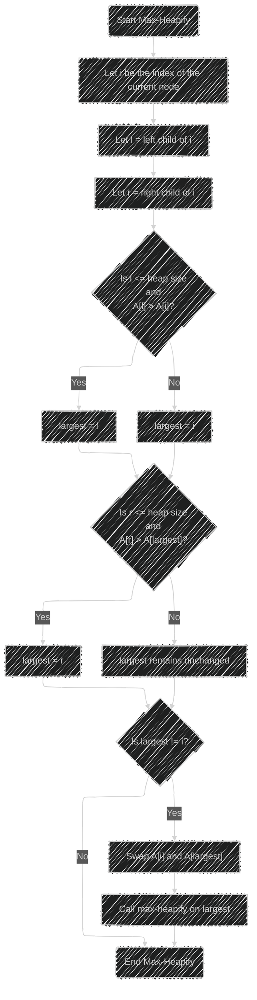
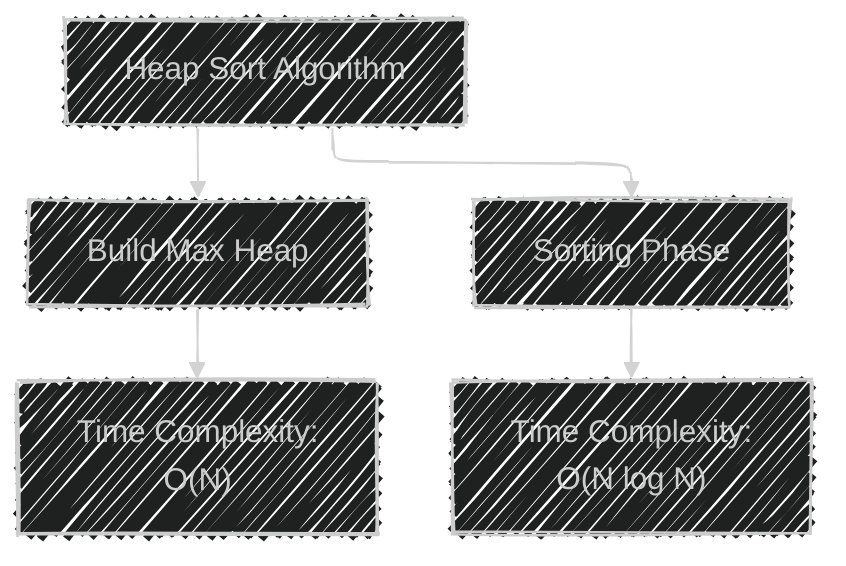
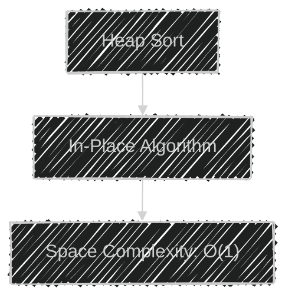
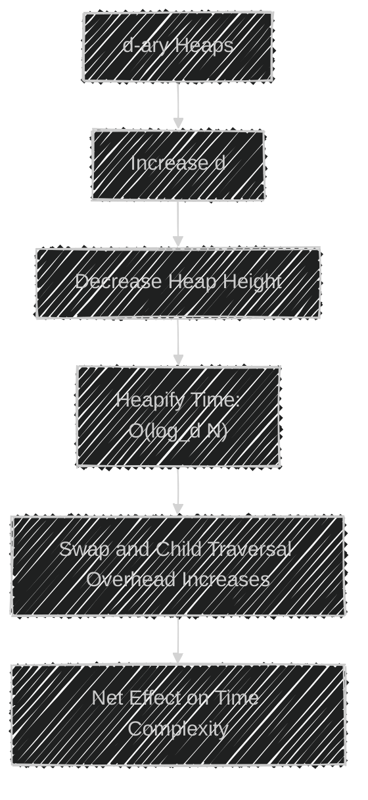
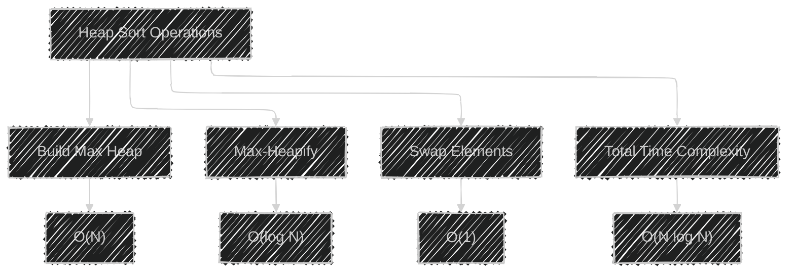

Below is a set of diagrams in Mermaid syntax that explain the complexities of the Heap Sort Algorithm as discussed in the previous response. Each diagram is accompanied by a brief explanation.

---


## 1. Overview of Heap Sort Algorithm Steps

This flowchart illustrates the main steps involved in the Heap Sort Algorithm.


**Explanation:**

1. **Build Max Heap:** The unsorted array is transformed into a max heap.
2. **Iterative Process:**
   - Swap the first element (maximum) with the last element in the heap.
   - Reduce the heap size by one.
   - Call `max-heapify` on the root to restore the max heap property.
3. **Termination:** Repeat the process until the heap size is reduced to 1.

---

## 2. Max-Heapify Operation

This flowchart details the `max-heapify` process for maintaining the max heap property.




**Explanation:**

- **Compare Current Node with Children:** Determine the largest among the current node and its left and right children.
- **Swap if Necessary:** If the largest is not the current node, swap them.
- **Recursive Heapify:** Recursively call `max-heapify` on the affected subtree.

---

## 3. Time Complexity Breakdown

This diagram shows the time complexities associated with each step in the algorithm.




**Explanation:**

- **Build Max Heap:** Takes `O(N)` time.
- **Sorting Phase:** Consists of `N-1` iterations, each requiring `O(log N)` time for `max-heapify`, totaling `O(N log N)`.

---

## 4. Max-Heapify Time Complexity Analysis

This tree diagram visualizes how the total time for building the heap sums up to `O(N)`.

```mermaid
---
config:
  layout: elk
  look: handDrawn
  theme: dark
---
graph TB
    subgraph Levels of Heap
    A1(Level 0 - Root)---A2(Level 1)
    A2---A3(Level 2)
    A3---A4(Level 3)
    end

    A1 --> B1[Nodes at Height h]
    B1 --> C1["Time per Node: O(h)"]
    C1 --> D1["Total Time: <br> ∑ Nodes at height h * O(h)"]
    D1 --> E1["Overall Time: O(N)"]
    
```




**Explanation:**

- **Nodes at Lower Levels:** There are more nodes at lower levels, but they require less time per `max-heapify`.
- **Aggregate Time:** The total time sums up to a linear function of `N`.

---

## 5. Comparison with Other Sorting Algorithms

A bar chart comparing the time complexities of Heap Sort with Merge Sort and Quick Sort.

```mermaid
%%{init: {'logLevel': '0', 'theme': 'base', 'themeVariables': {'barColor': '#69b3a2'}} }%%
    bar TimeComplexityComparison
    title Time Complexities of Sorting Algorithms
    "Heap Sort O(N log N)" : 100
    "Merge Sort O(N log N)" : 100
    "Quick Sort Avg O(N log N)" : 100
    "Quick Sort Worst O(N^2)" : 500
```

**Explanation:**

- **Heap Sort and Merge Sort:** Both have consistent `O(N log N)` time complexities.
- **Quick Sort:** Average case is `O(N log N)`, but the worst case degrades to `O(N^2)`.

---

## 6. Heap Sort Space Complexity

A simple diagram emphasizing the in-place nature of Heap Sort.




**Explanation:**

- **In-Place Sorting:** Heap Sort requires only a constant amount of additional space.

---

## 7. Effect of Heap Variations on Time Complexity

A diagram illustrating how changing the branching factor `d` in a d-ary heap affects the time complexity.




**Explanation:**

- **Higher Branching Factor:**
  - **Pros:** Reduces the height of the heap, potentially decreasing the number of levels `log_d N`.
  - **Cons:** Each `heapify` operation may involve more comparisons and swaps due to more children.

---

## 8. Heap Sort Algorithm Execution Example

An example of how Heap Sort transforms an unsorted array into a sorted array.


**Explanation:**

- **Sequence:**
  1. **Building the Max Heap**
  2. **Extracting Elements:** Repeatedly move the maximum element to the end and restore the heap.

---

## 9. Summary of Time Complexities

A flowchart summarizing the time complexities of various operations in Heap Sort.




---

## 10. Algorithmic Complexity Classes

A mind map categorizing Heap Sort within algorithmic complexity classes.


---

**Note:** The diagrams above are provided in Mermaid syntax and can be rendered using Mermaid.js-compatible tools or editors. They visually represent the complexities and steps involved in the Heap Sort Algorithm, aiding in the understanding of its performance characteristics.


---
