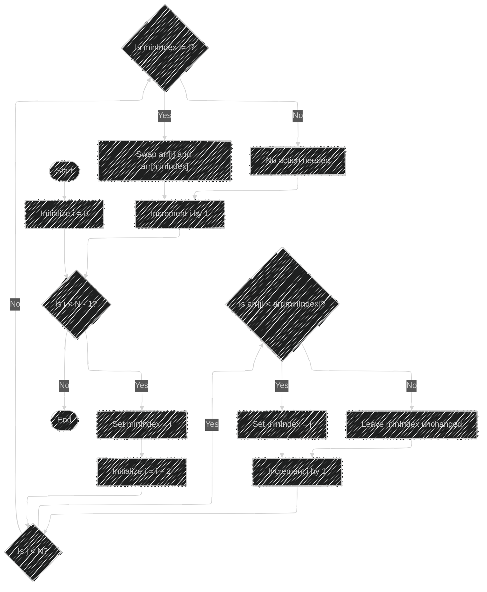
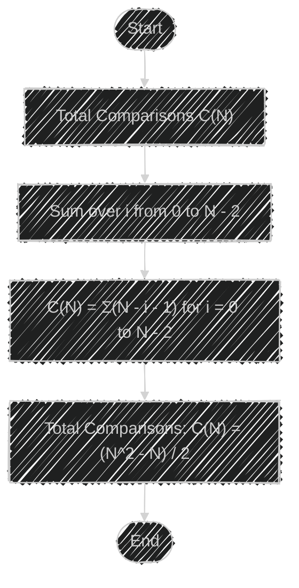
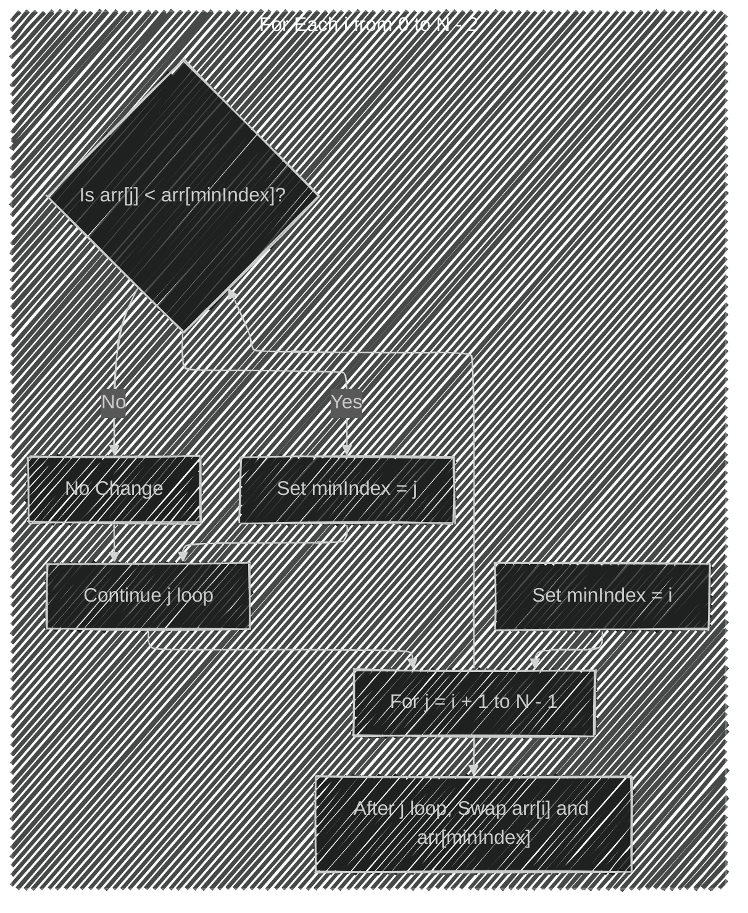

Below are several Mermaid diagrams that illustrate the complexities of the Selection Sort algorithm.

---

## 1. Flowchart of the Selection Sort Algorithm

This flowchart visualizes the step-by-step process of the Selection Sort algorithm.

---

## 2. Visualization of Comparisons and Swaps per Iteration

This diagram shows how the number of comparisons and swaps accumulate over each iteration.

---

## 3. Total Comparisons Calculation

Illustrating the derivation of the total number of comparisons in Selection Sort.

---

## 4. Time Complexity Representation

A diagram representing the time complexity of Selection Sort in different cases.

---

## 5. Space Complexity Representation

Diagram illustrating that Selection Sort is an in-place algorithm with constant space complexity.

---

## 6. Big O Notation Conceptual Graph

A conceptual representation of how the time complexity scales with the input size.

---

## 7. Comparison with Other Sorting Algorithms

A diagram comparing Selection Sort's time complexity with other common sorting algorithms.

---

## 8. Number of Comparisons over Input Size

This diagram illustrates the relationship between input size and the total number of comparisons.

---

## 9. Step-by-Step Operation Flow

Visual representation of operations in each iteration.

---

## 10. Algorithm's Inefficiency for Large N

A diagram emphasizing Selection Sort's impracticality for large datasets due to its quadratic time complexity.

---

