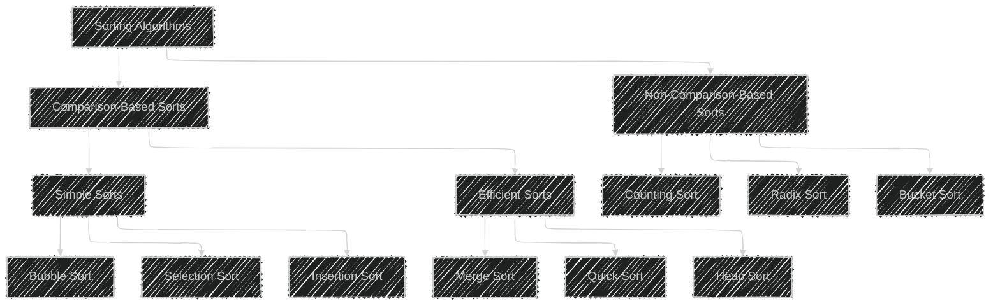
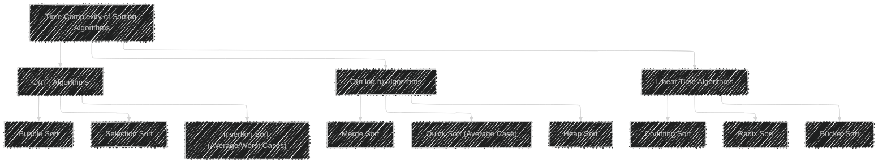
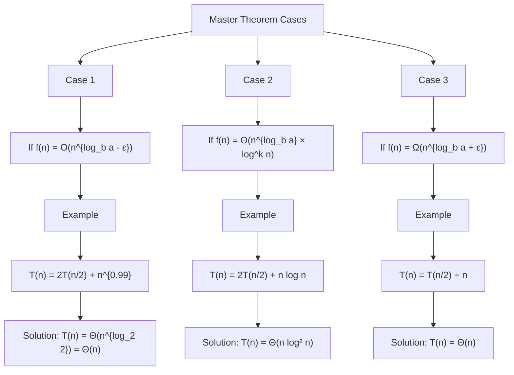
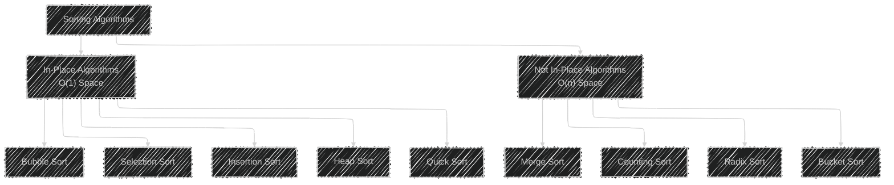

Below are diagrams in Mermaid syntax that explain the complexities of the sorting algorithms.

---

## 1. Classification of Sorting Algorithms

**Explanation:**
- This diagram classifies sorting algorithms into **Comparison-Based Sorts** and **Non-Comparison-Based Sorts**.
- **Comparison-Based Sorts** are further divided into **Simple Sorts** and **Efficient Sorts**.

---

## 2. Time Complexity Comparison

**Explanation:**
- This diagram groups sorting algorithms based on their time complexities.
- **O(n²) Algorithms** include Bubble Sort, Selection Sort, and Insertion Sort.
- **O(n log n) Algorithms** include Merge Sort, Quick Sort (average case), and Heap Sort.
- **Linear Time Algorithms** include Counting Sort, Radix Sort, and Bucket Sort.

---

## 3. Detailed Complexities of Key Sorting Algorithms

```mermaid
---
config:
  layout: elk
  look: handDrawn
  theme: dark
---
flowchart TD
    A[Sorting Algorithms]

    subgraph Comparison-Based Sorts
        direction TB
        A --> B1[Bubble Sort]
        A --> B2[Selection Sort]
        A --> B3[Insertion Sort]
        A --> B4[Merge Sort]
        A --> B5[Quick Sort]
        A --> B6[Heap Sort]
    end

    subgraph Non-Comparison-Based Sorts
        direction TB
        A --> C1[Counting Sort]
        A --> C2[Radix Sort]
        A --> C3[Bucket Sort]
    end

    %% Bubble Sort
    B1 --> BS1["**Best Case:** O(n)"]
    B1 --> BS2["**Average Case:** O(n²)"]
    B1 --> BS3["**Worst Case:** O(n²)"]
    B1 --> BS4["**Space:** O(1)"]
    B1 --> BS5[**Stable:** Yes]
    B1 --> BS6[**In-Place:** Yes]

    %% Selection Sort
    B2 --> SS1["**Best Case:** O(n²)"]
    B2 --> SS2["**Average Case:** O(n²)"]
    B2 --> SS3["**Worst Case:** O(n²)"]
    B2 --> SS4["**Space:** O(1)"]
    B2 --> SS5[**Stable:** No]
    B2 --> SS6[**In-Place:** Yes]

    %% Insertion Sort
    B3 --> IS1["**Best Case:** O(n)"]
    B3 --> IS2["**Average Case:** O(n²)"]
    B3 --> IS3["**Worst Case:** O(n²)"]
    B3 --> IS4["**Space:** O(1)"]
    B3 --> IS5[**Stable:** Yes]
    B3 --> IS6[**In-Place:** Yes]

    %% Merge Sort
    B4 --> MS1["**Best Case:** O(n log n)"]
    B4 --> MS2["**Average Case:** O(n log n)"]
    B4 --> MS3["**Worst Case:** O(n log n)"]
    B4 --> MS4["**Space:** O(n)"]
    B4 --> MS5[**Stable:** Yes]
    B4 --> MS6[**In-Place:** No]

    %% Quick Sort
    B5 --> QS1["**Best Case:** O(n log n)"]
    B5 --> QS2["**Average Case:** O(n log n)"]
    B5 --> QS3["**Worst Case:** O(n²)"]
    B5 --> QS4["**Space:** O(log n)"]
    B5 --> QS5[**Stable:** No]
    B5 --> QS6[**In-Place:** Yes]

    %% Heap Sort
    B6 --> HS1["**Best Case:** O(n log n)"]
    B6 --> HS2["**Average Case:** O(n log n)"]
    B6 --> HS3["**Worst Case:** O(n log n)"]
    B6 --> HS4["**Space:** O(1)"]
    B6 --> HS5[**Stable:** No]
    B6 --> HS6[**In-Place:** Yes]

    %% Counting Sort
    C1 --> CS1["**Time:** O(n + k)"]
    C1 --> CS2["**Space:** O(n + k)"]
    C1 --> CS3[**Stable:** Yes]
    C1 --> CS4[**In-Place:** No]

    %% Radix Sort
    C2 --> RS1["**Time:** O(n × d)"]
    C2 --> RS2["**Space:** O(n + k)"]
    C2 --> RS3[**Stable:** Yes]
    C2 --> RS4[**In-Place:** No]

    %% Bucket Sort
    C3 --> BK1["**Time:** O(n + k)"]
    C3 --> BK2["**Space:** O(n × k)"]
    C3 --> BK3["**Stable:** Yes (Depends on Inner Sort)"]
    C3 --> BK4[**In-Place:** No]
    
```

**Explanation:**
- This diagram provides detailed complexities for each key sorting algorithm.
- It includes best, average, and worst-case time complexities, space complexity, and whether the algorithm is stable and in-place.

---

## 4. Time Complexity Recurrences

**Explanation:**
- This diagram shows the recurrence relations for Merge Sort and Quick Sort.
- For Merge Sort, the recurrence relation is `T(n) = 2T(n/2) + O(n)`, leading to `O(n log n)` complexity.
- Quick Sort's average case has a similar recurrence, but the worst-case has `T(n) = T(n - 1) + O(n)`, leading to `O(n²)` complexity.

---

## 5. Master Theorem Application

**Explanation:**
- This diagram illustrates the three cases of the Master Theorem used to solve recurrence relations.
- It provides examples and solutions for each case.

---

## 6. Merge Sort Recurrence Tree

**Explanation:**
- This diagram represents the recurrence tree of Merge Sort.
- It shows how the array is recursively divided until individual elements are reached.
- The total number of levels is approximately `log n`, explaining the `O(n log n)` time complexity.

---

## 7. Quick Sort Worst-Case Partition

**Explanation:**
- This diagram illustrates the worst-case scenario in Quick Sort when the smallest element is always chosen as the pivot.
- This results in unbalanced partitions, leading to `O(n²)` time complexity.

---

## 8. Space Complexity Comparison

**Explanation:**
- This diagram classifies sorting algorithms based on their space complexity.
- **In-Place Algorithms** require only constant extra space.
- **Not In-Place Algorithms** require additional space proportional to the size of the input.

---
