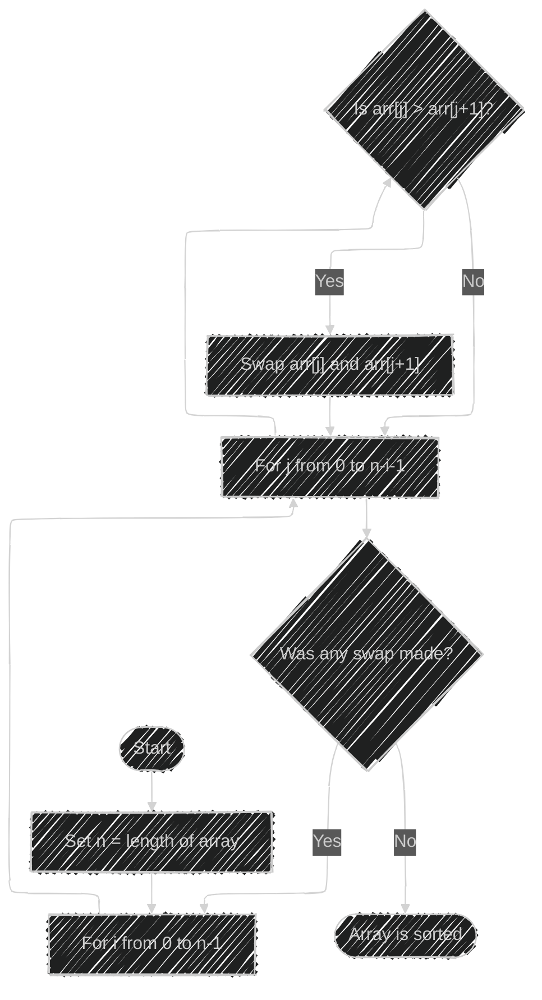
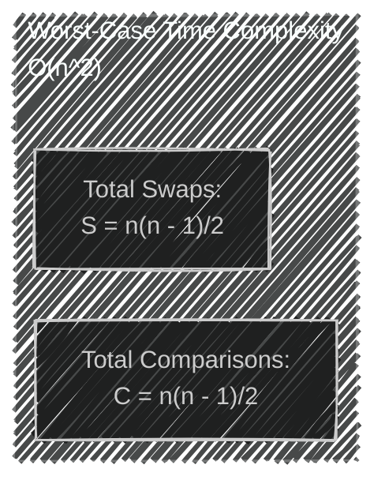
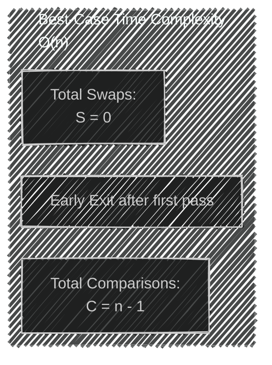
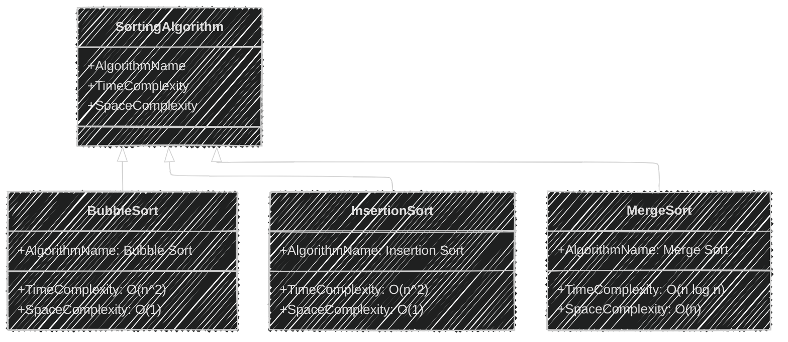
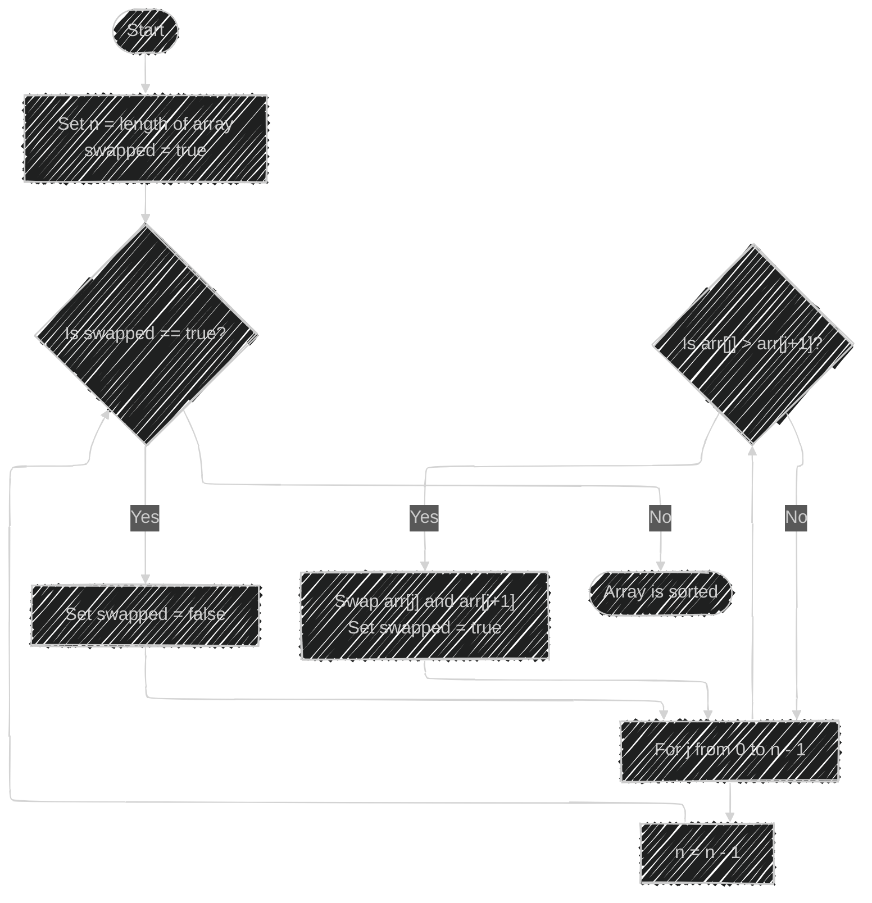

# Bubble Sort Algorithm Framework - Mermaid diagrams

> This content is dual-licensed under your choice of the following licenses:
> 1.  **MIT License:** For the code implementations in Swift and Mermaid provided in this document.
> 2.  **Creative Commons Attribution 4.0 International License (CC BY 4.0):** For all other content, including the text, explanations, and the Mermaid diagrams and illustrations.

---


## **1. Bubble Sort Algorithm Flowchart**

This flowchart demonstrates the step-by-step process of the Bubble Sort algorithm.




**Explanation:**

- **Initialization:** Sets the initial parameters for the algorithm.
- **Outer Loop:** Iterates through the entire array.
- **Inner Loop:** Compares adjacent elements and performs swaps if necessary.
- **Swap Condition:** Determines if a swap is needed based on the comparison.
- **Early Exit Optimization:** Checks if any swaps were made; if not, the array is already sorted.

---

## **2. Comparison and Swapping Mechanism**

This sequence diagram illustrates how adjacent elements are compared and swapped during each iteration.


**Explanation:**

- **Participants:** Represent the two adjacent array elements being compared.
- **Condition:** Determines whether a swap is required.
- **Actions:** Swap or retain the positions based on the comparison result.

---

## **3. Time Complexity Analysis**

### **a. Worst-Case Time Complexity**

In the worst-case scenario (reverse sorted array), the number of comparisons and swaps is maximized.




### **b. Best-Case Time Complexity**

In the best-case scenario (already sorted array with optimization), the algorithm completes in linear time.




**Explanation:**

- **Worst Case:**
  - The number of comparisons and swaps reaches the maximum.
  - Time complexity is \( O(n^2) \).
- **Best Case:**
  - The array is already sorted; swaps are not needed.
  - Early exit optimization reduces time complexity to \( O(n) \).

---

## **4. Number of Comparisons Visualization**

This bar chart represents the number of comparisons for different array sizes in the worst-case scenario.

```mermaid
%% Note: Mermaid currently does not support bar charts directly.
%% This is a conceptual representation.

graph LR
    A[Array Size n] --> B{Total Comparisons}
    B --> C[Comparisons = n(n - 1)/2]
    subgraph ComparisonsGraph[Comparisons Increase Quadratically]
        direction TB
        for n from 1 to N do
            CompN[At n=N:<br> C = N(N - 1)/2]
        end
    end
```

**Note:** Mermaid does not support plotting actual graphs or bar charts with data points. The above is a conceptual illustration.

---

## **5. Comparison with Other Sorting Algorithms**

This flowchart compares the time complexities of Bubble Sort with Insertion Sort and Merge Sort.


**Explanation:**

- **Bubble Sort and Insertion Sort:**
  - Both have quadratic time complexities.
  - Less efficient for large datasets.
- **Merge Sort:**
  - Has a logarithmic time complexity.
  - More efficient for larger datasets.

---

## **6. Algorithm Performance Summary Table**

While Mermaid does not natively support detailed tables, we can represent a simple comparison.




**Explanation:**

- **Inheritance Hierarchy:**
  - `SortingAlgorithm` is a general class.
  - `BubbleSort`, `InsertionSort`, and `MergeSort` inherit properties.
- **Attributes:**
  - **AlgorithmName**
  - **TimeComplexity**
  - **SpaceComplexity**

---

## **7. Pseudocode Representation**

A flowchart representing the pseudocode steps of the optimized Bubble Sort algorithm with an early exit.




**Explanation:**

- **Variable Initialization:** Prepare variables before sorting.
- **Swapped Flag:** Determines if another pass is needed.
- **Inner Loop:** Performs comparisons and swaps.
- **Optimization:** Early exit when no swaps occur.

---

## **8. Algorithm Complexity Summary**

A mind map summarizing the complexities of Bubble Sort.


**Explanation:**

- **Time Complexity Branch:**
  - Details different cases and their complexities.
- **Space Complexity Branch:**
  - Notes the in-place nature of the algorithm.
- **Characteristics Branch:**
  - Summarizes key features.
- **Optimizations Branch:**
  - Lists common optimizations applied to Bubble Sort.

---

## **Notes on Diagram Limitations**

- **Graphical Plots:**
  - Mermaid does not support plotting graphs with axes to show \( T(n) \) vs. \( n \) or \( n^2 \).
  - For detailed graphs, consider using external tools or programming libraries (e.g., Matplotlib in Python).

- **Tables:**
  - Mermaid's support for detailed tables is limited.
  - The class diagram is used here to represent comparative data.

---

## **Conclusion**

These diagrams provide a visual representation of the Bubble Sort algorithm and its complexities. By illustrating the algorithm's flow, comparison mechanism, and time complexities, we can better understand its behavior and performance characteristics. Visual tools like Mermaid help in conceptualizing these aspects, aiding in both learning and teaching the fundamentals of algorithm analysis.


---
**Licenses:**

- **MIT License:**  [](LICENSE) - Full text in [LICENSE](LICENSE) file.
- **Creative Commons Attribution 4.0 International:** [](LICENSE-CC-BY) - Legal details in [LICENSE-CC-BY](LICENSE-CC-BY) and at [Creative Commons official site](http://creativecommons.org/licenses/by/4.0/).

---