# Greedy Algorithms - Mermaid Diagrams

> This content is dual-licensed under your choice of the following licenses:
> 1.  **MIT License:** For the code implementations in Swift and Mermaid provided in this document.
> 2.  **Creative Commons Attribution 4.0 International License (CC BY 4.0):** For all other content, including the text, explanations, and the Mermaid diagrams and illustrations.

---

## **Diagram 1: Flowchart of Prim's Algorithm with Time Complexities**

This flowchart outlines the steps of Prim's Algorithm and highlights the time complexities associated with each operation.

### **Explanation:**

- **Initialization Steps:**
  - Initializing the min-heap with all vertices takes **O(V)** time.
  - Setting the key value of the starting vertex is a constant-time operation.
  - Building the initial heap from the vertices also takes **O(V)** time.

- **Main Loop:**
  - The loop runs until the heap **Q** is empty.
  - **Extract-Min** operation takes **O(log V)** time per extraction.
  - For each neighbor, the algorithm checks and potentially performs a **Decrease-Key** operation, which takes **O(log V)** time.

- **Total Time Complexity:**
  - The total time for **Extract-Min** operations is **O(V log V)**.
  - The total time for **Decrease-Key** operations is **O(E log V)**.
  - **Overall**, the time complexity is **O(E log V)** since **E** can be larger than **V**.

---

## **Diagram 2: Heap Operations Breakdown in Prim's Algorithm**

This diagram focuses on the contributions of different heap operations to the total time complexity of Prim's Algorithm.

```mermaid
graph TD
    A["Prim's Algorithm"] --> B["Heap Operations"]
    B --> C["Build Heap\nT = O(V)"]
    B --> D["Extract-Min Operations\nExecuted V times\nT = O(V log V)"]
    B --> E["Decrease-Key Operations\nExecuted ≤ E times\nT = O(E log V)"]
    A --> F["Total Time Complexity\nT = O(V log V + E log V) = O(E log V)"]
```

### **Explanation:**

- **Build Heap:**
  - Executed once during initialization, taking **O(V)** time.

- **Extract-Min Operations:**
  - Performed **V** times (once for each vertex), each taking **O(log V)** time.
  - Total time: **O(V log V)**.

- **Decrease-Key Operations:**
  - Performed up to **E** times (once for each edge in the worst case), each taking **O(log V)** time.
  - Total time: **O(E log V)**.

- **Total Time Complexity:**
  - Sum of all heap operation times, resulting in **O(E log V)**.

---

## **Diagram 3: Comparing Binary Heap and Fibonacci Heap in Prim's Algorithm**

This diagram compares how using a Binary Heap versus a Fibonacci Heap affects the time complexity of Prim's Algorithm.

### **Explanation:**

- **Binary Heap Implementation:**
  - **Extract-Min**: **O(log V)** per operation.
  - **Decrease-Key**: **O(log V)** per operation.
  - **Total Time Complexity**: **O(E log V)**.

- **Fibonacci Heap Implementation:**
  - **Extract-Min**: **O(log V)** per operation.
  - **Decrease-Key**: **O(1)** amortized per operation.
  - **Total Time Complexity**: **O(V log V + E)**.

- **Comparison:**
  - **Binary Heap** is simpler but may be slower for graphs with a large number of edges due to the **O(E log V)** term.
  - **Fibonacci Heap** offers better theoretical performance for dense graphs because the **Decrease-Key** operation is faster.

---

## **Diagram 4: Huffman Coding Process and Time Complexity**

This diagram illustrates the steps of the Huffman Coding algorithm and highlights where the heap operations contribute to the overall time complexity.

### **Explanation:**

- **Building the Min-Heap:**
  - Initial heap construction takes **O(n)** time.

- **Main Loop:**
  - Runs **n - 1** times until the heap reduces to a single node.
  - Each iteration involves:
    - **Two Extract-Min** operations: Each **O(log n)**.
    - **One Insert** operation: **O(log n)**.

- **Total Time Complexity:**
  - Extract-Min operations: **2(n - 1) \* O(log n) = O(n log n)**.
  - Insert operations: **(n - 1) \* O(log n) = O(n log n)**.
  - Combined with the initial heap build, the total time is **O(n log n)**.

---

## **Diagram 5: Summary of Heap Operations in Greedy Algorithms**

This diagram summarizes how different Greedy Algorithms utilize heap operations and their contributions to time complexity.

### **Explanation:**

- **Prim's Algorithm:**
  - Uses **Extract-Min** and **Decrease-Key** heap operations.
  - Time complexity depends on the heap implementation.

- **Huffman Coding:**
  - Uses **Extract-Min** and **Insert** operations.
  - Total time is **O(n log n)** due to heap operations.

- **Kruskal's Algorithm:**
  - Typically sorts edges; a heap can be used for this purpose.
  - Time complexity is **O(E log E)**.

- **Time Complexity Analysis:**
  - The efficiency of these algorithms is closely tied to the efficiency of heap operations.
  - Optimizing heap operations can lead to significant performance improvements.

---

## **Diagram 6: Theoretical vs. Practical Performance**

This diagram compares theoretical time complexities with practical considerations when choosing a heap implementation.

### **Explanation:**

- **Binary Heap:**
  - Easier to implement.
  - Good for graphs where the number of edges **E** is not significantly larger than the number of vertices **V**.

- **Fibonacci Heap:**
  - Offers better theoretical performance due to faster **Decrease-Key**.
  - Implementation complexity is higher.
  - Benefits are more noticeable in dense graphs where **E** is large.

- **Pairing Heap:**
  - Simpler than Fibonacci Heap with good amortized performance.
  - **Decrease-Key** operation is efficient in practice.

- **Practical Performance Considerations:**
  - Sometimes the overhead of complex heap implementations doesn't translate to practical performance gains.
  - Choice of heap should consider both theoretical time complexity and practical implementation factors.

---

## **Additional Notes on the Diagrams**

- The diagrams are intended to visually represent the relationship between algorithm steps, heap operations, and their corresponding time complexities.
- Time complexities are indicated next to each relevant operation to emphasize their contribution to the total time.
- Comparisons between different heap implementations help in understanding how they affect the overall efficiency of the algorithm.

---

Feel free to use these diagrams for your future research and development. You can copy the Mermaid code blocks into a Mermaid editor or compatible markdown viewer to visualize them.

**Note:** When rendering the diagrams, ensure that you have access to a tool or environment that supports Mermaid syntax to visualize them correctly.

---
**Licenses:**

- **MIT License:**   - Full text in [LICENSE](LICENSE) file.
- **Creative Commons Attribution 4.0 International:**  - Legal details in [LICENSE-CC-BY](LICENSE-CC-BY) and at [Creative Commons official site](http://creativecommons.org/licenses/by/4.0/).

---