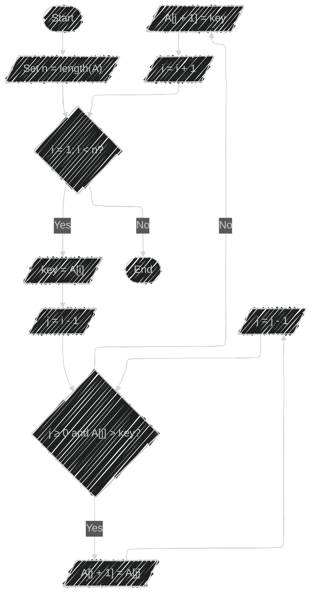
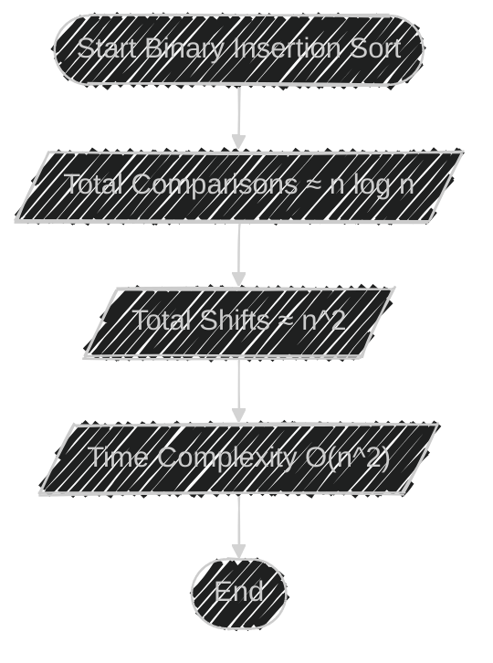
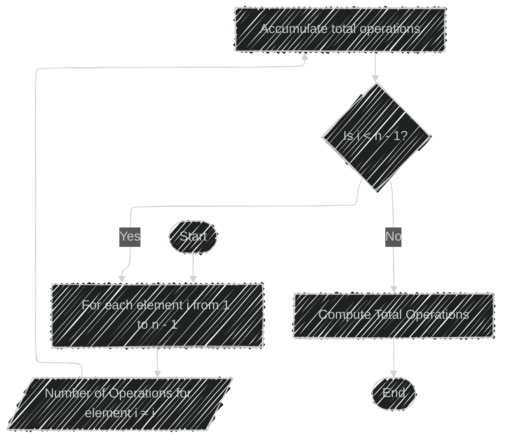
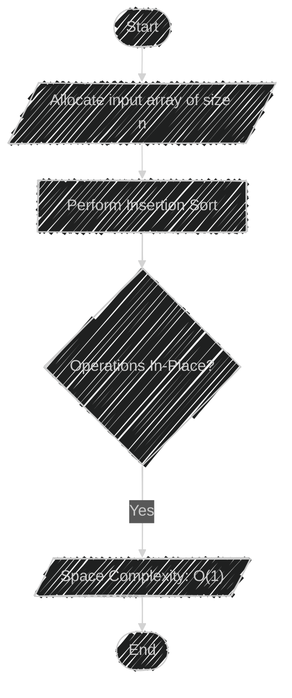
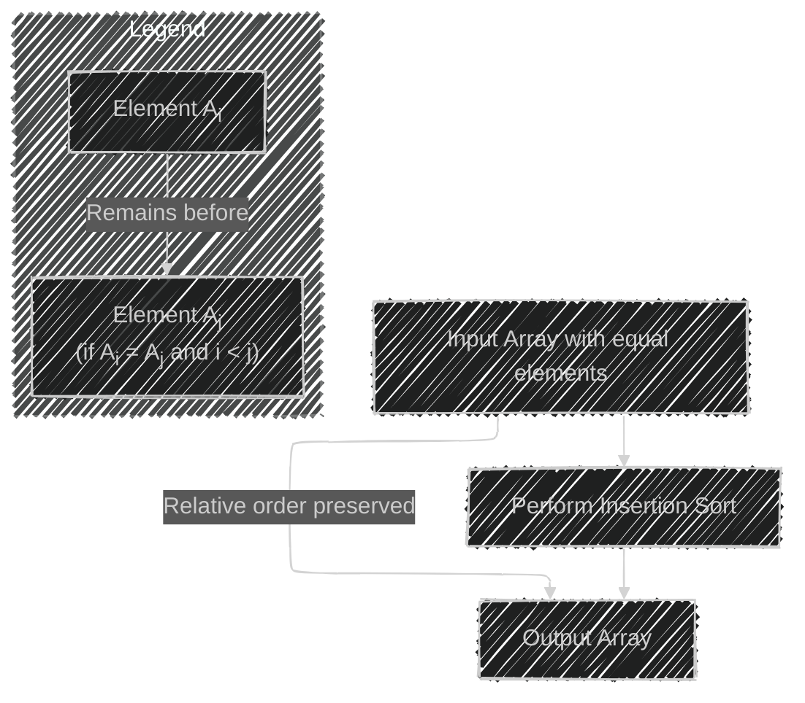

# Insertion Sort Algorithm - Mermaid diagrams

> This content is dual-licensed under your choice of the following licenses:
> 1.  **MIT License:** For the code implementations in Swift and Mermaid provided in this document.
> 2.  **Creative Commons Attribution 4.0 International License (CC BY 4.0):** For all other content, including the text, explanations, and the Mermaid diagrams and illustrations.

---

## **1. Flowchart of Insertion Sort Algorithm**

This flowchart illustrates the step-by-step process of the standard Insertion Sort algorithm.

**Explanation:**

- **Outer Loop:** Iterates from `i = 1` to `i = n - 1`.
- **Inner Loop:** Moves elements greater than `key` one position ahead to make space for the insertion.
- **Operations:**
  - Comparisons occur at the condition `A[j] > key`.
  - Shifts (assignments) happen when moving `A[j]` to `A[j + 1]`.

---

## **2. Worst-Case Time Complexity Visualization**

The worst-case occurs when the input array is in reverse order. Each new element is compared with all the sorted elements and shifted.

**Total Comparisons in Worst Case:**

$$
C_{\text{worst}} = \frac{n(n - 1)}{2} = O(n^2)
$$

---

## **3. Best-Case Time Complexity Visualization**

The best case occurs when the input array is already sorted. Each element needs only one comparison.

**Total Comparisons in Best Case:**

$$
C_{\text{best}} = n - 1 = O(n)
$$

---

## **4. Average-Case Time Complexity Visualization**

On average, the number of comparisons and shifts is approximately half that of the worst case.

**Total Comparisons in Average Case:**

$$
C_{\text{avg}} \approx \frac{n(n - 1)}{4} = O(n^2)
$$

---

## **5. Comparison Between Standard and Binary Insertion Sort**

### **5.1 Standard Insertion Sort**

### **5.2 Binary Insertion Sort**

**Explanation:**

- **Standard Insertion Sort:**
  - Uses linear search to find the insertion point.
  - Comparisons: $O(n^2)$
  - Shifts: $O(n^2)$
  - Time Complexity: $O(n^2)$

- **Binary Insertion Sort:**
  - Uses binary search to find the insertion point.
  - Comparisons: $O(n \log n)$
  - Shifts: $O(n^2)$
  - Time Complexity: $O(n^2)$ (dominated by shifts)

---

## **6. Time Complexity Summary Diagram**

This diagram summarizes the time complexities in different cases.

---

## **7. Operation Count Flowchart**

This flowchart demonstrates how the number of operations increases with each element inserted.

**Total Operations:**

$$
T(n) \approx \sum_{i=1}^{n-1} i = \frac{n(n - 1)}{2} = O(n^2)
$$

---

## **8. Shell Sort vs. Insertion Sort**

Illustrating how Shell Sort improves upon Insertion Sort using gap sequences.

---

## **9. Space Complexity Illustration**

Showing that Insertion Sort operates in-place with constant additional space.

---

## **10. Stability Characteristic**

Demonstrating that Insertion Sort is stable.

---

## **11. Algorithm Comparison Chart**

Although Mermaid doesn't support plotting graphs directly, we can create a conceptual diagram to compare time complexities.

---

## **Explanation of Diagrams**

The provided diagrams use Mermaid syntax to visualize key aspects of the Insertion Sort algorithm and its complexities:

- **Flowcharts:** Outline the steps of the algorithm, showing loops and conditions.
- **Graphs (Conceptual):** Illustrate how comparisons and shifts increase with the number of elements.
- **Comparisons:** Highlight the differences between standard and binary insertion sorts.
- **Time Complexity Summaries:** Summarize best-case, average-case, and worst-case complexities.
- **Additional Characteristics:** Display properties like space complexity and stability.

---
**Licenses:**

- **MIT License:**   - Full text in [LICENSE](LICENSE) file.
- **Creative Commons Attribution 4.0 International:**  - Legal details in [LICENSE-CC-BY](LICENSE-CC-BY) and at [Creative Commons official site](http://creativecommons.org/licenses/by/4.0/).

---