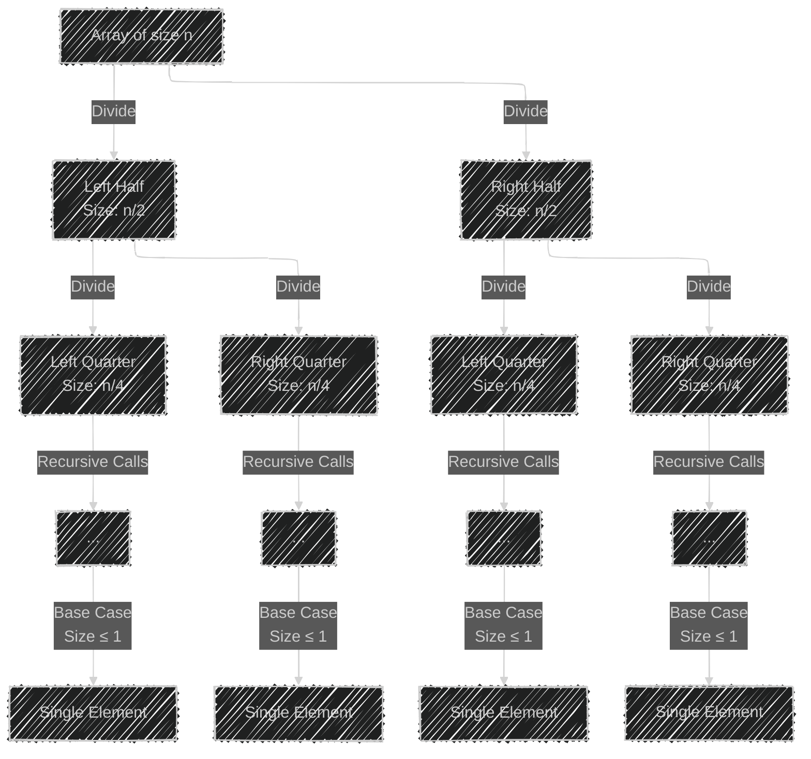
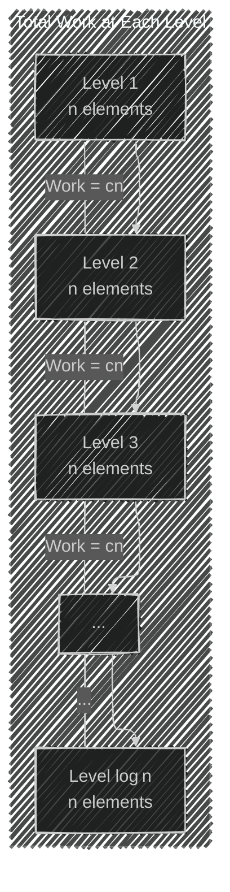
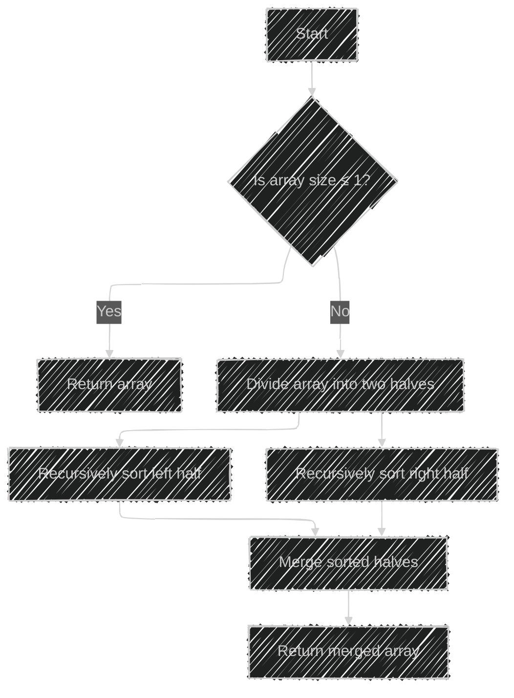
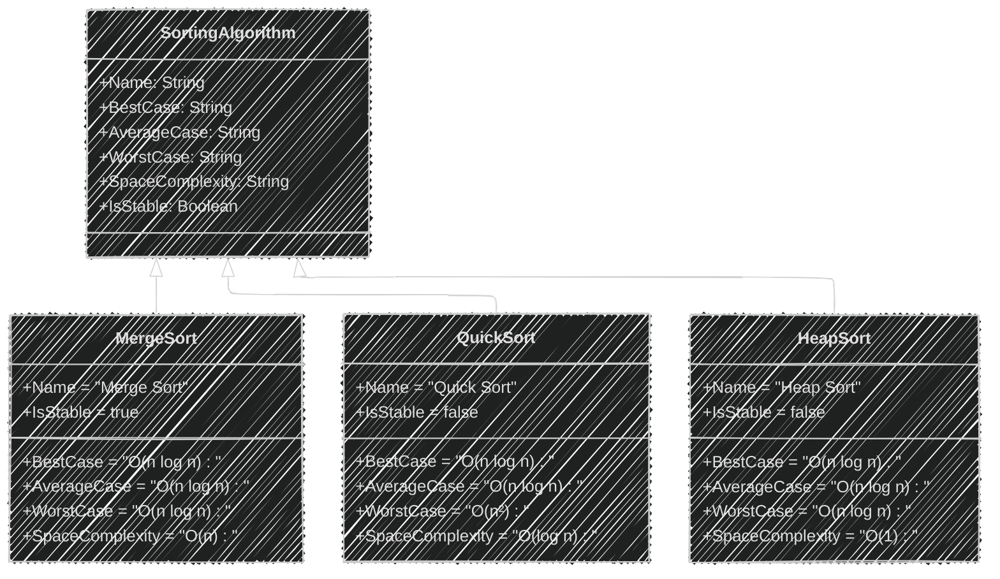
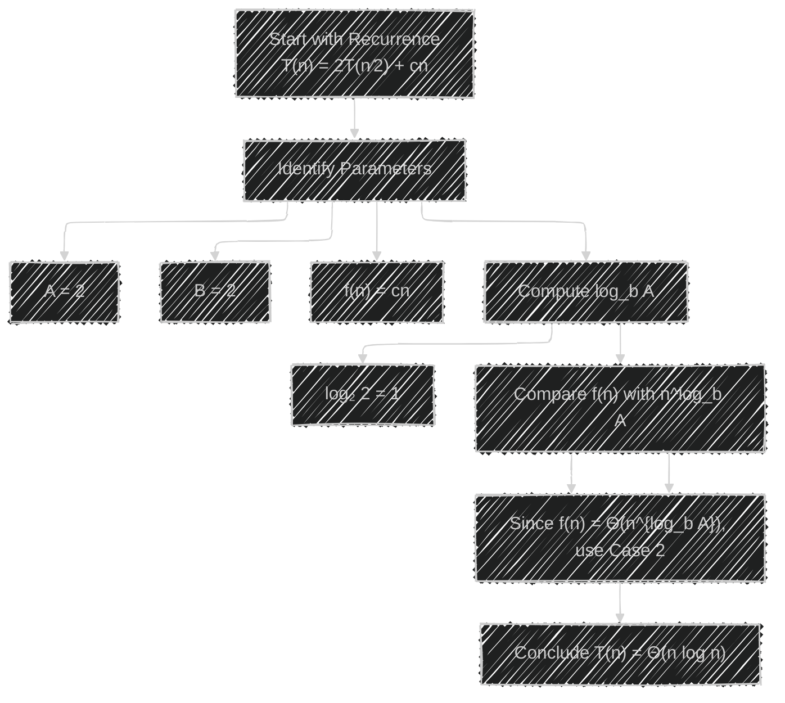
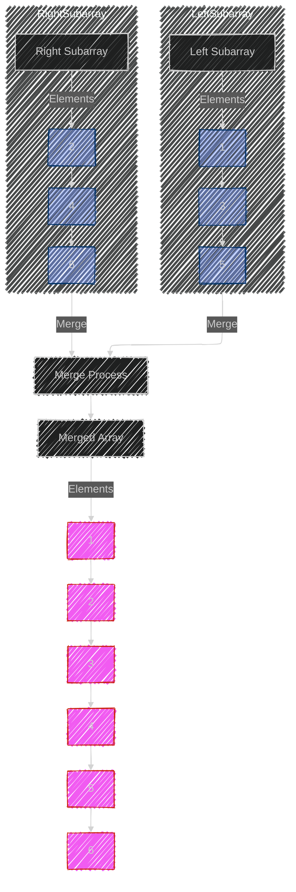
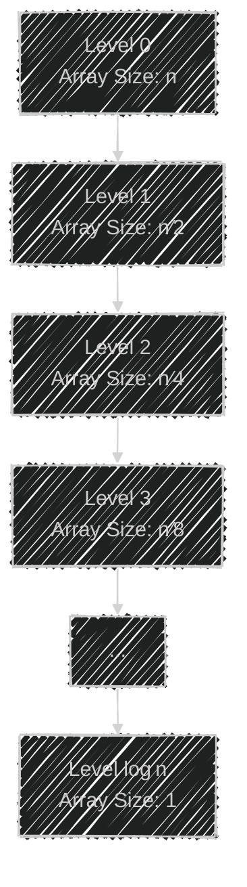

# Merge Sort Algorithm Framework  - Mermaid diagrams

> This content is dual-licensed under your choice of the following licenses:
> 1.  **MIT License:** For the code implementations in Swift and Mermaid provided in this document.
> 2.  **Creative Commons Attribution 4.0 International License (CC BY 4.0):** For all other content, including the text, explanations, and the Mermaid diagrams and illustrations.

---


### **1. Merge Sort Recursion Tree Diagram**

This diagram illustrates how the Merge Sort algorithm recursively divides the array until it reaches the base case.



- **Explanation:**
  - The array is divided into halves recursively.
  - The depth of the recursion tree is **log₂ n** since the array size reduces by half each time.
  - At the leaves, we reach arrays of size 1, which are inherently sorted.

---

### **2. Time Complexity Breakdown Diagram**

This diagram shows how the total time complexity of **O(n log n)** arises from the work done at each level of recursion.



- **Explanation:**
  - At each level, the total amount of data processed during merging is **n**.
  - With **log n** levels, the total time complexity is **O(n log n)**.

---

### **3. Merge Sort Algorithm Flowchart**

This flowchart depicts the steps involved in the Merge Sort algorithm.



- **Explanation:**
  - The algorithm checks if the array can be divided.
  - It recursively sorts both halves and then merges them.

---

### **4. Space Complexity Diagram**

This diagram explains the space requirements of Merge Sort.


- **Explanation:**
  - **Auxiliary Space:** Temporary arrays used during the merge step require **O(n)** space.
  - **Call Stack Space:** The recursion depth is **log n**, so the stack space is **O(log n)**.
  - The dominant term is **O(n)**.

---

### **5. Comparison Table of Sorting Algorithms**

This class diagram compares Merge Sort with other sorting algorithms.



- **Explanation:**
  - **Merge Sort** is stable and has consistent time complexity but requires extra space.
  - **Quick Sort** is faster on average but has a worse-case time of **O(n²)**.
  - **Heap Sort** has good time complexity and minimal space usage but is not stable.

---

### **6. Master Theorem Application Diagram**

This flowchart demonstrates how the Master Theorem is applied to determine the time complexity.




- **Explanation:**
  - **Parameters:** The recurrence fits the form for applying the Master Theorem.
  - **Result:** The time complexity is **Θ(n log n)**.

---

### **7. Execution Time vs. Input Size Illustration**

While Mermaid doesn't support graph plotting, we can represent the relationship between input size and execution time textually.

```mermaid
graph LR
    A[Input Size n]
    A -->|Time Complexity<br>T(n) = O(n log n)| B[Execution Time]

    note right of B
      - Execution time increases proportionally to n log n.
      - Doubling n increases T(n) by more than double.
    end
```

- **Explanation:**
  - The execution time grows logarithmically due to the **log n** factor.

---

### **8. Space-Time Trade-off Diagram**

This diagram illustrates the trade-off between time and space complexities.


- **Explanation:**
  - **Merge Sort** has optimal time complexity but requires extra space.
  - **In-place Merge Sort** reduces space but may increase time complexity due to overhead.

---

### **9. Merge Operation Illustration**

This diagram shows how two sorted subarrays are merged into a single sorted array.




- **Explanation:**
  - Elements from both subarrays are compared and merged in order.
  - This operation takes **O(n)** time where **n** is the total number of elements being merged.

---

### **10. Recursion Depth Visualization**

This diagram shows how the depth of recursion contributes to the **log n** factor in time complexity.




- **Explanation:**
  - The number of recursion levels is **log n**, contributing to the overall time complexity.

---

You can use the Mermaid Live Editor or any compatible tool to render these diagrams by copying the code snippets.

---

### **Note on Viewing Mermaid Diagrams**

To render and view the diagrams:

1. **Copy** the Mermaid code snippet for the diagram.
2. **Paste** the code into [Mermaid Live Editor](https://mermaid.live/).
3. **Render** the diagram to visualize it.
4. **Export** or **save** the diagram if needed.


---
**Licenses:**

- **MIT License:**  [](LICENSE) - Full text in [LICENSE](LICENSE) file.
- **Creative Commons Attribution 4.0 International:** [](LICENSE-CC-BY) - Legal details in [LICENSE-CC-BY](LICENSE-CC-BY) and at [Creative Commons official site](http://creativecommons.org/licenses/by/4.0/).

---