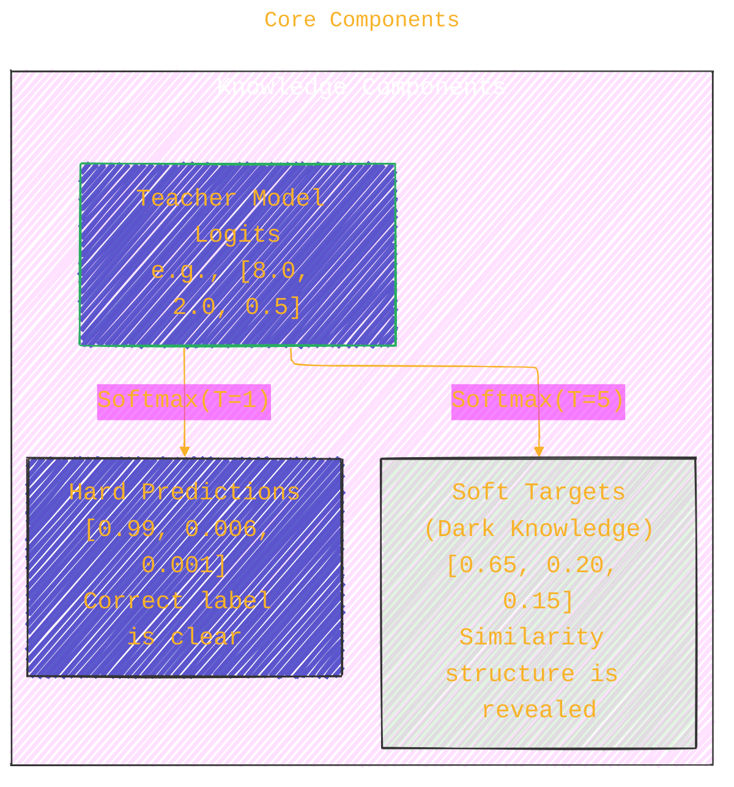

# Algorithmic Procedure for Knowledge Distillation: A Research-Oriented Analysis
> **Disclaimer:**
>
> This document contains my personal notes on the topic,
> compiled from publicly available documentation and various cited sources.
> The materials are intended for educational purposes, personal study, and reference.
> The content is dual-licensed:
> 1. **MIT License:** Applies to all code implementations (Swift, Mermaid, and other programming languages).
> 2. **Creative Commons Attribution 4.0 International License (CC BY 4.0):** Applies to all non-code content, including text, explanations, diagrams, and illustrations.
---


This document provides a structured analysis of the **Knowledge Distillation** algorithm, as introduced by Hinton, Vinyals, and Dean (2015). We adopt a systematic, step-by-step research framework to deconstruct, analyze, and validate the core concepts of this influential model compression technique.

---

## Step 1: Define the Research Scope

**Objective:** 🎯 To understand the fundamental principles of Knowledge Distillation, where "knowledge" from a large, high-performance "teacher" model is transferred to a smaller, computationally efficient "student" model.

**Keywords:**
*   Knowledge Distillation
*   Model Compression
*   Teacher-Student Learning
*   Soft Targets
*   Dark Knowledge
*   Response-Based Distillation

**Resources:**
*   **Primary Source:** Hinton, G., Vinyals, O., & Dean, J. (2015). "Distilling the Knowledge in a Neural Network." *arXiv:1503.02531*.
*   **Foundation:** Bucilua, C., Caruana, R., & Niculescu-Mizil, A. (2006). "Model compression." In *Proceedings of the 12th ACM SIGKDD*.
*   **Surveys:** Gou, J., et al. (2021). "Knowledge distillation: A survey." *International Journal of Computer Vision*.

**Mathematical Focus:**
The central idea is captured by a composite loss function that combines a standard supervised loss with a distillation loss.

$$
\mathcal{L}_{\text{total}} = (1 - \alpha) \cdot \mathcal{L}_{\text{hard}} + \alpha \cdot \mathcal{L}_{\text{soft}}
$$

Where:
*   $\mathcal{L}_{\text{hard}}$ is the loss against the ground-truth labels (hard targets).
*   $\mathcal{L}_{\text{soft}}$ is the loss against the teacher model's probability distribution (soft targets).
*   $\alpha$ is a hyperparameter that balances the two loss components.

---

## Step 2: Analyze Core Components and Their Roles

**Objective:** 🔬 To break down the function of each component in the distillation framework: the teacher, the student, and the knowledge transfer mechanism (temperature-controlled softmax).

**Keywords:**
*   Teacher Model
*   Student Model
*   Softmax Temperature
*   Logits
*   Cross-Entropy

**Focus Areas:**
*   **Teacher Model ($M_T$):** Its primary role is not just to be accurate but to provide a rich, nuanced probability distribution over all classes. This distribution, containing the "dark knowledge," reveals the inter-class similarities it has learned.
*   **Student Model ($M_S$):** Its objective is to learn a compressed function that mimics the teacher's output distribution, thereby inheriting its generalization capabilities.
*   **Temperature ($T$):** This hyperparameter is the key to unlocking dark knowledge. By "raising the temperature" of the softmax function, we soften the output probabilities, forcing the student to pay attention to the relative probabilities of incorrect classes.

**Mathematical Focus:**
The **Softmax with Temperature** function is crucial for generating soft targets.

$$
q_i = \sigma(z_i, T) = \frac{\exp(z_i/T)}{\sum_{j} \exp(z_j/T)}
$$

*   When $T=1$, this is the standard softmax.
*   As $T \to \infty$, the distribution approaches a uniform distribution.
*   A moderately high $T$ (e.g., 2 to 20) reveals the similarity structure learned by the teacher.



----

## Step 3: Explore Different Distillation Configurations

**Objective:** ⚙️ To compare the standard distillation setup with alternative configurations and understand their specific use cases.

**Keywords:**
*   Logit Matching
*   Hard vs. Soft Targets
*   Unlabeled Data
*   Loss Function Design

**Tasks:**
*   **Standard Distillation (with labels):** The student is trained on a combination of hard labels from the dataset and soft targets from the teacher. This is the main approach in Hinton et al. (2015).
*   **Distillation with Unlabeled Data:** If a large set of unlabeled data is available, the student can be trained using only the teacher's soft targets. This allows the student to learn from data far beyond the original labeled set.
*   **Matching Logits:** The original "Model Compression" paper by Caruana et al. proposed minimizing the squared difference between the logits of the teacher and student. Hinton et al. show this is a special case of their method.

**Mathematical Focus:**
The total loss function is adapted based on the configuration. For standard distillation:

$$
\mathcal{L}_{\text{total}} = (1 - \alpha) \cdot \mathcal{L}_{\text{CE}}(y_{\text{hard}}, \sigma(z_S, 1)) + \alpha \cdot T^2 \cdot \mathcal{L}_{\text{CE}}(\sigma(z_T, T), \sigma(z_S, T))
$$

*The $T^2$ term is a heuristic to keep the gradient contributions from the soft and hard targets roughly balanced.*

---

## Step 4: Conduct Theoretical Analysis

**Objective:** 🧠 To derive and understand the theoretical justification for why distillation is effective, focusing on its role as a regularizer and the mathematical connection between distillation and logit matching.

**Keywords:**
*   Information Theory
*   Implicit Regularization
*   High-Temperature Limit
*   KL-Divergence

**Tasks:**
*   **Distillation as Regularization:** Soft targets provide a much smoother and higher-entropy distribution than one-hot encoded hard targets. Forcing the student to match this smooth distribution acts as a powerful regularizer, preventing it from becoming over-confident and improving generalization, especially on smaller datasets. The paper's experiment on 3% of speech data provides strong evidence for this.
*   **Derivation of the High-Temperature Limit:** Hinton et al. (2015) show that as $T \to \infty$, minimizing the KL-divergence between the teacher's and student's soft distributions is equivalent to minimizing the mean squared error between their logits (assuming zero-meaned logits).

**Mathematical Focus:**
The paper shows the gradient of the cross-entropy loss w.r.t. the student's logits $z_i$ is:

$$
\frac{\partial \mathcal{L}_{\text{soft}}}{\partial z_i} = \frac{1}{T} \left( \sigma(z_i, T) - \sigma(z_{Ti}, T) \right)
$$

KaTex alternative version:

$$\frac{\partial \mathcal{L}_{\text{soft}}}{\partial z_i} = \frac{1}{T} \left( \sigma(z_i, T) - \sigma(z_{Ti}, T) \right)$$

In the high-temperature limit ($T \to \infty$), this approximates to:

$$
\frac{\partial \mathcal{L}_{\text{soft}}}{\partial z_i} \approx \frac{1}{NT^2} (z_i - z_{T_i})
$$


This gradient corresponds to minimizing $\frac{1}{2} (z_i - z_{T_i})^2$, proving that logit matching is a special case of distillation.

> [!NOTE]
> GitHub's math renderer may not display the equations above as intended.<br/>
> The math expressions in both LaTeX/KaTeX syntax are valid and work as expected in other editors externally.

----

## Step 5: Review Existing Literature and Case Studies

**Objective:** 📚 To survey the empirical evidence presented in Hinton et al. (2015) that demonstrates the effectiveness of knowledge distillation across different domains.

**Keywords:**
*   MNIST
*   Speech Recognition
*   JFT Dataset
*   Empirical Results

**Resources:**
*   Analyze Tables 1, 3, and 5 from Hinton, Vinyals, and Dean (2015).

**Mathematical Focus:**
Quantify the impact of distillation by comparing performance metrics.
*   **Speech Recognition (Table 1):**
	*   Baseline Single Model: 58.9% frame accuracy.
	*   10-Model Ensemble (Teacher): 61.1% frame accuracy (*+2.2% gain*).
	*   Distilled Single Model (Student): 60.8% frame accuracy (*+1.9% gain*).
	*   *Conclusion:* The distilled model captured **~86%** ($1.9 / 2.2$) of the improvement from the bulky ensemble.
*   **Regularization (Table 5):**
	*   Training on 3% of data with hard targets: 44.5% accuracy (severe overfitting).
	*   Training on 3% of data with soft targets: 57.0% accuracy.
	*   *Conclusion:* Soft targets are a highly effective mechanism for transferring learned regularities and preventing overfitting.

---

## Step 6: Implement Experimental Studies

**Objective:** 🧪 To empirically validate the theory by implementing a teacher-student framework and conducting controlled experiments.

**Keywords:**
*   PyTorch
*   TensorFlow
*   Implementation
*   Benchmarking
*   Ablation Study

**Tasks:**
1.  **Choose Framework and Dataset:** e.g., PyTorch with CIFAR-100.
2.  **Define Models:**
	*   **Teacher:** A large, pre-trained model (e.g., ResNet-110).
	*   **Student:** A smaller model (e.g., ResNet-20).
3.  **Implement Training Loop:** Write a script that incorporates the composite loss function from **Step 3**.
4.  **Run Experiments:**
	*   **Baseline:** Train the student model from scratch using only hard targets.
	*   **Distillation:** Train the student model using the distillation procedure.
	*   **Ablation:** Systematically vary hyperparameters like `T` and `α` to measure their impact on final student accuracy.

**Mathematical Focus:**
The primary metric is the final test accuracy. The goal is to show that:

$$
\text{Accuracy}(M_{S, \text{distilled}}) > \text{Accuracy}(M_{S, \text{baseline}})
$$

This empirical validation confirms that the knowledge transfer leads to a tangible performance improvement.

---

## Step 7: Optimize and Explore Advanced Techniques

**Objective:** 🚀 To investigate the advanced "ensemble of specialists" technique proposed for very large-scale problems and understand how it addresses the limitations of standard ensembles.

**Keywords:**
*   Specialist Ensembles
*   JFT Dataset
*   Scalability
*   KL-Divergence Minimization

**Tasks:**
*   **Research the Specialist Approach:** Understand the two-stage inference process.
	1.  A "generalist" model provides an initial set of probable classes.
	2.  Relevant "specialist" models (trained on confusing subsets, e.g., types of mushrooms) are activated to refine the prediction.
*   **Analyze the Training Method:** Specialists are initialized with the generalist's weights and trained on data highly enriched with their specific classes, making training highly parallelizable and much faster than training multiple full models.

**Mathematical Focus:**
The inference process for specialists involves finding a probability distribution $q$ that best agrees with the generalist ($p_g$) and the set of active specialists ($p_m$). This is done by minimizing a sum of KL-divergences:

$$
\min_{q} \left( \text{KL}(p_g, q) + \sum_{m \in \text{ActiveSpecialists}} \text{KL}(p_m, q) \right)
$$

---

## Step 8: Document Findings and Formulate Conclusions

**Objective:** ✍️ To compile the theoretical and empirical findings into a comprehensive conclusion about the power and versatility of knowledge distillation.

**Keywords:**
*   Research Documentation
*   Performance Analysis
*   Conclusion
*   Impact

**Tasks:**
*   **Summarize Theory:** Recap that distillation works by transferring a teacher's learned class-similarity structure through high-entropy soft targets, which also acts as a powerful regularizer.
*   **Present Key Data:** Cite the ~86% compression of ensemble gains in speech recognition and the dramatic prevention of overfitting on small datasets as primary evidence.
*   **Discuss Implications:** Knowledge Distillation provides a practical and effective bridge between the need for large, complex models during research/training and the need for small, efficient models in real-world deployment.
*   **Suggest Future Research:** As hinted in the paper, an interesting direction is distilling the knowledge from the specialist ensemble back into a single, improved generalist model.

---

## Summary Table of Research Steps for Knowledge Distillation

| **Step** | **Objective**                                      | **Keywords**                                    | **Mathematical Focus**                                                                      |
|:--------:|:---------------------------------------------------|:------------------------------------------------|:--------------------------------------------------------------------------------------------|
|    1     | Define Research Scope                              | Knowledge Distillation, Model Compression       | $\mathcal{L}_{\text{total}} = (1-\alpha)\mathcal{L}_{\text{hard}} + \alpha\mathcal{L}_{\text{soft}}$ |
|    2     | Analyze Core Components                            | Teacher Model, Soft Targets, Temperature        | $\sigma(z_i, T) = \frac{\exp(z_i/T)}{\sum_j \exp(z_j/T)}$                                      |
|    3     | Explore Distillation Configurations                | Logit Matching, Loss Function Design            | Comparison of loss functions for different scenarios.                                      |
|    4     | Conduct Theoretical Analysis                       | Implicit Regularization, High-Temperature Limit | Derivation of logit matching as a special case of distillation.                             |
|    5     | Review Literature and Case Studies                 | MNIST, Speech Recognition, Empirical Results    | Quantitative analysis of results from the original paper.                                   |
|    6     | Implement Experimental Studies                     | PyTorch, Benchmarking, Ablation Study           | Empirically validating that $\text{Acc}_{\text{distilled}} > \text{Acc}_{\text{baseline}}$    |
|    7     | Optimize and Explore Advanced Techniques           | Specialist Ensembles, Scalability               | $\min_q \sum \text{KL}(p, q)$ for inference with specialists.                                 |
|    8     | Document Findings and Formulate Conclusions        | Research Documentation, Impact                  | Synthesis of theoretical insights and empirical evidence.                                   |

---

## References

*   Bucilua, Cristian, Rich Caruana, and Alexandru Niculescu-Mizil. "Model compression." In *Proceedings of the 12th ACM SIGKDD international conference on Knowledge discovery and data mining*, 535-541. 2006.
*   Gou, Jianping, Baosheng Yu, Stephen John Maybank, and Dacheng Tao. "Knowledge distillation: A survey." *International Journal of Computer Vision* 129, no. 6 (2021): 1789-1819.
*   Hinton, Geoffrey, Oriol Vinyals, and Jeff Dean. "Distilling the Knowledge in a Neural Network." *arXiv preprint arXiv:1503.02531* (2015).

-----


```mermaid
---
title: "❓...C<char>o&#770;</char>ngL<char>e&#770;</char>SolutionX....❓"
author: "Cong Le"
version: "1.0"
license(s): "MIT, CC BY-SA 4.0"
copyright: "Copyright (c) 2025 Cong Le. All Rights Reserved."
config:
  theme: base
---
%%%%%%%% Mermaid version v11.4.1-b.14
%%{
  init: {
    'flowchart': { 'htmlLabels': false },
    'fontFamily': 'Bradley Hand',
    'themeVariables': {
      'primaryColor': '#fc82',
      'primaryTextColor': '#F8B229',
      'primaryBorderColor': '#27AE60',
      'secondaryColor': '#81c784',
      'secondaryTextColor': '#6C3483',
      'lineColor': '#F8B229',
      'fontSize': '20px'
    }
  }
}%%
flowchart LR
  My_Meme@{ img: "https://raw.githubusercontent.com/CongLeSolutionX/CongLeSolutionX/refs/heads/main/assets/images/My-meme-light-bulb-question-marks.png", label: "Ăn uống gì chưa ngừi đẹp?", pos: "b", w: 200, h: 150, constraint: "off" }

  Closing_quote@{ shape: braces, label: "...searching insights in the process of formulating better questions..." }

  Closing_quote ~~~ My_Meme
    
  Link_to_my_profile{{"<a href='https://github.com/CongLeSolutionX' target='_blank'>Click here if you care about the profile of a tech guy seeking for a job 🙏🏼</a>"}}

  Closing_quote ~~~ My_Meme
  My_Meme animatingEdge@--> Link_to_my_profile
  
  animatingEdge@{ animate: true }

```


---
**Licenses:**

- **MIT License:**  [](LICENSE) - Full text in [LICENSE](LICENSE) file.
- **Creative Commons Attribution 4.0 International:** [](LICENSE-CC-BY) - Legal details in [LICENSE-CC-BY](LICENSE-CC-BY) and at [Creative Commons official site](http://creativecommons.org/licenses/by/4.0/).

---
