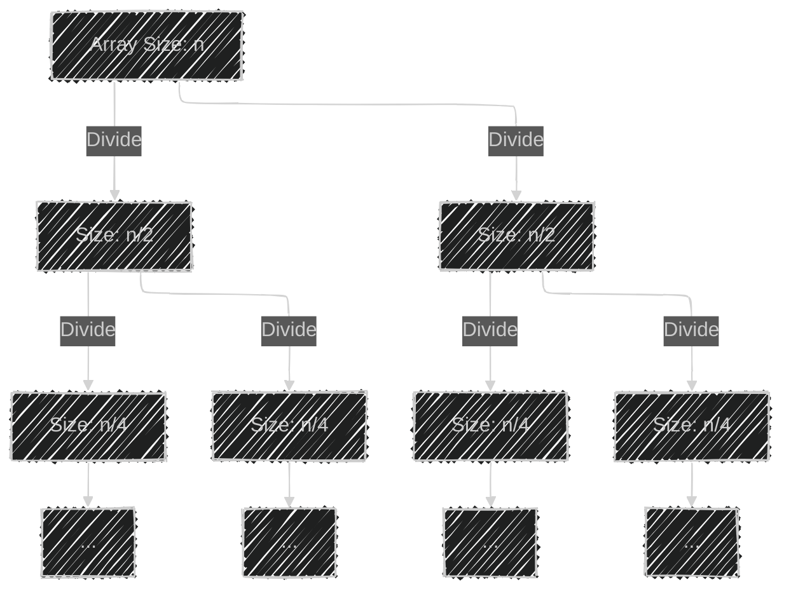
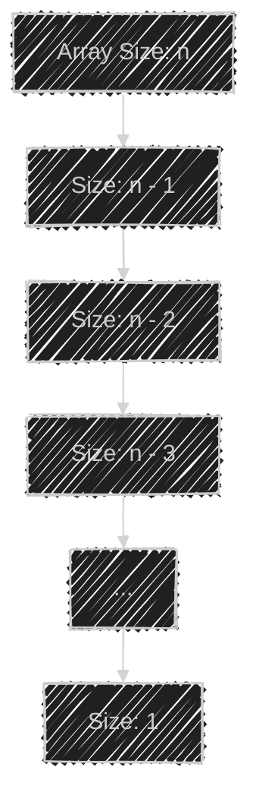
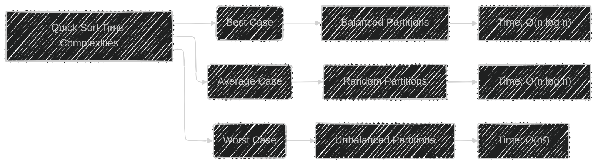
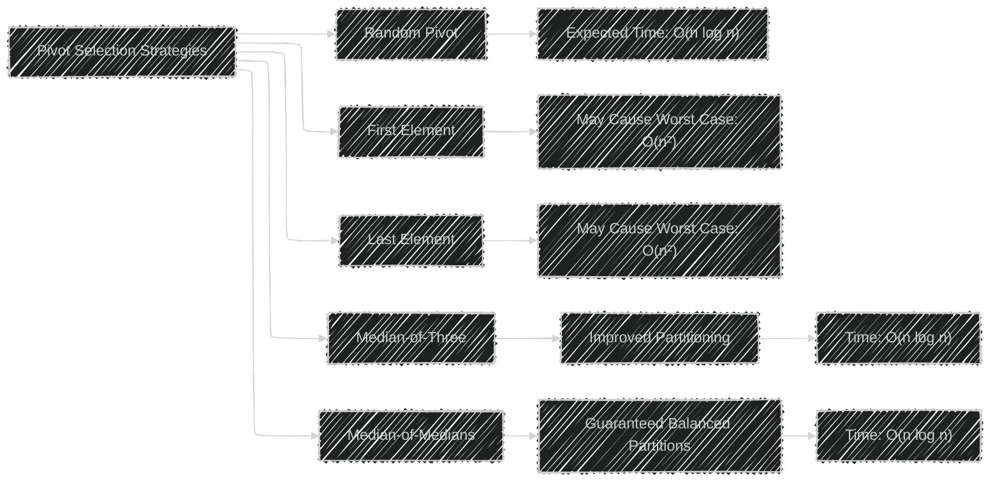
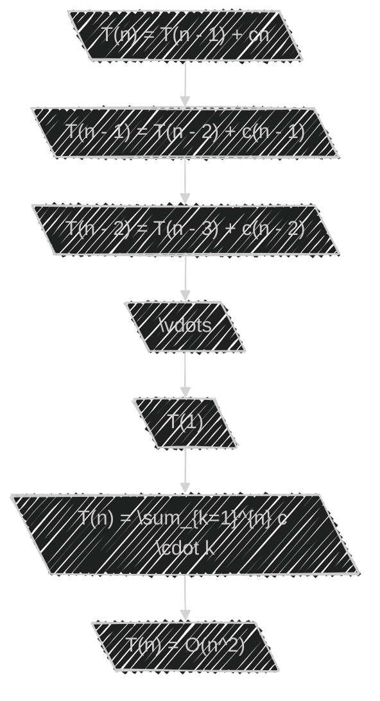
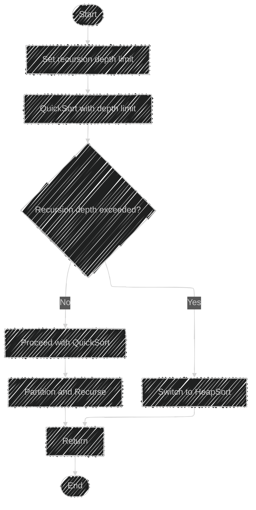
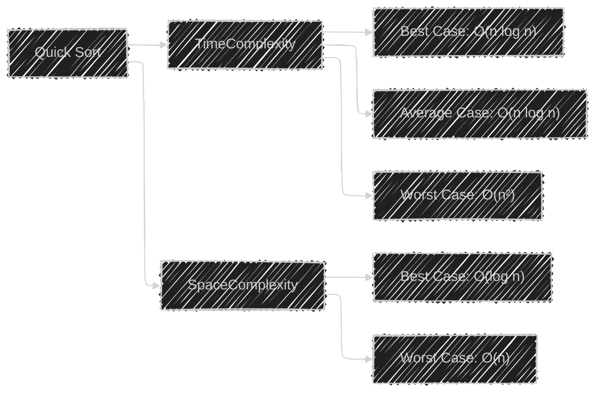

# Quick Sort Algorithm Framework  - Mermaid diagrams

> This content is dual-licensed under your choice of the following licenses:
> 1.  **MIT License:** For the code implementations in Swift and Mermaid provided in this document.
> 2.  **Creative Commons Attribution 4.0 International License (CC BY 4.0):** For all other content, including the text, explanations, and the Mermaid diagrams and illustrations.

---

## **1. Flowchart of the Quick Sort Algorithm**

**Explanation:**

- **Start:** Begin the Quick Sort algorithm.
- **Check Condition:** If `low < high`, proceed to partitioning; else, return.
- **Partition:** The array is partitioned around a pivot element.
- **Recursive Calls:** Quick Sort is called recursively on the left and right subarrays.
- **Merge and Return:** Results are merged (though Quick Sort is an in-place sort and doesn't explicitly merge) and the function returns.

---

## **2. Recursion Tree in Best-Case Scenario**

**Explanation:**

- The array is divided into two equal halves at each level.
- The height of the recursion tree is `log n`.
- Total work at each level is `n`.
- **Total Time Complexity:** $O(n \log n)$

---

## **3. Recursion Tree in Worst-Case Scenario**

**Explanation:**

- The pivot always partitions the array into sizes `n-1` and `0`.
- The recursion tree is skewed, resembling a linked list.
- The height of the recursion tree is `n`.
- **Total Time Complexity:** $O(n^2)$.

---

## **4. Comparison of Time Complexities**

**Explanation:**

- **Best Case:** Occurs with perfectly balanced partitions; time complexity is $O(n \log n)$.
- **Average Case:** With random data, the expected time complexity is $O(n \log n)$.
- **Worst Case:** Occurs with unbalanced partitions (e.g., sorted array and bad pivot selection); time complexity is $O(n^2)$.

---

## **5. Space Complexity Visualization**

**Explanation:**

- **Best Case Space Complexity:** The recursion stack depth is $\log n$, leading to space complexity $O(\log n)$.
- **Worst Case Space Complexity:** The recursion stack depth is $n$, leading to space complexity $O(n)$.

---

## **Additional Diagram: Impact of Pivot Selection**

**6. Effect of Pivot Selection on Time Complexity**

**Explanation:**

- **Random Pivot:** Reduces the chance of worst-case; expected $O(n \log n)$.
- **First/Last Element Pivot:** Can cause worst-case $O(n^2)$ if the array is already sorted.
- **Median-of-Three:** Improves partitioning by choosing a better pivot.
- **Median-of-Medians:** Ensures balanced partitions, guaranteeing $O(n \log n)$ time complexity.

---

## **Visualizing the Master Theorem Application**

**7. Applying Master Theorem to Best Case**

**Explanation:**

- The recurrence relation for the best case fits **Case 2** of the Master Theorem.
- This results in the time complexity \( O(n \log n) \).

---

## **Visualizing the Recurrence Unfolding in Worst Case**

**8. Unfolding the Recurrence for Worst Case**

**Explanation:**

- Unfolding the recurrence shows that the total time is proportional to the sum of the sequence $n + (n - 1) + (n - 2) + \dots + 1$.
- This sum equals $\frac{n(n + 1)}{2}$, leading to $O(n^2)$ time complexity.

---

## **Recursion Tree Depth Comparison**

**9. Recursion Depth in Best and Worst Cases**

**Explanation:**

- **Best Case Recursion Depth:** The recursion tree's height is $\log n$ due to balanced partitions.
- **Worst Case Recursion Depth:** The recursion tree's height is $n$ due to unbalanced partitions.

---

## **Visualization of Hybrid Sorting Approach**

**10. Introsort Algorithm Overview**

**Explanation:**

- **Introsort** starts with Quick Sort but switches to Heap Sort when the recursion depth exceeds a certain limit to ensure $O(n \log n)$ time complexity in the worst case.

---

## **Visual Representation of Algorithm Complexities**

**11. Summary of Quick Sort Complexities**

---

**Note on Diagram Usage:**

- Use these diagrams to visualize how Quick Sort operates under different conditions.
- They illustrate how the algorithm's time and space complexities are affected by factors like pivot selection and partitioning strategy.

---

## **How to Render Mermaid Diagrams**

To view these diagrams visually, you can:

- Use an online Mermaid renderer such as [Mermaid Live Editor](https://mermaid.live/).
- Integrate Mermaid diagrams into Markdown documents using tools like VSCode with the Mermaid plugin.
- Use the `mermaid` command-line tool to generate images from the syntax.

---
**Licenses:**

- **MIT License:**   - Full text in [LICENSE](LICENSE) file.
- **Creative Commons Attribution 4.0 International:**  - Legal details in [LICENSE-CC-BY](LICENSE-CC-BY) and at [Creative Commons official site](http://creativecommons.org/licenses/by/4.0/).

---