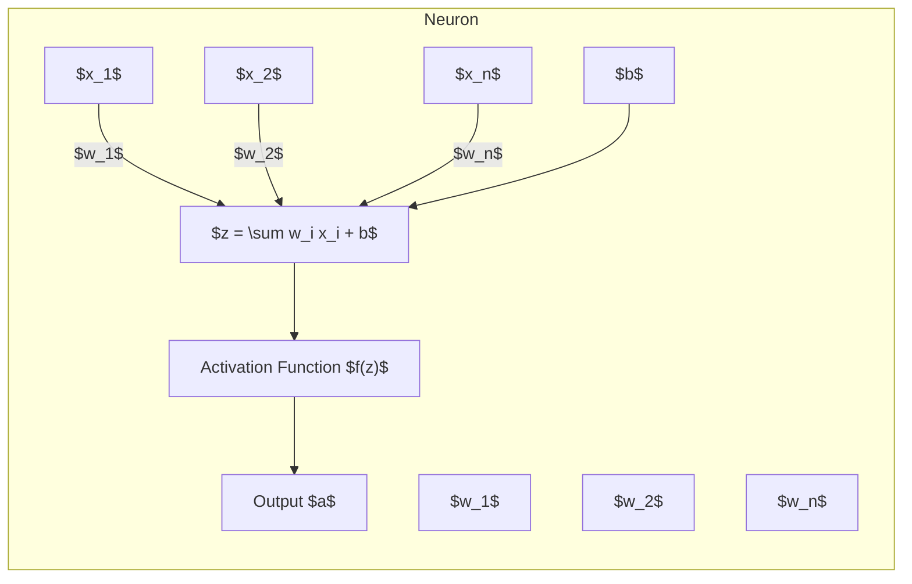
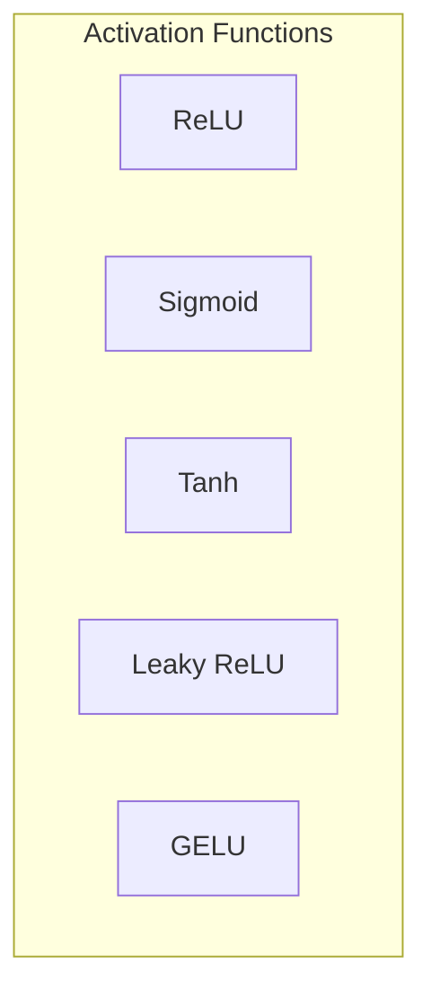
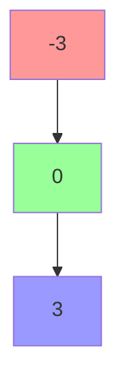
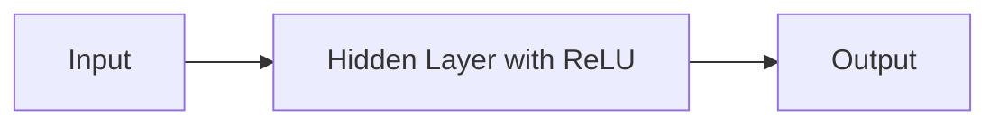
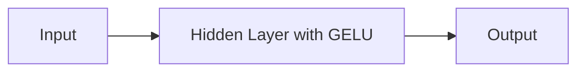

# Activation Functions in Neural Networks
> This content is dual-licensed under your choice of the following licenses:
> 1.  **MIT License:** For the code implementations in Swift and Mermaid provided in this document.
> 2.  **Creative Commons Attribution 4.0 International License (CC BY 4.0):** For all other content, including the text, explanations, and the Mermaid diagrams and illustrations.

---

Activation functions are a fundamental component of neural networks. They introduce non-linearities into the network, enabling it to learn and model complex patterns in data. Without activation functions, neural networks would be limited to modeling linear relationships, which are insufficient for capturing the complexities of real-world data.

---

## **1. Purpose of Activation Functions**

- **Introduce Non-Linearities**: Activation functions allow neural networks to capture non-linear patterns by transforming the inputs into non-linear outputs.
- **Enable Complex Modeling**: They enable networks to approximate any function, given sufficient data and network capacity, according to the Universal Approximation Theorem.
- **Control Signal Flow**: Activation functions decide whether a neuron should be activated or not, based on the input it receives, effectively controlling the signal flow within the network.

---

## **2. Role in Neural Networks**

In a neural network, each neuron performs the following operations:

1. **Compute Weighted Sum**: Calculate the weighted sum of inputs plus a bias.

$$
   z = \sum_{i=1}^{n} w_i x_i + b
$$

1. **Apply Activation Function**: Transform the weighted sum using an activation function $f(z)$.

$$
   a = f(z)
$$

### **Illustration of Neuron Operation**



---

## **3. Importance of Non-Linearities**

Without activation functions (non-linearities), a neural network would essentially perform linear transformations of the input data, regardless of the number of layers. This limitation arises because the composition of linear functions remains linear. Activation functions enable networks to:

- **Model Complex Functions**: Capture intricate patterns, interactions, and dependencies in the data.
- **Introduce Hierarchical Feature Learning**: Learn multiple levels of abstraction through layers.
- **Enhance Expressiveness**: Increase the representational power of the network.

---

## **4. Common Activation Functions**

### **4.1 Rectified Linear Unit (ReLU)**

#### **Definition**

The ReLU activation function is defined as:

$$
f(x) = \max(0, x)
$$

#### **Graphical Representation**

```mermaid
graph TD
    A(-5) --> B[0]
    B --> C[0]
    C --> D(5)
    style B fill:#f9f,stroke:#333,stroke-width:2px;
    A(-- Negative Input -->|Output = 0| B)
    D(-- Positive Input -->|Output = x| D)
```

#### **Properties**

- **Sparsity**: Activates only for positive inputs, leading to sparse activations.
- **Computational Efficiency**: Simple and fast to compute.
- **Non-Saturating Gradients**: Mitigates the vanishing gradient problem for positive inputs.

#### **Advantages**

- **Ease of Computation**: Facilitates faster training.
- **Improved Gradient Propagation**: Helps in deeper networks by keeping gradients significant.

#### **Disadvantages**

- **Dying ReLU Problem**: Neurons can get stuck during training if weights cause all inputs to be negative, rendering them inactive permanently.
- **Unbounded Output**: Can lead to exploding activations if not properly managed.

---

### **4.2 Gaussian Error Linear Unit (GELU)**

#### **Definition**

The GELU activation function is defined as:

$$
f(x) = x \cdot \Phi(x)
$$

Where \( \Phi(x) \) is the cumulative distribution function of the standard normal distribution.

**Approximate Formula for Computation:**

$$
f(x) \approx 0.5 x \left(1 + \tanh\left( \sqrt{\dfrac{2}{\pi}} \left( x + 0.044715 x^3 \right) \right) \right)
$$

#### **Graphical Representation**

```mermaid
graph TD
    A(-5) --> B(-2)
    B --> C(0)
    C --> D(2)
    D --> E(5)
    style C fill:#f9f,stroke:#333,stroke-width:2px;
    A(-- Negative Input -->|Smoothly Approaches 0| B)
    B -->|Negative Output| C
    C(-- Zero Input -->|Output = 0| C)
    D -->|Positive Output| E
    E(-- Positive Input -->|Smoothly Approaches x| E)
```

#### **Properties**

- **Smooth Activation**: Differentiable everywhere, ensuring smooth gradient flow.
- **Probabilistic Interpretation**: Multiplies input by the probability of activation.

#### **Advantages**

- **Performance Improvement**: Empirically shown to improve performance in transformer models.
- **Handles Negative Inputs**: Provides non-zero output for negative inputs, unlike ReLU.

#### **Disadvantages**

- **Computational Complexity**: More computationally intensive than ReLU due to exponential and hyperbolic functions.
- **Implementation Considerations**: May require approximations for efficiency.

---

## **5. Other Notable Activation Functions**

### **5.1 Sigmoid Function**

#### **Definition**

$$
f(x) = \dfrac{1}{1 + e^{-x}}
$$

#### **Properties**

- **Output Range**: (0, 1)
- **Use Case**: Output layer for binary classification.
- **Limitations**: Prone to vanishing gradient problem, especially in deep networks.

### **5.2 Hyperbolic Tangent (Tanh) Function**

#### **Definition**

$$
f(x) = \tanh(x) = \dfrac{e^{x} - e^{-x}}{e^{x} + e^{-x}}
$$

#### **Properties**

- **Output Range**: (-1, 1)
- **Zero-Centered Output**: Centers data around zero, which can improve convergence.
- **Limitations**: Also suffers from vanishing gradients for large input magnitudes.

### **5.3 Leaky ReLU**

#### **Definition**

$$
f(x) = \begin{cases}
x, & \text{if } x \geq 0 \\
\alpha x, & \text{if } x < 0
\end{cases}
$$

Where $\alpha$ is a small positive constant (e.g., 0.01).

#### **Properties**

- **Mitigates Dying ReLU**: Allows a small gradient when the unit is not active.
- **Maintains Computational Efficiency**.

---

## **6. Comparative Analysis**

### **6.1 Graphical Comparison**



- **ReLU**: Zero for negative inputs, linear for positive inputs.
- **Sigmoid**: S-shaped curve, asymptotically approaches 0 and 1.
- **Tanh**: S-shaped curve, asymptotically approaches -1 and 1.
- **Leaky ReLU**: Small slope for negative inputs, linear for positive inputs.
- **GELU**: Smooth curve combining characteristics of ReLU and Sigmoid/Tanh.

### **6.2 Feature Comparison Table**

| Activation Function | Output Range  | Differentiable Everywhere | Computational Cost | Vanishing Gradient | Dying Neuron Problem |
|---------------------|---------------|---------------------------|--------------------|--------------------|----------------------|
| ReLU                | [0, ∞)        | No (non-differentiable at 0) | Low                | No                 | Yes                  |
| Sigmoid             | (0, 1)        | Yes                       | Medium             | Yes                | No                   |
| Tanh                | (-1, 1)       | Yes                       | Medium             | Yes                | No                   |
| Leaky ReLU          | (-∞, ∞)       | Yes                       | Low                | No                 | Mitigated            |
| GELU                | (-∞, ∞)       | Yes                       | High               | No                 | No                   |

---

## **7. Applications in Modern Neural Networks**

### **7.1 ReLU in Convolutional Neural Networks (CNNs)**

- **Standard Choice**: ReLU is widely used in CNNs due to its simplicity and effectiveness.
- **Benefits**: Facilitates training of deep networks by mitigating vanishing gradients.

### **7.2 GELU in Transformer Architectures**

- **Default Activation**: GELU is the activation function used in transformer models like BERT and GPT.
- **Rationale**: GELU's smooth and probabilistic nature aligns well with the self-attention mechanisms in transformers.

### **7.3 Leaky ReLU and Variants in Deep Networks**

- **Usage**: Employed to address specific issues like the dying ReLU problem.
- **Variants**: Parametric ReLU (PReLU), Exponential Linear Unit (ELU), Scaled Exponential Linear Unit (SELU).

---

## **8. Technical Considerations**

### **8.1 Vanishing Gradient Problem**

- **Description**: Gradients decrease exponentially as they propagate back through layers, hindering weight updates.
- **Activation Functions Affected**: Sigmoid and Tanh are susceptible due to their output ranges and derivatives approaching zero for large input magnitudes.

### **8.2 Dying ReLU Problem**

- **Description**: Neurons become inactive when they output zero for all inputs.
- **Impact**: Neurons stop contributing to learning, reducing model capacity.

### **8.3 Computational Efficiency**

- **Importance**: Activation functions contribute to the overall computational load.
- **Trade-Off**: Complex functions like GELU offer benefits but at increased computational cost.

### **8.4 Derivatives for Backpropagation**

- **ReLU Derivative**

$$
  f'(x) = \begin{cases}
  1, & \text{if } x > 0 \\
  0, & \text{if } x \leq 0
  \end{cases}
$$

- **GELU Derivative**

  The derivative is more complex and involves the probability density function (PDF) of the normal distribution.

---

## **9. Current Industry Practices**

### **9.1 Considerations for Activation Function Selection**

- **Network Architecture**: Certain architectures benefit from specific activation functions (e.g., transformers with GELU).
- **Computational Resources**: Simpler functions may be preferred in resource-constrained environments.
- **Performance Goals**: Functions like GELU may offer marginal gains in accuracy at increased computational costs.

### **9.2 Trends in Activation Function Usage**

- **ReLU Dominance**: Continues to be the default choice in many applications due to its balance of simplicity and performance.
- **GELU Adoption**: Growing in popularity with the rise of transformer models in NLP and beyond.
- **Research into New Functions**: Ongoing exploration of novel activation functions to address limitations of existing ones.

---

## **10. Illustrations of Activation Functions**

### **10.1 Graphs of Activation Functions**

#### **ReLU Graph**



- **Negative Inputs**: Output is 0
- **Positive Inputs**: Output is equal to the input

#### **GELU Graph**

A smooth curve that starts from negative values, crosses zero smoothly, and increases gradually.

### **10.2 Impact on Neural Network Output**

**Neural Network with ReLU Activation**



- **Sparse Activation**: Many neurons may output zero, leading to sparsity.

**Neural Network with GELU Activation**



- **Smooth Activation**: Outputs vary smoothly, potentially capturing subtler patterns.

---

## **11. Advanced Topics**

### **11.1 Custom Activation Functions**

- **Swish Function**

$$
  f(x) = x \cdot \text{sigmoid}(\beta x)
$$

  Where $\beta$ is a trainable parameter.

- **Benefits**: Combines properties of ReLU and Sigmoid; shown to improve performance in some models.

### **11.2 Activation Function Regularization**

- **Purpose**: To prevent overfitting and improve generalization.
- **Methods**: Adding noise to activations, using dropout after activation functions.

### **11.3 Adaptive Activation Functions**

- **Trainable Parameters**: Functions like PReLU have parameters that are learned during training.
- **Adaptive Properties**: Allow the network to adjust activation behavior based on data.

---

## **12. Future Directions**

- **Continued Research**: Exploring new activation functions or modifications to existing ones.
- **Task-Specific Functions**: Developing activation functions tailored to specific domains or data types.
- **Integration with Network Architecture**: Designing activation functions that complement architectural innovations.

---

## **13. Conclusion**

Activation functions are a vital component in neural networks, enabling them to model non-linear and complex patterns inherent in real-world data. The choice of activation function affects not only the network's ability to learn but also its efficiency and performance during training. Current industry practices balance computational efficiency with performance gains, leading to widespread use of functions like ReLU and GELU in modern architectures.

---

## **References**

2. **Rectified Linear Units Improve Restricted Boltzmann Machines**, Vinod Nair and Geoffrey E. Hinton, 2010.
3. **Gaussian Error Linear Units (GELUs)**, Dan Hendrycks and Kevin Gimpel, 2016.
4. **Swish: A Self-Gated Activation Function**, Prajit Ramachandran, Barret Zoph, Quoc V. Le, 2017.
5. **Understanding the Dying ReLU Problem**, Rupesh Kumar Srivastava, Klaus Greff, Jürgen Schmidhuber, 2015.

---

**Note**: The graphs and diagrams are conceptual representations. In practical applications, plotting these functions using tools like Python's Matplotlib or industry-standard software provides precise visualizations.

----


---
**Licenses:**

- **MIT License:**  [](LICENSE) - Full text in [LICENSE](LICENSE) file.
- **Creative Commons Attribution 4.0 International:** [](LICENSE-CC-BY) - Legal details in [LICENSE-CC-BY](LICENSE-CC-BY) and at [Creative Commons official site](http://creativecommons.org/licenses/by/4.0/).

---