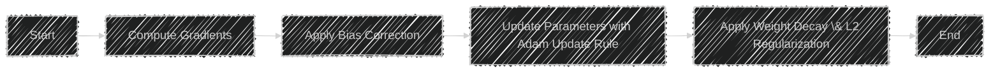
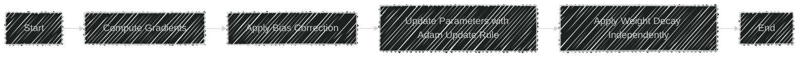
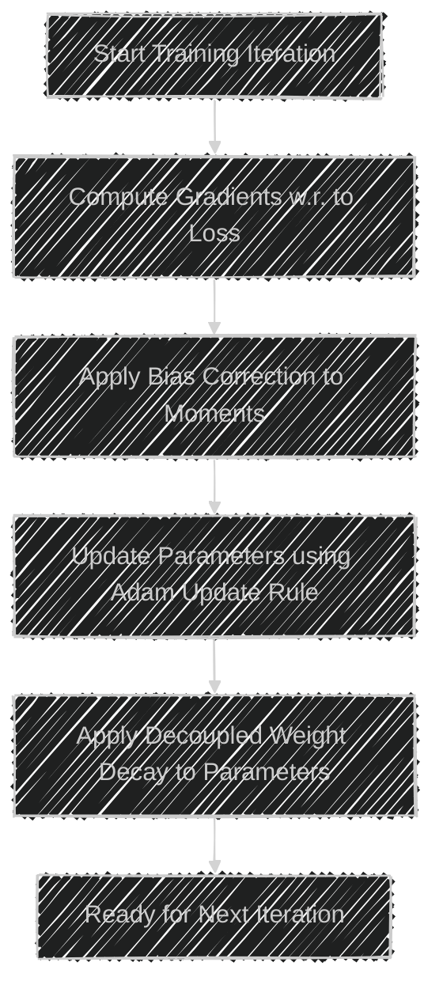
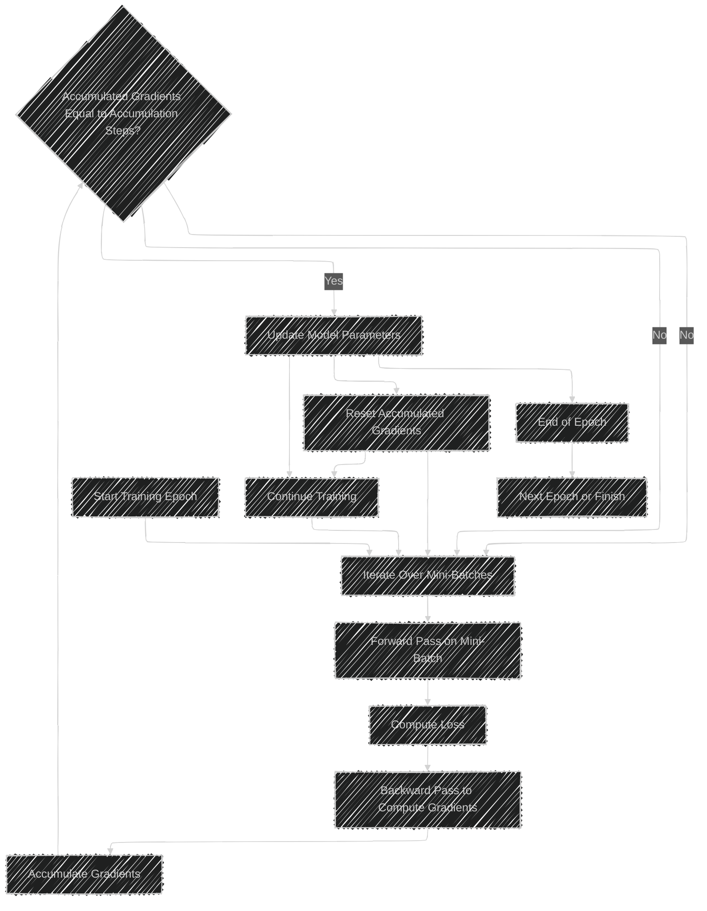
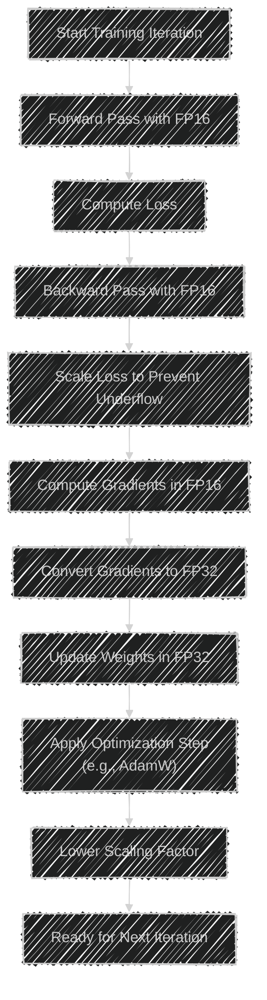

# Advanced Optimization and Training Techniques in Deep Learning
> This content is dual-licensed under your choice of the following licenses:
> 1.  **MIT License:** For the code implementations in Swift and Mermaid provided in this document.
> 2.  **Creative Commons Attribution 4.0 International License (CC BY 4.0):** For all other content, including the text, explanations, and the Mermaid diagrams and illustrations.

---

In modern deep learning workflows, optimizing training processes is crucial for enhancing model performance, reducing training time, and efficiently utilizing computational resources. This section delves into three pivotal advanced optimization and training techniques: **AdamW Optimizer**, **Gradient Accumulation**, and **Mixed Precision Training**. Each technique is explored in detail, accompanied by Mermaid diagrams to illustrate their complexities and technical concepts.

---

## 1. AdamW Optimizer

### Overview

The **AdamW Optimizer** is an enhanced variant of the traditional Adam optimizer. It addresses a critical issue in Adam by decoupling the weight decay from the gradient-based update, leading to more effective regularization and improved convergence properties.

### Traditional Adam vs. AdamW

#### Traditional Adam Optimizer

#### AdamW Optimizer

### Key Differences

- **Weight Decay Decoupling**: Unlike traditional Adam, AdamW applies weight decay directly to the parameters, separate from the gradient update. This decoupling ensures that regularization is applied more consistently and effectively.
  
- **Improved Regularization**: By decoupling weight decay, AdamW provides better control over the regularization process, leading to models that generalize better on unseen data.

### Mermaid Diagram: AdamW Optimization Flow

---

## 2. Gradient Accumulation

### Overview

**Gradient Accumulation** is a technique employed to simulate larger batch sizes without the necessity of increased memory consumption. This method is particularly beneficial when training large models on hardware with limited memory resources.

### How Gradient Accumulation Works

Instead of updating the model weights after every mini-batch, gradient accumulation involves accumulating gradients over multiple mini-batches before performing a single update. This approach effectively emulates a larger batch size, enhancing training stability and potentially leading to better convergence.

### Benefits

- **Memory Efficiency**: Enables the use of larger effective batch sizes without requiring additional GPU memory.
  
- **Improved Training Stability**: Larger batch sizes can lead to more stable gradient estimates, facilitating smoother convergence.

### Mermaid Diagram: Gradient Accumulation Process

### Implementation Considerations

- **Accumulation Steps**: Define how many mini-batches to accumulate before performing an update. This parameter balances the desired effective batch size and the computational overhead.
  
- **Learning Rate Adjustments**: When simulating larger batch sizes, adjustments to the learning rate may be necessary to maintain training dynamics.

---

## 3. Mixed Precision Training

### Overview

**Mixed Precision Training** leverages both 16-bit (half-precision) and 32-bit (single-precision) floating-point types to optimize computational efficiency and memory usage. This technique accelerates training processes and allows for the training of larger models within the constraints of available hardware memory.

### Advantages

- **Increased Throughput**: Utilizing half-precision calculations can lead to faster computation, especially on modern GPUs that are optimized for mixed precision.
  
- **Reduced Memory Footprint**: Half-precision variables consume half the memory of single-precision, enabling the training of larger models or larger batch sizes.

- **Energy Efficiency**: Reduced computational requirements can lead to lower energy consumption during training.

### Mermaid Diagram: Mixed Precision Training Workflow

### Key Components

- **Loss Scaling**: To mitigate the issue of gradient underflow in half-precision, loss scaling is applied. This involves multiplying the loss by a scaling factor during the backward pass and subsequently scaling down the gradients before the optimizer step.

- **Automatic Mixed Precision (AMP)**: Frameworks like PyTorch and TensorFlow provide AMP utilities that automate the process of casting variables to appropriate precision levels, managing loss scaling, and ensuring numerical stability.

### Industry Practices

- **Hardware Utilization**: NVIDIA's Tensor Cores are specifically designed to accelerate mixed precision computations, making GPUs like the NVIDIA V100 and A100 ideal for mixed precision training.
  
- **Framework Support**: Modern deep learning frameworks have built-in support for mixed precision training, simplifying its integration into existing training pipelines.

### Mermaid Diagram: Mixed Precision Training with Loss Scaling

```mermaid
---
config:
  layout: elk
  look: handDrawn
  theme: dark
---
graph LR
    A[Input Data in FP32] --> B[Forward Pass: Cast to FP16]
    B --> C[Compute Outputs in FP16]
    C --> D[Compute Loss in FP32]
    D --> E[Scale Loss by Factor]
    E --> F[Backward Pass: Compute Gradients in FP16]
    F --> G[Unscale Gradients]
    G --> H[Convert Gradients to FP32]
    H --> I[Optimizer Step in FP32]
    I --> J[Update Model Parameters]
    J --> K[Next Training Iteration]
```

---

## Integration of Advanced Techniques in Training Pipelines

Combining these advanced optimization and training techniques can lead to substantial improvements in training efficiency and model performance. Below is a holistic view of how **AdamW Optimizer**, **Gradient Accumulation**, and **Mixed Precision Training** integrate within a training pipeline.

### Mermaid Diagram: Combined Advanced Optimization Techniques

### Explanation of the Combined Workflow

1. **Forward Pass with Mixed Precision**: Inputs are processed using half-precision to speed up computations and reduce memory usage.

2. **Loss Computation and Scaling**: Loss is computed in single precision to maintain numerical accuracy, then scaled to prevent underflow during backpropagation.

3. **Backward Pass and Gradient Accumulation**: Gradients are computed in mixed precision and accumulated over several mini-batches to simulate a larger batch size without exceeding memory limits.

4. **Gradient Unscaling and Conversion**: Once the designated number of accumulation steps is reached, gradients are unscaled and converted back to single precision.

5. **Parameter Update with AdamW**: The AdamW optimizer updates the model parameters using the accumulated gradients, benefiting from decoupled weight decay for better regularization.

6. **Iteration Continuation**: The process repeats for the next set of mini-batches or concludes the training epoch.

---

## Conclusion

The integration of **AdamW Optimizer**, **Gradient Accumulation**, and **Mixed Precision Training** represents a synergistic approach to optimizing deep learning training workflows. These advanced techniques collectively enhance training efficiency, enable the handling of larger models and batch sizes, and improve the generalization capabilities of models through effective regularization. Leveraging these methods aligns with current industry best practices, ensuring scalable and performant machine learning solutions.

---
**Licenses:**

- **MIT License:**   - Full text in [LICENSE](LICENSE) file.
- **Creative Commons Attribution 4.0 International:**  - Legal details in [LICENSE-CC-BY](LICENSE-CC-BY) and at [Creative Commons official site](http://creativecommons.org/licenses/by/4.0/).

---