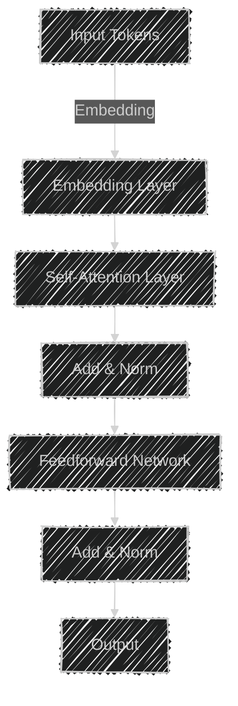
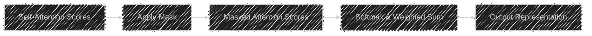
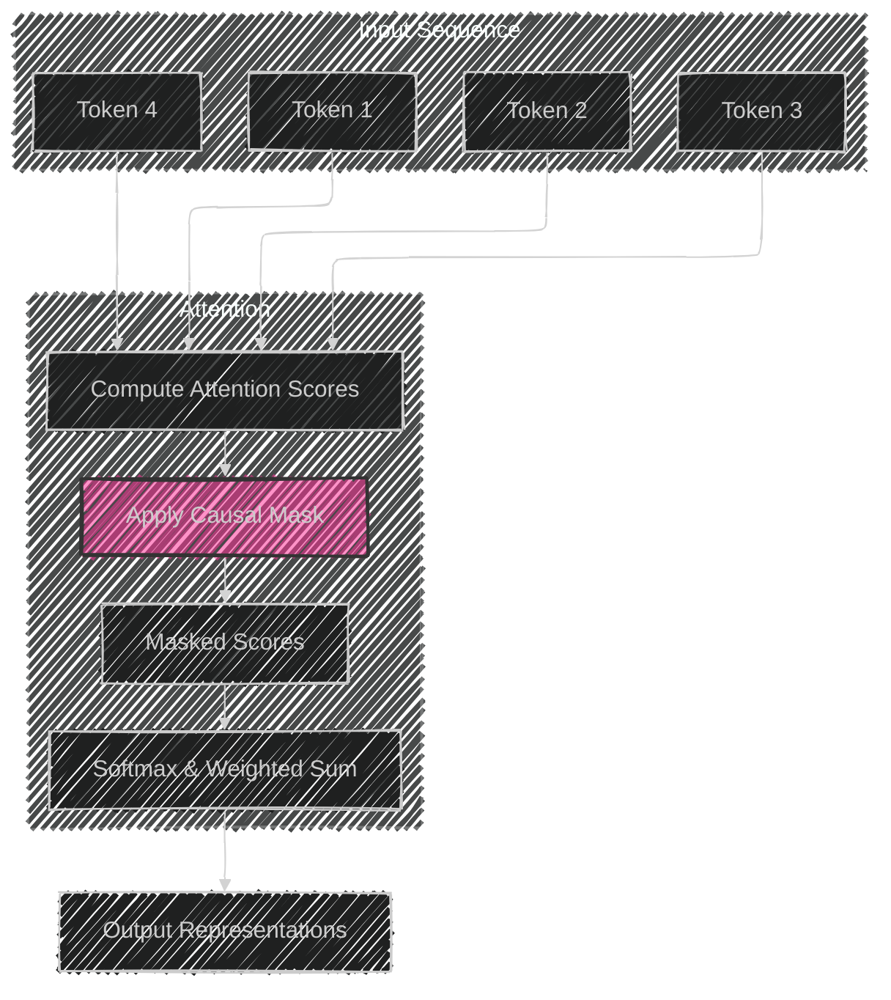
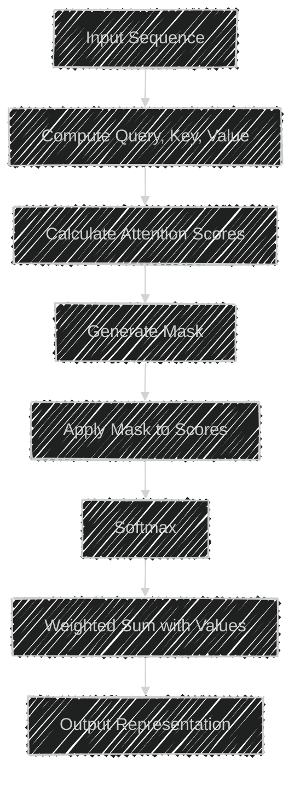
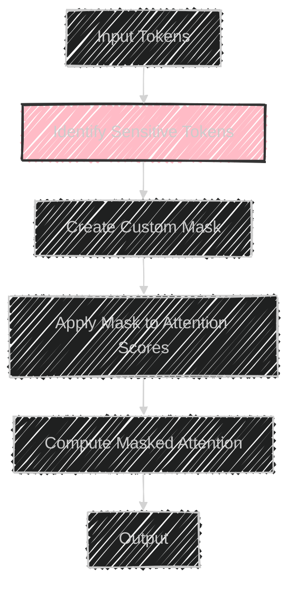
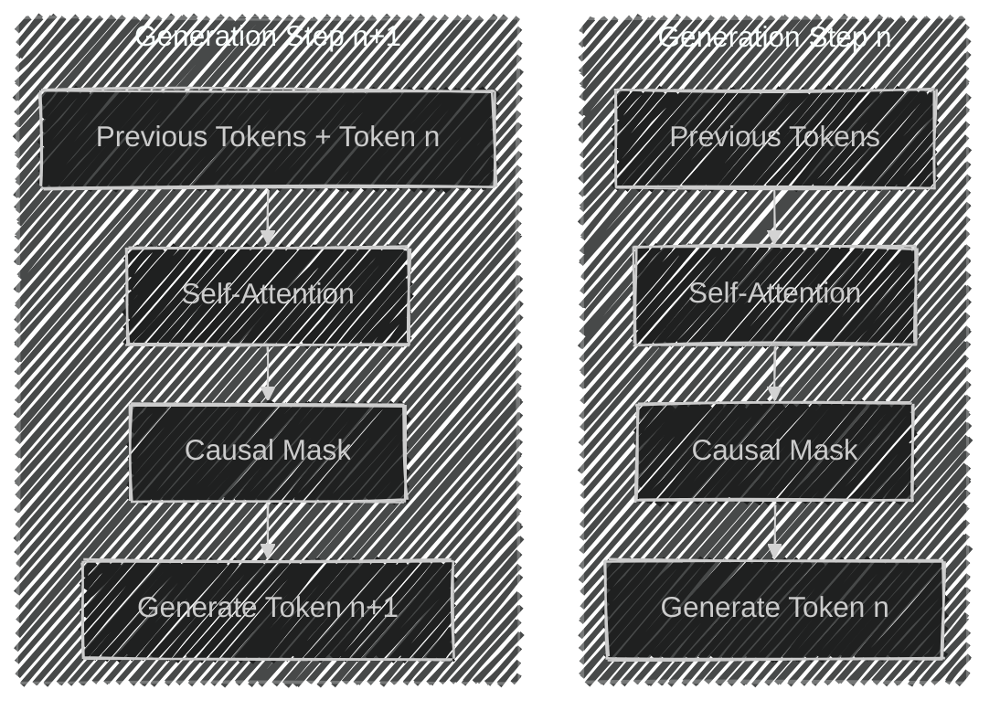
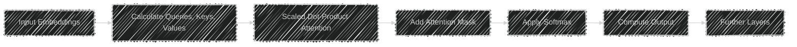
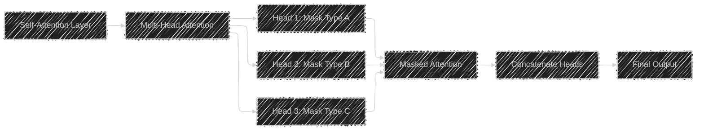
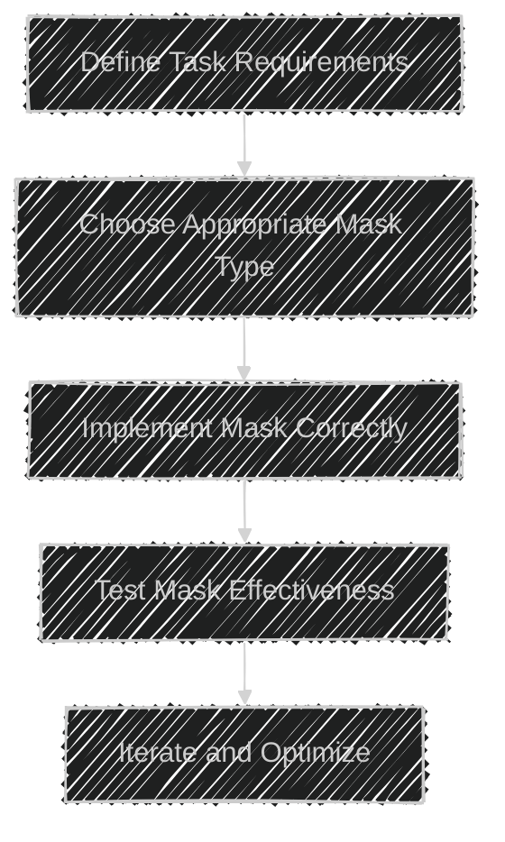

# Attention Masking Techniques
> This content is dual-licensed under your choice of the following licenses:
> 1.  **MIT License:** For the code implementations in Swift and Mermaid provided in this document.
> 2.  **Creative Commons Attribution 4.0 International License (CC BY 4.0):** For all other content, including the text, explanations, and the Mermaid diagrams and illustrations.

---


**Attention Masking Techniques** are pivotal in transformer-based models, such as GPT and BERT, to control the flow of information during the computation of attention mechanisms. This ensures that the model focuses on relevant parts of the input while adhering to specific constraints like causality or privacy. Below are comprehensive mermaid diagrams and explanations that delve into the complexities and technical concepts of attention masking techniques.

---

## 1. Overview of Attention Mechanism

Before diving into masking techniques, it's essential to understand the standard attention mechanism in transformers.



**Explanation:**
1. **Input Tokens**: The sequence of tokens (words/subwords) input to the model.
2. **Embedding Layer**: Converts tokens into dense vector representations.
3. **Self-Attention Layer**: Computes attention scores to determine the relevance of each token to others in the sequence.
4. **Add & Norm**: adds residual connections and normalizes the output.
5. **Feedforward Network**: Applies nonlinear transformations.
6. **Add & Norm**: Another residual connection and normalization.
7. **Output**: The processed representation passed to subsequent layers or for prediction.

---

## 2. Introduction to Attention Masking

Attention Masking modifies the attention scores to control which tokens can attend to each other, ensuring the model adheres to desired constraints.



**Explanation:**
1. **Self-Attention Scores**: Raw scores computed between query and key vectors.
2. **Apply Mask**: Introduce masking to these scores.
3. **Masked Attention Scores**: Modified scores where certain positions are masked (e.g., set to negative infinity).
4. **Softmax & Weighted Sum**: Convert masked scores to probabilities and compute weighted sum of values.
5. **Output Representation**: The final attention output considering the mask.

---

## 3. Types of Attention Masks

Attention masks can be categorized based on their purpose and application. The two primary types are **Padding Masks** and **Causal Masks**.


---

### a. Padding Mask

**Purpose**: Prevent the model from attending to padding tokens, which are added to sequences to ensure uniform length.


**Explanation:**
- **Sequence**: Contains actual tokens followed by padding tokens.
- **Self-Attention**: Computes attention scores across all tokens.
- **Apply Padding Mask**: Masks positions corresponding to padding tokens to prevent them from influencing the model.
- **Masked Attention**: Only actual tokens contribute to the output.
- **Output**: Represents features without padding interference.

---

### b. Causal Mask

**Purpose**: Enforce causality in generation tasks, ensuring that the prediction for a token only depends on previous tokens and not future ones.



**Explanation:**
- **Input Sequence**: A sequence of tokens where each token should only attend to itself and previous tokens.
- **Compute Attention Scores**: Raw attention scores between tokens.
- **Apply Causal Mask**: Masks out future tokens by setting their scores to negative infinity, preventing the model from accessing them.
- **Masked Scores**: Only allow attention to current and past tokens.
- **Softmax & Weighted Sum**: Normalize and compute contextual representations.
- **Output Representations**: Contextual embeddings respecting causality.

---

## 4. Technical Implementation of Attention Masks

Attention masks are typically implemented as binary or additive masks applied to the attention score matrix before the softmax function.



**Explanation:**
1. **Compute Query, Key, Value**: Derive from input embeddings.
2. **Calculate Attention Scores**: \( \text{Scores} = Q \times K^T \)
3. **Generate Mask**: Create a mask matrix with 0s and negative infinities or large negative numbers.
4. **Apply Mask to Scores**: \( \text{Masked Scores} = \text{Scores} + \text{Mask} \)
5. **Softmax**: Convert masked scores to probabilities.
6. **Weighted Sum with Values**: Compute the final attention output.
7. **Output Representation**: Contextualized embeddings after masking.

---

## 5. Preventing Attention to Irrelevant or Sensitive Information

Masks can be designed to exclude certain tokens based on criteria like token type, position, or external factors (e.g., privacy constraints).



**Explanation:**
1. **Identify Sensitive Tokens**: Detect tokens that should not influence or be influenced (e.g., personal information).
2. **Create Custom Mask**: Generate a mask that zeros out the attention scores for these tokens.
3. **Apply Mask to Attention Scores**: Incorporate the mask into the attention mechanism.
4. **Compute Masked Attention**: Only non-sensitive tokens contribute to contextual representations.
5. **Output**: Ensures sensitive information is neither used nor propagated.

---

## 6. Enforcing Causality in Generation Tasks

In tasks like language generation, it's crucial to ensure that the model generates each token based only on preceding tokens.



**Explanation:**
- **Generation Step n**:
  - **Previous Tokens**: The tokens generated so far.
  - **Self-Attention**: Computes attention over previous tokens.
  - **Causal Mask**: Ensures token n only attends to tokens $\leq n$.
  - **Generate Token n**: Produces the next token based on masked attention.
  
- **Generation Step n+1**:
  - **Previous Tokens + Token n**: Includes the newly generated token.
  - **Self-Attention**: Computes attention over all tokens up to n.
  - **Causal Mask**: Ensures token $n+1$ only attends to tokens $\leq n+1$.
  - **Generate Token n+1**: Produces the subsequent token.

This sequential masking ensures that at each generation step, the model cannot access future tokens, preserving the integrity and causality of the generation process.

---

## 7. Impact of Attention Masking on Model Performance

Attention masks play a significant role in both the efficiency and effectiveness of transformer models. Proper masking can enhance performance by focusing computational resources on relevant parts of the input and ensuring adherence to task-specific constraints.


**Explanation:**
1. **Prevents Irrelevant Focus**:
   - **Improved Efficiency**: By masking out unnecessary tokens, the model reduces computational overhead.
   - **Reduced Noise**: Limits the influence of irrelevant or distracting information, leading to cleaner representations.
   
2. **Enforces Task Constraints**:
   - **Maintains Causality**: Ensures correct sequence generation without information leakage from future tokens.
   - **Ensures Data Privacy**: Protects sensitive information by preventing the model from attending to or producing such data.
   
3. **Outcome**:
   - **Faster Computations**: Streamlined attention computations lead to quicker model responses.
   - **Better Representation Learning**: Clean and relevant data enhances the quality of learned representations.
   - **Accurate Sequence Generation**: Adhering to causality results in more coherent and logically consistent outputs.
   - **Compliance with Regulations**: Respecting data privacy through masking aligns with legal and ethical standards.

---

## 8. Common Practices and Industry Implementations

Modern transformer implementations, such as those in **TensorFlow** and **PyTorch**, provide built-in support for attention masking. Here's how they typically handle masking:



**Explanation:**
1. **Input Embeddings**: Start with token embeddings.
2. **Calculate Queries, Keys, Values**: Derive from embeddings.
3. **Scaled Dot-Product Attention**: Compute attention scores.
4. **Add Attention Mask**: Integrate masking by modifying attention scores.
5. **Apply Softmax**: Normalize the scores after masking.
6. **Compute Output**: Generate contextualized embeddings.
7. **Further Layers**: Pass through subsequent transformer layers.

**Code Snippet Example (PyTorch):**

```python
import torch
import torch.nn as nn

# Example Attention Mask
# 1 for tokens to attend to, 0 for masked tokens
attention_mask = torch.tensor([
    [1, 1, 1, 0],
    [1, 1, 0, 0]
])  # Shape: (batch_size, sequence_length)

# Transformer Encoder Layer
encoder_layer = nn.TransformerEncoderLayer(d_model=512, nhead=8)

# Transformer Encoder
transformer_encoder = nn.TransformerEncoder(encoder_layer, num_layers=6)

# Input Embeddings
src = torch.rand(10, 32, 512)  # (sequence_length, batch_size, d_model)

# Generate Key Padding Mask
# True for tokens to be masked
key_padding_mask = attention_mask == 0

# Forward Pass with Masking
output = transformer_encoder(src, src_key_padding_mask=key_padding_mask)
```

**Explanation:**
- **Attention Mask**: Specifies which tokens to attend to.
- **Key Padding Mask**: Converts attention mask to the required format for PyTorch's transformer.
- **Transformer Encoder**: Processes the input with applied attention masking.
- **Output**: Contextual embeddings with masked attention.

**Industry Insight:**
- **Hugging Face Transformers Library**: Provides easy-to-use interfaces for attention masking, allowing users to pass masks directly when using models like BERT, GPT, etc.
- **Efficient Masking**: Leveraging optimized tensor operations ensures that masking introduces minimal computational overhead.

---

## 9. Advanced Masking Techniques

Beyond basic padding and causal masks, advanced techniques are employed to handle more complex scenarios.


### a. Dynamic Masking

**Purpose**: Adjust masks dynamically based on input patterns or external constraints, enabling more flexible attention control.


**Explanation:**
1. **Input Tokens**: Sequences input to the model.
2. **Transformer Model**: Core model processing the input.
3. **Mask Generator**: Logic to create dynamic masks based on specific criteria.
4. **Attention Mechanism**: Applies the dynamic mask during attention computation.
5. **Output Representation**: Final embeddings considering dynamic masking.

**Use Cases**:
- **Domain-Specific Filtering**: Masking tokens outside a particular domain.
- **Context-Aware Privacy**: Dynamically masking information based on sensitivity levels.

---

### b. Multi-Head Masking

**Purpose**: Apply different masks to different attention heads, allowing each head to focus on distinct aspects or patterns.



**Explanation:**
- **Multi-Head Attention**: Splits attention into multiple parallel heads.
- **Head 1, 2, 3**: Each head can have its own masking strategy (e.g., causal, padding, custom).
- **Masked Attention**: Each head processes its attention based on its mask.
- **Concatenate Heads**: Combine the outputs from all heads.
- **Final Output**: Unified representation considering varied masking across heads.

**Benefits**:
- **Diverse Focus**: Different heads can specialize in different masking patterns.
- **Enhanced Representation**: Captures varied relationships within the data.

---

## 10. Practical Considerations and Best Practices

Implementing attention masking requires careful consideration to ensure masks align with model architecture and task requirements.



**Steps:**
1. **Define Task Requirements**: Understand the specific needs, such as preventing certain tokens from being attended to or enforcing generation constraints.
2. **Choose Appropriate Mask Type**: Select between padding, causal, or custom masks based on requirements.
3. **Implement Mask Correctly**: Ensure that the mask dimensions and placements correctly align with the input data.
4. **Test Mask Effectiveness**: Validate that masking behaves as intended, preventing undesired attention.
5. **Iterate and Optimize**: Refine masking strategies based on performance and output quality.

**Best Practices**:
- **Consistent Mask Dimensions**: Align mask shapes with attention score matrices to avoid computational errors.
- **Efficient Mask Generation**: Utilize optimized tensor operations for mask creation to minimize overhead.
- **Validation**: Regularly verify masking through visualizations or unit tests to ensure correctness.
- **Documentation**: Clearly document masking strategies within the codebase for maintainability.

---

## Summary Diagram: Comprehensive Attention Masking Workflow


**Explanation:**
1. **Input Tokens**: The initial data fed into the model.
2. **Embedding Layer**: Converts tokens to dense vectors.
3. **Self-Attention Layer**: Core attention mechanism processing embeddings.
4. **Calculate Attention Scores**: Determines relevance between tokens.
5. **Determine Mask Type**: Decide which masking technique to apply based on task.
6. **Apply Masks**: Depending on the mask type (padding, causal, dynamic, multi-head), modify the attention scores.
7. **Softmax & Weighted Sum**: Normalize scores and compute attention outputs.
8. **Output Representation**: Contextual embeddings after masking.
9. **Subsequent Layers**: Pass the outputs to further transformer layers or for final predictions.

---

## Conclusion

**Attention Masking Techniques** are integral to the functionality of transformer-based models, enabling precise control over the information flow during attention computations. By implementing various masking strategies—such as padding masks, causal masks, dynamic masks, and multi-head masks—models can ensure relevance, maintain causality, protect sensitive information, and optimize computational efficiency. Understanding and effectively applying these techniques is crucial for developing robust, accurate, and secure natural language processing systems in the industry.


---
**Licenses:**

- **MIT License:**  [](LICENSE) - Full text in [LICENSE](LICENSE) file.
- **Creative Commons Attribution 4.0 International:** [](LICENSE-CC-BY) - Legal details in [LICENSE-CC-BY](LICENSE-CC-BY) and at [Creative Commons official site](http://creativecommons.org/licenses/by/4.0/).

---