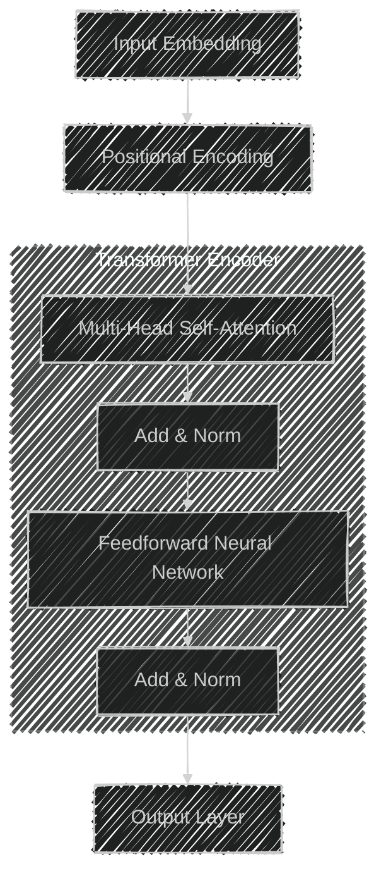
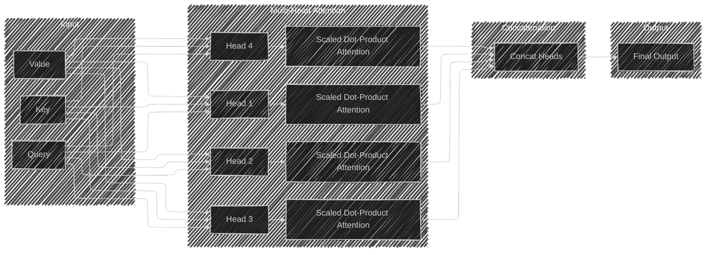
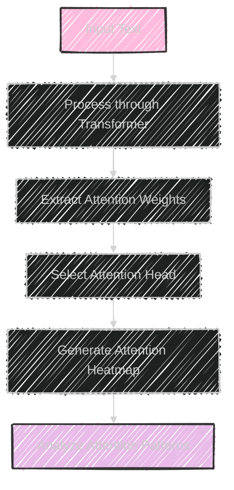
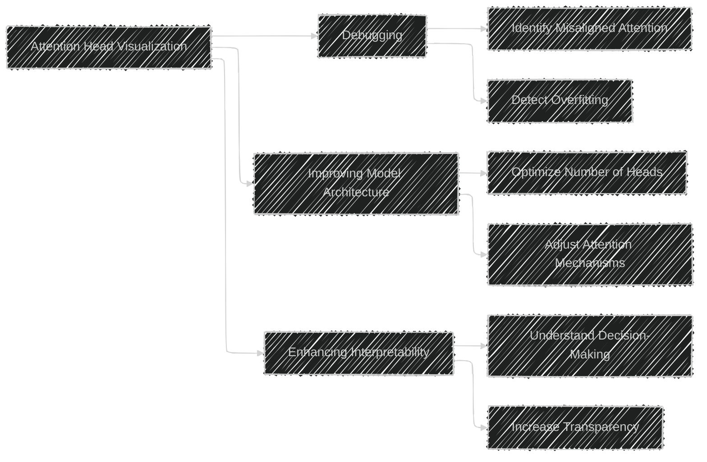
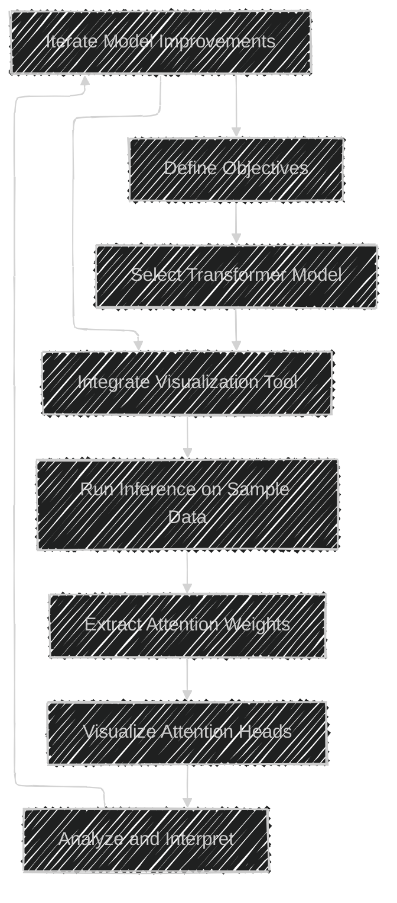
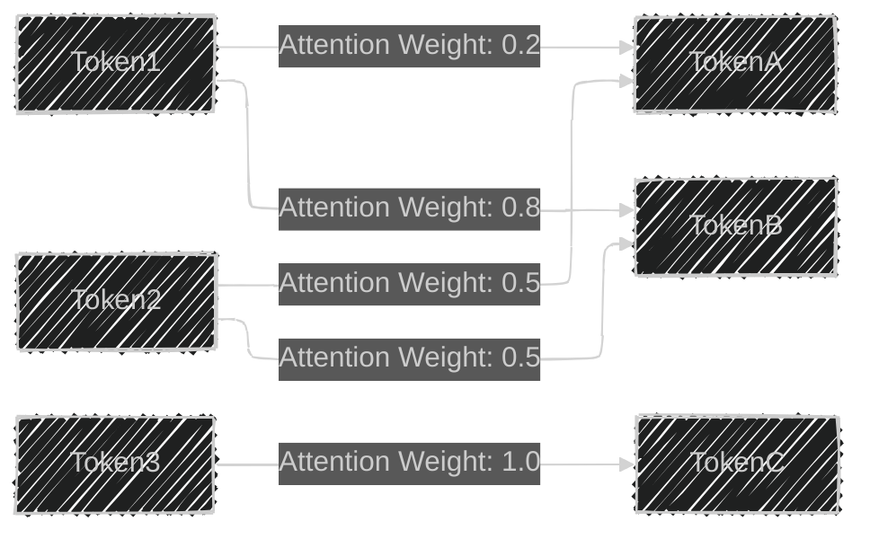

# Attention Visualization and Interpretability Tools
> This content is dual-licensed under your choice of the following licenses:
> 1.  **MIT License:** For the code implementations in Swift and Mermaid provided in this document.
> 2.  **Creative Commons Attribution 4.0 International License (CC BY 4.0):** For all other content, including the text, explanations, and the Mermaid diagrams and illustrations.

---

To comprehensively understand **Attention Visualization and Interpretability Tools**, particularly **Attention Head Visualization**, we can break down the concepts into several interconnected components. Below are a series of Mermaid diagrams that elucidate the complexities and technical aspects of this topic.

---

## 1. Transformer Model Overview with Attention Mechanism

This diagram provides a high-level overview of the Transformer architecture, highlighting where the attention mechanism fits within the model.

**Explanation:**
- **Input Embedding & Positional Encoding:** Converts input tokens into vectors and adds positional information.
- **Multi-Head Self-Attention:** Enables the model to focus on different parts of the input sequence simultaneously.
- **Add & Norm:** Applies residual connections followed by layer normalization.
- **Feedforward Neural Network:** Processes the attended information.
- **Output Layer:** Produces the final output representations.

---

## 2. Multi-Head Attention Structure

Visualizes how multi-head attention operates within the Transformer, allowing the model to capture diverse relationships in the data.

**Explanation:**
- **Heads (H1-H4):** Each head processes the Query (Q), Key (K), and Value (V) vectors independently.
- **Scaled Dot-Product Attention:** Computes attention scores and applies them to the Value vectors.
- **Concatenation:** Merges the outputs from all attention heads.
- **Final Output:** Combines the information from all heads to form a comprehensive representation.

---

## 3. Attention Head Visualization Process

Illustrates the steps involved in visualizing the focus of different attention heads within a Transformer model.

**Explanation:**
1. **Input Text:** The raw input data fed into the Transformer model.
2. **Process through Transformer:** The input is processed, and attention weights are computed.
3. **Extract Attention Weights:** Retrieve the attention matrices from specific layers and heads.
4. **Select Attention Head:** Choose which attention head(s) to visualize.
5. **Generate Attention Heatmap:** Create visual representations (e.g., heatmaps) of attention distributions.
6. **Analyze Attention Patterns:** Interpret the focus areas of different heads to understand model reasoning.

---

## 4. Applications of Attention Head Visualization

Demonstrates how attention visualization aids in various aspects of model development and analysis.

**Explanation:**
- **Debugging:**
  - **Identify Misaligned Attention:** Spot attention heads focusing on irrelevant parts of the input.
  - **Detect Overfitting:** Observe if attention patterns are too rigid or repetitive, indicating overfitting.

- **Improving Model Architecture:**
  - **Optimize Number of Heads:** Determine the optimal number of attention heads for better performance.
  - **Adjust Attention Mechanisms:** Modify how attention is computed based on insights from visualization.

- **Enhancing Interpretability:**
  - **Understand Decision-Making:** Gain insights into how the model processes information.
  - **Increase Transparency:** Make the model's operations more understandable to stakeholders.

---

## 5. Tools and Frameworks for Attention Visualization

Outlines popular tools and frameworks used in the industry for visualizing attention mechanisms.

**Explanation:**
- **TensorBoard:** Integrates with TensorFlow and PyTorch to provide visualization capabilities, including attention weights.
- **AttentionViz:** A web-based tool that allows interactive visualization of attention mechanisms.
- **BERTViz:** Specifically designed for visualizing attention in BERT models, offering detailed insights.
- **Transformers Interpret:** Provides interpretability tools for Transformer-based models, enabling attention analysis.
- **Custom Heatmap Implementations:** Developers can create bespoke visualizations using libraries like Matplotlib or Seaborn to tailor attention maps to specific requirements.

---

## 6. Workflow for Implementing Attention Head Visualization

Displays the typical workflow for incorporating attention visualization into model development cycles.

**Explanation:**
1. **Define Objectives:** Determine what aspects of the model you aim to understand or improve.
2. **Select Transformer Model:** Choose the appropriate Transformer architecture for your application.
3. **Integrate Visualization Tool:** Incorporate tools like TensorBoard or BERTViz into your workflow.
4. **Run Inference on Sample Data:** Process sample inputs through the model to generate outputs and attention weights.
5. **Extract Attention Weights:** Retrieve the attention matrices from the model.
6. **Visualize Attention Heads:** Use selected tools to create visual representations of attention distributions.
7. **Analyze and Interpret:** Examine the visualizations to gain insights into model behavior.
8. **Iterate Model Improvements:** Based on the analysis, make necessary adjustments to the model and repeat the process.

---

## 7. Example of an Attention Heatmap

Provides a visual representation of attention distributions across different heads and tokens.

**Explanation:**
While Mermaid doesn't support actual heatmap visualizations, the above diagram conceptually represents how tokens attend to each other with varying weights. In practice, attention heatmaps display these weights as gradients of color, where intensity corresponds to the magnitude of attention.

**Example Illustration:**

*Figure: A typical attention heatmap showing attention weights between tokens in a sequence.*

---

## Conclusion

Attention Head Visualization is a pivotal tool in the interpretability and optimization of Transformer-based models. By visually analyzing how different attention heads focus on various parts of the input data, developers and researchers can gain deep insights into the model's decision-making processes. This not only aids in debugging and refining model architectures but also enhances the overall transparency and trustworthiness of AI systems.

The diagrams above provide a structured and detailed breakdown of the components, processes, and applications associated with attention visualization, illustrating its critical role in modern machine learning practices.

---
**Licenses:**

- **MIT License:**   - Full text in [LICENSE](LICENSE) file.
- **Creative Commons Attribution 4.0 International:**  - Legal details in [LICENSE-CC-BY](LICENSE-CC-BY) and at [Creative Commons official site](http://creativecommons.org/licenses/by/4.0/).

---