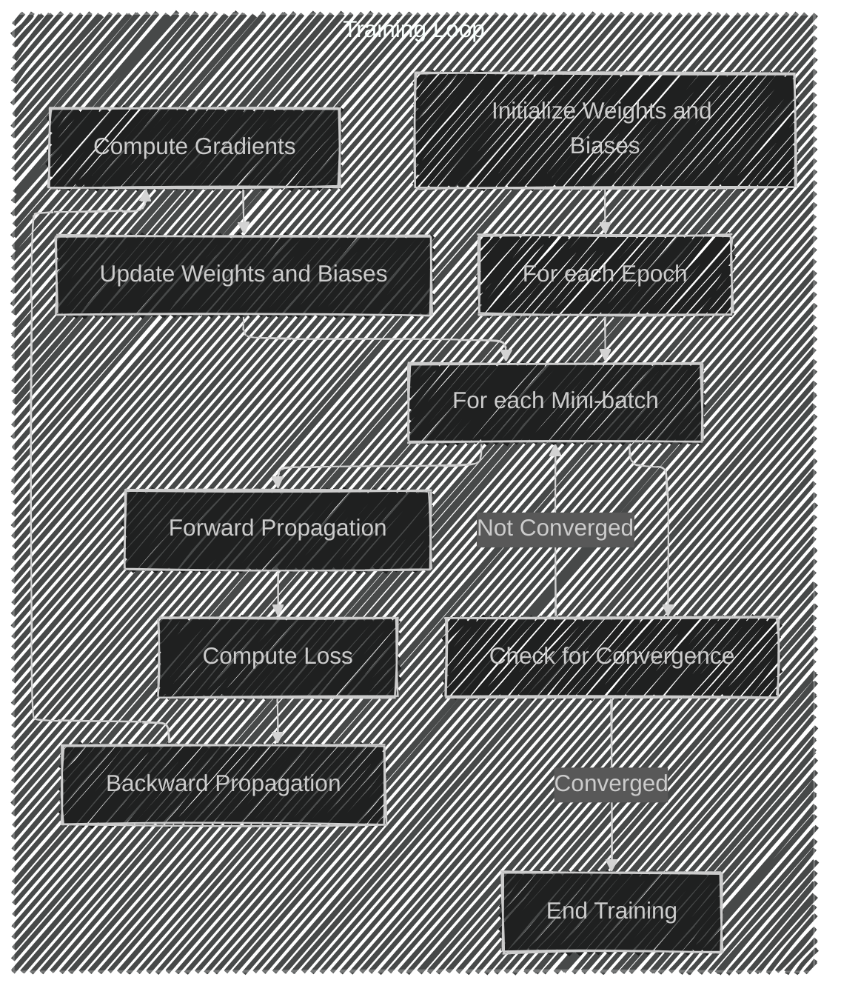

# Backpropagation Algorithm: An In-depth Exploration
> This content is dual-licensed under your choice of the following licenses:
> 1.  **MIT License:** For the code implementations in Swift and Mermaid provided in this document.
> 2.  **Creative Commons Attribution 4.0 International License (CC BY 4.0):** For all other content, including the text, explanations, and the Mermaid diagrams and illustrations.

---

The **Backpropagation Algorithm** is a fundamental component in training artificial neural networks. It is the mechanism by which the network learns from data, adjusting its internal parameters (weights and biases) to minimize the difference between its predictions and the actual outcomes.

In this explanation, we will delve into the intricacies of the backpropagation algorithm, illustrating the concepts with detailed Mermaid diagrams and mathematical expressions to provide a comprehensive understanding of how it functions in practice.

---

## Overview of Neural Network Training

Before diving into backpropagation, it's essential to understand the broader context of training a neural network:

1. **Initialization**: The network starts with random weights and biases.
2. **Forward Propagation**: Input data is passed through the network to produce an output.
3. **Loss Computation**: The difference between the predicted output and the actual output is measured using a loss function.
4. **Backward Propagation**: Gradients of the loss function with respect to each weight and bias are computed.
5. **Weight Updates**: Weights and biases are adjusted in the opposite direction of the gradients to reduce the loss.
6. **Iteration**: Steps 2-5 are repeated for multiple epochs until the network converges.

---

## Forward Propagation

Forward propagation involves computing the output of the neural network by passing the input data through each layer.

### Neural Network Structure

Consider a simple feedforward neural network with one hidden layer:

```mermaid
---
config:
  layout: elk
  look: handDrawn
  theme: dark
---
graph TD
    Input([Input Layer<br>Features \( x \)]) -->|Weights \( W^{[1]} \), Biases \( b^{[1]} \)| Hidden[Hidden Layer<br>Activations \( a^{[1]} \)]
    Hidden -->|Weights \( W^{[2]} \), Biases \( b^{[2]} \)| Output([Output Layer<br>Predictions \( \hat{y} \)])
    
```

---

## Mathematical Representation

### Layer Computations

For each layer $l$, the computations are as follows:

#### 1. Linear Transformation

   $$
   z^{[l]} = W^{[l]} a^{[l-1]} + b^{[l]}
   $$

   - $W^{[l]}$: Weights matrix for layer \( l \).
   - $b^{[l]}$: Bias vector for layer \( l \).
   - $a^{[l-1]}$: Activations from the previous layer (or inputs for the first layer).

#### 2. Activation Function

   $$
   a^{[l]} = \sigma(z^{[l]})
   $$

   - $\sigma$: Activation function (e.g., ReLU, sigmoid, tanh).

---

## Loss Computation

The loss function quantifies the difference between the network's predictions and the actual target values.

### Common Loss Functions

- **Mean Squared Error (MSE)** for regression:

  $$
  L = \frac{1}{m} \sum_{i=1}^{m} (\hat{y}^{(i)} - y^{(i)})^2
  $$

- **Cross-Entropy Loss** for classification:

  $$
  L = -\frac{1}{m} \sum_{i=1}^{m} [y^{(i)} \log(\hat{y}^{(i)}) + (1 - y^{(i)}) \log(1 - \hat{y}^{(i)})]
  $$

---

## Backpropagation Algorithm

Backpropagation computes the gradients of the loss function with respect to each weight and bias in the network.

### Key Steps

#### 1. Compute Output Error


   $$
   \delta^{[L]} = \frac{\partial L}{\partial a^{[L]}} \odot \sigma'\left(z^{[L]}\right)
   $$

   - $\delta^{[L]}$: Error term for the output layer.
   - $\sigma'$: Derivative of the activation function.
   - $\odot$: Element-wise multiplication.

#### 2. Propagate Error Backwards

   For each layer $l = L-1, L-2, \dots, 1$:

   $$
   \delta^{[l]} = \left( W^{[l+1]} \right)^T \delta^{[l+1]} \odot \sigma'\left(z^{[l]}\right)
   $$

#### 3. Compute Gradients

   - **Gradients w.r.t Weights**:

     $$
     \frac{\partial L}{\partial W^{[l]}} = \delta^{[l]} \left( a^{[l-1]} \right)^T
     $$

   - **Gradients w.r.t Biases**:

     $$
     \frac{\partial L}{\partial b^{[l]}} = \delta^{[l]}
     $$

---

## Visualization of Backpropagation Flow

```mermaid
---
config:
  layout: elk
  look: handDrawn
  theme: dark
---
flowchart TB
    subgraph Forward Pass
        Input1((Input \( x \))) --> Z1[Linear \( z^{[1]} = W^{[1]} x + b^{[1]} \)]
        Z1 --> A1[Activation \( a^{[1]} = \sigma(z^{[1]}) \)]
        A1 --> Z2[Linear \( z^{[2]} = W^{[2]} a^{[1]} + b^{[2]} \)]
        Z2 --> Output1((Output \( \hat{y} \)))
    end
    subgraph Backward Pass
        Output1 --> Delta2[Compute \( \delta^{[2]} \)]
        Delta2 --> GradW2[Compute \( \frac{\partial L}{\partial W^{[2]}} \)]
        Delta2 --> GradB2[Compute \( \frac{\partial L}{\partial b^{[2]}} \)]
        Delta2 --> Delta1[Backpropagate \( \delta^{[1]} \)]
        Delta1 --> GradW1[Compute \( \frac{\partial L}{\partial W^{[1]}} \)]
        Delta1 --> GradB1[Compute \( \frac{\partial L}{\partial b^{[1]}} \)]
    end
    style Forward Pass fill:#d3d9,stroke:#333,stroke-width:1px
    style Backward Pass fill:#f3d4,stroke:#333,stroke-width:1px
```

---

## Chain Rule in Backpropagation

Backpropagation relies heavily on the chain rule from calculus to compute derivatives of composite functions.

### Chain Rule

For composite functions \( f(g(h(x))) \):

$$
\frac{df}{dx} = \frac{df}{dg} \cdot \frac{dg}{dh} \cdot \frac{dh}{dx}
$$

### Application in Neural Networks

- The gradient of the loss with respect to the weights involves the product of derivatives from the output layer back to the current layer.

---

## Updating Weights and Biases

Once the gradients are computed, weights and biases are updated using an optimization algorithm like **Gradient Descent**.

### Gradient Descent Update Rule

For each weight $W^{[l]}$ and bias $b^{[l]}$:

$$
\begin{align*}
W^{[l]} &:= W^{[l]} - \eta \frac{\partial L}{\partial W^{[l]}} \\
b^{[l]} &:= b^{[l]} - \eta \frac{\partial L}{\partial b^{[l]}}
\end{align*}
$$

- $\eta$: Learning rate, a hyperparameter that controls the step size.

---

## Industry Practices and Optimizations

### Advanced Optimization Algorithms

- **Stochastic Gradient Descent (SGD)**: Uses a random subset (mini-batch) of data for each update.
- **Adam**: Adaptive Moment Estimation combines ideas from RMSProp and Momentum.
- **RMSProp**: Adapts the learning rate based on a moving average of squared gradients.

### Regularization Techniques

- **L1 and L2 Regularization**: Add penalties to the loss function to prevent overfitting.
  
  $$
  L_{\text{reg}} = L + \lambda \left( \sum_{l} \| W^{[l]} \|_1 \text{ or } \| W^{[l]} \|_2^2 \right)
  $$

- **Dropout**: Randomly deactivate neurons during training to prevent co-adaptation.


### Learning Rate Scheduling

- **Learning Rate Decay**: Reduce $\eta$ over time to fine-tune convergence.
- **Adaptive Learning Rates**: Algorithms adjust $\eta$ per parameter.

### Batch Normalization

- Normalizes inputs to each layer to stabilize learning.

---

## Computational Graphs

In practice, frameworks like TensorFlow and PyTorch use computational graphs to represent the dependencies of operations, enabling automatic differentiation.

```mermaid
graph TD
    X((Input \( x \))) --> W1[Weights \( W^{[1]} \)] --> Z1[Linear \( z^{[1]} \)] --> A1[Activation \( a^{[1]} \)]
    A1 --> W2[Weights \( W^{[2]} \)] --> Z2[Linear \( z^{[2]} \)] --> A2[Activation \( \hat{y} \)]
    A2 --> L[Loss \( L \)]
    L -->|Backpropagation| GradW2[Gradients \( \frac{\partial L}{\partial W^{[2]}} \)] --> UpdateW2[Update \( W^{[2]} \)]
    L -->|Backpropagation| GradW1[Gradients \( \frac{\partial L}{\partial W^{[1]} } \)] --> UpdateW1[Update \( W^{[1]} \)]
```

---

## Example: Step-by-Step Backpropagation

Consider a network with:

- Input $x$
- One hidden layer with one neuron (for simplicity)
- Output $\hat{y}$

### Forward Pass Calculations

#### 1. Compute $z^{[1]}$
   $$
   z^{[1]} = W^{[1]} x + b^{[1]}
   $$

#### 2. Compute $a^{[1]}$


   $$
   a^{[1]} = \sigma(z^{[1]})
   $$

#### 3. Compute $z^{[2]}$

   $$
   z^{[2]} = W^{[2]} a^{[1]} + b^{[2]}
   $$

#### 4. Compute Output $\hat{y}$


   $$
   \hat{y} = \sigma(z^{[2]})
   $$

#### 5. Compute Loss $L$


   $$
   L = \frac{1}{2} (\hat{y} - y)^2
   $$

### Backward Pass Calculations

#### 1. Compute Output Error $\delta^{[2]}$

   $$
   \delta^{[2]} = (\hat{y} - y) \cdot \sigma'\left(z^{[2]}\right)
   $$

#### 2. Compute Gradient w.r.t $W^{[2]}$


   $$
   \frac{\partial L}{\partial W^{[2]}} = \delta^{[2]} \cdot a^{[1]}
   $$

#### 3. Compute Error for Hidden Layer $\delta^{[1]}$

   $$
   \delta^{[1]} = \delta^{[2]} \cdot W^{[2]} \cdot \sigma'\left(z^{[1]}\right)
   $$

#### 4. Compute Gradient w.r.t $W^{[1]}$


   $$
   \frac{\partial L}{\partial W^{[1]}} = \delta^{[1]} \cdot x
   $$

---

## Modern Implementations and Frameworks

### Automatic Differentiation

- **Autograd**: Automatically computes gradients, simplifying the implementation of backpropagation.
- **Computational Graphs**: Represent operations and dependencies, enabling efficient gradient computations.

### Frameworks

- **TensorFlow**: Uses static or dynamic graphs for defining models.
- **PyTorch**: Dynamic computational graphs with easy-to-use autograd functionality.
- **Keras**: High-level API for building and training models, integrates with TensorFlow.

---

## Practical Considerations

### Numerical Stability

- **Exploding Gradients**: Gradients become excessively large.
  - **Solution**: Gradient clipping.
- **Vanishing Gradients**: Gradients become too small to make effective updates.
  - **Solution**: Use activation functions like ReLU, architectures like LSTM for recurrent networks.

### Initialization Strategies

- **Xavier Initialization**: Scales weights according to the number of input and output neurons.
- **He Initialization**: Similar to Xavier but optimized for ReLU activations.

### Activation Functions and Their Derivatives

- **Sigmoid Function**:

  $$
  \sigma(z) = \frac{1}{1 + e^{-z}}, \quad \sigma'(z) = \sigma(z)(1 - \sigma(z))
  $$

- **ReLU Function**:

  $$
  \sigma(z) = \max(0, z), \quad \sigma'(z) = \begin{cases} 1 & \text{if } z > 0 \\ 0 & \text{else} \end{cases}
  $$

- **Tanh Function**:

  $$
  \sigma(z) = \tanh(z), \quad \sigma'(z) = 1 - \sigma(z)^2
  $$

---

## Full Workflow Diagram



---

## Conclusion

The backpropagation algorithm is a cornerstone of modern neural network training, enabling networks to learn complex patterns by efficiently computing gradients and adjusting weights and biases. Understanding this algorithm is crucial for designing, training, and optimizing neural networks in various applications across the industry.

---

# References

- Rumelhart, D. E., Hinton, G. E., & Williams, R. J. (1986). **Learning representations by back-propagating errors**. *Nature*, 323(6088), 533-536.
- Goodfellow, I., Bengio, Y., & Courville, A. (2016). **Deep Learning**. MIT Press.
- LeCun, Y., Bottou, L., Orr, G. B., & Müller, K.-R. (2012). **Efficient BackProp**. *Neural Networks: Tricks of the Trade*, 9–48.

----


---
**Licenses:**

- **MIT License:**  [](LICENSE) - Full text in [LICENSE](LICENSE) file.
- **Creative Commons Attribution 4.0 International:** [](LICENSE-CC-BY) - Legal details in [LICENSE-CC-BY](LICENSE-CC-BY) and at [Creative Commons official site](http://creativecommons.org/licenses/by/4.0/).

---