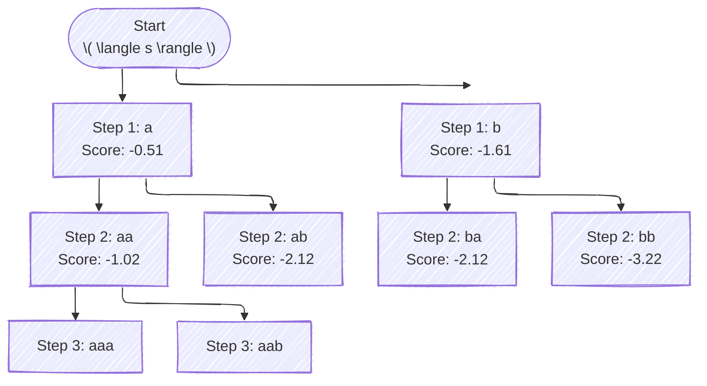
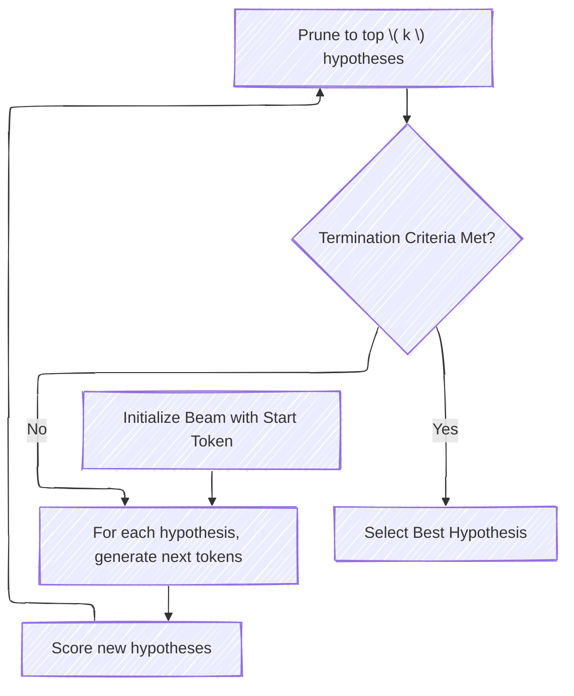
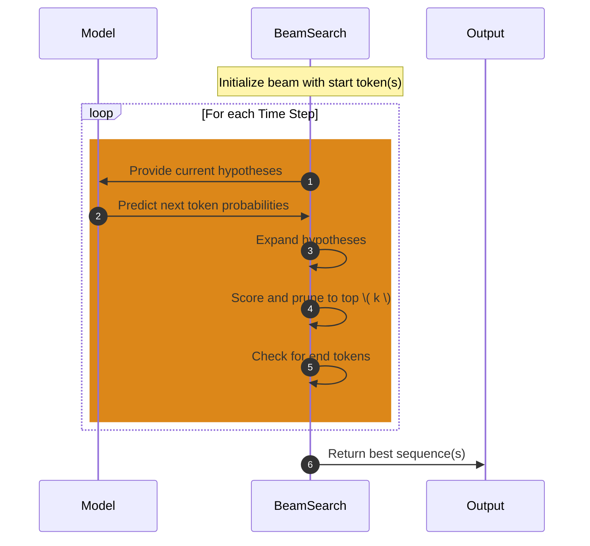

# Beam Search Algorithm: An In-Depth Explanation
> This content is dual-licensed under your choice of the following licenses:
> 1.  **MIT License:** For the code implementations in Swift and Mermaid provided in this document.
> 2.  **Creative Commons Attribution 4.0 International License (CC BY 4.0):** For all other content, including the text, explanations, and the Mermaid diagrams and illustrations.

---

## Introduction

**Beam Search** is a heuristic search algorithm used to efficiently find the most probable sequence of tokens (e.g., words or subwords) in tasks involving sequence generation. It balances between the exhaustive search (which is computationally infeasible) and the greedy search (which considers only the most probable next token at each step). 

Beam Search is widely used in **Natural Language Processing (NLP)** applications such as:

- **Machine Translation**
- **Text Summarization**
- **Dialogue Systems**
- **Speech Recognition**
- **Image Captioning**

## Purpose

- **Efficient Exploration**: To navigate a vast search space of possible sequences without evaluating every possible combination.
- **Maintaining Top Hypotheses**: Keeps track of the top \( k \) (beam width) most probable sequences at each time step.
- **Balancing Quality and Computation**: Provides better results than greedy search with manageable computational overhead compared to exhaustive search.

## Applications

- **Text Generation**: Produces coherent and contextually appropriate sequences by exploring multiple possible continuations.
- **Prediction Tasks**: Used in models where predicting a sequence of outputs is required.

## How Beam Search Works

### Concept Overview

At each time step during sequence generation:

1. **Expansion**: Each partial sequence (hypothesis) in the beam is extended by one token.
2. **Scoring**: New sequences are scored based on the model's predicted probabilities.
3. **Pruning**: Only the top \( k \) sequences are kept for the next time step.

### Algorithm Steps

1. **Initialization**:
   - Start with a beam containing a single empty sequence (or start token).

2. **Iteration**:
   - For each hypothesis in the beam:
     - Generate probabilities of all possible next tokens.
     - Extend the hypothesis with each possible next token.
   - Collect all new hypotheses.
   - Sort new hypotheses based on their cumulative scores.
   - Prune to retain the top \( k \) hypotheses.

3. **Termination**:
   - Repeat the iteration until:
     - An end-of-sequence token is generated.
     - A maximum sequence length is reached.
     - Sufficient sequences have been completed.

4. **Selection**:
   - Choose the hypothesis with the highest score among complete sequences.

### Mathematical Representation

- **Sequence Score**:

  $$
  \text{Score}(Y) = \sum_{t=1}^{T} \log P(y_t | y_{<t})
  $$

  Where:
  - \( Y = (y_1, y_2, \dots, y_T) \) is a sequence of tokens.
  - \( P(y_t | y_{<t}) \) is the probability of token \( y_t \) given the preceding tokens.

- **Beam Width (\( k \))**:
  - The number of hypotheses retained at each time step.

## Detailed Example

Let's walk through a simplified example with a small vocabulary.

### Vocabulary

Assume our vocabulary consists of the tokens: \( \{ a, b, c, d \} \) and special tokens \( \langle s \rangle \) (start) and \( \langle /s \rangle \) (end).

### Beam Width

Set beam width \( k = 2 \).

### Hypothetical Probabilities

At each time step, the model outputs probabilities for the next token.

#### Time Step 1

- **Initial Hypothesis**: \( [\langle s \rangle] \)
- **Probabilities**:

  | Token | Probability (Log Prob) |
  |-------|------------------------|
  | a     | 0.6       (-0.51)      |
  | b     | 0.2       (-1.61)      |
  | c     | 0.1       (-2.30)      |
  | d     | 0.1       (-2.30)      |

- **Extend Hypotheses**:

  - Hypotheses:

    1. \( [\langle s \rangle, a] \) Score: -0.51
    2. \( [\langle s \rangle, b] \) Score: -1.61
    3. \( [\langle s \rangle, c] \) Score: -2.30
    4. \( [\langle s \rangle, d] \) Score: -2.30

- **Prune to Top 2**:

  - Retain \( [\langle s \rangle, a] \) and \( [\langle s \rangle, b] \).

#### Time Step 2

- **Expanding Hypotheses**:

  For each retained hypothesis, generate all possible next tokens.

- **For Hypothesis \( [\langle s \rangle, a] \)**:

  | Next Token | Sequence              | Cumulative Log Prob |
  |------------|-----------------------|---------------------|
  | a          | \( [\langle s \rangle, a, a] \) | -0.51 + (-0.51) = -1.02 |
  | b          | \( [\langle s \rangle, a, b] \) | -0.51 + (-1.61) = -2.12 |
  | c          | \( [\langle s \rangle, a, c] \) | -0.51 + (-2.30) = -2.81 |
  | d          | \( [\langle s \rangle, a, d] \) | -0.51 + (-2.30) = -2.81 |

- **For Hypothesis \( [\langle s \rangle, b] \)**:

  | Next Token | Sequence              | Cumulative Log Prob |
  |------------|-----------------------|---------------------|
  | a          | \( [\langle s \rangle, b, a] \) | -1.61 + (-0.51) = -2.12 |
  | b          | \( [\langle s \rangle, b, b] \) | -1.61 + (-1.61) = -3.22 |
  | c          | \( [\langle s \rangle, b, c] \) | -1.61 + (-2.30) = -3.91 |
  | d          | \( [\langle s \rangle, b, d] \) | -1.61 + (-2.30) = -3.91 |

- **Combined Hypotheses**:

  1. \( [\langle s \rangle, a, a] \): -1.02
  2. \( [\langle s \rangle, a, b] \): -2.12
  3. \( [\langle s \rangle, b, a] \): -2.12
  4. \( [\langle s \rangle, a, c] \): -2.81
  5. \( [\langle s \rangle, a, d] \): -2.81
  6. \( [\langle s \rangle, b, b] \): -3.22
  7. \( [\langle s \rangle, b, c] \): -3.91
  8. \( [\langle s \rangle, b, d] \): -3.91

- **Prune to Top 2**:

  - Retain:
    1. \( [\langle s \rangle, a, a] \): -1.02
    2. \( [\langle s \rangle, a, b] \): -2.12

#### Subsequent Time Steps

Repeat the expansion, scoring, and pruning steps until the hypotheses generate the end token or reach maximum length.

### Visualization with Mermaid Diagrams

#### Beam Search Tree Diagram

#### Flowchart of Beam Search Process

## Key Concepts

### Beam Width (\( k \))

- **Definition**: The number of hypotheses retained at each time step.
- **Impact**:
  - **Small \( k \)**: Less computational cost, might miss better sequences.
  - **Large \( k \)**: Higher computational cost, potentially better sequences.

### Cumulative Probability

- Sequences are scored based on the cumulative log probability to avoid numerical underflow.

### Length Normalization

- **Issue**: Longer sequences tend to have lower cumulative log probabilities.
- **Solution**: Apply length normalization or penalties to balance.

  $$
  \text{Adjusted Score} = \frac{\text{Score}}{(5 + L)^\alpha / (5 + 1)^\alpha}
  $$

  Where:
  - \( L \) is the sequence length.
  - \( \alpha \) is a hyperparameter (commonly around 0.7).

### Handling End Tokens

- When a hypothesis reaches the end token \( \langle /s \rangle \), it's considered complete.
- Complete hypotheses can be moved to a separate list.
- Continue expanding incomplete hypotheses until termination criteria are met.

## Industry Practices

### Selecting Beam Width

- Common values range from 5 to 10.
- Trade-offs:
  - **Speed**: Lower \( k \) is faster.
  - **Quality**: Higher \( k \) might improve quality up to a point.

### Length Penalty

- Adjusts for biases towards shorter sequences.

### Diversity in Beam Search

- **Issue**: Beams can converge to similar sequences.
- **Solution**: Techniques like Diverse Beam Search introduce diversity among hypotheses.

### Top-k and Top-p Sampling

- **Top-k Sampling**: At each step, sample from the top \( k \) tokens.
- **Top-p (Nucleus) Sampling**: Sample from the smallest set of tokens whose cumulative probability exceeds \( p \).

### Handling Large Vocabulary

- For large vocabularies, using methods like **Vocabulary Pruning** or restricting to the top \( n \) tokens at each timestep.

## Technical Concepts

### Log Probabilities

- Using logarithms transforms multiplication of probabilities into addition, which is numerically more stable.

  $$
  \log(a \times b) = \log(a) + \log(b)
  $$

### Managing Numerical Stability

- Floating-point precision can affect calculations.
- Implementation should handle very small probabilities and overflows.

### Parallelization

- Beam Search can be parallelized across beams.
- Modern frameworks utilize GPUs to accelerate computations.

### Memory Considerations

- Beam Search stores multiple hypotheses.
- Efficient data structures (e.g., priority queues) help manage memory usage.

## Limitations

- **Computational Cost**: Increases with beam width and sequence length.
- **Limited Optimality**: May still miss the best possible sequence due to heuristic nature.
- **Lack of Diversity**: Beams might contain similar sequences.

## Advanced Variations

### Diverse Beam Search

- Modifies the scoring to promote diversity among beams.

### Adaptive Beam Width

- Dynamically adjusts \( k \) during decoding based on certain criteria (e.g., pruning low-probability beams early).

### Hypothesis Recombination

- Merges hypotheses that reach the same state to reduce redundancy.

## Practical Tips

- **Tuning Beam Width**:
  - Experiment with different \( k \) values on validation data.
  - Monitor the trade-off between quality and computational resources.

- **Implementing Length Normalization**:
  - Choose appropriate normalization to avoid bias towards shorter sequences.

- **Integration with Models**:
  - Ensure compatibility with the model's output, especially in terms of token probabilities.

## Mermaid Diagram of the Overall Process

## Conclusion

Beam Search is an essential algorithm in sequence generation tasks, providing a balance between computational efficiency and output quality. By keeping multiple hypotheses and selecting the most promising ones, it enables the generation of coherent and contextually appropriate sequences.

Understanding the intricacies of Beam Search, including beam width selection, length normalization, and handling of probabilities, allows practitioners to fine-tune their models for optimal performance in real-world applications.

---

# Key Takeaways

- **Beam Search maintains multiple hypotheses** at each time step, expanding and pruning based on cumulative scores.
- **Beam Width (\( k \))** is a crucial parameter affecting the trade-off between computational resources and output quality.
- **Length Normalization and Penalties** are important to address biases towards shorter or longer sequences.
- **Diversity Techniques** can be applied to avoid generating similar sequences and promote varied outputs.
- **Efficiency Considerations** are important for practical implementations, including parallelization and memory management.

# Industry Relevance

Beam Search continues to be a vital component in NLP models, especially with the advent of **Transformer architectures** like BERT and GPT, where decoding strategies greatly influence the generated text's quality and appropriateness.

Understanding Beam Search and its nuances is essential for:

- **Developers Implementing NLP Models**: To ensure the generated sequences meet application requirements.
- **Researchers**: To explore new decoding algorithms or improve existing ones.
- **Data Scientists**: To fine-tune models for tasks like translation, summarization, and dialogue systems.

---

# References

- **Sutskever, I., Vinyals, O., & Le, Q. V. (2014)**. Sequence to Sequence Learning with Neural Networks.
- **Wu, Y. et al. (2016)**. Google's Neural Machine Translation System: Bridging the Gap between Human and Machine Translation.
- **Vijayakumar, A. K. et al. (2016)**. Diverse Beam Search for Improved Description of Complex Scenes.

---

---
**Licenses:**

- **MIT License:**   - Full text in [LICENSE](LICENSE) file.
- **Creative Commons Attribution 4.0 International:**  - Legal details in [LICENSE-CC-BY](LICENSE-CC-BY) and at [Creative Commons official site](http://creativecommons.org/licenses/by/4.0/).

---