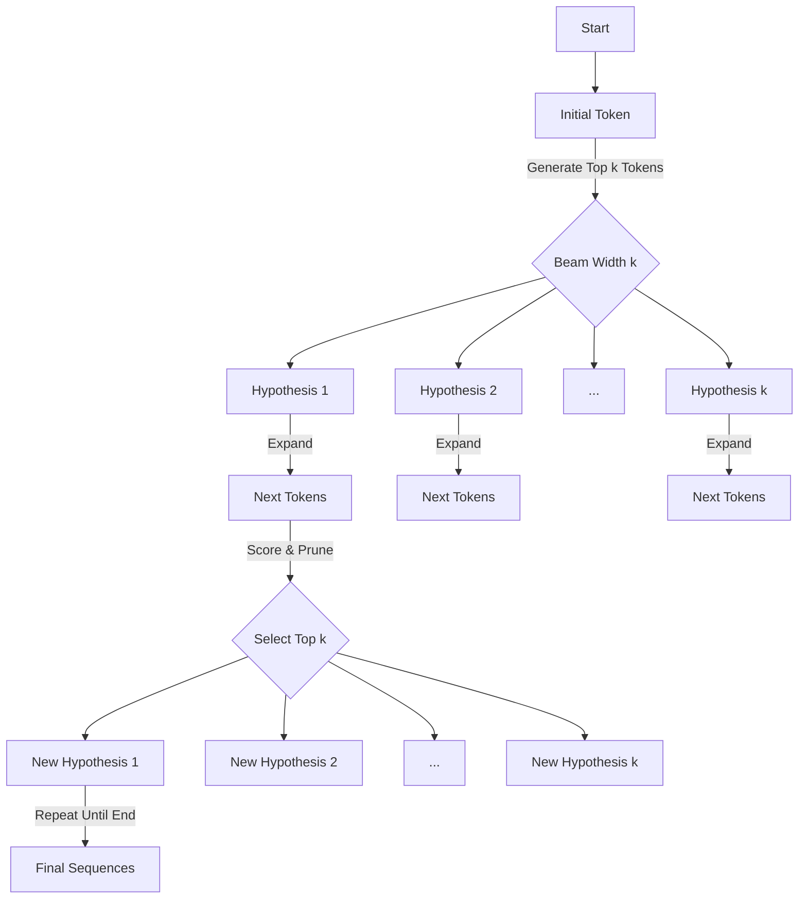
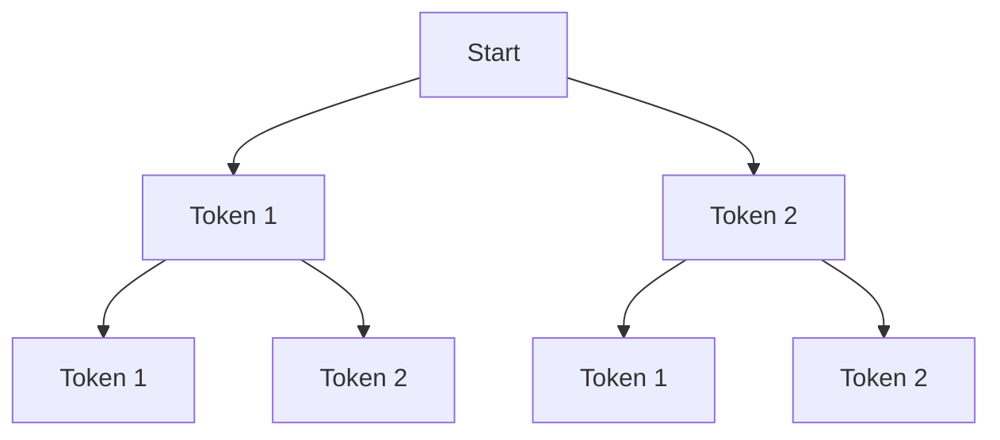
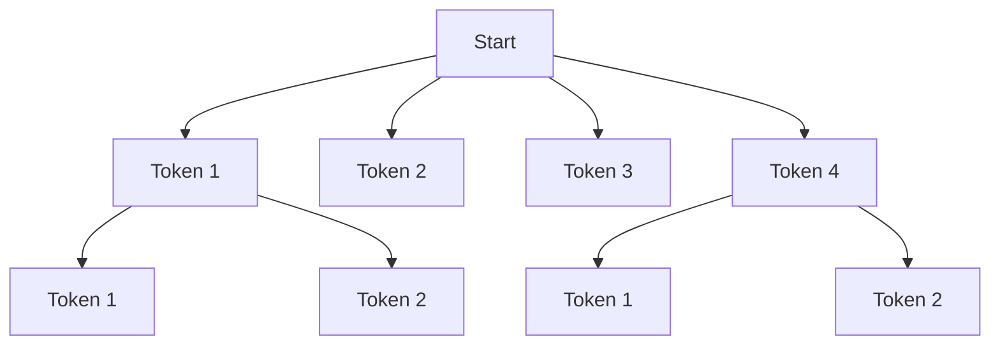
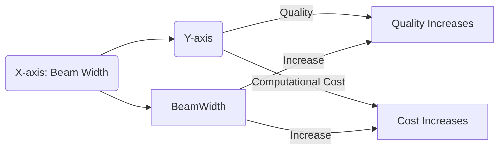
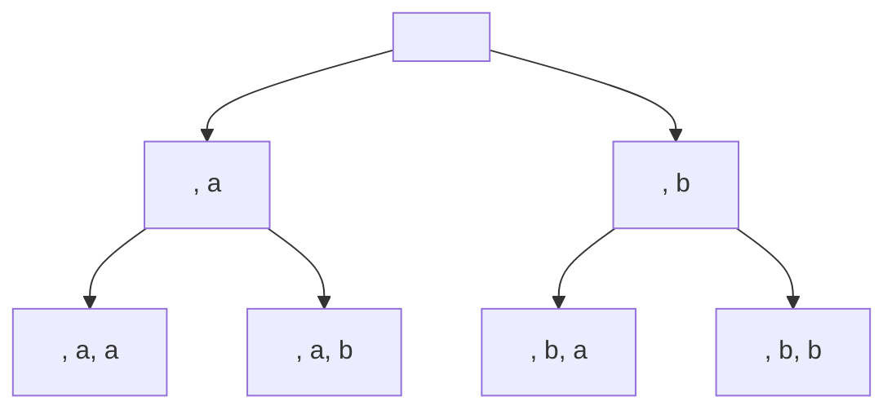

# Beam Width Adjustment in Beam Search: A Comprehensive Guide
> This content is dual-licensed under your choice of the following licenses:
> 1.  **MIT License:** For the code implementations in Swift and Mermaid provided in this document.
> 2.  **Creative Commons Attribution 4.0 International License (CC BY 4.0):** For all other content, including the text, explanations, and the Mermaid diagrams and illustrations.

---

Beam Search is a heuristic search algorithm widely used in natural language processing (NLP), especially in tasks like machine translation, text summarization, and text generation using language models. Beam Width Adjustment refers to the process of modifying the beam width parameter in Beam Search to balance between computational efficiency and the quality of the generated text. 

This guide delves into the intricacies of Beam Width Adjustment, explaining its purpose, applications, and impact on text generation, along with illustrative diagrams to enhance understanding.

---

## **Table of Contents**

1. [Introduction to Beam Search](#introduction-to-beam-search)
2. [Understanding Beam Width](#understanding-beam-width)
3. [Beam Width Adjustment](#beam-width-adjustment)
4. [Trade-offs in Beam Width Adjustment](#trade-offs-in-beam-width-adjustment)
5. [Technical Concepts and Complexities](#technical-concepts-and-complexities)
6. [Industry Practices](#industry-practices)
7. [Illustrations and Diagrams](#illustrations-and-diagrams)
8. [Conclusion](#conclusion)

---

## **1. Introduction to Beam Search**

Beam Search is an advanced search algorithm that explores a graph (or tree) to find a sequence of tokens that maximizes the probability of a given language model. It is a breadth-limited heuristic search that keeps track of the top \( k \) most probable sequences (hypotheses) at each time step, where \( k \) is the beam width.

### **How Beam Search Works**

At each step of sequence generation:

- **Expansion**: All possible next tokens are considered for each hypothesis.
- **Scoring**: Each new sequence is scored based on the language model's predictions.
- **Pruning**: Only the top \( k \) sequences are kept for the next step.

This process continues until the end-of-sequence token is generated or a maximum length is reached.

---

## **2. Understanding Beam Width**

### **Definition**

- **Beam Width (\( k \))**: The number of hypotheses (partial sequences) retained at each time step during the search.

### **Impact of Beam Width**

- **Smaller Beam Width**:
  - **Pros**: Less computationally intensive.
  - **Cons**: May miss high-quality sequences due to limited exploration.
- **Larger Beam Width**:
  - **Pros**: Better chance of finding optimal or higher-quality sequences.
  - **Cons**: Increased computational cost and memory usage.

---

## **3. Beam Width Adjustment**

Beam Width Adjustment involves tuning the beam width (\( k \)) to optimize the balance between computational efficiency and the quality of generated text.

### **Purpose**

- **Optimize Performance**: Adjust \( k \) to achieve acceptable output quality without unnecessary computational overhead.
- **Resource Management**: Ensure that the algorithm runs efficiently within the constraints of available computational resources.

---

## **4. Trade-offs in Beam Width Adjustment**

### **Quality vs. Computational Cost**

- **Quality Improvement**:
  - Increasing \( k \) can lead to more coherent and contextually appropriate sequences.
  - Diminishing returns: Beyond a certain point, increasing \( k \) yields minimal quality gains.

- **Computational Cost**:
  - Time Complexity: \( O(k \times V \times L) \)
    - \( V \): Vocabulary size.
    - \( L \): Sequence length.
  - Memory Usage: Proportional to \( k \times L \).

### **Overfitting and Diversity**

- **Overfitting to Likelihood**:
  - Large \( k \) may result in generic or repetitive outputs by overemphasizing high-probability words.
- **Lack of Diversity**:
  - Smaller \( k \) may produce less diverse results, potentially missing novel or creative outputs.

---

## **5. Technical Concepts and Complexities**

### **Scoring Functions**

- **Log Probability**:
  - Sum of log probabilities of the tokens in a sequence.
- **Length Normalization**:
  - Adjusts scores to prevent bias toward shorter sequences.

### **Beam Pruning Strategies**

- **Naïve Pruning**:
  - Keep top \( k \) sequences based solely on current scores.

- **Diversity-Promoting Techniques**:
  - **Diverse Beam Search**: Encourages diversity among hypotheses.
  - **Stochastic Beam Search**: Introduces randomness into selection.

### **Handling of End Tokens**

- **Early Stopping**:
  - When a hypothesis generates an end-of-sequence token, it's added to the list of complete hypotheses.
- **Continuation vs. Termination**:
  - Decision whether to continue expanding incomplete hypotheses or terminate.

### **Complexity Analysis**

- **Time Complexity**:
  - \( O(k \times V \times L) \)
    - Linear in beam width \( k \), vocabulary size \( V \), and sequence length \( L \).

- **Space Complexity**:
  - \( O(k \times L) \)
    - Stores \( k \) sequences, each of length \( L \).

---

## **6. Industry Practices**

### **Adaptive Beam Width**

- **Dynamic Adjustment**:
  - Start with a larger \( k \) and reduce it as the sequence progresses.
- **Heuristic-Based Adjustment**:
  - Use metrics like average score divergence to adjust \( k \).

### **Hybrid Approaches**

- **Combined with Sampling**:
  - Use beam search with stochastic elements to balance quality and diversity.
- **Top-\( k \) or Nucleus Sampling**:
  - Use alternative decoding methods for specific applications.

### **Beam Width Values**

- **Common Choices**:
  - \( k \) values between 3 and 10 are often used.
- **Task-Specific Tuning**:
  - Adjust \( k \) based on the application (e.g., translation vs. summarization).

---

## **7. Illustrations and Diagrams**

### **7.1 Beam Search Process**

### **7.2 Impact of Beam Width**

#### **Beam Width = 2**

#### **Beam Width = 4**

### **7.3 Trade-off Visualization**

---

## **8. Conclusion**

Beam Width Adjustment is a crucial aspect of optimizing Beam Search in text generation tasks. By carefully tuning the beam width, practitioners can balance computational efficiency with the quality of the generated text. Understanding the trade-offs and technical complexities allows for informed decisions that enhance performance while managing resources effectively.

---

# **Appendix: Detailed Explanations**

## **A. Beam Search Algorithm Steps**

1. **Initialization**:
   - Start with a single initial hypothesis consisting of the start token.
   - Set the initial score to zero or the log probability of the start token.

2. **Iteration**:
   - For each hypothesis in the beam:
     - **Expansion**: Generate all possible next tokens.
     - **Scoring**: Calculate the score for each extended hypothesis.
   - **Pruning**:
     - Combine all extended hypotheses.
     - Sort based on the cumulative score.
     - Retain the top \( k \) hypotheses.

3. **Termination**:
   - Repeat the iteration until:
     - All hypotheses have generated the end-of-sequence token.
     - Maximum sequence length is reached.
   - **Selection**:
     - From completed hypotheses, select the one with the best score.

## **B. Length Normalization Techniques**

Longer sequences tend to have lower cumulative log probabilities (more negative) due to the multiplication (addition in log space) of probabilities. To address this bias:

- **Average Log Probability**:
  - Divide the cumulative log probability by the sequence length.

$$
 \text{Normalized Score} = \frac{1}{N} \sum_{i=1}^{N} \log P(w_i | w_{<i})
$$

- **Length Penalty**:
  - Apply a penalty term to adjust the score.

$$
 \text{Score} = \frac{\log P(\mathbf{w})}{(5 + N)^\alpha / 6^\alpha}
$$

  - \( \alpha \) is a hyperparameter controlling the strength of the penalty.

## **C. Diverse Beam Search**

An extension of Beam Search to promote diversity among the hypotheses:

- **Group Beams**:
  - Partition the beam into groups.
- **Diversity Penalty**:
  - Modify scores to penalize hypotheses similar to those already selected.

## **D. Beam Search Variants**

- **Stochastic Beam Search**:
  - Introduces randomness by sampling instead of always selecting the top tokens.
- **Monte Carlo Beam Search**:
  - Uses Monte Carlo sampling to estimate the value of future sequences.

---

# **References**

- **Vijayakumar, A., et al. (2018)**. Diverse Beam Search for Improved Description of Complex Scenes. *AAAI Conference on Artificial Intelligence*.
- **Wu, Y., et al. (2016)**. Google's Neural Machine Translation System: Bridging the Gap between Human and Machine Translation. *arXiv preprint arXiv:1609.08144*.
- **Sutskever, I., et al. (2014)**. Sequence to Sequence Learning with Neural Networks. *Advances in Neural Information Processing Systems*.

---

# **Frequently Asked Questions**

### **1. Why not always use a large beam width for the best quality?**

- **Computational Constraints**: Larger beam widths significantly increase computation time and memory usage.
- **Diminishing Returns**: Beyond a certain point, increases in beam width yield minimal improvements.
- **Overfitting to Likelihood**: May produce less diverse or overly generic sequences.

### **2. How to choose the optimal beam width?**

- **Empirical Testing**: Experiment with different \( k \) values and evaluate the output quality.
- **Task-Specific Requirements**: Consider the nature of the task; some tasks benefit more from larger beams.
- **Resource Availability**: Balance against available computational resources and time constraints.

### **3. What are alternatives to Beam Search?**

- **Greedy Search**: Selects the best token at each step without considering future possibilities.
- **Sampling Methods**: Such as Top-\( k \) sampling, Nucleus (Top-p) sampling, which introduce randomness.
- **Contrastive Search**: Balances between maximizing likelihood and diversity.

---

# **Illustration: Beam Search Example**

### **Hypothetical Scenario**

Assume a language model with a vocabulary \( V = \{ a, b, c \} \) and we aim to generate a sequence.

### **Beam Width \( k = 2 \)**

#### **Step 1: Initialization**

- Hypotheses:
  - \( h_1 \): [\<START\>] (Score: 0)

#### **Step 2: First Iteration**

- **Expansion**:
  - \( h_1 \) extends to:
    - \( h_{1a} \): [\<START\>, a] (Score: \( s_{1a} \))
    - \( h_{1b} \): [\<START\>, b] (Score: \( s_{1b} \))
    - \( h_{1c} \): [\<START\>, c] (Score: \( s_{1c} \))

- **Scoring & Pruning**:
  - Keep top 2 based on scores.

#### **Step 3: Second Iteration**

- Hypotheses:
  - \( h_{1a} \), \( h_{1b} \)

- **Expansion**:
  - Each hypothesis extends to all possible next tokens.

- **Scoring & Pruning**:
  - Combine and keep top 2.

#### **Visualization**

---

# **Summary**

Beam Width Adjustment is essential for optimizing text generation in language models. By understanding and applying the concepts outlined in this guide, practitioners can fine-tune their models to produce high-quality outputs while efficiently utilizing computational resources.

---

# **Recommended Actions**

- **Experiment with Different Beam Widths**: Test various \( k \) values to find the optimal balance.
- **Implement Length Normalization**: Prevent biases toward shorter or longer sequences.
- **Consider Diversity-Promoting Techniques**: If output diversity is important, explore methods like Diverse Beam Search.
- **Monitor Resource Usage**: Use profiling tools to ensure that computational costs remain within acceptable limits.

---

# **Additional Resources**

- **OpenAI GPT Models Documentation**
- **TensorFlow and PyTorch Beam Search Implementations**
- **Latest Research Papers on Sequence Generation Algorithms**

---
**Licenses:**

- **MIT License:**   - Full text in [LICENSE](LICENSE) file.
- **Creative Commons Attribution 4.0 International:**  - Legal details in [LICENSE-CC-BY](LICENSE-CC-BY) and at [Creative Commons official site](http://creativecommons.org/licenses/by/4.0/).

---