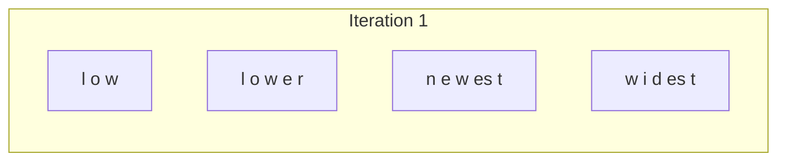
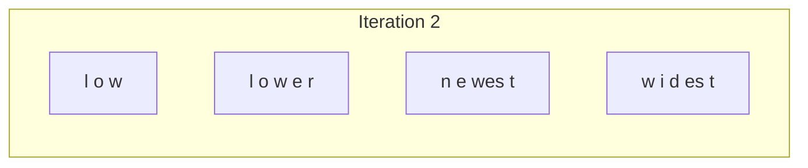
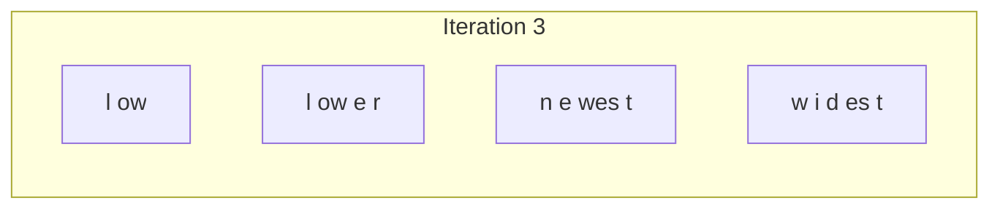
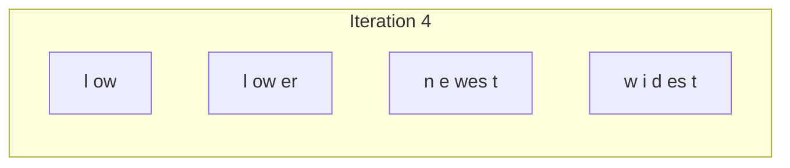
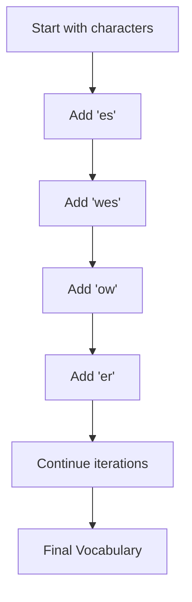
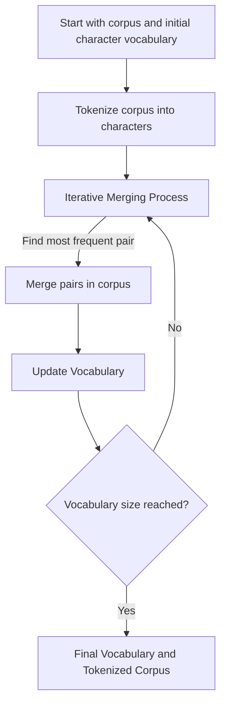
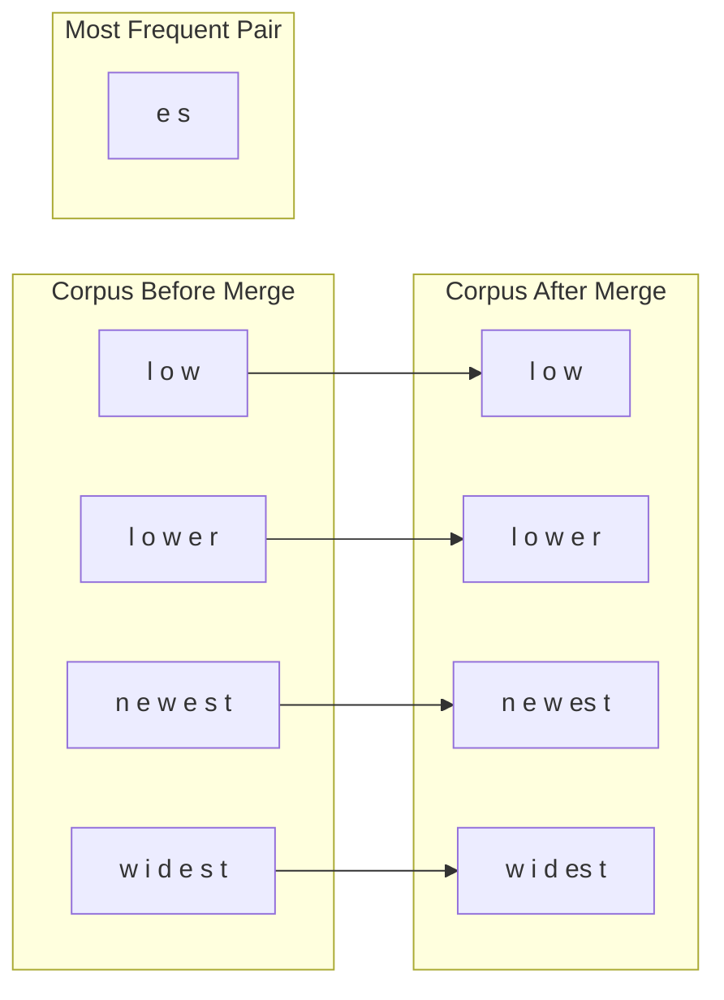
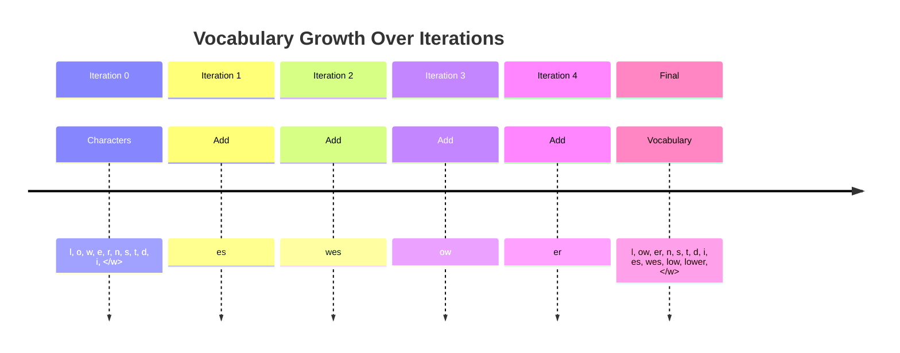

# Byte Pair Encoding (BPE): An In-Depth Exploration
> This content is dual-licensed under your choice of the following licenses:
> 1.  **MIT License:** For the code implementations in Swift and Mermaid provided in this document.
> 2.  **Creative Commons Attribution 4.0 International License (CC BY 4.0):** For all other content, including the text, explanations, and the Mermaid diagrams and illustrations.

---

**Byte Pair Encoding (BPE)** is a subword segmentation algorithm widely used in natural language processing (NLP) to effectively handle rare words and reduce the out-of-vocabulary (OOV) problem. It merges frequent pairs of characters or character sequences to build a vocabulary of subword units, enabling models to represent any word in terms of these units. This approach strikes a balance between character-level and word-level representations, improving vocabulary efficiency and model performance.

In this detailed explanation, we'll cover:

1. **The Motivation Behind BPE**
2. **How BPE Works: Step-by-Step**
3. **Mathematical Formulation**
4. **Applications in NLP and Industry Practices**
5. **Advantages and Considerations**
6. **Comparisons with Other Tokenization Methods**

Throughout, we'll use **Mermaid diagrams** to illustrate the concepts and processes involved.

---

## 1. The Motivation Behind BPE

### The OOV Problem

In NLP, models often struggle with rare or unseen words (out-of-vocabulary words). Traditional word-level tokenization cannot handle words not present in the training vocabulary, leading to information loss.

### The Need for Subword Units

To mitigate this, subword tokenization methods break words into smaller units, allowing models to:

- Represent any word, including rare or new ones.
- Capture meaningful subword patterns (e.g., prefixes, suffixes).
- Reduce the overall size of the vocabulary, making training more efficient.

**Byte Pair Encoding (BPE)** is one such method, adapted from a data compression technique to serve NLP needs.

---

## 2. How BPE Works: Step-by-Step

### Overview

BPE starts with a base vocabulary of individual characters and iteratively merges the most frequent pair of symbols (characters or sequences already formed). This continues until a predefined vocabulary size is reached.

### Step-by-Step Process

Let's break down the BPE algorithm with an example.

**Assumption**:

- We have a corpus: `low`, `lower`, `newest`, `widest`

### Initial Vocabulary

1. **Start with a character-level vocabulary** (including the end-of-word marker `</w>`):

   ```
   l, o, w, e, r, n, s, t, d, </w>
   ```

2. **Initialize the corpus as sequences of characters**:

   ```
   l o w </w>
   l o w e r </w>
   n e w e s t </w>
   w i d e s t </w>
   ```

### Iterative Merging Process

At each iteration, we:

- Find the most frequent pair of symbols.
- Merge this pair throughout the corpus.
- Update the vocabulary accordingly.

Let's illustrate this with diagrams.

#### **Iteration 1**

**Find the most frequent pair**:

- Pairs: (`e`, `s`), (`e`, `r`), (`l`, `o`), (`o`, `w`), etc.
- **Most frequent pair**: `e` `s` (appears twice)

**Merge `e s` into `es`**:

**Updated Corpus**:

```
l o w </w>
l o w e r </w>
n e w es t </w>
w i d es t </w>
```

**Updated Vocabulary**:

```
l, o, w, e, r, n, s, t, d, i, es, </w>
```

**Mermaid Diagram**:



#### **Iteration 2**

**Find the most frequent pair**:

- Pairs: (`w`, `es`), (`e`, `r`), (`o`, `w`), etc.
- **Most frequent pair**: `w` `es` (appears twice)

**Merge `w es` into `wes`**:

**Updated Corpus**:

```
l o w </w>
l o w e r </w>
n e wes t </w>
w i d es t </w>
```

**Updated Vocabulary**:

```
l, o, w, e, r, n, s, t, d, i, es, wes, </w>
```

**Mermaid Diagram**:



#### **Iteration 3**

**Find the most frequent pair**:

- Pairs: (`w`, `i`), (`l`, `o`), (`o`, `w`), etc.
- **Most frequent pair**: `o` `w` (appears twice)

**Merge `o w` into `ow`**:

**Updated Corpus**:

```
l ow </w>
l ow e r </w>
n e wes t </w>
w i d es t </w>
```

**Updated Vocabulary**:

```
l, ow, e, r, n, s, t, d, i, es, wes, </w>
```

**Mermaid Diagram**:



#### **Iteration 4**

**Find the most frequent pair**:

- Pairs: (`l`, `ow`), (`e`, `r`), (`i`, `d`), etc.
- **Most frequent pair**: `e` `r` (appears once, ties can be broken arbitrarily)

**Merge `e r` into `er`**:

**Updated Corpus**:

```
l ow </w>
l ow er </w>
n e wes t </w>
w i d es t </w>
```

**Updated Vocabulary**:

```
l, ow, er, n, s, t, d, i, es, wes, </w>
```

**Mermaid Diagram**:



We continue this process until reaching the desired vocabulary size.

### Final Vocabulary

For this example, suppose we continue until we have the following vocabulary:

```
l, ow, er, n, s, t, d, i, es, wes, widest, newest, lower, low, </w>
```

**Mermaid Diagram of Vocabulary Expansion**:



---

## 3. Mathematical Formulation

Let me denote:

- Let \( V \) be the initial vocabulary (set of symbols), starting with all characters.
- Let \( S \) be the training corpus, represented as sequences over \( V \).
- At each iteration, find the pair of symbols \( (x, y) \) in \( V \times V \) that maximizes the frequency count \( f(x, y) \) in \( S \).
  
  \( (x', y') = \underset{(x, y) \in V \times V}{\arg\max} \, f(x, y) \)
  
- Merge \( x' \) and \( y' \) into a new symbol \( z \), update \( V \leftarrow V \cup \{ z \} \), and replace all occurrences of \( x'y' \) in \( S \) with \( z \).

Repeat until the desired vocabulary size is reached.

---

## 4. Applications in NLP and Industry Practices

### NLP Models

- **Neural Machine Translation (NMT)**
- **Language Models**: GPT-2, GPT-3
- **Text Classification**

### Industry Practices

- **OpenAI's GPT Series**: Utilize BPE for efficient tokenization.
- **Google's SentencePiece**: An evolution of BPE that treats the input as a sequence of Unicode characters and allows for direct training from raw sentences.

### Mermaid Diagram of Integration in NLP Pipeline


---

## 5. Advantages and Considerations

### Advantages

- **Handles OOV Words**: By breaking words into subwords, rare or new words can be represented.
- **Balancing Vocabulary Size**: Controls the trade-off between vocabulary size and the granularity of tokens.
- **Captures Meaningful Subwords**: Frequently occurring morphemes or word pieces are learned.

### Considerations

- **Predefined Vocabulary Size**: Requires setting the vocabulary size beforehand.
- **Computation Time**: The merge operations can be computationally intensive on large corpora.
- **Language Dependency**: Works well for languages with concatenative morphology; may need adjustments for others.

---

## 6. Comparisons with Other Tokenization Methods

### WordPiece (Used in BERT)

- Similar to BPE but uses a probabilistic model to select merges.
- Focuses on maximizing the likelihood of the training data.

### Unigram Language Model (Used in SentencePiece)

- Treats subword units as a probabilistic model.
- Selects the vocabulary that maximizes the likelihood of the training data using a subset of all possible subwords.

### Byte-Level BPE (Used in GPT-2/GPT-3)

- Applies BPE at the byte level rather than Unicode characters.
- Can handle any text without needing to decode bytes to characters, making it language-agnostic.

---

## Detailed Mermaid Diagrams and Illustrations

### BPE Workflow Diagram



### Symbol Merging Process



### Vocabulary Evolution



---

## Conclusion

**Byte Pair Encoding (BPE)** is a fundamental technique in modern NLP for effectively handling rare and out-of-vocabulary words by building a flexible subword vocabulary. By merging frequent character pairs iteratively, BPE constructs a balanced vocabulary that captures both frequent words and meaningful subword patterns, enhancing the model's ability to process diverse language inputs.

---

# Additional Technical Concepts and Complexities

## Extension to Byte-Level BPE

Some models, like GPT-2 and GPT-3, apply BPE at the byte level, operating on raw bytes instead of Unicode characters. This approach has advantages:

- **Language Agnostic**: Can process any language without specific tokenization rules.
- **Consistent Handling of Whitespace and Special Characters**.

## Mathematical Notation for Probability

While BPE itself is a deterministic algorithm, when integrated into language models, the probability of a token sequence can be represented as:

$$
P(w) = \prod_{t=1}^{T} P(w_t | w_{<t})
$$

Where:

- $w = w_1, w_2, ..., w_T$ is the sequence of tokens generated by BPE.
- $P(w_t | w_{<t})$ is the probability of token $w_t$ given the previous tokens.

## Handling Unseen Words

Even with BPE, completely new words may still appear. However, since words are made up of subword units from the vocabulary, the model can represent and process them, assigning probabilities to sequences of subwords.

---

# Current Practices and Industry Trends

- **Adaptive Tokenization**: Some newer models explore dynamic tokenization strategies that adjust during training.
  
- **Vocabulary Size Optimization**: Finding the optimal vocabulary size is essential. Too small may lead to long sequences; too large can increase model complexity.

- **Combining with Other Techniques**: BPE is often used in conjunction with other preprocessing steps such as normalization, lowercasing, or handling of special tokens.

---

# References for Further Reading

- **Original BPE Paper**: [Neural Machine Translation of Rare Words with Subword Units](https://arxiv.org/abs/1508.07909)
  
- **SentencePiece**: [A Unigram Language Model for Neural Machine Translation](https://arxiv.org/abs/1804.10959)

- **Byte-Level BPE in GPT-2**: [Language Models are Unsupervised Multitask Learners](https://cdn.openai.com/better-language-models/language_models_are_unsupervised_multitask_learners.pdf)

---


---
**Licenses:**

- **MIT License:**  [](LICENSE) - Full text in [LICENSE](LICENSE) file.
- **Creative Commons Attribution 4.0 International:** [](LICENSE-CC-BY) - Legal details in [LICENSE-CC-BY](LICENSE-CC-BY) and at [Creative Commons official site](http://creativecommons.org/licenses/by/4.0/).

---