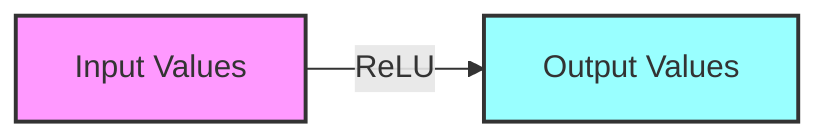
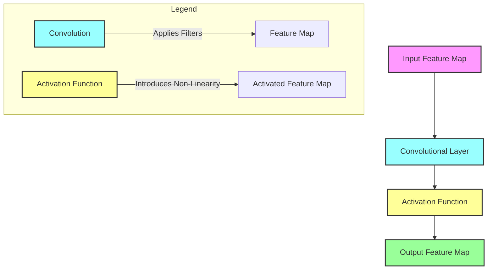

# Activation Functions in Convolutional Neural Networks(CNNs)
> This content is dual-licensed under your choice of the following licenses:
> 1.  **MIT License:** For the code implementations in Swift and Mermaid provided in this document.
> 2.  **Creative Commons Attribution 4.0 International License (CC BY 4.0):** For all other content, including the text, explanations, and the Mermaid diagrams and illustrations.

---

## **Introduction**

In neural networks, **activation functions** are crucial components that introduce **non-linearity** into the model. This non-linearity enables neural networks to capture complex patterns in the data, allowing them to model intricate relationships between inputs and outputs.

In **Convolutional Neural Networks (CNNs)**, activation functions are applied after convolutional layers and fully connected layers to transform the output into a non-linear format, which is then passed to the next layer. Without activation functions, CNNs would behave as purely linear systems, regardless of their depth, severely limiting their ability to model real-world data.

---

## **Purpose of Activation Functions**

- **Introduce Non-Linearity**: Allow the network to learn non-linear relationships.
- **Enable Complex Function Approximation**: Facilitate the modeling of complex patterns in data.
- **Ensure Differentiability**: Activation functions are designed to be differentiable to allow gradient-based optimization.

---

## **Common Activation Functions**

### **1. ReLU (Rectified Linear Unit)**

- **Definition**:

  $$
  \text{ReLU}(x) = \max(0, x)
  $$

- **Characteristics**:
  - Outputs the input directly if it's positive; otherwise, it outputs zero.
  - Introduces sparsity by zeroing out negative inputs.
  - Computationally efficient and accelerates convergence in deep networks.

- **Graphical Representation**:

  
  
  *ReLU function: Activates neurons only if the input is greater than zero.*

- **Advantages**:
  - Reduces the likelihood of vanishing gradients.
  - Simple and efficient to compute.

- **Disadvantages**:
  - **Dying ReLU Problem**: Neurons can become inactive if they consistently output zero, ceasing to learn.

### **2. Sigmoid Function**

- **Definition**:

  $$
  \text{Sigmoid}(x) = \frac{1}{1 + e^{-x}}
  $$

- **Characteristics**:
  - S-shaped curve that maps input values to an output range between 0 and 1.
  - Historically popular in early neural networks.

- **Graphical Representation**:

  
  
  *Sigmoid function: Smoothly squashes input values into the (0, 1) interval.*

- **Advantages**:
  - Smooth gradient, which can be desirable for gradient-based algorithms.
  - Outputs can be interpreted as probabilities.

- **Disadvantages**:
  - **Vanishing Gradient Problem**: Gradients become very small for large positive or negative inputs, slowing learning.
  - Outputs are not zero-centered, which can affect convergence.

### **3. Tanh Function (Hyperbolic Tangent)**

- **Definition**:

  $$
  \text{Tanh}(x) = \frac{e^{x} - e^{-x}}{e^{x} + e^{-x}}
  $$

- **Characteristics**:
  - Similar to the sigmoid function but outputs values between -1 and 1.
  - Zero-centered outputs assist in faster convergence compared to sigmoid.

- **Graphical Representation**:

  
  
  *Tanh function: Maps input values to between -1 and 1.*

- **Advantages**:
  - Zero-centered outputs improve optimization.

- **Disadvantages**:
  - Suffers from the vanishing gradient problem like the sigmoid function.

### **4. Leaky ReLU**

- **Definition**:

  $$
  \text{Leaky ReLU}(x) = 
  \begin{cases} 
    x, & \text{if } x \geq 0 \\
    \alpha x, & \text{if } x < 0
  \end{cases}
  $$

  Where \( \alpha \) is a small constant, typically 0.01.

- **Characteristics**:
  - Allows a small, non-zero gradient when the unit is not active.
  - Helps mitigate the dying ReLU problem.

- **Graphical Representation**:

  
  
  *Leaky ReLU function: Introduces a small slope for negative inputs.*

- **Advantages**:
  - Prevents neurons from dying by ensuring a small gradient for negative inputs.

- **Disadvantages**:
  - The appropriate value of \( \alpha \) needs to be determined.

---

## **Effect of ReLU Activation in CNNs**

The **Rectified Linear Unit (ReLU)** is the most commonly used activation function in CNNs due to its simplicity and effectiveness in training deep networks.

### **Flow Diagram of ReLU Activation**

In this diagram:

- **Input Values**: The outputs from the convolutional layer (which can be negative, zero, or positive).
- **ReLU Function**: Applies the activation function element-wise to the input.
- **Output Values**: The transformed outputs, where all negative values are set to zero.

### **Mathematical Example**

Suppose we have an input vector from a convolutional layer:

$$
X = [-2.0,\ 0.5,\ -0.3,\ 1.2]
$$

Applying the ReLU activation function:

$$
\text{ReLU}(X) = [0,\ 0.5,\ 0,\ 1.2]
$$

---

## **Importance of Non-Linearity**

### **Why Linear Layers are Not Enough**

- **Linear Layers**: Without activation functions, stacking multiple linear layers is equivalent to a single linear transformation. Mathematically, linear operations are additive:

$$
    \text{Linear}(W_2, \text{Linear}(W_1, X)) = W_2 W_1 X
$$

- **Limitation**: Linear models cannot capture complex patterns inherent in data that are non-linear.

### **Role of Activation Functions**

- **Enable Complex Mappings**: Non-linear activation functions allow networks to learn non-linear relationships.
- **Expressiveness**: Increase the representational power of the network to model complex functions.

---

## **Activation Functions and Backpropagation**

### **Differentiability**

- **Requirement**: Activation functions must be differentiable to allow the computation of gradients during backpropagation.
- **Gradients**: Used to update the weights in the network through gradient descent optimization.

### **ReLU Derivative**

- The derivative of ReLU is:

$$
  \text{ReLU}'(x) = 
  \begin{cases} 
    1, & \text{if } x > 0 \\
    0, & \text{if } x \leq 0
  \end{cases}
$$

- **Implication**: For inputs greater than zero, the gradient flows back without attenuation; for inputs less than or equal to zero, the gradient is zero.

### **Vanishing Gradient Problem**

- **Occurs With**: Sigmoid and tanh functions for large input values where the gradient approaches zero.
- **Impact**: Learning slows down or stops in earlier layers during training.
- **Solution**: Use activation functions like ReLU that do not saturate in the positive region.

---

## **Potential Issues with Activation Functions**

### **Dying ReLU Problem**

- **Description**: Neurons become inactive and only output zero, effectively 'dying'.
- **Cause**: If a neuron's weights are updated such that the net input is always negative.
- **Consequence**: The neuron stops contributing to the network's learning.
- **Mitigation Strategies**:
  - Use variants like **Leaky ReLU**, **Parametric ReLU (PReLU)**, or **Exponential Linear Unit (ELU)**.
  - Proper weight initialization.

### **Choosing the Right Activation Function**

- **ReLU**: Default choice for hidden layers in CNNs.
- **Sigmoid**: Suitable for output layers in binary classification.
- **Tanh**: Can be used but generally less preferred due to vanishing gradient issues.
- **Leaky ReLU and Variants**: Employed when the dying ReLU problem is significant.

---

## **Advanced Activation Functions**

### **Parametric ReLU (PReLU)**

- **Definition**:

$$
  \text{PReLU}(x) = 
  \begin{cases} 
    x, & \text{if } x \geq 0 \\
    a x, & \text{if } x < 0
  \end{cases}
$$

  - **Learnable Parameter**: The coefficient \( a \) is learned during training.

- **Benefit**: Allows the network to determine the most appropriate negative slope.

### **Exponential Linear Unit (ELU)**

- **Definition**:

$$
  \text{ELU}(x) = 
  \begin{cases} 
    x, & \text{if } x \geq 0 \\
    \alpha (e^{x} - 1), & \text{if } x < 0
  \end{cases}
$$

  - **Characteristics**:
    - Negative values are smoothly output.
    - Reduces bias shift by pushing mean activations towards zero.

### **Scaled Exponential Linear Unit (SELU)**

- **Definition**:

$$
  \text{SELU}(x) = \lambda
  \begin{cases} 
    x, & \text{if } x > 0 \\
    \alpha (e^{x} - 1), & \text{if } x \leq 0
  \end{cases}
$$

  - **Self-Normalizing Networks**: SELUs help keep the mean and variance of the inputs to layers close to zero and one, respectively.

---

## **Visualization Using Mermaid Diagrams**

### **Activation Flow in CNNs**

**Explanation**:

- **Convolutional Layer**: Applies filters to the input feature map, producing linear activations.
- **Activation Function**: Introduces non-linearity to the activations.
- **Output Feature Map**: Passed to the next layer in the network.

---

## **Practical Implementation Tips**

### **Weight Initialization**

- **He Initialization**: Recommended when using ReLU activation functions.

$$
  \text{Variance} = \frac{2}{\text{number of input units}}
$$

- **Purpose**: Helps maintain variance of activations throughout the network layers.

### **Batch Normalization**

- **Function**: Normalizes inputs to layers, stabilizing learning.
- **Interaction with Activation Functions**:
  - Can be applied before or after activation functions.
  - Often used with ReLU to improve training speed and performance.

---

## **Summary**

Activation functions are fundamental to the success of CNNs in modeling complex, non-linear relationships in data. The choice of activation function impacts:

- **Learning Dynamics**: How gradients flow during backpropagation.
- **Network Performance**: Ability to converge and generalize to new data.
- **Training Stability**: Mitigating problems like vanishing or exploding gradients.

**Common Practices**:

- Use **ReLU** for hidden layers in CNNs.
- Be cautious of the dying ReLU problem; consider **Leaky ReLU** or **ELU** if necessary.
- For output layers:
  - Use **Sigmoid** for binary classification.
  - Use **Softmax** (not detailed here) for multi-class classification tasks.

By understanding and effectively utilizing activation functions, you can significantly enhance the performance and robustness of convolutional neural networks in various applications.

---
**Licenses:**

- **MIT License:**   - Full text in [LICENSE](LICENSE) file.
- **Creative Commons Attribution 4.0 International:**  - Legal details in [LICENSE-CC-BY](LICENSE-CC-BY) and at [Creative Commons official site](http://creativecommons.org/licenses/by/4.0/).

---