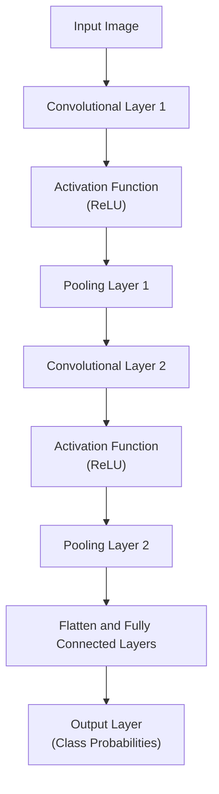
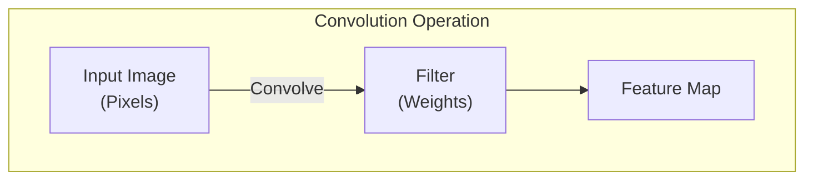
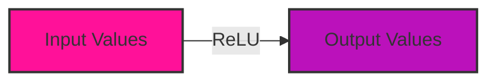
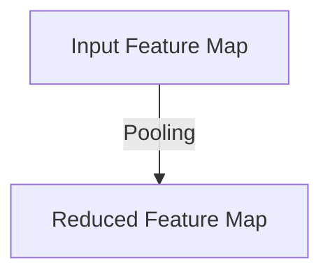
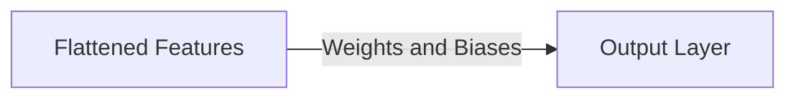
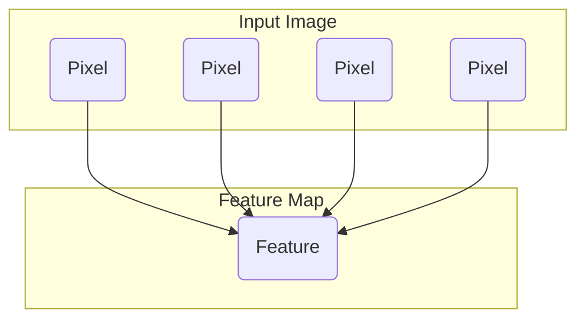
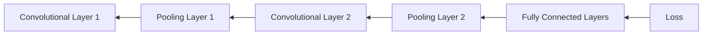
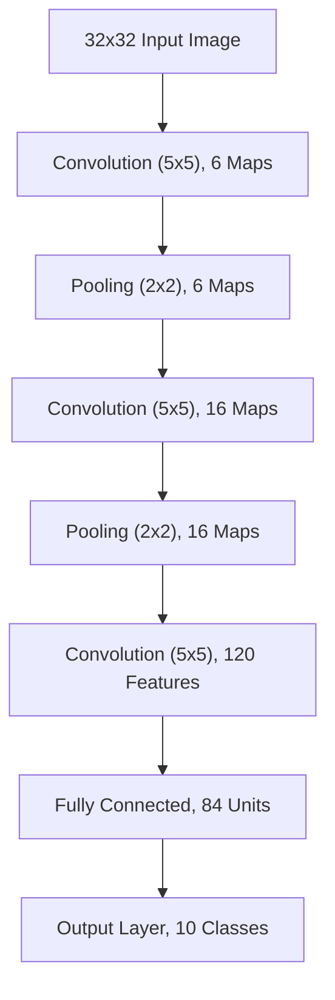

# Convolutional Neural Networks (CNNs) Detailed Explanation
> This content is dual-licensed under your choice of the following licenses:
> 1.  **MIT License:** For the code implementations in Swift and Mermaid provided in this document.
> 2.  **Creative Commons Attribution 4.0 International License (CC BY 4.0):** For all other content, including the text, explanations, and the Mermaid diagrams and illustrations.

---


## Overview

**Convolutional Neural Networks (CNNs)** are a class of deep learning neural networks widely used for analyzing visual imagery. They are specifically designed to process data with a grid-like topology, such as images, by employing a mathematical operation called **convolution**.

- **Purpose**: To automatically and adaptively learn spatial hierarchies of features from input images.
- **Applications**:
  - **Image Classification**: Assigning a label to an image (e.g., cat, dog).
  - **Facial Recognition**: Identifying or verifying a person from a digital image.
  - **Object Detection**: Detecting instances of objects within images.
  - **Image Segmentation**: Partitioning an image into meaningful parts.

---

## **CNN Architecture**

A typical CNN architecture consists of a series of layers that transform the input image into outputs such as class probabilities. The main types of layers in a CNN are:

1. **Convolutional Layers**
2. **Pooling Layers**
3. **Activation Functions**
4. **Fully Connected Layers**

### **High-Level Architecture**



---

## **Detailed Components**

### **1. Convolutional Layers**

- **Function**: Performs convolution operations to extract features from the input image.
- **Process**:
  - Applies a set of learnable filters (kernels) to the input.
  - Each filter convolves across the width and height of the input image, producing a 2D activation map (**feature map**).
  - Captures local dependencies using receptive fields.

**Mathematical Representation**:

$$
\text{Output}(i,j) = (X * W)(i,j) + b
$$

Where:
- $X$ = Input image or feature map.
- $W$ = Filter weights (kernel).
- $*$ = Convolution operation.
- $b$ = Bias term.

**Visualization of Convolution**:



**Characteristics**:
- **Stride**: The number of pixels by which the filter slides over the input.
- **Padding**: Adding zeros around the input image borders to control the spatial size of the output.
- **Number of Filters**: Determines the depth of the output feature map.

### **2. Activation Functions**

- **Purpose**: Introduce non-linearity into the network.
- **Common Functions**:
  - **ReLU (Rectified Linear Unit)**:
  
    $$
    \text{ReLU}(x) = \max(0, x)
    $$
  
  - **Others**: Sigmoid, Tanh, Leaky ReLU.

**Effect of ReLU Activation**:



[[Step 2 - Detail explanations - Build from the previous response - Activation Functions in Neural Networks  - By o1-preview]]


### **3. Pooling Layers**

- **Function**: Reduce the spatial size of the feature maps to decrease computational load and control overfitting.
- **Types**:
  - **Max Pooling**: Takes the maximum value from the region covered by the filter.
  - **Average Pooling**: Takes the average value.

**Pooling Operation**:



**Mathematical Representation for Max Pooling**:

$$
\text{Output}(i,j) = \max_{(m,n) \in \text{Region}} \text{Input}(m,n)
$$

### **4. Fully Connected Layers**

- **Purpose**: Perform high-level reasoning and classification based on the features extracted.
- **Process**:
  - Flatten the multidimensional tensor output from the previous layers into a vector.
  - Apply linear transformations and activation functions.

**Fully Connected Layer Connectivity**:



---

## **Feature Extraction and Learning**

### **Local Connectivity and Receptive Fields**

- **Local Connectivity**: Each neuron in the convolutional layer is connected only to a local region of the input.
- **Receptive Field**: The local region of the input that affects a particular feature in the output.

**Illustration of Receptive Field**:



### **Hierarchical Feature Learning**

- **Lower Layers**: Learn simple features like edges and textures.
- **Higher Layers**: Combine lower-level features to detect more complex patterns like shapes or objects.

---

## **Training CNNs**

### **Cost Function and Optimization**

- **Loss Function**: Measures the discrepancy between the predicted output and the true label.
  - **Common Loss Functions**:
    - **Cross-Entropy Loss** for classification:

      $$
      L = -\sum_{i} y_i \log(\hat{y}_i)
      $$

- **Optimization Algorithm**: Adjusts the parameters to minimize the loss function.
  - **Gradient Descent Variants**: SGD, Adam, RMSProp.

### **Backpropagation**

- **Purpose**: Computes the gradients of the loss function with respect to the network parameters.
- **Process**:
  - Propagate the error backward through the network.
  - Update weights using the gradients and learning rate.

**Backpropagation Flow**:



---

## **Advanced Concepts and Practices**

### **Regularization Techniques**

- **Purpose**: Prevent overfitting and improve generalization.
- **Methods**:
  - **Dropout**: Randomly sets a fraction of input units to zero during training.

    ```mermaid
    graph TD
        InputUnits[Input Units] -->|Dropout Layer| OutputUnits[Output Units]
        style OutputUnits stroke-dasharray: 5 5
    ```
  
  - **Batch Normalization**: Normalizes the inputs of each layer to stabilize learning.

    $$
    \text{BN}(x) = \gamma \left( \frac{x - \mu}{\sqrt{\sigma^2 + \epsilon}} \right) + \beta
    $$

### **Popular CNN Architectures**

#### **1. LeNet-5**

- **Developed**: 1998 by Yann LeCun for digit recognition.

**Architecture Overview**:




#### **2. AlexNet**

- **Developed**: 2012 by Alex Krizhevsky et al.
- **Significance**: Won the ImageNet Large Scale Visual Recognition Challenge (ILSVRC).

#### **3. VGGNet**

- **Developed**: 2014 by Simonyan and Zisserman.
- **Characteristic**: Used very small (3x3) convolution filters.

#### **4. ResNet**

- **Developed**: 2015 by Kaiming He et al.
- **Key Feature**: Introduced **Residual Connections** to combat the vanishing gradient problem.

**Residual Block**:

```mermaid
flowchart LR
    InputX -->[Identity Path] Add[Addition] --> OutputY
    InputX --> Conv1[Conv Layer]
    Conv1 --> Relu1[ReLU]
    Relu1 --> Conv2[Conv Layer]
    Conv2 -->[Main Path] Add
    
```

### **Transfer Learning**

- **Concept**: Utilizing pre-trained models on large datasets to improve performance on a new task.
- **Benefits**:
  - Requires less data and computational resources.
  - Can achieve higher accuracy faster.

---

## **Industry Practices**

### **1. Data Augmentation**

- **Purpose**: Increase the diversity of training data without collecting new data.
- **Techniques**:
  - **Image Flipping**
  - **Rotation**
  - **Scaling**
  - **Translation**
  - **Color Jittering**

### **2. Use of Pre-trained Models**

- **Platforms and Frameworks**:
  - **TensorFlow**: Offers models like Inception, MobileNet.
  - **PyTorch**: Provides ResNet, DenseNet models.
  - **Keras**: High-level API with easy access to pre-trained models.

### **3. Deployment Practices**

- **Optimization for Inference**:
  - **Quantization**: Reduce model size and increase speed by using lower precision.
  - **Pruning**: Remove unnecessary connections in the network.
  - **Compression**: Use algorithms to reduce the model footprint.

- **Deployment Platforms**:
  - **Edge Devices**: Mobile phones, IoT devices.
  - **Cloud Services**: AWS SageMaker, Google Cloud ML.

---

## **Mathematical Underpinnings**

### **Convolution Operation**

- **Discrete Convolution**:

  $$
  S(i, j) = (I * K)(i, j) = \sum_m \sum_n I(i - m, j - n) K(m, n)
  $$

- **Properties**:
  - **Linear Operation**.
  - **Shift-Invariant**.

### **Backpropagation Equations**

- **Gradient of Loss with Respect to Weights**:

  $$
  \frac{\partial L}{\partial W} = \frac{\partial L}{\partial O} * \frac{\partial O}{\partial W}
  $$

Where:
- $L$ = Loss function.
- $O$ = Output of the convolution layer.

---

## **Applications in Detail**

### **1. Image Classification**

- **Task**: Assign a label to an entire image.
- **Datasets**: MNIST, CIFAR-10, ImageNet.
- **Metrics**: Accuracy, Precision, Recall, F1-Score.

### **2. Facial Recognition**

- **Task**: Identify or verify a person from an image.
- **Techniques**:
  - **Feature Extraction**: Use CNNs to extract facial features.
  - **Encoding**: Convert features into a numerical vector (embedding).
  - **Comparison**: Compute similarity between embeddings.

### **3. Object Detection**

- **Task**: Locate and classify objects within an image.
- **Algorithms**:
  - **R-CNN Family**: Regions with CNN features.
  - **YOLO (You Only Look Once)**: Real-time object detection.
  - **SSD (Single Shot MultiBox Detector)**.

[[Step 2 - Detail explanations - Build from the previous response - YOLO Real-Time Object Detection Overview - By o1-preview]]


### **4. Image Segmentation**

- **Task**: Partition an image into segments representing different objects.
- **Types**:
  - **Semantic Segmentation**: Classify each pixel to a class.
  - **Instance Segmentation**: Identify each object instance separately.

---

## **Current Trends and Developments**

### **1. Depthwise Separable Convolutions**

- **Used In**: MobileNet architectures.
- **Purpose**: Reduce computational cost by splitting convolution into two steps.
  - **Depthwise Convolution**: Applies a single filter per input channel.
  - **Pointwise Convolution**: Uses 1x1 convolution to combine the outputs.

### **2. Attention Mechanisms**

- **Inspiration**: Models can focus on important parts of the image.
- **Applications**: Improved performance in complex tasks.

### **3. Generative Adversarial Networks (GANs)**

- **Concept**: Consists of a generator and a discriminator network in competition.
- **Use in CNNs**: Enhancing image quality, image-to-image translation.

---

## **Challenges and Considerations**

### **1. Computational Resources**

- Training large CNNs requires significant computational power.
- Solutions:
  - **Use of GPUs and TPUs**.
  - **Distributed Training**.

### **2. Data Requirements**

- CNNs require large amounts of labeled data.
- Techniques to mitigate:
  - **Transfer Learning**.
  - **Semi-supervised Learning**.

### **3. Overfitting**

- When a model performs well on training data but poorly on unseen data.
- Prevention:
  - **Regularization**.
  - **Cross-Validation**.
  - **Data Augmentation**.

---

## **Conclusion**

Convolutional Neural Networks have revolutionized the field of computer vision by enabling machines to interpret and understand visual data with high accuracy. Their ability to automatically learn hierarchical feature representations makes them powerful tools for a variety of applications, from image classification to object detection and beyond.

By staying abreast of the latest developments and understanding the underlying principles, practitioners can effectively design, train, and deploy CNNs to solve complex real-world problems.

---

# **References**

- **Deep Learning** by Ian Goodfellow, Yoshua Bengio, and Aaron Courville.
- **Convolutional Neural Networks for Visual Recognition** by Andrej Karpathy (CS231n).
- **Research Papers**:
  - "Very Deep Convolutional Networks for Large-Scale Image Recognition" (VGGNet).
  - "Deep Residual Learning for Image Recognition" (ResNet).
- **Frameworks and Libraries**:
  - **TensorFlow**
  - **PyTorch**
  - **Keras**


---
**Licenses:**

- **MIT License:**  [](LICENSE) - Full text in [LICENSE](LICENSE) file.
- **Creative Commons Attribution 4.0 International:** [](LICENSE-CC-BY) - Legal details in [LICENSE-CC-BY](LICENSE-CC-BY) and at [Creative Commons official site](http://creativecommons.org/licenses/by/4.0/).

---