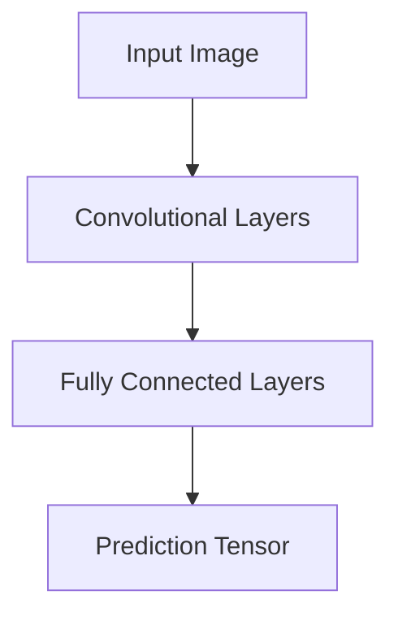
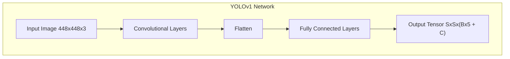

# YOLO (You Only Look Once): Detailed Explanation
> This content is dual-licensed under your choice of the following licenses:
> 1.  **MIT License:** For the code implementations in Swift and Mermaid provided in this document.
> 2.  **Creative Commons Attribution 4.0 International License (CC BY 4.0):** For all other content, including the text, explanations, and the Mermaid diagrams and illustrations.

---


## Overview

**YOLO (You Only Look Once)** is a state-of-the-art, real-time object detection system. The key innovation of YOLO is the unified architecture that enables end-to-end training and real-time speeds while maintaining high average precision.

- **Purpose**: Detect and classify multiple objects within an image in a single forward pass through the network.
- **Applications**:
  - **Real-time Object Detection**: Videos, autonomous driving, surveillance systems.
  - **Robotics**: Enabling robots to understand their environment.
  - **Industrial Automation**: Quality control, defect detection.

---

## **Key Concepts**

### **1. Unified Detection**

YOLO models frame object detection as a **single regression problem**, directly from image pixels to bounding box coordinates and class probabilities.

- **Single Neural Network**: Processes the entire image at once.
- **Global Reasoning**: Incorporates contextual information.

### **2. Gridding the Image**

- **Input Image**: Divided into an \( S \times S \) grid of cells.
- **Each Cell**:
  - Predicts **B** bounding boxes.
  - Provides **confidence scores** for those boxes.
  - Predicts **C** class probabilities.

---

## **YOLO Architecture**

### **High-Level Architecture**



- **Convolutional Layers**: Extract features from the image.
- **Fully Connected Layers**: Predict bounding boxes and class probabilities.

### **Detailed Architecture (YOLOv1)**

1. **Convolutional Layers**:
   - Series of convolutional and pooling layers.
   - Feature extraction.

2. **Flattening**:
   - Output from convolutional layers flattened into a vector.

3. **Fully Connected Layers**:
   - Two fully connected layers.
   - Output layer predicts bounding boxes and class probabilities.

**Architecture Diagram:**




- **Output Tensor**:
  - Size: \( S \times S \times (B \times 5 + C) \)
  - **S**: Grid size (e.g., 7)
  - **B**: Number of bounding boxes per cell (e.g., 2)
  - **C**: Number of classes (e.g., 20 for PASCAL VOC)

---

## **Processing Pipeline**

1. **Image Division**:
   - Divide the input image into a grid.
   
   ```mermaid
   graph LR
       Image[Input Image] -->|Divide| Grid[SxS Grid]
   ```

2. **Bounding Box Prediction**:
   - Each grid cell predicts bounding boxes.
   - Each bounding box includes:
     - \( x \), \( y \): Center coordinates relative to the grid cell.
     - \( w \), \( h \): Width and height relative to the whole image.
     - \( \text{Confidence} \): Probability that a bounding box contains an object and how accurate it is.

3. **Class Probability Prediction**:
   - Each cell predicts class probabilities \( P(Class_i | Object) \).

4. **Confidence Scores**:
   - For each bounding box:
     
     $$
     \text{Confidence} = P(\text{Object}) \times \text{IOU}_{\text{pred}}^{\text{truth}}
     $$

     - \( P(\text{Object}) \): Probability that an object exists in that grid cell.
     - \( \text{IOU}_{\text{pred}}^{\text{truth}} \): Intersection over Union between predicted box and ground truth.

---

## **Mathematical Formulation**

### **Bounding Box Prediction**

- Each bounding box prediction includes:
  - $x, y, w, h, \text{Confidence}s$.

- **Center Coordinates (\( x, y \))**:
  - Relative to the bounds of the grid cell.
  - Values between 0 and 1.

- **Width and Height (\( w, h \))**:
  - Relative to the entire image width and height.
  - Values normalized between 0 and 1 but can be greater than 1.

### **Class Probability Map**

- For each cell:
  - Predicts \( C \) conditional class probabilities.

- **Class-Specific Confidence Score**:

  $$
  \text{Score}_{ij}^{\text{Class}} = P(\text{Object}) \times P(\text{Class} | \text{Object}) \times \text{IOU}_{\text{pred}}^{\text{truth}}
  $$

### **Loss Function**

YOLO uses a specialized loss function to directly optimize detection performance.

**Total Loss (\( \mathcal{L} \))**:

$$
\mathcal{L} = \lambda_{\text{coord}} \sum_{i=0}^{S^2} \sum_{j=0}^{B} \mathbf{1}_{ij}^{\text{obj}} \left[ (x_i - \hat{x}_i)^2 + (y_i - \hat{y}_i)^2 + (w_i - \hat{w}_i)^2 + (h_i - \hat{h}_i)^2 \right] + \sum_{i=0}^{S^2} \sum_{j=0}^{B} \mathbf{1}_{ij}^{\text{obj}} (C_i - \hat{C}_i)^2 + \lambda_{\text{noobj}} \sum_{i=0}^{S^2} \sum_{j=0}^{B} \mathbf{1}_{ij}^{\text{noobj}} (C_i - \hat{C}_i)^2 + \sum_{i=0}^{S^2} \mathbf{1}_i^{\text{obj}} \sum_{c \in \text{classes}} (p_i(c) - \hat{p}_i(c))^2
$$

Where:

- **Variables**:
  - \( S \): Grid size.
  - \( B \): Number of bounding boxes per grid cell.
  - \( C \): Number of classes.
  - $\mathbf{1}_{ij}^{\text{obj}}$: Indicator function that equals 1 if object exists in cell $i$ for bounding box $j$, 0 otherwise.
  - $\mathbf{1}_{ij}^{\text{noobj}} = 1 - \mathbf{1}_{ij}^{\text{obj}}$.

- **Components**:
  - **Localization Loss**: Errors in predicted bounding box coordinates.
    - Weighted by $\lambda_{\text{coord}}$ (e.g., 5).
  - **Confidence Loss Object**: Confidence score errors when an object is present.
  - **Confidence Loss No Object**: Confidence score errors when no object is present.
    - Weighted by $\lambda_{\text{noobj}}$ (e.g., 0.5).
  - **Classification Loss**: Errors in class probabilities.

---

## **Advantages of YOLO**

1. **Speed**:
   - Real-time performance (>45 frames per second).
   - Single network evaluation.

2. **Global Context**:
   - Considers the entire image during training and testing.
   - Reduces false positives from background.

3. **Simplicity**:
   - Unified architecture without complex pipelines.
   - End-to-end training and optimization.

---

## **Limitations of YOLO**

1. **Localization Errors**:
   - Struggles with small objects.
   - Coarse grid can lead to imprecise bounding boxes.

2. **Generalization to New Domains**:
   - May not perform well on unfamiliar objects or environments without retraining.

3. **Trade-off between Speed and Accuracy**:
   - While fast, may have lower accuracy compared to region-based methods in some cases.

---

## **Evolution of YOLO Versions**

### **YOLOv1**

- **Introduced**: 2015 by Joseph Redmon et al.
- **Key Features**:
  - Single convolutional network.
  - Divides image into a grid and makes predictions accordingly.

### **YOLOv2 (YOLO9000)**

- **Improvements**:
  - **Batch Normalization**: Accelerates training and improves accuracy.
  - **Anchor Boxes**: Predefined boxes of certain shapes and sizes.
  - **High-Resolution Classifier**: Trained classifier network at the same resolution as detection network.
  - **Multi-Scale Training**: Improves robustness to input image sizes.
  
- **YOLO9000**:
  - Can detect over 9,000 object categories using joint training on ImageNet and COCO datasets.

### **YOLOv3**

- **Advancements**:
  - **Feature Pyramid Networks (FPN)**: For multi-scale feature extraction.
  - **Residual Blocks**: Improves gradient flow and allows deeper networks.
  - **Bounding Box Predictions**: Uses logistic regression for objectness score; better performance with small objects.

- **Detection at Multiple Scales**:
  - Predictions made at three different scales.

### **YOLOv4, YOLOv5, and Beyond**

- **YOLOv4**:
  - Introduces CSPDarknet53 backbone.
  - Uses **Bag of Freebies (BoF)** and **Bag of Specials (BoS)** techniques to enhance performance.

- **YOLOv5**:
  - Builds upon YOLOv4 with additional optimization.
  - Focuses on ease of use, including model export to various formats.

---

## **Comparison with Other Object Detection Models**

### **1. R-CNN Family**

- **R-CNN**:
  - Generates region proposals using selective search.
  - Processes each proposal individually.
  
- **Fast R-CNN**:
  - Improves speed using shared convolutional features.
  
- **Faster R-CNN**:
  - Introduces Region Proposal Network (RPN) for generating proposals.

- **Comparison**:
  - **Speed**: YOLO is significantly faster.
  - **Accuracy**: R-CNN methods may be more accurate for small objects.

### **2. Single Shot MultiBox Detector (SSD)**

- **SSD**:
  - Similar to YOLO; predicts bounding boxes and class probabilities directly.
  - Uses feature maps from multiple layers for detection.

- **Comparison**:
  - **Performance**: Comparable speed and accuracy.
  - **Architecture**: SSD uses multiple feature maps for better detection of objects at various scales.

---

## **Mathematical Details**

### **Intersection over Union (IoU)**

- **Definition**:

  $$
  \text{IoU} = \frac{\text{Area of Overlap}}{\text{Area of Union}}
  $$

- **Usage**:
  - Measures the overlap between predicted bounding box and ground truth.
  - Used for confidence score calculation and during non-max suppression.

### **Non-Maximum Suppression (NMS)**

- **Purpose**:
  - Eliminates redundant bounding boxes.
  - Keeps bounding boxes with the highest confidence scores.

- **Process**:
  1. Sort all predicted boxes by confidence score.
  2. Select the box with the highest score and suppress all boxes with IoU greater than a threshold (e.g., 0.5).
  3. Repeat with the next highest score.

---

## **Implementation Details**

### **Anchor Boxes**

- **Concept**:
  - Predefined bounding box shapes and sizes.
  - Helps capture objects with varying aspect ratios.

- **Effect on Predictions**:
  - Network predicts offsets to these anchor boxes rather than predicting absolute bounding box coordinates.

### **Activation Functions**

- **Leaky ReLU**:

  $$
  f(x) = \begin{cases}
  x & \text{if } x > 0 \\
  0.01x & \text{if } x \leq 0
  \end{cases}
  $$

- **Usage**: Allows a small gradient when the unit is not active, improving gradient flow.

### **Batch Normalization**

- **Purpose**:
  - Normalizes the output of the previous layer.
  - Reduces internal covariate shift.
  - Accelerates training and improves accuracy.

---

## **Practical Applications**

### **1. Autonomous Vehicles**

- **Usage**:
  - Real-time detection of pedestrians, other vehicles, traffic signs.
  - Helps in decision-making for navigation and safety.

### **2. Surveillance Systems**

- **Usage**:
  - Detecting and tracking objects of interest (e.g., intruders).
  - Crowd monitoring and analysis.

### **3. Robotics**

- **Usage**:
  - Enabling robots to interact with objects.
  - Object recognition and manipulation.

### **4. Industrial Automation**

- **Usage**:
  - Defect detection on assembly lines.
  - Monitoring production processes.

---

## **Code Snippet (Pseudo-Code)**

```python
# Load YOLO model
model = load_yolo_model()

# Read input image
image = read_image('input.jpg')

# Preprocess image
input_image = preprocess(image)

# Perform detection
predictions = model.predict(input_image)

# Post-process predictions
boxes, scores, classes = post_process(predictions)

# Draw bounding boxes
output_image = draw_boxes(image, boxes, scores, classes)

# Display or save output image
display(output_image)
```

---

## **Future Developments**

### **1. YOLOv7 and Beyond**

- **Enhancements**:
  - Improved architectures with better trade-offs between speed and accuracy.
  - Incorporation of transformer modules.

### **2. Integration with Other Technologies**

- **Edge Computing**:
  - Optimizing YOLO models for deployment on mobile and embedded devices.

- **Combination with Tracking Algorithms**:
  - For multi-object tracking (e.g., DeepSORT).

---

## **Challenges and Considerations**

### **1. Real-Time Constraints**

- **Hardware Limitations**:
  - Requires optimization for specific hardware (e.g., GPUs, FPGAs).
  
- **Model Compression Techniques**:
  - Quantization, pruning to reduce model size.

### **2. Dataset Bias**

- **Issue**:
  - Models trained on specific datasets may not generalize well.

- **Solution**:
  - Use diverse and representative datasets.
  - Fine-tune models on target domain data.

### **3. Ethical Considerations**

- **Privacy**:
  - Use of surveillance and facial recognition raises concerns.

- **Bias and Fairness**:
  - Ensuring models do not discriminate against certain groups.

---

## **Conclusion**

YOLO revolutionized object detection by reframing the problem as a single regression task. Its ability to perform real-time detection with reasonable accuracy has made it a popular choice across various industries. As versions evolve, YOLO continues to improve in terms of speed, accuracy, and ease of integration.

Understanding the underlying principles and mathematical formulations allows practitioners to adapt and optimize YOLO for specific applications, ensuring efficient and effective deployment.

---

# **References**

- **Original Papers**:
  - "You Only Look Once: Unified, Real-Time Object Detection" by Joseph Redmon et al. (2016).
  - "YOLO9000: Better, Faster, Stronger" by Joseph Redmon and Ali Farhadi (2017).
  - "YOLOv3: An Incremental Improvement" by Joseph Redmon and Ali Farhadi (2018).

- **Implementations**:
  - **Darknet**: Open-source neural network framework written in C.
  - **PyTorch YOLOv5**: Ultralytics implementation with focus on ease of use.

- **Tutorials and Resources**:
  - **PJ Reddie's YOLO Website**: https://pjreddie.com/darknet/yolo/
  - **Towards Data Science Articles**: Explaining YOLO and its applications.


---
**Licenses:**

- **MIT License:**  [](LICENSE) - Full text in [LICENSE](LICENSE) file.
- **Creative Commons Attribution 4.0 International:** [](LICENSE-CC-BY) - Legal details in [LICENSE-CC-BY](LICENSE-CC-BY) and at [Creative Commons official site](http://creativecommons.org/licenses/by/4.0/).

---