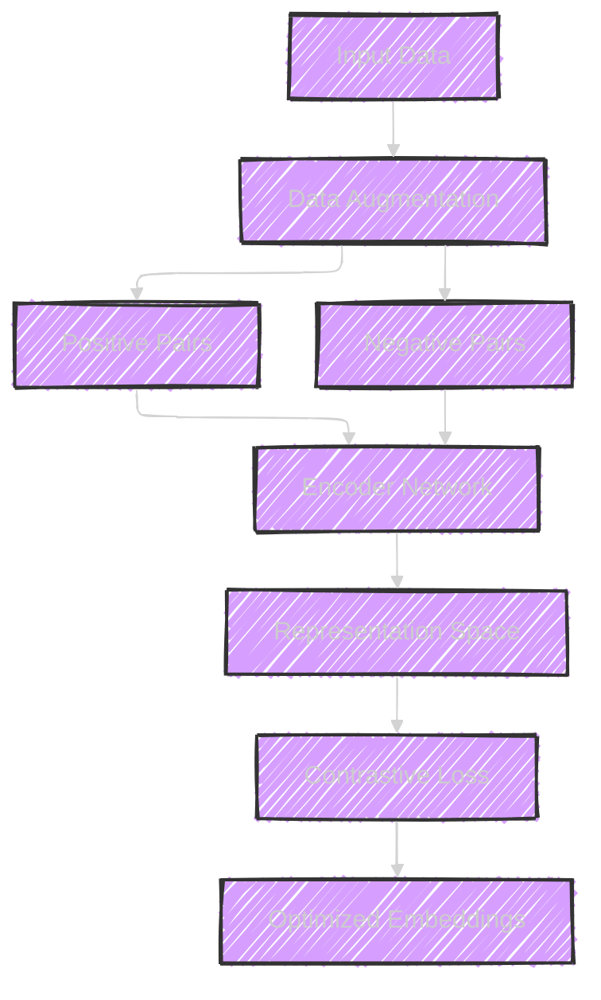
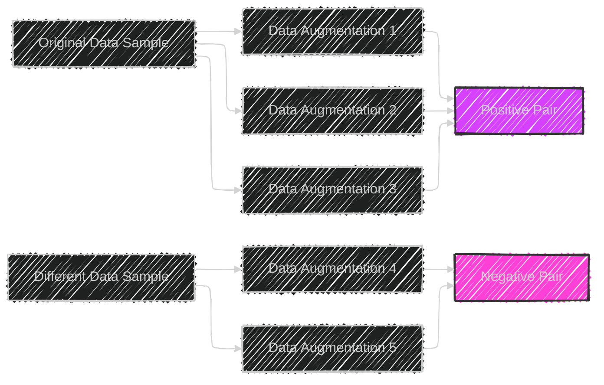
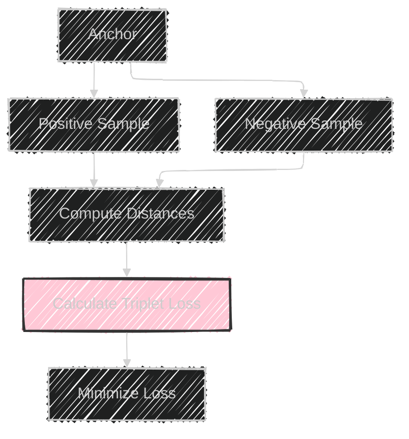
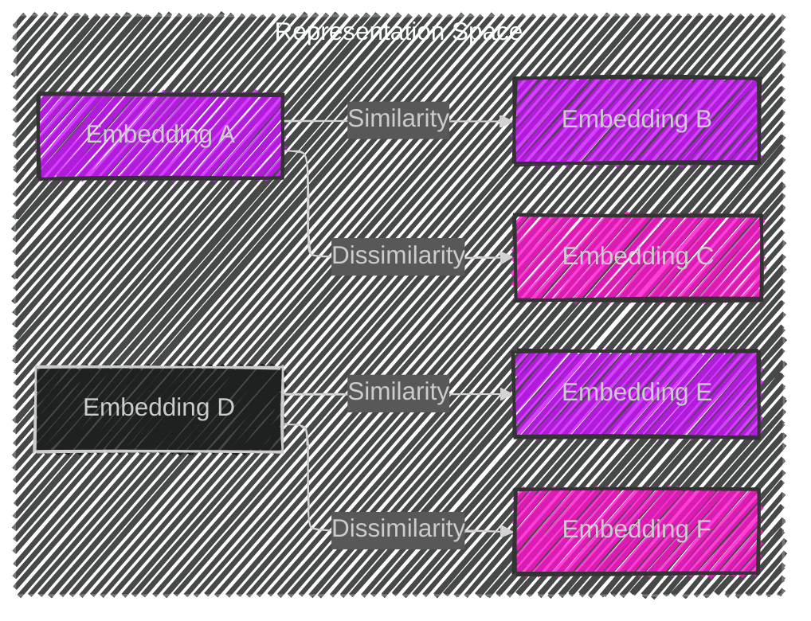
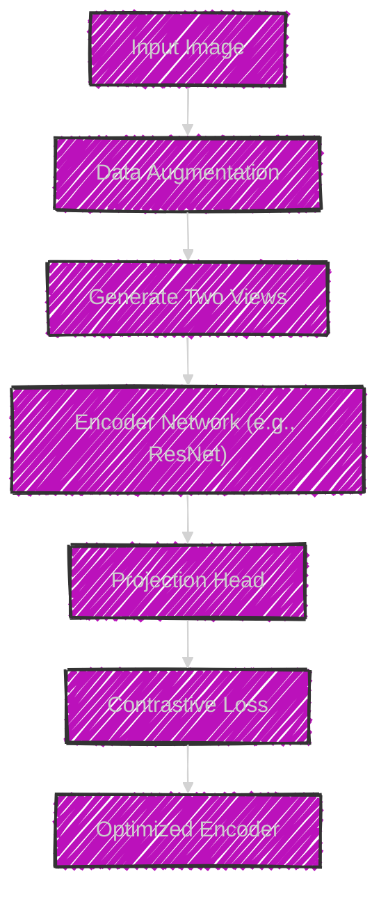
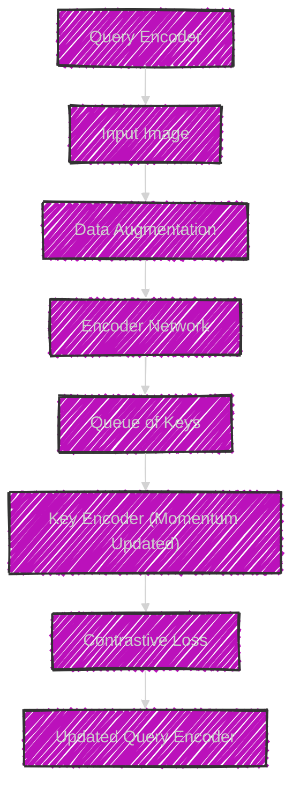
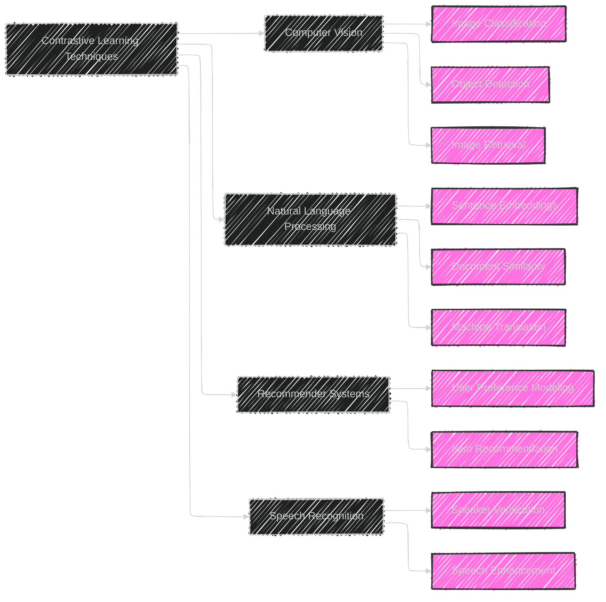

# Contrastive Learning Techniques
> This content is dual-licensed under your choice of the following licenses:
> 1.  **MIT License:** For the code implementations in Swift and Mermaid provided in this document.
> 2.  **Creative Commons Attribution 4.0 International License (CC BY 4.0):** For all other content, including the text, explanations, and the Mermaid diagrams and illustrations.

---

Contrastive Learning is a self-supervised learning paradigm that has gained significant traction in recent years, particularly in the fields of computer vision and natural language processing. The core idea revolves around learning representations by contrasting positive and negative pairs of data. This approach enhances the quality of embeddings, ensuring that similar inputs have similar representations while dissimilar ones are distinct. Below are detailed explanations and accompanying Mermaid diagrams to illustrate the complexities and technical concepts of Contrastive Learning Techniques.

---

## 1. Overview of Contrastive Learning

**Description:**

- **Input Data**: The raw data samples (e.g., images, text).
- **Data Augmentation**: Applying transformations to create different views of the same data sample.
- **Positive Pairs**: Augmented versions of the same data sample.
- **Negative Pairs**: Augmented versions of different data samples.
- **Encoder Network**: A neural network (e.g., CNN, Transformer) that generates embeddings.
- **Representation Space**: A high-dimensional space where embeddings reside.
- **Contrastive Loss**: A loss function that pulls positive pairs closer and pushes negative pairs apart.
- **Optimized Embeddings**: High-quality representations learned through contrastive learning.

---

## 2. Generation of Positive and Negative Pairs

**Description:**

- **Original Data Sample**: The starting point for generating pairs.
- **Data Augmentation**: Techniques such as cropping, flipping, color jittering (for images) or synonym replacement, back-translation (for text).
- **Positive Pair**: Two augmented versions derived from the same original sample.
- **Negative Pair**: Augmented versions derived from different original samples.

---

## 3. Contrastive Loss Functions

### 3.1. Contrastive Loss

**Mathematical Representation:**

$$
\mathcal{L} = \frac{1}{2N} \sum_{i=1}^{N} \left[ y_i \cdot D_i^2 + (1 - y_i) \cdot \max(0, m - D_i)^2 \right]
$$

Where:
- $D_i$ = Distance between embeddings.
- $y_i$ = Label indicating positive pair (1) or negative pair (0).
- $m$ = Margin parameter.

### 3.2. Triplet Loss

**Mathematical Representation:**

$$
\mathcal{L} = \sum_{i=1}^{N} \max \left( 0, D(a_i, p_i) - D(a_i, n_i) + \alpha \right)
$$

Where:
- $D(a_i, p_i)$ = Distance between anchor and positive sample.
- $D(a_i, n_i)$ = Distance between anchor and negative sample.
- $\alpha$ = Margin.

---

## 4. Representation Space Visualization

**Description:**

- **Embedding A & B**: Similar embeddings due to positive pairing.
- **Embedding C & F**: Dissimilar embeddings due to negative pairing.
- **Representation Space**: High-dimensional space where embeddings are organized based on similarity.

---

## 5. Industry Practices in Contrastive Learning

### 5.1. SimCLR (Simple Framework for Contrastive Learning of Visual Representations)

**Key Components:**
- **Data Augmentation**: Critical for creating diverse positive pairs.
- **Projection Head**: Maps embeddings to a space where contrastive loss is applied.
- **Contrastive Loss**: Typically uses NT-Xent (Normalized Temperature-Scaled Cross Entropy) loss.

### 5.2. MoCo (Momentum Contrast for Unsupervised Visual Representation Learning)

**Key Components:**
- **Momentum Update**: The key encoder is updated as a moving average of the query encoder.
- **Queue of Keys**: Maintains a dynamic dictionary of negative samples.
- **Contrastive Loss**: Facilitates learning by contrasting current queries against a large number of negative keys.

---

## 6. Applications of Contrastive Learning

**Description:**

- **Computer Vision**: Enhancing tasks like image classification, object detection, and retrieval by learning robust feature representations.
- **Natural Language Processing**: Improving sentence embeddings, document similarity measures, and machine translation quality.
- **Recommender Systems**: Modeling user preferences and recommending items based on learned representations.
- **Speech Recognition**: Facilitating speaker verification and enhancing speech quality.

---

## 7. Contrastive Learning Workflow

**Description:**

1. **Input Data**: User provides raw data.
2. **Data Augmentation**: System applies transformations to create varied views.
3. **Pair Generation**: Generates positive (same sample) and negative (different samples) pairs.
4. **Encoding**: Uses neural networks to generate embeddings for each pair.
5. **Loss Computation**: Calculates contrastive loss based on embeddings.
6. **Optimization**: Backpropagates loss and updates model weights.
7. **Output**: Provides optimized embeddings for downstream tasks.

---

## 8. Technical Challenges and Solutions

**Description:**

- **Selecting Effective Augmentations**: Choosing transformations that preserve semantic meaning.
- **Balancing Samples**: Ensuring a healthy mix of positive and negative pairs to avoid bias.
- **Handling Large Datasets**: Scaling contrastive learning to vast amounts of data efficiently.
- **Tuning Hyperparameters**: Optimizing parameters like learning rate, batch size, and margins for best performance.
- **Preventing Mode Collapse**: Avoiding scenarios where the model produces similar embeddings for diverse inputs.

---

## 9. Future Directions in Contrastive Learning

**Description:**

- **Self-Supervised Learning**: Enhancing contrastive learning within self-supervised frameworks.
- **Efficient Methods**: Developing architectures and algorithms that reduce computational and memory overhead.
- **Advanced Loss Functions**: Innovating loss functions that better capture the nuances of data.
- **Applications Expansion**: Extending contrastive learning to diverse and critical domains like healthcare and autonomous systems.
- **Theoretical Foundations**: Deepening the understanding of why and how contrastive learning works, ensuring robust and reliable deployments.

---

## Conclusion

Contrastive Learning Techniques represent a transformative approach in machine learning, enabling models to learn meaningful and discriminative representations without extensive labeled data. By effectively contrasting positive and negative pairs, these techniques ensure that embeddings capture the essence of the data, fostering advancements across various applications. The accompanying Mermaid diagrams provide a visual elucidation of the intricate processes, challenges, and future trajectories within contrastive learning, reflecting both foundational principles and cutting-edge industry practices.

---
**Licenses:**

- **MIT License:**   - Full text in [LICENSE](LICENSE) file.
- **Creative Commons Attribution 4.0 International:**  - Legal details in [LICENSE-CC-BY](LICENSE-CC-BY) and at [Creative Commons official site](http://creativecommons.org/licenses/by/4.0/).

---