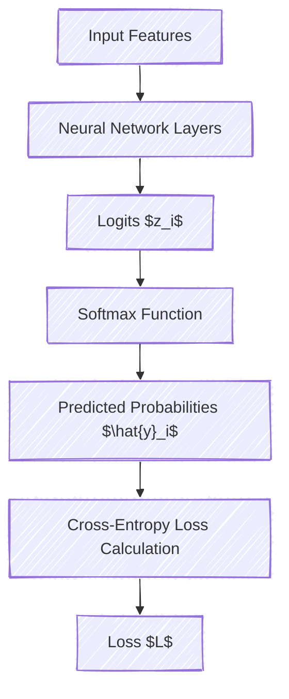
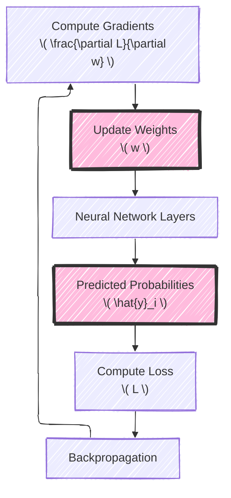
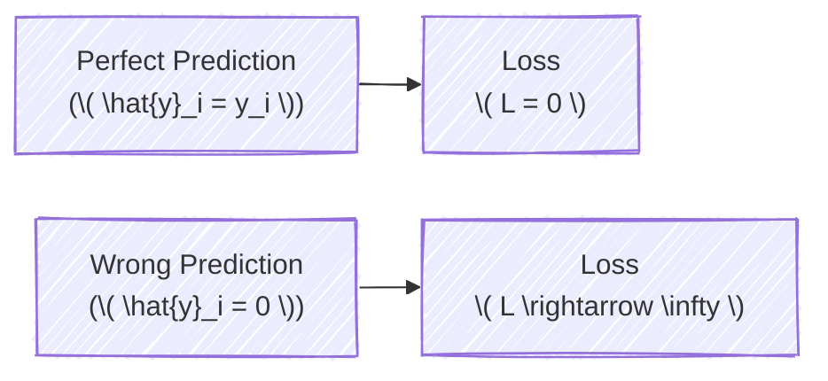

# Cross-Entropy Loss Function in Deep Learning
> This content is dual-licensed under your choice of the following licenses:
> 1.  **MIT License:** For the code implementations in Swift and Mermaid provided in this document.
> 2.  **Creative Commons Attribution 4.0 International License (CC BY 4.0):** For all other content, including the text, explanations, and the Mermaid diagrams and illustrations.

---

The **Cross-Entropy Loss Function** is a fundamental component in training classification models in deep learning. It quantifies the difference between the predicted probability distribution and the true distribution of the target classes. By minimizing this loss, models improve their predictions over time.

In this detailed explanation, we'll delve into:

- The mathematical foundation of cross-entropy.
- Its application in neural networks.
- How it guides the optimization process during training.
- Current industry practices and considerations.

Let's explore these concepts with diagrams and equations to illustrate the complexities involved.

---

## **1. Understanding Probability Distributions**

Before diving into cross-entropy, it's essential to understand probability distributions in the context of classification.

- **True Distribution (\( \mathbf{y} \))**: One-hot encoded vector representing the actual class labels.
- **Predicted Distribution (\( \hat{\mathbf{y}} \))**: The model's output probabilities for each class.

### **Example**

For a 3-class classification problem:

- **True Label**: Class 2
$$
  \mathbf{y} = [0, \underline{1}, 0]
$$
- **Predicted Probabilities**:
$$
   \hat{\mathbf{y}} = [0.2, \underline{0.7}, 0.1]
$$

---

## **2. Entropy and Cross-Entropy**

### **2.1 Entropy**

- **Definition**: Entropy measures the uncertainty in a probability distribution.
- **Equation**:
$$
  H(\mathbf{y}) = -\sum_{i} y_i \log y_i
$$
- **Interpretation**: Higher entropy indicates more uncertainty.

### **2.2 Cross-Entropy**

- **Definition**: Cross-entropy measures the difference between two probability distributions.
- **Equation**:
$$
  H(\mathbf{y}, \hat{\mathbf{y}}) = -\sum_{i} y_i \log \hat{y}_i
$$
- **Purpose**: Quantifies how well the predicted probabilities $\hat{\mathbf{y}}$ match the true distribution $\mathbf{y}$.

---

## **3. Cross-Entropy in Neural Networks**

In neural networks, cross-entropy loss is commonly used with the **softmax activation** function in the output layer for multi-class classification tasks.

### **3.1 Softmax Function**

- **Equation**:
$$
   \hat{y}_i = \frac{e^{z_i}}{\sum_{j} e^{z_j}}
$$
- **Purpose**: Converts raw outputs (logits) \( z_i \) into probabilities that sum to 1.

### **3.2 Loss Function**

- **Categorical Cross-Entropy Loss**:
$$
  L = -\sum_{i} y_i \log \hat{y}_i
$$
- **For a single sample** (assuming one-hot encoded \( \mathbf{y} \)):
$$
   L = -\log \hat{y}_{k}
$$
  where \( k \) is the index of the true class.

### **Mermaid Diagram: Forward Pass and Loss Calculation**



---

## **4. Optimization with Cross-Entropy Loss**

The loss \( L \) quantifies the error between the predicted and true distributions. The goal of training is to **minimize the loss** by updating the model's weights.

### **4.1 Gradient Descent**

- **Process**: Compute gradients of the loss with respect to the weights and update them in the opposite direction.
- **Equation**:
$$
  w^{(t+1)} = w^{(t)} - \eta \frac{\partial L}{\partial w}
$$
  where:
  - \( w \) are the weights.
  - \( \eta \) is the learning rate.

### **4.2 Backpropagation**

- **Purpose**: Efficiently compute gradients using the chain rule.
- **Steps**:
  1. **Forward Pass**: Compute \( \hat{\mathbf{y}} \) and \( L \).
  2. **Backward Pass**: Compute gradients \( \frac{\partial L}{\partial w} \).
  3. **Weights Update**: Adjust weights to minimize \( L \).

### **Mermaid Diagram: Optimization Process**



---

## **5. Mathematical Derivation**

To understand how cross-entropy loss guides optimization, let's derive the gradient for a softmax output layer.

### **5.1 Derivative of Cross-Entropy Loss with Softmax**

- **Loss Function**:
$$
  L = -\sum_{i} y_i \log \hat{y}_i
$$
- **Softmax Output**:
$$
  \hat{y}_i = \frac{e^{z_i}}{\sum_{j} e^{z_j}}
$$
- **Gradient w.r.t. Logits \( z_i \)**:
$$
  \frac{\partial L}{\partial z_i} = \hat{y}_i - y_i
$$

### **Explanation**

- The gradient simplifies to the difference between the predicted probability and the true label.
- This simplicity accelerates computation and reduces error accumulation.

---

## **6. Practical Considerations**

### **6.1 Numerical Stability**

Calculating $\log \hat{y}_i$ can be numerically unstable when $\hat{y}_i$ is very close to 0.

- **Solution**: Implement log-sum-exp trick or use stable libraries.
- **Example**:
$$
  \log \hat{y}_i = z_i - \log \left( \sum_{j} e^{z_j} \right)
$$

### **6.2 Label Smoothing**

- **Purpose**: Prevent overconfidence by smoothing the target distribution.
- **Technique**:
$$
y_i' = y_i (1 - \epsilon) + \frac{\epsilon}{K}
$$
  where:
  - $K$ is the number of classes.
  - $\epsilon$ is a small constant (e.g., 0.1).

### **6.3 Class Imbalance**

- **Problem**: When classes are imbalanced, the model may become biased.
- **Solution**: Use **weighted cross-entropy loss** to give more importance to rare classes.

---

## **7. Current Industry Practices**

### **7.1 Framework Implementations**

Most deep learning frameworks (TensorFlow, PyTorch) provide optimized functions:

- **TensorFlow**:
  ```python
  loss = tf.nn.softmax_cross_entropy_with_logits(labels=y_true, logits=logits)
  ```
- **PyTorch**:
  ```python
  loss_fn = torch.nn.CrossEntropyLoss()
  loss = loss_fn(logits, target)
  ```

### **7.2 Monitoring and Debugging**

- **Loss Curves**: Plot training and validation loss over epochs to monitor overfitting.
- **Gradient Checking**: Verify the correctness of gradient computations.

### **7.3 Advanced Techniques**

- **Focal Loss**: Focus on hard-to-classify examples.
$$
  L = -\alpha (1 - \hat{y}_i)^\gamma y_i \log \hat{y}_i
$$
  where $\gamma$ modulates the focus.

- **Teacher Forcing**: In sequence models, use the true label as the next input during training.

---

## **8. Cross-Entropy Loss in Practice**

### **8.1 Example: Image Classification**

**Scenario**: Classify images into 10 categories using a CNN.

- **Model Outputs**: Logits \( z \) of shape (batch_size, 10).
- **Apply Softmax and Compute Loss**:
$$
 L = -\sum_{i=1}^{10} y_i \log \hat{y}_i
$$

### **8.2 Example: Language Modeling**

**Scenario**: Predict the next word in a sequence.

- **Model Outputs**: Logits \( z \) over the vocabulary size \( V \).
- **Compute Cross-Entropy Loss** for each time step and average.

---

## **9. Visualization of Cross-Entropy Loss**

### **9.1 Loss Surface**

Understanding how the loss changes with predictions:

- **Mermaid Diagram: Loss vs. Prediction**



- **Interpretation**: Loss increases exponentially as predictions deviate from true labels.

### **9.2 Contour Plot**

Imagining the loss surface helps in understanding optimization paths.

---

## **10. Conclusion**

The **Cross-Entropy Loss Function** is essential for training classification models in deep learning. It provides a measure of how well the predicted probabilities align with the true distribution, enabling the optimization algorithms to adjust the model's parameters effectively.

---

# **Summary**

- **Purpose**: Cross-Entropy Loss quantifies the error between predicted and true probability distributions.
- **Application**: Used extensively in classification tasks to guide model training.
- **Optimization**: Facilitates efficient computation of gradients for updating model parameters.
- **Industry Practices**: Includes addressing numerical stability, class imbalance, and leveraging framework-specific optimizations.

By deeply understanding the cross-entropy loss function, machine learning practitioners can build more accurate and robust models.

---

# **Additional Resources**

- **Research Papers**:
  - "Understanding the Difficulty of Training Deep Feedforward Neural Networks" - Xavier Glorot & Yoshua Bengio.
- **Books**:
  - "*Deep Learning*" by Ian Goodfellow, Yoshua Bengio, and Aaron Courville.
- **Framework Documentation**:
  - [TensorFlow Losses](https://www.tensorflow.org/api_docs/python/tf/nn/softmax_cross_entropy_with_logits)
  - [PyTorch Loss Functions](https://pytorch.org/docs/stable/nn.html#loss-functions)

---

# **Appendix: Mathematical Details**

## **A. Derivation of Gradient**

Starting with the loss function:

$$
L = -\sum_{i} y_i \log \hat{y}_i
$$

Since $\hat{y}_i = \frac{e^{z_i}}{\sum_{j} e^{z_j}}$, we have:

$$
\frac{\partial L}{\partial z_k} = \hat{y}_k - y_k
$$

This shows that the gradient depends on the error between the predicted probability and the true label.

## **B. Relationship to Kullback-Leibler Divergence**

Cross-entropy relates to **Kullback-Leibler (KL) Divergence**:

$$
\text{KL}(\mathbf{y} || \hat{\mathbf{y}}) = H(\mathbf{y}, \hat{\mathbf{y}}) - H(\mathbf{y})
$$

Since \( H(\mathbf{y}) \) is constant with respect to the model parameters, minimizing cross-entropy minimizes KL divergence.

---

# **Mermaid Diagram: Complete Process Overview**


---
**Licenses:**

- **MIT License:**  [](LICENSE) - Full text in [LICENSE](LICENSE) file.
- **Creative Commons Attribution 4.0 International:** [](LICENSE-CC-BY) - Legal details in [LICENSE-CC-BY](LICENSE-CC-BY) and at [Creative Commons official site](http://creativecommons.org/licenses/by/4.0/).

---