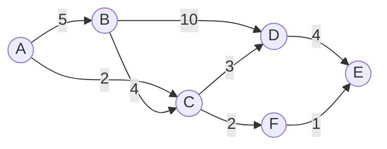
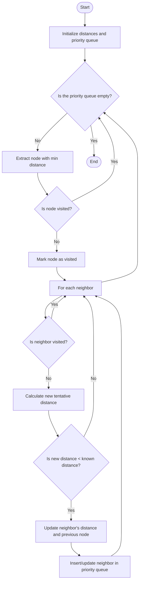
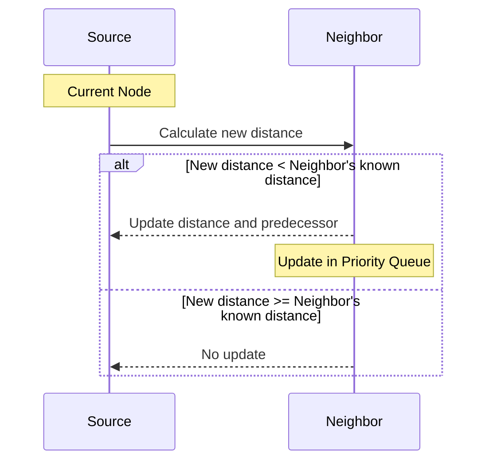
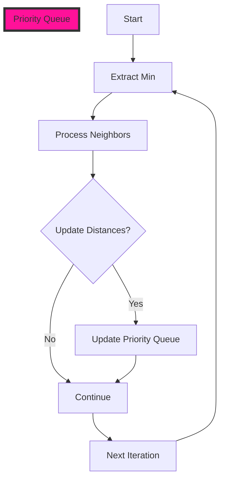

# Dijkstra's Algorithm: In-Depth Explanation
> This content is dual-licensed under your choice of the following licenses:
> 1.  **MIT License:** For the code implementations in Swift and Mermaid provided in this document.
> 2.  **Creative Commons Attribution 4.0 International License (CC BY 4.0):** For all other content, including the text, explanations, and the Mermaid diagrams and illustrations.

---

## Purpose

Dijkstra's Algorithm is a fundamental algorithm in computer science used to find the shortest path from a single source node to all other nodes in a **weighted graph with non-negative edge weights**. It's essential for solving routing problems in various domains.

## Applications

- **Maps and Navigation Systems**: Calculating the shortest driving route between two locations.
- **Network Routing**: Determining optimal paths for data packets.
- **Logistics and Transportation**: Optimizing delivery routes and schedules.
- **Robotics**: Path planning for autonomous navigation.
- **Geospatial Analysis**: Analyzing and modeling spatial networks.

---

## Algorithm Overview

Dijkstra's Algorithm systematically explores all possible paths from the source node, always extending the paths with the lowest cumulative cost. It ensures that once the shortest path to a node is found, it's finalized and won't be updated with a shorter path later.

### Key Concepts

- **Weighted Graph**: A graph where each edge has an associated numerical value (weight or cost).
- **Tentative Distance**: The current shortest known distance from the source node to a node.
- **Visited Nodes**: Nodes for which the shortest path from the source is definitively known.
- **Unvisited Nodes**: Nodes that are still being evaluated.

---

## Algorithm Steps

1. **Initialization**:
   - Set the tentative distance to the source node to **0**.
   - Set the tentative distance to all other nodes to **infinity (∞)**.
   - Set all nodes as **unvisited**.
   - Define the **priority queue** (min-heap) to store nodes based on their tentative distances.

2. **While** there are unvisited nodes:
   - **Extract** the node with the smallest tentative distance from the priority queue (current node).
   - **For** each unvisited neighbor of the current node:
     - Calculate the **new tentative distance**: `current distance + edge weight`.
     - **If** the new tentative distance is less than the previously recorded tentative distance:
       - **Update** the tentative distance.
       - **Set** the current node as the **predecessor** of the neighbor.
       - **Insert or update** the neighbor in the priority queue.
   - Mark the current node as **visited**.

3. **Reconstruction**:
   - After all nodes are visited, reconstruct the shortest paths using the **predecessor** information.

---

## Mermaid Diagrams and Illustrations

### Graph Representation

Let's consider a sample graph to illustrate the algorithm:

- **Nodes**: A, B, C, D, E, F
- **Edges and Weights**:
  - A to B: 5
  - A to C: 2
  - B to C: 4
  - B to D: 10
  - C to D: 3
  - D to E: 4
  - C to F: 2
  - F to E: 1

---

### Algorithm Execution Steps

We'll find the shortest path from node **A** to node **E**.

#### Initialization

| Node | Tentative Distance | Previous Node | Visited |
|------|--------------------|---------------|---------|
| A    | **0**              | None          | No      |
| B    | ∞                  | None          | No      |
| C    | ∞                  | None          | No      |
| D    | ∞                  | None          | No      |
| E    | ∞                  | None          | No      |
| F    | ∞                  | None          | No      |

Priority Queue: [(A, 0)]

---

#### **Step-by-Step Execution**

1. **Current Node: A (Distance: 0)**
   - Neighbors: B, C
   - **Update B**:
     - New Distance: 0 + 5 = 5 (less than ∞)
     - Update B's tentative distance to 5 and set previous node to A.
   - **Update C**:
     - New Distance: 0 + 2 = 2 (less than ∞)
     - Update C's tentative distance to 2 and set previous node to A.
   - Mark A as **visited**.
   - Priority Queue: [(C, 2), (B, 5)]

2. **Current Node: C (Distance: 2)**
   - Neighbors: B, D, F
   - **Update B**:
     - New Distance: 2 + 4 = 6 (current tentative distance is 5)
     - Since 6 > 5, do not update.
   - **Update D**:
     - New Distance: 2 + 3 = 5 (less than ∞)
     - Update D's tentative distance to 5 and set previous node to C.
   - **Update F**:
     - New Distance: 2 + 2 = 4 (less than ∞)
     - Update F's tentative distance to 4 and set previous node to C.
   - Mark C as **visited**.
   - Priority Queue: [(F, 4), (B, 5), (D, 5)]

3. **Current Node: F (Distance: 4)**
   - Neighbor: E
   - **Update E**:
     - New Distance: 4 + 1 = 5 (less than ∞)
     - Update E's tentative distance to 5 and set previous node to F.
   - Mark F as **visited**.
   - Priority Queue: [(B, 5), (D, 5), (E, 5)]

4. **Current Node: B (Distance: 5)**
   - Neighbor: D
   - **Update D**:
     - New Distance: 5 + 10 = 15 (current tentative distance is 5)
     - Since 15 > 5, do not update.
   - Mark B as **visited**.
   - Priority Queue: [(D, 5), (E, 5)]

5. **Current Node: D (Distance: 5)**
   - Neighbor: E
   - **Update E**:
     - New Distance: 5 + 4 = 9 (current tentative distance is 5)
     - Since 9 > 5, do not update.
   - Mark D as **visited**.
   - Priority Queue: [(E, 5)]

6. **Current Node: E (Distance: 5)**
   - No unvisited neighbors.
   - Mark E as **visited**.
   - Priority Queue: []

All nodes have been **visited**. The algorithm terminates.

---

#### **Final Table**

| Node | Tentative Distance | Previous Node |
|------|--------------------|---------------|
| A    | 0                  | None          |
| B    | 5                  | A             |
| C    | 2                  | A             |
| D    | 5                  | C             |
| E    | 5                  | F             |
| F    | 4                  | C             |

---

### Reconstructing the Shortest Path

To find the shortest path from **A** to **E**, we backtrack using the **Previous Node**:

1. **E**'s previous node is **F**.
2. **F**'s previous node is **C**.
3. **C**'s previous node is **A**.

**Shortest Path**: A → C → F → E

**Total Cost**: 5

---

### Flowchart of Dijkstra's Algorithm

---

### Algorithm Complexity

#### Time Complexity

Let $V$ be the number of vertices (nodes) and $E$ be the number of edges.

- **Using a Min-Priority Queue (Binary Heap)**
  - **Initialization**: $O(V)$
  - **Priority Queue Operations**:
    - **Extract-Min**: $O(\log V)$ per operation
    - **Decrease-Key (Update Distance)**: $O(\log V)$ per operation
  - **Total Time Complexity**: $O((V + E) \log V)$

- **Using a Fibonacci Heap**
  - Improves Decrease-Key operation to $O(1)$ amortized time
  - **Total Time Complexity**: $O(E + V \log V)$
  - Less common in practice due to higher constant factors

#### **Space Complexity**

- **Memory Usage**: $O(V)$ for storing distances and previous nodes
- **Priority Queue**: Up to $O(V)$ elements

---

## Implementation Considerations

### **Data Structures**

- **Priority Queue Implementation**:
  - **Binary Heap**: Efficient and simple to implement
  - **Fibonacci Heap**: Theoretically faster but more complex
- **Graph Representation**:
  - **Adjacency List**: Preferred for sparse graphs
  - **Adjacency Matrix**: Useful for dense graphs but consumes more space

### Edge Weights

- All edge weights must be **non-negative**.
- If negative edge weights are present, consider using the **Bellman-Ford Algorithm**.

### **Path Reconstruction**

- Store the **previous node** for each node during updates.
- Allows for efficient path reconstruction after the algorithm completes.

### **Optimizations**

- **Early Exit**: If the goal node is known, the algorithm can terminate once it has been visited.
- **Bidirectional Dijkstra**: Runs two simultaneous searches from the source and destination, potentially reducing search space.

---

## Current Practices in the Industry

### **Navigation Systems**

- **Traffic Data Integration**:
  - Edge weights are dynamically adjusted based on real-time traffic conditions.
- **Hierarchical Routing**:
  - Use **Contraction Hierarchies** or **Multi-Level Dijkstra** to speed up queries on large road networks.
- **Heuristics**:
  - Combine Dijkstra's Algorithm with heuristics (e.g., in the **A\*** algorithm) for faster pathfinding when approximate solutions are acceptable.

### Network Routing

- Dijkstra's Algorithm forms the basis of many routing protocols, such as **OSPF** (Open Shortest Path First).
- Networks utilize optimized and distributed versions to handle large and dynamic topologies.

### Software Development

- Implementations often make use of high-level languages and libraries that provide efficient data structures.
- Emphasis on code optimization, especially in systems where performance is critical (e.g., real-time systems).

### Parallel and Distributed Computing**

- For extremely large graphs (e.g., social networks, web graphs), parallel versions of the algorithm are employed.
- **MapReduce** and other distributed computing frameworks are used to process big data.

---

## **Technical Concepts and Complexities**

### **Algorithm Correctness**

- **Greedy Strategy**: Always chooses the node with the smallest tentative distance.
- **Optimality**: Guarantees the shortest path in graphs with non-negative edge weights.
- **Proof of Correctness**:
  - Relies on the triangle inequality and non-negative weights.
  - Once a node's shortest path is determined (visited), it will not be updated again.

### **Limitations**

- **Negative Edge Weights**:
  - Cannot handle graphs with negative edge weights.
  - Negative cycles can lead to incorrect results.

### **Comparison with Other Algorithms**

- **Bellman-Ford Algorithm**:
  - Handles negative weights.
  - Higher time complexity: $O(V \cdot E)$
- **A\* Algorithm**:
  - Uses heuristics to guide the search.
  - More efficient for pathfinding in certain contexts.

### **Edge Cases**

- **Disconnected Graphs**:
  - Nodes not reachable from the source will retain a tentative distance of infinity.
- **Multiple Shortest Paths**:
  - If multiple paths have the same shortest distance, any one may be found.

---

## **Advanced Topics**

### **Priority Queue Implementations**

- **Binary Heap**:
  - Common due to simplicity and good performance.
- **Pairing Heap**:
  - Offers good amortized performance and simplicity.
- **Bucket-Based Priority Queues**:
  - For graphs with integer weights in a small range.
  - Can achieve $O(V + E)$ time complexity.

### **Memory Optimization**

- In systems with limited memory, optimizations are necessary:
  - **Iterative Deepening**: Limits the depth of the search.
  - **Graph Pruning**: Removes unnecessary nodes and edges.

### **Real-Time Systems**

- **Incremental Graph Changes**:
  - Algorithms that update paths when the graph changes incrementally.
- **Dynamic Edge Weights**:
  - Handling changes in edge weights without recomputing from scratch.

---

## **Conclusion**

Dijkstra's Algorithm is a cornerstone of graph theory and pathfinding algorithms. Its efficiency and reliability make it a go-to solution for shortest path problems in numerous applications across industries. Understanding its operation, complexities, and practical implementation details is essential for software engineers and computer scientists working with graph-based data structures and networks.

---

# **Additional Mermaid Diagrams**

### **Edge Relaxation Process**

### **Priority Queue State Changes**

---

---
**Licenses:**

- **MIT License:**   - Full text in [LICENSE](LICENSE) file.
- **Creative Commons Attribution 4.0 International:**  - Legal details in [LICENSE-CC-BY](LICENSE-CC-BY) and at [Creative Commons official site](http://creativecommons.org/licenses/by/4.0/).

---